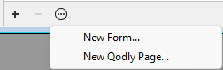

エクスプローラーは、テーブル、フォーム、メソッド、ビルトイン4Dコマンド、定数やプラグインへの便利なアクセスを提供する、デザイン環境内のウィンドウです。 また以下の項目への情報も提供します。 **デザイン > エクスプローラー** 内のページを選択、あるいはツールバー内の **エクスプローラー** ボタンをクリックすることでいつでもエクスプローラーを表示することができます。

:::note

エクスプローラーの包括的な詳細については、[doc.4d.com のエクスプローラーの章](https://doc.4d.com/4Dv21/4D/21/Explorer.200-7676561.ja.html)を参照してください。

:::

## フォームページ

フォームページには3つのリストが格納されています: **プロジェクトフォーム**、**テーブルフォーム**、と**Qodly ページ** です。

### Qodlyページ

このセクションではプロジェクトで定義されているQodly ページの一覧を見ることができます。 またページを追加、または開くことができます。

Qodly ページのセクションに表示されいてるページは、プロジェクトのSources フォルダ内の [**WebForm** サブフォルダ](../Project/architecture.md#webforms) に格納されています。

:::note

Qodly ページはエクスプローラーの **ホーム** ページからは見えません。

:::

### 要件

Qodly ページは、Web ベースの開発ツールである、[Qodly Studio](https://developer.4d.com/qodly/4DQodlyPro/qodlyStudioInterface) において作成および編集されます。 4D からQodly Studio にアクセスするためには [特定の設定](https://developer.4d.com/qodly/4DQodlyPro/gettingStarted#要件) を設定する必要があり、これは [ワンクリックで設定可能です](https://developer.4d.com/qodly/4DQodlyPro/gettingStarted#ワンクリック設定)。

### Qodlyページを追加または開く

4D エクスプローラーからQodly ページを直接追加または開くことができます。 [要件](#要件) を満たしていた場合、ページは[Qodly Studio のページエディター](https://developer.4d.com/qodly/4DQodlyPro/pageLoaders/pageLoaderOverview) で開かれます。

ページを追加するには:

- コンテキストメニュー内の **New Qodly page...** を選択します 
  

- or click the **+** icon or select **New Qodly page...** in the bottom area of the Explorer. 
  

Enter the name of the page and click **OK** to open the page in Qodly Studio:

To open a page:

- double-click on a Qodly page name, or
- right-click on a Qodly page name and select **Edit...** in the contextual menu.

### Renaming or deleting a Qodly page

Renaming or deleting a Qodly page can only be done in the [Page editor of Qodly Studio](https://developer.4d.com/qodly/4DQodlyPro/pageLoaders/pageLoaderOverview).

Click on the pen icon to rename the page: 

Click on the options button and select **Delete** to delete a page: 

確認用のダイアログボックスが表示されます。

