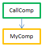

コンパイルされたコードは、**プリエンプティブプロセス** として実行できます。 この新機能のおかげで、コンパイルされた 4Dアプリケーションはマルチコアコンピューターの利点をすべて活かすことができ、それによって実行速度が向上し、またより多くのユーザーの接続をサポートすることができます。

## プリエンプティブプロセスとは？

_プリエンプティブ_ モードで実行された場合、プロセスは CPU に割り当てられます。 プロセス管理はシステムへと委任され、マルチコアのマシン上にてシステムはプロセスをそれぞれのCPUへと個別に割り当てます。

_コオペラティブ_ モードで実行された場合には、たとえマルチコアのマシン上であっても、すべてのプロセスは親アプリケーションのスレッドにより管理され、同じ CPU を共有します。

結果として、プリエンプティブモードでは、アプリケーションの全体的なパフォーマンスは向上します。マルチコアのマシン上では複数のプロセス (スレッド) が真実同時実行可能であるため、パフォーマンスの向上はさらに顕著になります。 (ただし、実際のパフォーマンスの差は、実行される処理に依存します。) その一方で、プリエンプティブモードではそれぞれのスレッドが他から独立しており、アプリケーションによって直接管理されている訳ではないため、プリエンプティブに準拠させるにあたってはメソッドに特定の制約が課されます。 それに加え、プリエンプティブ実行は特定のコンテキストでのみ使用可能です。

## プリエンプティブモードの利用可能状況

プリエンプティブモードの使用は、以下の実行コンテキストでサポートされています:

| コンテキスト      | プリエンプティブ実行                                                         |
| ----------- | ------------------------------------------------------------------ |
| 4D Server   | ◯                                                                  |
| 4Dリモート      | ◯ ([ServerNet または QUIC](../settings/client-server#ネットワークレイヤー) 使用時) |
| 4D シングルユーザー | ◯                                                                  |
| コンパイルモード    | ◯                                                                  |
| インタープリターモード | ×                                                                  |

実行コンテキストがプリエンプティブモードをサポートし、かつメソッドが "スレッドセーフ" である場合、`New process` あるいは `CALL WORKER` コマンドあるいは "メソッドを実行" メニュー項目を使用してローンチされた新しい 4Dプロセスは、プリエンプティブスレッド内にて実行されます。

それ以外の場合で、サポートされていない実行コンテキスト (たとえばインタープリタモードなど) から `New process` あるいは `CALL WORKER` コマンドを呼び出した場合、プロセスは常にコオペラティブに実行されます。

## スレッドセーフとスレッドアンセーフ

4Dコードは、いくつかの特定の条件に合致していた場合に限りプリエンプティブスレッド内で実行することができます。 実行コードのそれぞれの部分 (コマンド、メソッド、変数など) が プリエンプティブ実行に準拠している必要性があります。 プリエンプティブスレッドで実行可能な要素はスレッドセーフと呼ばれ、プリエンプティブスレッドで実行できない要素はスレッドアンセーフと呼ばれます。

:::note

スレッドは、親プロセスメソッドをスタートとして独自に管理されているので、呼び出しチェーン全体のどこにおいてもスレッドアンセーフなコードが含まれていてはいけません。そのようなコードが含まれていた場合、プリエンプティブに実行することはできません。 この点については、[こちらの章](#プロセスがプリエンプティブに実行される条件とは) で詳細な説明があります。

:::

要素毎の "スレッドセーフティ" プロパティは、その要素自身によります:

- 4Dコマンド: スレッドセーフティは内部プロパティです。 [4Dランゲージリファレンス](https://doc.4d.com/4Dv20/4D/20.1/4D-Language-Reference.100-6479538.ja.html) 内では、スレッドセーフなコマンドは  のアイコンで識別されています。 [`Command name`](https://doc.4d.com/4dv20/help/command/ja/page538.html) コマンドを使用して、コマンドがスレッドセーフであるかどうかを知ることもできます。 4Dコマンドの大部分はプリエンプティブモードで実行可能です。
- プロジェクトメソッド: スレッドセーフであるための条件は [こちらの段落](#スレッドセーフなメソッドの書き方) にまとめられています。

原則として、プリエンプティブスレッド内で実行されるコードは外部との相互作用する部分、たとえばプラグインコードやインタープロセス変数などを呼び出すことはできません。 しかしながら、4Dデータサーバーと ORDA はプリエンプティブ実行をサポートしていることから、データアクセスは可能です。

## プリエンプティブ実行宣言

デフォルトでは、4D はアプリケーション内のプロジェクトメソッドをすべてコオペラティブモードで実行します。 プリエンプティブモードを利用したい場合は、まず最初に、可能な限りプリエンプティブモードで開始したいメソッドをすべて明示的に宣言することから始まります。これはつまり、プリエンプティブプロセスで実行可能なメソッドであるということです。 コンパイラーは、[それらのメソッドが実際にスレッドセーフであるかどうかをチェックします](#スレッドセーフなメソッドの書き方)。 また、必要であれば、一部のメソッドに対してプリエンプティブモードを禁止することもできます。

プリエンプティブで使用可能 ("capable") であると宣言することは、当該メソッドにプリエンプティブ実行の資格を与えますが、実行時にそのメソッドが実際にプリエンプティブモードで実行されることを保障するものではないことに留意が必要です。 プロセスをプリエンプティブモードで開始することは、プロセス内の呼び出しチェーン内のすべてのメソッドの関連プロパティを [4Dが評価して](#プロセスがプリエンプティブに実行される条件とは) 初めて可能になります。

メソッドがプリエンプティブモードに則していることを宣言するためには、メソッドプロパティダイアログボックスの "実行モード" 宣言オプションを使用する必要があります:


以下のオプションが提供されています:

- **プリエンプティブプロセスで実行可能**: このオプションをチェックすると、メソッドがプリエンプティブプロセスでの実行が可能であると宣言し、可能な場合にはプリエンプティブモードで実行するべきと宣言します。 メソッドの "preemptive" プロパティは "capable" に設定されます。

  このオプションがチェックされている場合、4Dコンパイラーはメソッドが実際にプリエンプティブモードで実行可能かどうかを検証し、そうでない場合 (たとえば、プリエンプティブモードで実行不可能なコマンドやメソッドを直接的あるいは間接的に呼び出している場合など) にはエラーを返します。なお、コールチェーンはすべて解析されますが、最初のサブレベルに対してのみエラーが報告されます。 エラーの場合には、メソッドを編集してスレッドセーフにするか、あるいは別のオプションを選択します。

  メソッドのプリエンプティブ性が証明されると、内部で "thread safe" というタグ付けがされ、すべての要件が満たされればプリエンプティブモードで実行されます。 このプロパティはプリエンプティブモードの資格を定義しますが、メソッドが実際にプリエンプティブモードで実行されることを保証するものではありません。プリエンプティブ実行モードは [特定のコンテキスト](#プロセスがプリエンプティブに実行される条件とは) を必要とするからです。

- **プリエンプティブプロセスでは実行不可**: このオプションをチェックすると、当該メソッドはプリエンプティブモードでの実行は不可能であると宣言し、以前の 4D のバージョンと同様に常にコオペラティブモードで実行されます。 メソッドの "preemptive" プロパティは "incapable" に設定されます。

  このオプションがチェックされている場合、4Dコンパイラーはメソッドがプリエンプティブ実行可能かどうかを検証しません。メソッドは内部で自動的に "thread unsafe" とタグ付けされます (たとえ、理論的にはスレッドセーフであってもです)。 ランタイムで呼び出された場合、このメソッドは同じスレッド内の他のメソッドを "汚染" し、他のメソッドがスレッドセーフであったとしても、スレッドはコオペラティブモードでの実行を強制されます。

- **特に設定しない** (デフォルト): このオプションをチェックすると、当該メソッドについてはプリエンプティブプロパティを管理しないことを宣言します。 メソッドの "preemptive" プロパティは "indifferent" に設定されます。

  このオプションがチェックされているとき、4Dコンパイラーはメソッドのプリエンプティブ性を評価し、内部的に "thread safe" あるいは "thread unsafe" のタグ付けをします。 プリエンプティブ実行に関するエラーは報告されません。 メソッドがスレッドセーフと評価されていれば、ランタイムでプリエンプティブコンテキストから呼び出された場合にはプリエンプティブスレッド実行を妨げません。 逆に、メソッドがスレッドアンセーフであると評価された場合には、ランタイムで呼び出された場合に、プリエンプティブなスレッド実行を不可能にします。

このオプションを使用した場合、内部でのスレッドセーフ評価に関わらず、最初の親メソッドとしてメソッドが 4D から直接呼び出された場合 (たとえば `New process` コマンドから呼び出された場合など)、メソッドは常にコオペラティブモードで実行されます。 内部で "thread-safe" とタグ付けされている場合、そのタグはコールチェーン内で他のメソッドから呼び出された場合に限り考慮されます。

:::note 特殊なケース

メソッドの [**コンポーネントとホストプロジェクト間で共有**](../Project/code-overview.md#コンポーネントとホストプロジェクト間で共有) プロパティがチェックされている場合、**特に設定しない** オプションを選択するとメソッドは自動的にスレッドアンセーフであるとタグ付けされます。 共有コンポーネントメソッドをスレッドセーフにしたい場合には、**プリエンプティブプロセスで実行可能** オプションを明示的に選択する必要があります。

:::

## プロセスがプリエンプティブに実行される条件とは?

:::info リマインダー

プリエンプティブ実行はコンパイル済みモードでのみ利用可能です。

:::

コンパイル済みモードでは、`New process` あるいは `CALL WORKER` メソッドで作成されたプロセスを開始するとき、4D はプロセスメソッド (別名 _親_ メソッド) のプリエンプティブプロパティを読み、そのプロパティに応じてプロセスをプリエンプティブモードあるいはコオペラティブモードで実行します:

- プロセスメソッドが "thread safe" であった場合 (コンパイル時に評価)、プロセスはプリエンプティブスレッド内で実行されます。
- プロセスメソッドが "thread unsafe" であった場合、プロセスはコオペラティブスレッド内で実行されます。
- プロセスメソッドのプリエンプティブプロパティが "indifferent" であった場合、(メソッドが実際にはプリエンプティブに実行可能だったとしても) 互換性のためにプロセスはコオペラティブスレッド内で実行されます。 この互換性機能はメソッドがプロセスメソッドとして使用された場合にのみ適用されるという点に注意してください。また "indifferent" と宣言されたもののコンパイラーによって内部で "thread safe" とタグ付けされたメソッドに関しては、他のメソッドからプリエンプティブに呼び出すことが可能です (以下参照)。

実際のスレッドセーフプロパティは呼び出しチェーンによります。 "capable" と宣言されたプロパティを持つメソッドが、スレッドアンセーフなメソッドをサブレベル (どの階層でも) で呼び出した場合、コンパイルエラーが返されます。呼び出しチェーン全体の中で一つでもメソッドがスレッドアンセーフであれば、それは他のすべてのメソッドをいわば "汚染" し、プリエンプティブ実行はコンパイラーによって拒否されます。 プリエンプティブスレッドは、呼び出しチェーン全体がスレッドセーフであり、プロセスメソッドが "プリエンプティブプロセスで実行可能" と宣言されている場合にのみ作成可能です。
その一方で、同じスレッドセーフメソッドを、呼び出しチェーン内ではプリエンプティブスレッド内で実行し、他の呼び出しチェーン内ではコオペラティブスレッド内で実行することが可能です。

たとえば、次のプロジェクトメソッドの場合:

```4d
  // MyDialog プロジェクトメソッド
  // インターフェースコールを含み、内部的にスレッドアンセーフです
 $win:=Open form window("tools";Palette form window)
 DIALOG("tools")
```

```4d
  // MyComp プロジェクトメソッド
  // 単純な演算を含み、内部的にスレッドセーフです
 #DECLARE($value : Integer) -> $result : Integer
 $result:=$value*2
```

```4d
  // CallDial プロジェクトメソッド
 var $vName : Text
 MyDialog
```

```4d
  // CallComp プロジェクトメソッド
 var $vAge : Integer
 MyComp($vAge)
```

プリエンプティブモードでのメソッド実行は、"プリエンプティブ" プロパティや呼び出しチェーンに依存します。 以下の表は、これらの様々な状況をまとめたものです:


| 宣言と呼び出しチェーン                           | コンパイル | スレッドセーフの結果                             | 実行モード    | 説明                                                                                                                                                                                                                                                               |
| ------------------------------------- | ----- | -------------------------------------- | -------- | ---------------------------------------------------------------------------------------------------------------------------------------------------------------------------------------------------------------------------------------------------------------- |
|  | OK    |   | プリエンプティブ | CallComp は親メソッドで、プリエンプティブな使用が "capable" (可能) と宣言されています。MyComp は内部的にスレッドセーフなので、CallComp も内部的にスレッドセーフとなり、プロセスはプリエンプティブになります                                                                                                                                        |
|  | エラー発生 |   | 実行不可能    | CallDial は親メソッドでプリエンプティブ "capable" (可能)、MyDialog は "indifferent" と宣言されています。 しかし、MyDialog が内部的にはスレッドアンセーフのため、呼び出しチェーンを "汚染" してしまいます。 CallDial の宣言と実際の実効性が矛盾するためコンパイルは失敗します。 解決方法は、MyDialog を変更してスレッドセーフにして実行をプリエンプティブにするか、CallDial のプロパティを変更してコオペラティブに実行するようにします。 |
|  | OK    |   | コオペラティブ  | CallDial はプリエンプティブな使用が "incapable"(不可) と宣言されているのでコンパイル時には内部的にスレッドアンセーフとなり、MyDialog の状況に関わらず実行はかならずコオペラティブになります。                                                                                                                                                  |
|  | OK    |   | コオペラティブ  | CallComp が親メソッドでプロパティが "indifferent" のため、呼び出しチェーンがすべてスレッドセーフでも、プロセスはコオペラティブになります。                                                                                                                                                                                |
|  | OK    |  | コオペラティブ  | CallDial が親メソッドでプロパティが "indifferent" のため、プロセスはコオペラティブになり、コンパイルは成功します。                                                                                                                                                                                            |

### 実際の実行モードの調べ方

4Dではプロセスに対してコオペラティブ実行かプリエンプティブ実行かを識別する機能を提供しています:

- [`PROCESS PROPERTIES`](https://doc.4d.com/4dv20/help/command/ja/page336.html) コマンドを使用するとプロセスがプリエンプティブモードあるいはコオペラティブモードで実行されているかを調べる事ができます。
- ランタイムエクスプローラーと [4D Server管理ウィンドウ](../ServerWindow/processes.md#プロセスタイプ) は、どちらもプリエンプティブプロセスに対して新しい特定のアイコンを表示するようになりました:

## スレッドセーフなメソッドの書き方

スレッドセーフであるためには、メソッドは以下のルールに従う必要があります:

- "プリエンプティブプロセスで実行可能" もしくは "特に設定しない" プロパティを持っている
- スレッドセーフでない 4Dコマンドを呼び出していない
- スレッドセーフでない他のプロジェクトメソッドを呼び出していない
- スレッドセーフでないプラグインを呼び出していない
- インタープロセス変数を使用していない(1)
- インターフェースオブジェクトを呼び出していない(2) (例外あり、以下参照)

(1) プリエンティブプロセス間 (およびすべてのプロセス間) でデータを交換するためには、[共有コレクションあるいは共有オブジェクト](../Concepts/shared.md) を引数としてプロセスに渡すか、[Storage](https://doc.4d.com/4dv20/help/command/ja/page1525.html) カタログを使用することができます。
[ワーカープロセス](processes.md#ワーカープロセス) という新種のプロセスによって、プリエンプティブプロセスを含むあらゆるプロセス間でデータの交換ができるようになります。

[`CALL FORM`](https://doc.4d.com/4dv20/help/command/ja/page1391.html) コマンドを使用すると、プリエンプティブプロセスからインターフェースオブジェクトを呼び出せるというスマートなソリューションが可能になります。

:::note 注記

- "コンポーネントとホストデータベース間で共有" メソッドの場合、"プリエンプティブプロセスで実行可能" プロパティが選択されている必要があります。
- すべての SQLステートメントはスレッドセーフです。 `Begin SQL`/`End SQL` ブロックに挿入される SQLコードは、以下の条件に従う必要があります:
  - 4D Server あるいは 4Dローカルデータベースに適用される (ODBC あるいは `SQL LOGIN` 経由のリモートデータベースではスレッドセーフではありません。 ただし、`USE DATABASE` を使用したローカルなデータベースはスレッドセーフです)。
  * SQLステートメントから呼び出されるトリガーはすべてスレッドセーフでなければなりません (以下の[トリガー](#トリガー) を参照ください)。

:::

"プリエンプティブプロセスで実行可能" プロパティを持つメソッドは、コンパイル時に 4D によってチェックされます。 メソッドがスレッドセーフになるのを妨げる要因をコンパイラーが見つけた場合にはコンパイルエラーが生成されます:


:::info

スレッドセーフであるかどうかの検証は [局所的に無効化](#部分的なスレッドセーフ検証の無効化) することができます

:::

[シンボルファイル](../Project/compiler.md/#メソッドの全リスト) (有効化されていた場合)には、それぞれのメソッドについてのスレッドセーフの状態が含まれます。

### ユーザーインターフェース

厳密に言えば "外部" アクセスにあたるため、フォームやデバッガーなどのユーザーインターフェースオブジェクトへの呼び出しは、プリエンプティブスレッドでは許可されません。

プリエンプティブスレッドからアクセス可能なユーザーインターフェースは以下のものに限られます:

- [標準のエラーダイアログ](../Debugging/basics)。 ダイアログはユーザーモードプロセス (4D)、あるいはサーバーユーザーインターフェースプロセス (4D Server) 内で表示されます。 ただし **トレース** ボタンは無効化されます。
- 標準の進捗インジケーター
- `ALERT`、`Request` そして `CONFIRM` ダイアログ。 ダイアログはユーザーモードプロセス (4D)、あるいはサーバーユーザーインターフェースプロセス (4D Server) 内で表示されます。 ただし、4D Server を Windows上でユーザー操作を許可しないサービスとしてローンチした場合には、ダイアログは表示されないという点に注意して下さい。

### トリガー

When a method uses a command that can call a trigger, the 4D compiler evaluates the thread safety of the trigger in order to check the thread safety of the method:

```4d
 SAVE RECORD([Table_1]) //trigger on Table_1, if it exists, must be thread-safe
```

Here is the list of commands that are checked at compilation time for trigger thread safety:

`SAVE RECORD`, `SAVE RELATED ONE`, `DELETE RECORD`, `DELETE SELECTION`, `ARRAY TO SELECTION`, `JSON TO SELECTION`, `APPLY TO SELECTION`, `IMPORT DATA`, `IMPORT DIF`, `IMPORT ODBC`, `IMPORT SYLK`, `IMPORT TEXT`.

If the table is passed dynamically, the compiler may sometimes not be able to find out which trigger it needs to evaluate. Here are some examples of such situations:

```4d
 DEFAULT TABLE([Table_1])
 SAVE RECORD
 SAVE RECORD($ptrOnTable->)
 SAVE RECORD(Table(myMethodThatReturnsATableNumber())->)
```

In this case, all triggers are evaluated. If a thread-unsafe command is detected in at least one trigger, the whole group is rejected and the method is declared thread-unsafe.

### Error-handling methods

[Error-catching methods](../Concepts/error-handling.md) installed by the `ON ERR CALL` command must be thread-safe if they are likely to be called from a preemptive process. In order to handle this case, the compiler checks the thread safety property of error-catching project methods passed to the `ON ERR CALL` command during compilation and returns appropriate errors if they do not comply with preemptive execution.

Note that this checking is only possible when the method name is passed as a constant, and is not computed, as shown below:

```4d
 ON ERR CALL("myErrMethod1") //will be checked by the compiler
 ON ERR CALL("myErrMethod"+String($vNum)) //will not be checked by the compiler
```

In addition, if an error-catching project method cannot be called at runtime (following a thread safety issue, or for any reason like "method not found"), the error -10532 "Cannot call error handling project method 'methodName'" is generated.

### Pointers compatibility

A process can dereference a pointer to access the value of another process variable only if both processes are cooperative; otherwise, 4D will throw an error. In a preemptive process, if some 4D code tries to dereference a pointer to an interprocess variable, 4D will throw an error.

Example with the following methods:

Method1:

```4d
 myVar:=42
 $pid:=New process("Method2";0;"process name";->myVar)
```

Method2:

```4d
 $value:=$1->
```

If either the process running Method1 or the process running Method2 is preemptive, then the expression `$value:=$1->` will throw an execution error.

### DocRef document reference

The use of DocRef type parameters (opened document reference, used or returned by `Open document`, `Create document`, `Append document`, `CLOSE DOCUMENT`, `RECEIVE PACKET`, `SEND PACKET`) is limited to the following contexts:

- When called from a preemptive process, a `DocRef` reference is only usable from that preemptive process.
- When called from a cooperative process, a `DocRef` reference is usable from any other cooperative process.

## 部分的なスレッドセーフ検証の無効化

There may be some cases where you prefer that thread safety checking of commands not be applied to certain parts of code, for example when it contains thread-unsafe commands that you know to be never called.

To do this, you must surround the code to be excluded from command thread safety checking with the special directives `%T-` and `%T+` as comments. The `//%T-` comment disables thread safety checking and `//%T+` enables it again:

```4d
  // %T- to disable thread safety checking
 
  // Place the code containing commands to be excluded from thread safety checking here
 $w:=Open window(10;10;100;100) //for example
 
  // %T+ to enable thread safety checking again for the rest of the method
```

Of course, the 4D developer is responsible for the preemptive mode compatibility of the code between the deactivation and reactivation directives. Runtime errors will be generated if thread-unsafe code is executed in a preemptive thread.
