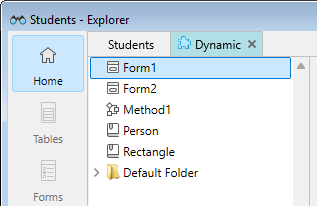
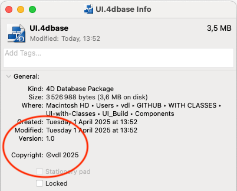

## コンポーネント

4D のコンポーネントとは、[4Dアプリケーションにインストール可能](Concepts/components.md) な、1つ以上の機能を持つ 4D関数やメソッド、フォームの一式です。 たとえば、メールの送受信をおこない、それらを 4D アプリケーションに格納するための機能を持ったコンポーネントを作成できます。

ニーズに合わせて独自の 4Dコンポーネントを開発し、それを非公開とすることができます。 また、作成した [コンポーネントを4Dコミュニティで共有](https://github.com/topics/4d-component) することもできます。

### 定義

- **マトリクスプロジェクト**: コンポーネント開発に使用する4D プロジェクト。 マトリクスプロジェクトは特別な属性を持たない標準のプロジェクトです。 マトリクスプロジェクトはひとつのコンポーネントを構成します。
- **ホストプロジェクト**: コンポーネントがインストールされ、それを使用するアプリケーションプロジェクト。
- **コンポーネント**: [ホストアプリケーションにインストール](../Project/components.md) され、同アプリケーションによって使用されるマトリクスプロジェクトのこと。マトリクスプロジェクトはコンパイルし、[ビルド](Desktop/building.md#コンポーネントをビルド) することができます。

:::note

個別にマトリックスプロジェクトを作成することなく、[ホストプロジェクトから直接コンポーネントを作成する](#コンポーネントの作成) ことができます。

:::

### 基本

4D コンポーネントの作成とインストールは直接 4D を使用しておこないます:

- コンポーネントを使用するには、[アプリケーションにインストール](../Project/components.md) するだけです。 ホストから直接コンポーネントを作成することもできます。この場合、このコンポーネントは直ちに使用することが可能です。
- 言い換えれば、マトリクスプロジェクト自体も1 つ以上のコンポーネントを使用できます。 しかしコンポーネントが "サブコンポーネント" を使用することはできません。
- コンポーネントは次の 4D の要素を呼び出すことができます: データストア([`ds`](../commands/ds.md))、クラス、関数、プロジェクトメソッド、プロジェクトフォーム、メニューバー、選択リストなど。 以下のデータベースメソッドを使用することが可能です: [On Web Connection](../commands-legacy/on-web-connection-database-method.md)、 [On Web Authentication](../commands-legacy/on-web-authentication-database-method.md)、 [On Host Database Event](../commands-legacy/on-host-database-event-database-method.md) 。
- 外部データベースのメカニズムを使用すればテーブルやフィールドを作成し、そこにデータを格納したり読み出したりすることができます。 外部データベースは、メインの 4D データベースとは独立して存在し、SQLコマンドでアクセスします。
- インタープリターモードで動作するホストプロジェクトは、インタープリターまたはコンパイル済みどちらのコンポーネントも使用できます。 コンパイルモードで実行されるホストデータベースでは、インタープリターのコンポーネントを使用できません。 この場合、コンパイル済みコンポーネントのみが利用可能です。

:::note

Interpreted component code can be [edited directly from the host project](#editing-components) if the context is supported.

:::

## Creating and editing components from the host

In interpreted mode, the 4D IDE allows you to create and edit components directly from the host project. It facilitates component development and tuning in the actual context of a host project without having to leave or restart it.

### Creating components

You can create a new component directly from the host project:

- by using the **File > New > Component...** option from the File menu,
- or by clicking the **New > Component...** button in the toolbar.

This action opens a folder selection dialog where you choose where [the component package](../Project/components.md#package-folder) will be stored.

- Default location: The first time you create a component, 4D suggests the **Components** folder inside the [project package](../Project/architecture.md#components). After that, your used last folder will be automatically remembered and preselected.
- If you decide to store the component **next to the project package**, 4D adds it to the [`dependencies.json`](../Project/components.md#dependenciesjson) file.
- If you decide to store the component **elsewhere**, 4D adds it to the [`dependencies.json`](../Project/components.md#dependenciesjson) file and its path is added to the [`environment4d.json`](../Project/components.md#environment4djson) file, using either a [relative or an absolute path](../Project/components.md#relative-paths-vs-absolute-paths). A relative path is used if the component is located within no more than two levels above as the `environment4d.json` file, or in its subfolders. Otherwise, an absolute path is used.

:::note

You cannot store a component **in the project package** but **outside the Components folder**.

:::

Once created, the component is immediately added to the project, accessible in the [Project dependencies](../Project/components.md#monitoring-project-dependencies) window, and available for editing.

### Editing components

You can edit a component code as long as the following conditions are met:

- ホストプロジェクトがインタープリタモードで実行中である
- コンポーネントが、[インタープリタモードでロードされてい](../Project/components.md#interpreted-and-compiled-components) 、ソースコードが編集可能である
- the component files are stored locally (i.e. they are not [downloaded from GitHub](../Project/components.md#adding-a-github-dependency)).

このコンテキストでは、以下の2箇所において、コンポーネントのコードをコードエディターで開き、編集して、保存することができます:

- エクスプローラーのコンポーネントメソッドのセクションから(公開されたコードのみ)
- 専用のコンポーネントタブで(全てのコード)

#### 公開されたコンポーネントコードを編集する

コンポーネントの[公開されたコンポーネントクラス](#クラスの共有) および [共有されたメソッド](#プロジェクトメソッドの共有) はエクスプローラーの**コンポーネントメソッド** タブから編集することができます。

エクスプローラーでは、コンポーネントに共有されたコードが含まれていることを表す特定のアイコンが表示されます:<br/>


**編集...** を選択するとコードエディターでコンポーネントのコードが開きます。 そこで編集し保存することができます。

#### 全てのコンポーネントコードを編集する

共有されていないメソッドやクラスも含め、ロードされたコンポーネントの全てのコードを、ホストプロジェクトから専用のコンポーネントタブにおいて直接編集することができます。

**編集...** の項目は、エクスプローラーの **コンポーネントメソッド** タブ内にてコンポーネント名を右クリックすると利用できます。


それを選択すると、エクスプローラーに専用のタブが追加されます(あるいは既に追加されていた場合にはそれがハイライトされます)。 このタブ内では、以下の標準のページが利用でき、コンポーネントの中身へとアクセスできます:



- フォルダ、メソッド、クラスおよびフォーム(プレビューのみ)を含むホーム
- プロジェクトメソッド
- データベースメソッド([On Web Connection](../commands-legacy/on-web-connection-database-method.md)、[On Web Authentication](../commands-legacy/on-web-authentication-database-method.md)、[On Host Database Event](../commands-legacy/on-host-database-event-database-method.md))
- クラス
- プロジェクトフォームメソッド
- コマンドと定数
- プラグイン
- ゴミ箱


標準の4D IDE 機能がコンポーネントに対して利用可能です。 以下のアクションを実行することができます:

- [メソッドおよびクラス](../Project/code-overview.md)の追加、複製、削除、編集/保存
- コードのプレビュー、[ドキュメンテーション](../Project/documentation.md) の表示/編集、[メソッドプロパティ](../Project/code-overview.md#project-method-properties) の表示/編集
- メソッドの実行
- ゴミ箱からの復元、あるいはゴミ箱を空にする。

### ランゲージコマンドのスコープ

[使用できないコマンド](#使用できないコマンド) を除き、コンポーネントではすべての 4D ランゲージコマンドが使用できます。

コマンドがコンポーネントから呼ばれると、コマンドはコンポーネントのコンテキストで実行されます。 ただし[`EXECUTE FORMULA`](../commands-legacy/execute-formula.md) と [`EXECUTE METHOD`](../commands-legacy/execute-method.md) コマンドは除きます。これらはコマンドで指定されたメソッドのコンテキストを使用します。 また、ユーザー＆グループテーマの読み出しコマンドはコンポーネントで使用することができますが、読み出されるのはホストプロジェクトのユーザー＆グループ情報であることに注意してください (コンポーネントに固有のユーザー＆グループはありません)。

[`SET DATABASE PARAMETER`](../commands-legacy/set-database-parameter.md) および [`Get database parameter`](../commands-legacy/get-database-parameter.md) コマンドは例外となります: これらのコマンドのスコープはグローバルです。 これらのコマンドがコンポーネントから呼び出されると、結果はホストプロジェクトに適用されます。

さらに、`Structure file` と `Get 4D folder` コマンドは、コンポーネントで使用するための設定ができるようになっています。

[`COMPONENT LIST`](../commands-legacy/component-list.md) コマンドを使用して、ホストプロジェクトにロードされたコンポーネントのリストを取得できます。

### 使用できないコマンド

(読み取り専用モードで開かれるため) ストラクチャーファイルを更新する以下のコマンドは、コンポーネントで使用することができません。 コンポーネント中で以下のコマンドを実行すると、-10511, "CommandName コマンドをコンポーネントでコールすることはできません" のエラーが生成されます:

- `ON EVENT CALL`
- `Method called on event`
- `SET PICTURE TO LIBRARY`
- `REMOVE PICTURE FROM LIBRARY`
- `SAVE LIST`
- `ARRAY TO LIST`
- `EDIT FORM`
- `CREATE USER FORM`
- `DELETE USER FORM`
- `CHANGE PASSWORD`
- `EDIT ACCESS`
- `Set group properties`
- `Set user properties`
- `DELETE USER`
- `CHANGE LICENSES`
- `BLOB TO USERS`
- `SET PLUGIN ACCESS`

**注:**

- `Current form table` コマンドは、プロジェクトフォームのコンテキストで呼び出されると `Nil` を返します。 ゆえにこのコマンドをコンポーネントで使用することはできません。
- SQLデータ定義言語のコマンド (`CREATE TABLE`、`DROP TABLE`等)  をコンポーネントのフレームワークで使用することはできません。 ただし、外部データベースの場合は使用することができます (`CREATE DATABASE` SQL コマンド参照)。

### プロジェクトメソッドの共有

マトリクスプロジェクトのすべてのプロジェクトメソッドは 、コンポーネントに含まれます。 つまり、マトリクスプロジェクトをコンポーネント化した後、これらのプロジェクトメソッドは同コンポーネント内で呼び出して実行することができます。

他方、デフォルトでは、これらのプロジェクトメソッドはホストプロジェクトに表示されず、呼び出すこともできません。 マトリクスプロジェクトで、メソッドプロパティダイアログボックスの **コンポーネントとホストプロジェクト間で共有** ボックスをチェックすることで、ホストプロジェクトおよびそのコンポーネントと共有したいメソッドを明示的に設定することができます。


設定することで、共有されたプロジェクトメソッドはホストプロジェクトにおいて呼び出せるようになります (しかしホストプロジェクトのコードエディターで編集することはできません)。 これらのメソッドはコンポーネントの **エントリーポイント** となります。

セキュリティのため、デフォルトでは、コンポーネントはホストプロジェクトのプロジェクトメソッドを実行することはできません。 特定の場合に、ホストプロジェクトのプロジェクトメソッドにコンポーネントがアクセスできるようにする必要があるかもしれません。 そうするには、ホストプロジェクトのプロジェクトメソッド側で、コンポーネントからのアクセスを可能にするよう明示的に指定しなければなりません。これはメソッドプロパティダイアログボックスの、**コンポーネントとホストプロジェクト間で共有** で設定します。


ホストプロジェクトのプロジェクトメソッドがコンポーネントから利用可能になっていれば、[`EXECUTE FORMULA`](../commands-legacy/execute-formula.md) または [`EXECUTE METHOD`](../commands-legacy/execute-method.md) コマンドを使用して、コンポーネント側からホストのメソッドを実行することができます。 例:

```4d
// ホストメソッド
component_method("host_method_name")
```

```4d
// コンポーネントメソッド
#DECLARE ($param : Text)
EXECUTE METHOD($param)
```

> インタープリターコンポーネントがインストールされたインタープリターホストデータベースは、それがインタープリターコンポーネントのメソッドを呼び出さなければ、コンパイル/シンタックスチェックができます。 そうでない場合、コンパイルまたはシンタックスチェックを実行しようとすると警告ダイアログが表示され、操作を実行することはできません。  
> 一般的に、インタープリターメソッドはコンパイル済みメソッドを呼び出せますが、逆はできません。これをおこなうには `EXECUTE METHOD` や `EXECUTE FORMULA` コマンドを使用します。

### クラスの共有

デフォルトでは、ホストプロジェクトの 4Dコードエディターからコンポーネントのクラスを呼び出すことはできません。 ホストプロジェクトおよび読み込まれているコンポーネントに対してコンポーネントのクラスを公開したい場合は、**コンポーネント名前空間を宣言** する必要があります。 また、コンポーネントのクラスがホストコードエディターでどのように提案されるかをコントロールすることもできます。

#### コンポーネント名前空間の宣言

ホストプロジェクトおよび読み込まれているコンポーネントに対してコンポーネントのクラスを公開するには、マトリクスプロジェクトの設定の [一般ページにある **クラスストア内でのコンポーネント名前空間** オプション](../settings/general.md#クラスストア内でのコンポーネント名前空間) に値を入力します。 デフォルトでは、このエリアは空です。つまり、コンポーネントのクラスはコンポーネント外で利用できません。


:::note

*名前空間* は、同じ名前のクラスや関数を持つ異なるコンポーネントがホストプロジェクトで使用されている場合に、競合が発生しないようにします。 コンポーネント名前空間は、[プロパティの命名規則](../Concepts/identifiers.md#オブジェクトプロパティ) に準拠する必要があります。

:::

値を入力すると、ホストプロジェクトおよび読み込まれているコンポーネントのコードにおいて、ユーザークラスストア (cs) 内の cs.<値> 名前空間を介して、コンポーネントのクラスが利用可能になることを宣言することになります。 たとえば、`getArea()` 関数を持つ `Rectangle` クラスが存在する場合に、コンポーネント名前空間として "eGeometry" を入力すると、このプロジェクトがコンポーネントとしてインストールされると、ホストプロジェクトの開発者は次のように記述することができます:

```4d
// ホストプロジェクトまたは読み込まれているコンポーネントにて
var $rect: cs.eGeometry.Rectangle
$rect:=cs.eGeometry.Rectangle.new(10;20)
$area:=$rect.getArea()
```

:::info

[コンパイルされた](#コンポーネントの保護-コンパイル) コンポーネントの名前空間は、ホストプロジェクトの [コンポーネントメソッドページ](../Concepts/components.md#コンポーネントの使い方) にて、コンポーネント名の後に括弧で表示されます。


:::

競合を避けるためには、優れた識別名の使用が推奨されます。 もし、コンポーネントの名前空間と同じ名前のユーザークラスがすでにプロジェクトに存在していた場合、そのユーザークラスが考慮され、コンポーネントクラスは無視されます。

コンポーネントの ORDAクラスは、ホストプロジェクトでは使用できません。 たとえば、コンポーネントに Employees というデータクラスがある場合、ホストプロジェクトで "cs.Mycomponent.Employee" クラスを使用することはできません。

#### 非表示クラス

アンダースコア ("_") を名前の前に付けることで、コンポーネントのクラスや関数を非表示にすることができます。 [コンポーネント名前空間が定義されている](#コンポーネント名前空間の宣言) 場合、非表示のクラスや関数はコード補完の際に提案されません。

ただし、名前がわかっていれば使用することは可能です。 たとえば、`_Rectangle` クラスが非表示の場合でも、次のシンタックスは有効です:

```4d
$rect:=cs.eGeometry._Rectangle.new(10;20)
```

> 非表示のクラス内の、非表示でない関数は、そのクラスを [継承](../Concepts/classes.md#継承) するクラスでコード補完を使用すると提案されます。 たとえば、あるコンポーネントに `_Person` クラスを継承した `Teacher` クラスがある場合、`Teacher` のコード補完では `_Person` の非表示でない関数が提案されます。

## コンパイル済みコンポーネントのコード補完

開発者に向けてコンポーネントを使いやすくするため、マトリクスプロジェクトの設定で、 [一般ページの **コンパイル時にコード補完用のシンタックスファイルを生成する** オプション](../settings/general.md#component-namespace-in-the-class-store) をチェックすることができます。

すると、コンパイル時にシンタックスファイル (JSON形式) が自動生成され、そこにコンポーネントのクラス、関数、および [公開メソッド](#プロジェクトメソッドの共有) のシンタックスを格納し、コンポーネントプロジェクトの `\Resources\ja.lproj` フォルダーに配置されます。 4D は、このシンタックスファイルをもとに、コード補完や関数シンタックスなどのコードエディター用のヘルプを生成します。


[コンポーネント名前空間](#コンポーネント名前空間の宣言) を入力しない場合、シンタックスファイル生成のオプションがチェックされていても、クラスや公開メソッド用のリソースは生成されませ ん。

### 変数の渡し方

ローカル、プロセス、インタープロセス変数は、コンポーネントとホストプロジェクト間で共有されません。 ホストプロジェクトからコンポーネントの変数を編集、またはその逆をおこなう唯一の方法はポインターを使用することです。

配列を使用した例:

```4d
// ホストプロジェクト側:
     ARRAY INTEGER(MyArray;10)
     AMethod(->MyArray)

// コンポーネント側で AMethod プロジェクトメソッドは以下の通りです:
     APPEND TO ARRAY($1->;2)
```

変数を使用した例:

```4d
C_TEXT(myvariable)
component_method1(->myvariable)
```

```4d
C_POINTER($p)
$p:=component_method2(...)
```

ポインターを使用しない場合でも、コンポーネント側からホストデータベースの (変数そのものではなく) 変数の値にアクセスすること自体は可能ですし、その逆も可能です:

```4d
// ホストデータベース内
C_TEXT($input_t)
$input_t:="DoSomething"
component_method($input_t)
// component_method は $1 に "DoSomething" を受け取ります ($input_t 変数を受け取るわけではありません)
```

ホストプロジェクトとコンポーネント間でポインターを使用して通信をおこなうには、以下の点を考慮する必要があります:

- `Get pointer` をコンポーネント内で使用した場合、このコマンドはホストプロジェクトの変数へのポインターを返しません。また逆にこのコマンドをホストプロジェクトで使用した場合も同様です。

- コンパイル済みプロジェクトでは、コンパイルされたコンポーネントしか使用できませんが、インタープリタープロジェクトの場合には、インタープリターおよびコンパイル済みコンポーネントを同時に使用することができます。 この場合、ポインターの利用は以下の原則を守らなければなりません: インタープリターモードでは、コンパイルモードにおいて作成されたポインターを解釈できます。逆にコンパイルモードでは、インタープリターモードにて作成されたポインターを解釈することはできません。
  以下の例でこの原則を説明します: 同じホストプロジェクトにインストールされた 2つのコンポーネント C ( コンパイル済) と I ( インタープリタ) があります:

- コンポーネントC が定義する変数 `myCvar` があるとき、コンポーネントI はポインター `->myCvar` を使用して変数の値にアクセスすることができます。

- コンポーネントI が定義する変数 `myIvar` があるとき、コンポーネントC はポインター `->myIvar` を使用しても変数の値にアクセスすることはできません。 このシンタックスは実行エラーを起こします。

- `RESOLVE POINTER` を使用したポインターの比較はお勧めできません。変数の分離の原則により、ホストプロジェクトとコンポーネント (あるいは他のコンポーネント) で同じ名前の変数が存在することができますが、根本的にそれらは異なる内容を持ちます。 両コンテキストで、変数のタイプが違うことさえありえます。 ポインター `myptr1` と `myptr2` がそれぞれ変数を指すとき、以下の比較は正しくない結果となるかもしれません:

```4d
     RESOLVE POINTER(myptr1;vVarName1;vtablenum1;vfieldnum1)
     RESOLVE POINTER(myptr2;vVarName2;vtablenum2;vfieldnum2)
     If(vVarName1=vVarName2)
      // 変数が異なっているにもかかわらず、このテストはtrue を返します
```

このような場合には、ポインターを比較しなければなりません:

```4d
     If(myptr1=myptr2) // このテストはFalse を返します
```

### エラー処理

`ON ERR CALL` コマンドによって実装された [エラー処理メソッド](Concepts/error-handling.md) は、実行中のプロジェクトに対してのみ適用されます。 コンポーネントによって生成されたエラーの場合、ホストプロジェクトの `ON ERR CALL` エラー処理メソッドは呼び出されず、その逆もまた然りです。

### ホストプロジェクトのテーブルへのアクセス

コンポーネントでテーブルを使用することはできませんが、ホストプロジェクトとコンポーネントはポインターを使用して通信をおこなうことができます。 たとえば、以下はコンポーネントで実行可能なメソッドです:

```4d
// コンポーネントメソッドの呼び出し
methCreateRec(->[PEOPLE];->[PEOPLE]Name;"Julie Andrews")
```

コンポーネント内の `methCreateRec` メソッドのコード:

```4d
C_POINTER($1) // ホストプロジェクトのテーブルへのポインター
C_POINTER($2) // ホストプロジェクトのフィールドへのポインター
C_TEXT($3) // 代入する値

$tablepointer:=$1
$fieldpointer:=$2
CREATE RECORD($tablepointer->)

$fieldpointer->:=$3
SAVE RECORD($tablepointer->)
```

> コンポーネントのコンテキストにおいて、テーブルフォームへの参照はすべてホスト側のテーブルフォームへの参照だと 4D はみなします (コンポーネントはテーブルを持つことができないからです)。

### テーブルやフィールドの利用

コンポーネントは、マトリクスプロジェクトのストラクチャーで定義されたテーブルやフィールドを使用することはできません。 しかし外部データベースを作成し、そのテーブルやフィールドを必要に応じ利用することはできます。 外部データベースの作成と管理は SQL を用いておこないます。 外部データベースは、メインの4Dプロジェクトから独立している別の 4Dプロジェクトですが、メインプロジェクトから操作が可能です。 外部データベースの利用は、そのデータベースを一時的にカレントデータベースに指定することです。言い換えれば、4Dが実行する SQL クエリのターゲットデータベースとして外部データベースを指定します。 外部データベースの作成は SQL の `CREATE DATABASE` コマンドを使用します。

#### 例題

以下のコードはコンポーネントに実装されており、外部データベースに対して3つの基本的なアクションをおこないます:

- 外部データベースを作成します (存在しない場合)
- 外部データベースにデータを追加します
- 外部データベースからデータを読み込みます

外部データベースの作成:

```4d
<>MyDatabase:=Get 4D folder+"\MyDB" // (Windows) データを許可されているディレクトリに保存します
 Begin SQL
        CREATE DATABASE IF NOT EXISTS DATAFILE :[<>MyDatabase];
        USE DATABASE DATAFILE :[<>MyDatabase];
        CREATE TABLE IF NOT EXISTS KEEPIT
        (
        ID INT32 PRIMARY KEY,
        kind VARCHAR,
        name VARCHAR,
        code TEXT,
        sort_order INT32
        );

        CREATE UNIQUE INDEX id_index ON KEEPIT (ID);

        USE DATABASE SQL_INTERNAL;

 End SQL

```

外部データベースへのデータ書き込み:

```4d
 $Ptr_1:=$2 // ポインターを介してホストプロジェクトからデータを取得します
 $Ptr_2:=$3
 $Ptr_3:=$4
 $Ptr_4:=$5
 $Ptr_5:=$6
 Begin SQL

        USE DATABASE DATAFILE :[<>MyDatabase];

        INSERT INTO KEEPIT
        (ID, kind, name, code, sort_order)
        VALUES
        (:[$Ptr_1], :[$Ptr_2], :[$Ptr_3], :[$Ptr_4], :[$Ptr_5]);

        USE DATABASE SQL_INTERNAL;


 End SQL

```

外部データベースからデータを読み込み:

```4d
 $Ptr_1:=$2 // ホストプロジェクトへのデータアクセスはポインターを通じておこないます
 $Ptr_2:=$3
 $Ptr_3:=$4
 $Ptr_4:=$5
 $Ptr_5:=$6

 Begin SQL

    USE DATABASE DATAFILE :[<>MyDatabase];

    SELECT ALL ID, kind, name, code, sort_order
    FROM KEEPIT
    INTO :$Ptr_1, :$Ptr_2, :$Ptr_3, :$Ptr_4, :$Ptr_5;

    USE DATABASE SQL_INTERNAL;

 End SQL

```

### フォームの使用

- 特定のテーブルに属さない" プロジェクトフォーム" のみが、コンポーネント内で利用できます。 マトリクスプロジェクトのすべてのプロジェクトフォームをコンポーネントで使用することができます。
- コンポーネントはホストプロジェクトのテーブルフォームを使用できます。 この場合、コンポーネントのコードでフォームを指定するにあたっては、テーブル名ではなく、テーブルへのポインターを使用しなければならないことに注意してください。

> コンポーネントが `ADD RECORD` コマンドを使用すると、ホストプロジェクトのコンテキストで、ホストプロジェクトのカレントの入力フォームが表示されます。 したがって、その入力フォーム上に変数が含まれている場合、コンポーネントはその変数にアクセスできません。

- コンポーネントフォームをホストプロジェクト内で [サブフォームとして公開](../FormEditor/properties_FormProperties.md#サブフォームとして公開) することができます。 これは具体的には、グラフィックオブジェクトを提供するコンポーネントを開発できることを意味します。 たとえば、4D社が提供するウィジェットはコンポーネントのサブフォーム利用に基づいています。

> コンポーネントのコンテキストにおいては、参照されるプロジェクトフォームはすべてコンポーネント内に存在している必要があります。 たとえば、コンポーネント内において、`DIALOG` または `Open form window` コマンドを使用してホスト側のプロジェクトフォームを参照しようとした場合にはエラーが生成されます。

### リソースの使用

コンポーネントは、自身の Resourcesフォルダーにあるリソースを使用することができます。

これによって自動メカニズムが有効となり、コンポーネントの Resources フォルダー内で見つかった XLIFF ファイルは、 同コンポーネントによってロードされます。

1つ以上のコンポーネントを含むホストプロジェクトでは、ホストプロジェクトと同様にそれぞれのコンポーネントも固有のリソースチェーンを持っています。 リソースは異なるプロジェクト間で分離されます。コンポーネントA のリソースにコンポーネントB やホストプロジェクトからアクセスすることはできません。

### 初期化のコードの実行

コンポーネントは、ホストデータベースを開いたときまたは閉じたときに、自動的に 4Dコードを実行することができます。これによってたとえば、ホストデータベースに関連する設定やユーザーの状態などを読み込み・保存することができます。

初期化やデータベースを閉じるコードの実行は、 `On Host Database Event` データベースメソッド を使用しておこなわれます。

> セキュリティ上の理由から、`On Host Database Event` データベースメソッドを使用可能にするためには、その実行をホストデータベースで明示的に許可する必要があります。 このためには、ストラクチャー設定画面のセキュリティページ内の、[**コンポーネントの "On Host Database Event" メソッドを実行**](../settings/security.md#オプション) オプションにチェックを入れます:

### Info.plist

コンポーネントは、その[root フォルダ](../Project/architecture.md) にシステム(macOS のみ)と[依存関係マネージャ](../Project/components.md#コンポーネントのロード)が読み取り可能な追加の情報を提供する、 `Info.plist` ファイルを持っています。

:::note

このファイルは必須ではありませんが、macOS 用の[公証可能でステープル可能な](../Desktop/building.md#ノータリゼーション-公証-について) コンポーネントをビルドするためには必要です。 そのため、これがまだ存在しない場合にはに[ビルド時に](../Desktop/building.md#build-component)自動的に作成されます。 一部のキーはbuildApp XML キーを使用して設定可能である点に留意してください([コンポーネントのビルド](../Desktop/building.md#コンポーネントをビルド) を参照してください)。

:::

コンポーネントの`Info.plist` ファイル内でサポートされているキーは、大部分は[Apple bundle キー](https://developer.apple.com/documentation/bundleresources/information-property-list) であり、Windows 上では無視されます。 しかしながら、これらは全てのプラットフォームにおいて[依存関係マネージャ](../Project/components.md#コンポーネントの読み込み) によって使用されます。

The following keys can be defined:

| key                                                        | description                                                                                                 |
| ---------------------------------------------------------- | ----------------------------------------------------------------------------------------------------------- |
| CFBundleName                                               | コンポーネント名(内部)                                                                             |
| CFBundleDisplayName                                        | 表示するコンポーネント名                                                                                                |
| NSHumanReadableCopyright                                   | 表示する著作権                                                                                                     |
| CFBundleVersion                                            | コンポーネントのバージョン                                                                                               |
| CFBundleShortVersionString                                 | 表示するコンポーネントのバージョン                                                                                           |
| com.4d.minSupportedVersion | サポートされる最低限の4D のバージョン。これは依存関係マネージャの[4D のバージョンに従うコンポーネント](../Project/components.md#4Dバージョンタグの命名規則)において使用されます。 |

以下は、`Info.plist` ファイルの一例です:

```xml
<?xml version="1.0" encoding="UTF-8" standalone="no" ?>
<plist>
  <dict>
    <key>CFBundleName</key>
    <string>UI</string>
    <key>CFBundleDisplayName</key>
    <string>UI</string>
    <key>CFBundleShortVersionString</key>
    <string>1.0</string>
    <key>NSHumanReadableCopyright</key>
    <string>©vdl 2025</string>
    <key>CFBundleVersion</key>
    <string></string>
    <key>com.4d.minSupportedVersion</key>
    <string>20R10</string>
  </dict>
</plist>
```

macOS 上では、Finder からこの情報を見ることができます:



### コンポーネントの保護: コンパイル

コンポーネントとしてインストールされたマトリクスプロジェクトのコードは、ホストプロジェクトからデフォルトでアクセス可能です。 特に:

- エクスプローラーのメソッドページに存在する共有のプロジェクトメソッドは、ホストプロジェクトのメソッドから呼び出し可能です。 エクスプローラーのプレビューエリアでそれらの内容を選択してコピーすることが可能です。 また、その内容はデバッガーで見ることもできます。 しかし、それらをコードエディター上で開いたり編集したりすることはできません。
- マトリクスプロジェクトの他のプロジェクトメソッドはエクスプローラーに現れません。しかし、ホストプロジェクトのデバッガーには内容が表示されます。
- [名前空間が宣言されていれば](#コンポーネント名前空間の宣言)、非表示でないクラスや関数はデバッガーで確認することができます。

コンポーネントのコードを効果的に保護するには、マトリクスプロジェクトを [コンパイルしビルドして](Desktop/building.md#コンポーネントをビルド)、.4dz ファイルとして提供します。 コンパイルされたマトリクスプロジェクトがコンポーネントとしてインストールされると:

- 共有のプロジェクトメソッド、クラス、および関数は、ホストプロジェクトのメソッドから呼び出し可能です。共有のプロジェクトメソッドは、エクスプローラーのメソッドページにも表示されます。 しかし、その内容はプレビューエリアにもデバッガーにも表示されません。
- マトリクスプロジェクトの他のプロジェクトメソッドは一切表示されません。

### GitHub上でコンポーネントを共有する

開発したコンポーネントを [GitHub](https://github.com/topics/4d-component) で公開し、4D開発者のコミュニティをサポートすることをお勧めします。 正しく参照されるためには、**`4d-component`** トピックをご利用ください。

## プラグイン

### プラグインの必要性

オブジェクトやレコードの操作、ユーザーインターフェースの実装のため、4D は数百のビルトインコマンドを提供していますが、さらに特殊な機能 (プラットフォーム依存のものなど) が必要になることがあります。たとえば、Windows上のODBC 、macOS上のアップルサービス、特殊な統計機能、ソーシャルネットワークログイン、決済用のプラットフォーム、ネットワークを介したファイルアクセス、特殊なユーザーインターフェース、独自のピクチャー構造などです。

これらの機能をすべて、macOS と Windows の両方で 4D コマンドによって提供しようとした場合、コマンド数は数千に膨れ上がると同時に、ほとんどのユーザーはそれらの追加機能を必要としないでしょう。 また、そのような万能ツールを作り上げたとしても、その結果として 4D 環境は複雑化することになり、4D の学習が困難になるだけでなく、成果が得られるまで時間を要するようになるでしょう。

4D 環境のモジュール性により、基礎的なアプリケーションの作成はもちろんのこと、非常に複雑なシステムの開発も可能です。 4D プラグインのアーキテクチャーによって、4D 環境はあらゆるアプリケーションとユーザーに対して開かれています。 4D プラグインによってアプリケーションやユーザーの生産性を飛躍させることができます。

### プラグインとは何か

プラグインとは、4D 起動時にロードされるコードのことです。 プラグインは、4D に機能を追加します。

通常、プラグインは:

- 4D ができないことを処理します (プラットフォーム特有の技術など)
- 4D だけでは難しいことを実現します
- プラグインのエントリーポイントの形でのみ提供されている機能を提供します

プラグインには通常複数のルーチンが含まれています。 プラグインは外部エリアを操作でき、外部プロセスを実行できます。

- **プラグインルーチン** とは、ネイティブ言語 (通常は C あるいは C++) で書かれたルーチンで、なんらかの処理を実行します。
- **外部エリア** とはフォームの一部で、あらゆるものを表示することができ、必要に応じてユーザー操作を受け付けることができます。
- **外部プロセス** とは、通常はループ形式で単独実行されるプロセスのことです。 プロセスのコードはすべてプラグインに属しており、4D はプロセスに対してイベントを送受信するだけです。

### 重要な注記

プラグインは、小さな処理をおこなう一つのルーチンを実行するだけの、とても簡単なものでありえます。また、百以上のルーチンとエリアを扱うような、非常に複雑なものでもありえます。 プラグインの機能に制限はありませんが、プラグインの開発にあたっては、プラグインがあくまで従たるコードであることに留意が必要です。 プラグインは 4D 内で実行されます。 プラグインは独立したアプリケーションではなく、4D の一部です。 プラグインは、他のプラグインや 4D 自身と CPU 時間とメモリを共有します。したがって、プラグインのコードは、必要なリソースだけを使用する控えめなコードであるべきです。 たとえば、非常に長いループ処理においては (その重要性が絶対的な優先権を要求しないかぎり)、プラグインは `PA_Yield()` を呼び出して、4D のスケジューラーにも処理時間を割り当てるべきです。

### プラグインの作り方

4D は GitHub 上に、4D Plugin API と the 4D Plugin Wizard を含んだオープンソースの [**プラグイン SDK**](https://github.com/4d/4D-Plugin-SDK) (英語) を提供しています:

- [**4D Plugin API**](https://github.com/4d/4D-Plugin-SDK/blob/master/4D%20Plugin%20API) は C で書かれており、プラグインの開発を助けるための機能を400以上追加します。 4D Plug-in API の機能は、4D とプラグイン間の通信を管理します。
- [**4D Plugin Wizard**](https://github.com/4d/4D-Plugin-SDK/blob/master/4D%20Plugin%20Wizard) は、4D プラグインの開発を簡略化するために不可欠なツールです。 プラグインのロードや、プラグインとの通信に 4D が必要とするコードがツールによって提供されることで、デベロッパーはプラグインの根幹をなすコードに集中することができます。

### プラグインの共有

開発したプラグインを [GitHub](https://github.com/topics/4d-plugin) で公開し、4D開発者のコミュニティをサポートすることをお勧めします。 正しく参照されるためには、**`4d-plugin`** トピックをご利用ください。