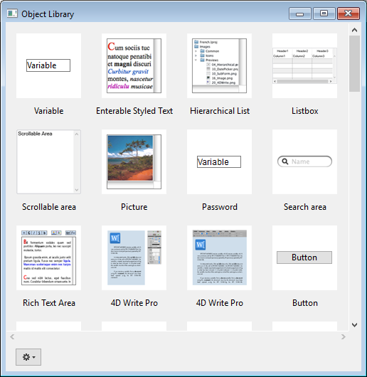

フォームの作成にあたっては、オブジェクトライブラリを利用することができます。 オブジェクトライブラリは、ドラッグ＆ドロップやコピー/ペーストするだけでフォームに追加することができる、あらかじめ設定された各種オブジェクトを提供しています。

4D では 2種類のオブジェクトライブラリを利用できます:

- 標準の設定済みオブジェクトライブラリはすべてのプロジェクトに利用できます
- カスタムオブジェクトライブラリは、開発者自身がお気に入りのフォームオブジェクトや、あるいはプロジェクトフォームそのものをとっておくためのものです

## 標準のオブジェクトライブラリの使用

標準のオブジェクトライブラリはフォームエディターからアクセスすることができます: ツールバーの右にある次のボタンをクリックします:

すると、ライブラリが別ウィンドウに開きます:

このウィンドウには次の主な機能があります:

- Tips 付きプレビューエリア: 中央のエリアには各オブジェクトのプレビューが表示されます。 オブジェクトにマウスオーバーすると、オブジェクトに関する情報が Tips として表示されます。
- 表示オブジェクトは **カテゴリ** メニューを使って絞り込むことができます:
  
- ライブラリのオブジェクトをフォーム上で使うには:
  - オブジェクト上で右クリックし、コンテキストメニューから **コピー** を選択してフォーム上で同様に **ペースト** するか、
  - ライブラリからフォーム上へと、オブジェクトをドラッグ＆ドロップします。
    すると、フォームに当該オブジェクトが追加されます。

設定済みオブジェクトライブラリは変更できません。 デフォルトオブジェクトを編集したり、設定済みオブジェクトやフォームのライブラリを独自に作るには、カスタムオブジェクトライブラリを作成します (後述参照)。

標準のオブジェクトライブラリにて提供されているオブジェクトについては [doc.4d.com](https://doc.4d.com/4Dv18/4D/18/Library-objects.200-4575412.ja.html) で詳しく説明されています。

## カスタムオブジェクトライブラリの作成と使用

4Dでカスタムオブジェクトライブラリを作成し、使用することができます。 カスタムオブジェクトライブラリとは、任意のオブジェクト (ボタン、テキスト、ピクチャー等) を格納する 4D プロジェクトです。 これらのオブジェクトは別のフォームやプロジェクトにて再利用することができます。

オブジェクトはプロパティおよびオブジェクトメソッドとともに格納されます。 ライブラリはドラッグ＆ドロップや、コピー/ペースト操作で利用できます。

ライブラリを使用すると、グラフィックファミリーや振る舞いごとにグループ化したフォームオブジェクトを作成できます。

### オブジェクトライブラリの作成

オブジェクトライブラリを作成するには、**ファイル** メニューまたはツールバーから **新規 > オブジェクトライブラリ...** を選択します。 標準のファイル保存用のダイアログボックスが表示され、オブジェクトライブラリの名前と保存先を指定できます。

ダイアログボックスを受け入れると、4D はディスク上に新しいオブジェクトライブラリを作成し、ウィンドウに表示します (デフォルトで空です)。

ライブラリは必要なだけ作成できます。 macOS上で作成されたライブラリを Windowsで使用すること、あるいはその逆も可能です。

### オブジェクトライブラリを開く

一つのオブジェクトライブラリを複数のプロジェクトで同時に開くことはできませんが、 一つのプロジェクトで複数のライブラリを開くことは可能です。

カスタムのオブジェクトライブラリを開くには、**ファイル** メニューまたはツールバーから **開く > オブジェクトライブラリ...** コマンドを選択します。 標準のファイルを開くダイアログボックスが表示され、オブジェクトライブラリを選択できます。 次のファイルタイプが選択できます:

- **.4dproject**
- **.4dz**

カスタムオブジェクトライブラリは、実質的には標準の 4D プロジェクトです。 プロジェクトをライブラリとして開くと、次のものが公開されます:

- プロジェクトフォーム
- フォームのページ1

### オブジェクトライブラリの構築

ドラッグ＆ドロップやコピー/ペースト操作で、オブジェクトをオブジェクトライブラリに配置できます。 オブジェクトは、フォームあるいは他のオブジェクトライブラリ ([標準のオブジェクトライブラリ](#標準のオブジェクトライブラリの使用) 含む) からコピーできます 。 元のオブジェクトとのリンクは保持されないため、オリジナルが編集されてもライブラリのオブジェクトには影響しません。

> フォームからオブジェクトライブラリにドラッグ＆ドロップ操作をおこなうには、4D環境設定のフォームページにて **ドラッグ＆ドロップを開始** オプションを選択している必要があります。

追加・削除・名称変更などの基本操作はコンテキストメニューあるいはウィンドウのオプションメニューから行えます:

- ペーストボードへの **カット** または **コピー**
- ペーストボードからオブジェクトを **ペースト**
- **クリア** でライブラリからオブジェクトを削除
- **名称変更** でダイアログが開き、オブジェクトの名前を変更することができます。 ライブラリ内のオブジェクト名は一意のものでなくてはなりません。

オブジェクトライブラリには個々のオブジェクト (サブフォーム含む) やオブジェクトグループを格納できます。 それぞれのオブジェクトは1つのアイテムとしてグループ化されます:

1つのオブジェクトライブラリには32,000項目まで含めることができます。

オブジェクトは、グラフィックおよび動作に関わるすべてのプロパティとメソッドともにコピーされます。 これらのプロパティはオブジェクトがフォームや他のライブラリにコピーされる際にも保持されます。

#### 依存オブジェクト

コピー/ペーストやドラッグ＆ドロップで特定のライブラリオブジェクトを使用すると、依存オブジェクトも一緒にコピーされます。 たとえば、ボタンをコピーすると、そのオブジェクトに割り当てられていたオブジェクトメソッドもコピーされます。 これらの依存オブジェクトはそれのみを直接コピーしたりドラッグ＆ドロップしたりすることはできません。

メインのオブジェクトと一緒にライブラリに登録される依存オブジェクトは以下のとおりです:

- リスト
- フォーマット/フィルター
- ピクチャー
- ヘルプTips (フィールドにリンク)
- オブジェクトメソッド
