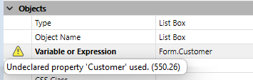
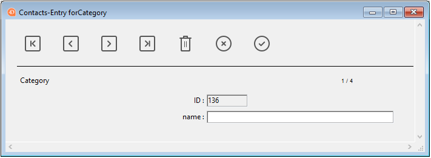

---

## カラースキーム

> 配色プロパティは、macOS でのみ適用されます。

このプロパティは、フォームのカラースキームを定義します。 By default when the property is not set, the value for a color scheme is **inherited** (the form uses the scheme defined at the [application level](../commands-legacy/set-application-color-scheme.md)). これは、フォームに対して以下の 2つのオプションのいずれかに変更することができます:

- dark - 暗い背景に明るいテキスト
- light - 明るい背景に暗いテキスト

> 定義されたカラースキームを CSS で上書きすることはできません。

#### JSON 文法

| 名称          | データタイプ | とりうる値           |
| ----------- | ------ | --------------- |
| colorScheme | string | "dark", "light" |

---

## CSS

このプロパティは、フォーム用に特定の CSSファイルを読み込むことを可能にします。

フォームレベルで定義された CSSファイルは、デフォルトのスタイルシートをオーバーライドします。 詳細については [スタイルシート](createStylesheet.md) を参照ください。

#### JSON 文法

| 名称  | データタイプ                | とりうる値                                                                                                                                                                                                                                     |
| --- | --------------------- | ----------------------------------------------------------------------------------------------------------------------------------------------------------------------------------------------------------------------------------------- |
| css | string または collection | CSSファイルパス:<li>文字列 (両方のプラットフォーム用に 1ファイル)</li><li>文字列のコレクション (両プラットフォーム用のファイルのリスト)</li><li>{"path":string;"media":"mac" \| "win"} オブジェクトのコレクション </li> |

---

## Form Class

Name of an existing [user class](../Concepts/classes.md#class-definition) to associate to the form . The user class can belong to the host project or to a [component](../Extensions/develop-components.md#sharing-of-classes), in which case the formal syntax is "[_componentNameSpace_](../settings/general.md#component-namespace-in-the-class-store).className".

Associating a class to the form provides the following benefits:

- When you work in the [Form editor](../FormEditor/formEditor.md), the associated class is used for accurate syntax checking of expressions such as `Form.myProperty` in all areas of the [Property list](../FormEditor/formEditor.md#property-list) that support [expressions](../Concepts/quick-tour.md#expressions) (e.g. **Variable or Expression**, **Font color expression**...). Errors are displayed in red and warnings are displayed in yellow in the left column of the Property list and you can hover it to get explanations:

- The detection of errors in the code of form object expressions by the [compiler](../Project/compiler.md) is improved.

- You can also to benefit from [autocompletion features](../code-editor/write-class-method.md#autocomplete-functions) in the code editor.

- When the form is executed, 4D automatically instantiates a user class object for the form, which is returned by the [`Form`](../commands/form.md) object. Your code can directly access class functions defined in the user class through the `Form` command (e.g. `Form.message()`) without having to pass a _formData_ object as parameter to the [`DIALOG`](../commands/dialog.md), [`Print form`](../commands/print-form.md), or [`FORM LOAD`](../commands/form-load.md) commands.

:::note

See [this blog post](http://blog.4d.com/empower-your-development-process-with-your-forms) for an illustration of this feature.

:::

#### JSON 文法

| 名称        | データタイプ | とりうる値                                                                                                                   |
| --------- | ------ | ----------------------------------------------------------------------------------------------------------------------- |
| formClass | string | name of an existing user class ("_className_" or "_componentNameSpace_._className_") |

---

## フォーム名

このプロパティはフォームそのものの名称で、4Dランゲージで名前によってフォームを参照するのに使用されます。 フォーム名は、4Dの [識別子の命名規則](Concepts/identifiers.md) に準じたものでなければなりません。

#### JSON 文法

フォーム名は、form.4Dform ファイルを格納するフォルダーの名前で定義されます。 詳しくは [プロジェクトのアーキテクチャー](Project/architecture.md#sources-フォルダー) を参照ください。

---

## フォームタイプ

フォームのタイプ、_つまり_ その出力先によって、当該フォームで利用できる機能が定義されます。 たとえば、[マーカー](properties_Markers.md) はリスト (出力) テーブルフォームでのみ設定できます。

データベースの各テーブルは通常、少なくとも 2つのテーブルフォームを持ちます。 1つは画面上にレコードを一覧表示するためのもので、もう 1つはレコードを 1件ずつ表示するためのものです (データ入力や修正に使用):

- 出力フォーム - _出力フォーム_ (または _リストフォーム_) は、レコードのリストを、1レコードにつき 1行で表示します。 クエリの結果は出力フォームに表示され、ユーザーが行をダブルクリックすると、そのレコード用に入力フォームが表示されます。
  

- 入力フォーム - データ入力に使用されます。 1つの画面に 1件のレコードが表示され、一般的には、レコードの編集を保存・キャンセルするためのボタンや、レコード間を移動するためのボタン (先頭レコード、最終レコード、前レコード、次レコード等) を備えています。
  

サポートされるタイプは、フォームのカテゴリーによって異なります:

| フォームタイプ    | JSON 文法          | 説明                                              | サポートされているフォーム       |
| ---------- | ---------------- | ----------------------------------------------- | ------------------- |
| 詳細フォーム     | detailScreen     | データ入力・修正用の表示フォーム                                | プロジェクトフォームとテーブルフォーム |
| 印刷用詳細フォーム  | detailPrinter    | 1ページにつき 1レコードの印刷レポート (請求書など) | プロジェクトフォームとテーブルフォーム |
| リストフォーム    | listScreen       | レコードを画面上に一覧表示するフォーム                             | テーブルフォーム            |
| 印刷用リストフォーム | listPrinter      | レコード一覧の印刷レポート                                   | テーブルフォーム            |
| なし         | _no destination_ | 特定の機能を持たないフォーム                                  | プロジェクトフォームとテーブルフォーム |

#### JSON 文法

| 名称          | データタイプ | とりうる値                                                        |
| ----------- | ------ | ------------------------------------------------------------ |
| destination | string | "detailScreen", "listScreen", "detailPrinter", "listPrinter" |

---

## 継承されたフォーム名

このプロパティは、現在のフォームに [継承するフォーム](forms.md#継承フォーム) を指定します。

テーブルフォームを継承する場合は、[継承されたフォームテーブル](#継承されたフォームテーブル) プロパティにテーブルを設定します。

継承を解除するには、プロパティリストで `\<なし>` を選択します (JSON では " ")。

#### JSON 文法

| 名称            | データタイプ | とりうる値                                                                                    |
| ------------- | ------ | ---------------------------------------------------------------------------------------- |
| inheritedForm | string | テーブルまたはプロジェクトフォームの名前, フォームを定義する .json ファイルへの POSIXパス, またはフォームを定義するオブジェクト |

---

## 継承されたフォームテーブル

このプロパティは、現在のフォームに [継承するテーブルフォーム](forms.md#継承フォーム) が属するデータベーステーブルを指定します。

プロジェクトフォームを継承する場合は、プロパティリストで `\<なし>` を選択します (JSON では " ")。

#### JSON 文法

| 名称                 | データタイプ            | とりうる値          |
| ------------------ | ----------------- | -------------- |
| inheritedFormTable | string または number | テーブル名またはテーブル番号 |

---

## Pages

各フォームは、少なくとも 2つのページで構成されています:

- ページ0 (背景ページ)
- ページ1 (メインページ)

詳細については [フォームのページ](forms.md#フォームのページ) を参照ください。

#### JSON 文法

| 名称    | データタイプ     | とりうる値                                                      |
| ----- | ---------- | ---------------------------------------------------------- |
| pages | collection | ページのコレクション (各ページはオブジェクトで、ページ0 は最初の要素です) |

---

## サブフォームとして公開

コンポーネントフォームをホストアプリケーションの [サブフォーム](FormObjects/subform_overview.md) として選択するには、明示的に共有されている必要があります。 このプロパティが選択されていると、フォームがホストアプリケーションで公開されます。

公開されたサブフォームとして指定できるのは、プロジェクトフォームのみです。

#### JSON 文法

| 名称     | データタイプ  | とりうる値       |
| ------ | ------- | ----------- |
| shared | boolean | true, false |

---

## 配置を記憶

このオプションがチェックされていると、`Open form window` コマンドに `*` 演算子を渡して開かれたウィンドウが閉じられるとき、そのフォームの特定のプロパティ値については、それらがセッション中に変更された場合、4D によって自動的に保存されます:

- カレントページ
- それぞれのフォームオブジェクトの配置・大きさ・表示状態 (リストボックス列のサイズと表示状態も含む)。

> このオプションは、`OBJECT DUPLICATE` コマンドを使用して作成されたオブジェクトに対しては無効です。 このコマンドを使用したときに使用環境を復元させるには、デベロッパーがオブジェクトの作成・定義・配置の手順を再現しなければなりません。

このオプションが選択されているとき、一部のオブジェクトに置いては [値を記憶](FormObjects/properties_Object.md#値を記憶) のオプションが選択可能になります。

#### JSON 文法

| 名称               | データタイプ  | とりうる値       |
| ---------------- | ------- | ----------- |
| memorizeGeometry | boolean | true, false |

#### 参照

[**値を記憶**](FormObjects/properties_Object.md#値を記憶)

---

## ウィンドウタイトル

ウィンドウタイトルは、アプリケーションモードで `Open window` や `Open form window` コマンドを用いてフォームを開く際に使用されます。 ウィンドウタイトルはウィンドウのタイトルバーに表示されます。

動的参照を使用して、フォームのウィンドウタイトルを定義することもできます:

- Resourcesフォルダーに保存された、標準の XLIFF参照
- テーブル/フィールドラベル: 適用できるシンタックスは `<?[TableNum]FieldNum>` または `<?[TableName]FieldName>` です。
- 変数またはフィールド: 適用できるシンタックスは `\<VariableName>` または `\<[TableName]FieldName>`。 フィールドや変数の現在の値がウィンドウタイトルとして表示されます。

> ウィンドウタイトルの最大文字数は 31 です。

#### JSON 文法

| 名称          | データタイプ | とりうる値               |
| ----------- | ------ | ------------------- |
| windowTitle | string | テキストまたは参照としてのウィンドウ名 |
