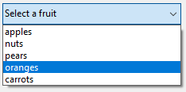

ドロップダウンリストは、ユーザーがリストから選択をおこなえるようにするためのフォームオブジェクトです。 ドロップダウンリストに表示される項目は、オブジェクト、配列、選択リスト、または標準アクションを用いて管理します。

macOS においては、ドロップダウンリストは "ポップアップメニュー" とも呼ばれます。 どちらの名前も同じタイプのオブジェクトを指します。 次の例に示すように、ドロップダウンリストの外観はプラットフォームによって若干異なります:


## ドロップダウンリストの種類

それぞれに特有の機能を持つ、複数タイプのドロップダウンリストを作成することができます。 タイプを定義するには、プロパティリストで適切な **式の型** と **データタイプ** の値を選択するか、それらに相当する JSON を指定します。

| 型                                | 機能                                      | 式の型/式タイプ | データタイプ                        | JSON 定義                                                                                                                                  |
| -------------------------------- | --------------------------------------- | -------- | ----------------------------- | ---------------------------------------------------------------------------------------------------------------------------------------- |
| Object                           | コレクションに基づく                              | Object   | Numeric, Text, Date, または Time | `dataSourceTypeHint: object` + `numberFormat: <format>` または `textFormat: <format>` または `dateFormat: <format>` または `timeFormat: <format>` |
| 配列                               | 配列に基づく                                  | 配列       | Numeric, Text, Date, または Time | `dataSourceTypeHint: arrayNumber` または `arrayText` または `arrayDate` または `arrayTime`                                                        |
| 選択リスト (値を保存)  | 選択リストに基づく (標準)       | リスト      | 選択された項目値                      | `dataSourceTypeHint: text` + `saveAs: value`                                                                                             |
| 選択リスト (参照を保存) | 選択リストに基づく (項目の位置を保存) | リスト      | 選択された項目参照                     | `dataSourceTypeHint: integer` + `saveAs: reference`                                                                                      |
| 階層型選択リスト                         | 階層型の表示が可能                               | リスト      | リスト参照                         | `dataSourceTypeHint: integer`                                                                                                            |
| 標準アクション                          | アクションにより自動生成                            | _any_    | _リスト参照以外_                     | いずれかの定義 + `action: <action>` (他エリアに適用されるアクションの場合は + `focusable: false`)                                               |

## ドロップダウンリストの使い方

### オブジェクトの使用

> この機能は 4Dプロジェクトでのみ利用可能です。

ドロップダウンリストのデータソースとして、[コレクション](Concepts/dt_collection) を内包した [オブジェクト](Concepts/dt_object.md) を使用できます。 このオブジェクトには、次のプロパティが格納されていなくてはなりません:

| プロパティ          | 型               | 説明                                                                                                                                            |
| -------------- | --------------- | --------------------------------------------------------------------------------------------------------------------------------------------- |
| `values`       | Collection      | 必須 - スカラー値のコレクション。 すべての同じ型の値でなくてはなりません。 サポートされている型:<li>文字列</li><li>数値</li><li>日付</li><li>時間</li>空、または未定義の場合、ドロップダウンリストは空になります |
| `index`        | number          | 選択項目のインデックス (0 と `collection.length-1` の間の値)。 -1 に設定すると、プレースホルダー文字列として currentValue が表示されます。                               |
| `currentValue` | Collection要素と同じ | 選択中の項目 (コードにより設定した場合はプレースホルダーとして使用される)                                                                                     |

オブジェクトにその他のプロパティが含まれている場合、それらは無視されます。

ドロップダウンリストに関連付けるオブジェクトを初期化するには、次の方法があります:

- プロパティリストの [データソース](properties_DataSource.md) テーマにおいて、選択リストの項目で `\<Static List>` を選び、デフォルト値のリストを入力します。 これらのデフォルト値は、オブジェクトへと自動的にロードされます。

- オブジェクトとそのプロパティを作成するコードを実行します。 たとえば、ドロップダウンリストに紐づいた [変数](properties_Object.md#変数あるいは式) が "myList" であれば、[On Load](Events/onLoad.md) フォームイベントに次のように書けます:

```4d
// Form.myDrop はフォームオブジェクトのデータソースです

Form.myDrop:=New object
Form.myDrop.values:=New collection("apples"; "nuts"; "pears"; "oranges"; "carrots")
Form.myDrop.index:=-1  // currentValue をプレースホルダーに使います
Form.myDrop.currentValue:="フルーツを選択してください" 
```

ドロップダウンリストには、プレースホルダー文字列が表示されます:


ユーザーによって項目が選択されると:



```4d
Form.myDrop.values // ["apples","nuts","pears","oranges","carrots"]
Form.myDrop.currentValue //"oranges"
Form.myDrop.index //3
```

### 配列の使用

[配列](Concepts/arrays.md) とは、メモリー内の値のリストのことで、配列の名前によって参照されます。 ドロップダウンリストをクリックすると、その配列を値のリストとして表示します。

ドロップダウンリストに関連付ける配列を初期化するには、次の方法があります:

- プロパティリストの [データソース](properties_DataSource.md) テーマにおいて、選択リストの項目で `\<Static List>` を選び、デフォルト値のリストを入力します。 これらのデフォルト値は、配列へと自動的にロードされます。 オブジェクトに関連付けた変数名を使用して、この配列を参照することができます。

- オブジェクトが表示される前に、値を配列要素に代入するコードを実行します。 例:

```4d
  ARRAY TEXT(aCities;6) 
  aCities{1}:="Philadelphia" 
  aCities{2}:="Pittsburg" 
  aCities{3}:="Grand Blanc" 
  aCities{4}:="Bad Axe" 
  aCities{5}:="Frostbite Falls" 
  aCities{6}:="Green Bay" 
```

この場合、フォームのオブジェクトに紐付けた [変数](properties_Object.md#変数あるいは式) は `aCities` でなければなりません。 このコードをフォームメソッド内に置き、`On Load` フォームイベント発生時に実行されるようにします。

- オブジェクトが表示される前に、[LIST TO ARRAY](https://doc.4d.com/4dv19/help/command/ja/page288.html) コマンドを使ってリストの値を配列にロードします。 例:

```4d
   LIST TO ARRAY("Cities";aCities)
```

この場合にも 、フォームのオブジェクトに紐付けた [変数](properties_Object.md#変数あるいは式) は `aCities` でなければなりません。 このコードは、前述した代入命令文の代わりに実行できます。

ユーザーがおこなった選択内容をフィールドに保存する必要があれば、レコードの登録後に代入命令を実行します。 たとえば、次のような Case文のコードを作成します:

```4d
  Case of
    :(Form event=On Load)
       LIST TO ARRAY("Cities";aCities)
       If(Record number([People])<0) // 新規レコードの場合
          aCities:=3 // デフォルトの値を表示します
       Else // 既存レコードの場合には、保存された値を表示します
          aCities:=Find in array(aCities;City)
       End if
    :(Form event=On Clicked) // ユーザーが選択を変更した場合
       City:=aCities{aCities} // フィールドに新しい値を代入
    :(Form event=On Validate)
       City:=aCities{aCities}
    :(Form event=On Unload)
       CLEAR VARIABLE(aCities)
 End case
```

プロパティリストのイベントテーマにおいて、作成した Case 文の中で使用する各イベントを選択して有効化ます。 配列には常に有限数の項目が納められます。 項目リストは動的であり、メソッドを用いて変更可能です。 配列の項目は変更・並び替え・追加することができます。

### 選択リストの使用

入力エリア (列挙型のフィールドまたは変数) の管理のためにリストボックスを使用したい場合、フィールドまたは変数をドロップダウンリストの [データソース](properties_Object.md#変数あるいは式) として直接参照することができます。 これにより列挙型のフィールド/変数を容易に管理できるようになります。

たとえば、"White"、"Blue"、"Green"、"Red" という値のみを含む "Color" というフィールドがあった場合、これらの値を含むリストを作成し、それを "Color" フィールドを参照するドロップダウンリストに関連付けることができます。 こうすることによって、あとは 4D が自動的にカレント値の入力や表示に関して管理してくれます。

> 階層リストの場合、第一階層の値のみが表示・選択できます。 階層的な内容を表示したい場合は、[階層型の選択リスト](#階層型選択リストの使用) を使用する必要があります。

ドロップダウンリストをフィールドや変数と関連付けるには、プロパティリストの [変数あるいは式](properties_Object.md#変数あるいは式) 欄にフィールドまたは変数の名前を直接入力します。

> この原理は、オブジェクトや配列を用いたドロップダウンリストと組み合わせることはできません。 "変数あるいは式" の欄にフィールド名を入力した場合は、必ず選択リストを使用します。

フォームを実行すると、4D が自動的に入力中または表示中のドロップダウンリストの状態を管理します。ユーザーが値を選択すると、その値はフィールドに保存され、このフィールドの値はフォームが表示されたときにドロップダウンリスト表示されます:


#### 選択された項目値 または 選択された項目参照

選択リスト型のドロップダウンリストをフィールドや変数と関連付けた場合、[**データタイプ**](properties_DataSource.md#データタイプ) プロパティを **選択された項目値** または **選択された項目参照** に設定することができます。 このオプションにより、保存するデータのサイズを最適化できるようになります。

### 階層型選択リストの使用

階層型ドロップダウンリストは、リストの各項目にサブリストが関連付けられています。 以下は、階層型ドロップダウンリストの例です:


> フォーム上では、階層型ドロップダウンリストは 2階層に制限されています。

階層型選択リストをドロップダウンリストオブジェクトに割り当てるには、プロパティリストの [選択リスト](properties_DataSource.md#choice-list) 欄を使います。

階層型ドロップダウンリストの管理には、4Dランゲージの **階層リスト** コマンドを使用します。 `(*; "name")` シンタックスをサポートするすべてのコマンドを、階層型ドロップダウンリストに使用できます (例: [`List item parent`](https://doc.4d.com/4dv19/help/command/ja/page633.html))。

### 標準アクションの使用

[標準アクション](properties_Action.md#標準アクション) を使って、ドロップダウンリストを自動的に構築することができます。 この機能は、以下のコンテキストでサポートされています:

- `gotoPage` 標準アクションの使用。 この場合、4D は選択された項目の番号に対応する [フォームのページ](FormEditor/forms.md#フォームのページ) を自動的に表示します。 たとえば、ユーザーが 3番目の項目をクリックすると、4Dはカレントフォームの 3ページ目 (存在する場合) を表示します。 実行時のデフォルトでは、ドロップダウンリストにはページ番号 (1、2...) が表示されます。

- 項目のサブリストを表示する標準アクションの使用 (例: `backgroundColor`)。 この機能には以下の条件があります:
  - スタイル付きテキストエリア ([4D Write Pro エリア](writeProArea_overview.md) または [マルチスタイル](properties_Text.md#マルチスタイル) プロパティ付き [入力](input_overview.md)) が標準アクションのターゲットとしてフォーム内に存在する。
  - ドロップダウンリストに [フォーカス可](properties_Entry.md#フォーカス可) 設定されていない。
    実行時のドロップダウンリストは、背景色などの値の自動リストを表示します。 この自動リストは、各項目が任意の標準アクションを割り当てられた選択リストを設定することで上書きすることもできます。

> この機能は、階層型のドロップダウンリストでは使用できません。

## プロパティ一覧

[文字フォーマット](properties_Display.md#文字フォーマット) -
[太字](properties_Text.md#太字) -
[下](properties_CoordinatesAndSizing.md#下) -
[ボタンスタイル](properties_TextAndPicture.md#ボタンスタイル) -
[選択リスト](properties_DataSource.md#選択リスト) -
[CSSクラス](properties_Object.md#cssクラス) -
[データタイプ (式の型)](properties_DataSource.md#データタイプ-式の型) -
[データタイプ (リスト)](properties_DataSource.md#データタイプ-リスト) -
[日付フォーマット](properties_Display.md#日付フォーマット) -
[式の型](properties_Object.md#式の型式タイプ) -
[フォーカス可](properties_Entry.md#フォーカス可) -
[フォント](properties_Text.md#フォント) -
[フォントカラー](properties_Text.md#フォントカラー) -
[フォントサイズ](properties_Text.md#フォントサイズ) -
[高さ](properties_CoordinatesAndSizing.md#高さ) -
[ヘルプTips](properties_Help.md#ヘルプtips) -
[横方向サイズ変更](properties_ResizingOptions.md#横方向サイズ変更) -
[イタリック](properties_Text.md#イタリック) -
[左](properties_CoordinatesAndSizing.md#左) -
[レンダリングしない](properties_Display.md#レンダリングしない) -
[オブジェクト名](properties_Object.md#オブジェクト名) -
[右](properties_CoordinatesAndSizing.md#右) -
[標準アクション](properties_Action.md#標準アクション) -
[値を記憶](properties_Object.md#値を記憶) -
[時間フォーマット](properties_Display.md#時間フォーマット) -
[上](properties_CoordinatesAndSizing.md#上) -
[タイプ](properties_Object.md#タイプ) -
[下線](properties_Text.md#下線) -
[変数あるいは式](properties_Object.md#変数あるいは式) -
[縦方向サイズ変更](properties_ResizingOptions.md#縦方向サイズ変更) -
[表示状態](properties_Display.md#表示状態) -
[幅](properties_CoordinatesAndSizing.md#幅)
