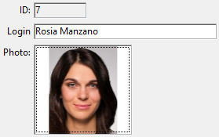

入力オブジェクトを使って、データベースフィールド や [変数](Concepts/variables.md) といった式をフォーム上に追加することができます。 入力オブジェクトは文字ベースのデータ (テキスト、日付、数値など)  およびピクチャー型のデータを扱えます。 入力オブジェクトは文字ベースのデータ (テキスト、日付、数値など)  およびピクチャー型のデータを扱えます。



入力オブジェクトにはの[変数あるいは式](Concepts/quick-tour.md#代入可-vs-代入不可の式)プロパティには 代入可、または代入不可の式 を設定することができます。

また、入力オブジェクトは [入力可、または不可](properties_Entry.md#入力可) に設定することができます。 入力可に設定された入力オブジェクトはデータを受け入れます。 データ入力に対しては、データ入力制御を設定できます。 入力不可に設定された入力オブジェクトは、ユーザーの編集を受け付けず、値を表示するのみです。

データは、[オブジェクトメソッドやフォームメソッド](Concepts/methods.md)を使って管理することができます。

:::note

セキュリティ上の理由から、[マルチスタイル](./properties_Text.md#マルチスタイル) の入力エリアでは、別の4D アプリケーションや外部環境からフォーミュラがペーストされた際には、コピーした時点で取得可能な*計算された値*(テキストまたは画像)のみがペーストされます。 値が何も取得できない場合(例: フォーミュラが一度も計算されていないなど)、4D はフォーミュラのソースを標準テキストとしてペーストします。 値が何も取得できない場合(例: フォーミュラが一度も計算されていないなど)、4D はフォーミュラのソースを標準テキストとしてペーストします。

:::

### JSON 例:

```4d
	"myText": {
		"type": "input",	// オブジェクトタイプ
		"spellcheck": true,	// 自動スペルチェック
		"left": 60,			// フォーム上の座標 (左)	  
		"top": 160,			// フォーム上の座標 (上) 
		"width": 100,		// 幅
		"height": 20		// 高さ
		}
```

## プロパティ一覧

<details><summary>履歴</summary>

| リリース  | 内容                                |
| ----- | --------------------------------- |
| 20 R4 | Support of Writing Tools property |
| 19 R7 | 角の半径をサポート                         |

</details>

[Allow font/color picker](properties_Text.md#allow-fontcolor-picker) - [Alpha Format](properties_Display.md#alpha-format) - [Auto Spellcheck](properties_Entry.md#auto-spellcheck) - [Background Color](properties_BackgroundAndBorder.md#background-color--fill-color) - [Bold](properties_Text.md#bold) - [Boolean format](properties_Display.md#text-when-falsetext-when-true) - [Border Line Style](properties_BackgroundAndBorder.md#border-line-style) - [Bottom](properties_CoordinatesAndSizing.md#bottom) - [Choice List](properties_DataSource.md#choice-list) - [Class](properties_Object.md#css-class) - [Context Menu](properties_Entry.md#context-menu) - [Corner radius](properties_CoordinatesAndSizing.md#corner-radius) - [Date Format](properties_Display.md#date-format) - [Default value](properties_RangeOfValues.md#default-value) - [Draggable](properties_Action.md#draggable) - [Droppable](properties_Action.md#droppable) - [Enterable](properties_Entry.md#enterable) - [Entry Filter](properties_Entry.md#entry-filter) - [Excluded List](properties_RangeOfValues.md#excluded-list) - [Expression type](properties_Object.md#expression-type) - [Fill Color](properties_BackgroundAndBorder.md#background-color--fill-color) - [Font](properties_Text.md#font) - [Font Color](properties_Text.md#font-color) - [Font Size](properties_Text.md#font-size) - [Height](properties_CoordinatesAndSizing.md#height) - [Hide focus rectangle](properties_Appearance.md#hide-focus-rectangle) - [Horizontal Alignment](properties_Text.md#horizontal-alignment) - [Horizontal Scroll Bar](properties_Appearance.md#horizontal-scroll-bar) - [Horizontal Sizing](properties_ResizingOptions.md#horizontal-sizing) - [Italic](properties_Text.md#italic) - [Left](properties_CoordinatesAndSizing.md#left) - [Multiline](properties_Entry.md#multiline) - [Multi-style](properties_Text.md#multi-style) - [Number Format](properties_Display.md#number-format) - [Object Name](properties_Object.md#object-name) - [Orientation](properties_Text.md#orientation) - [Picture Format](properties_Display.md#picture-format) - [Placeholder](properties_Entry.md#placeholder) - [Print Frame](properties_Print.md#print-frame) - [Required List](properties_RangeOfValues.md#required-list) - [Right](properties_CoordinatesAndSizing.md#right) - [Selection always visible](properties_Entry.md#selection-always-visible) - [Store with default style tags](properties_Text.md#store-with-default-style-tags) - [Text when False/Text when True](properties_Display.md#text-when-falsetext-when-true) - [Time Format](properties_Display.md#time-format) - [Top](properties_CoordinatesAndSizing.md#top) - [Type](properties_Object.md#type) - [Underline](properties_Text.md#underline) - [Variable or Expression](properties_Object.md#variable-or-expression) - [Vertical Scroll Bar](properties_Appearance.md#vertical-scroll-bar) - [Vertical Sizing](properties_ResizingOptions.md#vertical-sizing) - [Visibility](properties_Display.md#visibility) - [Width](properties_CoordinatesAndSizing.md#width) - [Wordwrap](properties_Display.md#wordwrap) - [Writing Tools](properties_Entry.md#writing-tools)

## サポートされるイベント

[On After Edit](../Events/onAfterEdit.md) - [On After Keystroke](../Events/onAfterKeystroke.md) - [On Before Keystroke](../Events/onBeforeKeystroke.md) - [On Begin Drag Over](../Events/onBeginDragOver.md) - [On Clicked](../Events/onClicked.md) - [On Data Change](../Events/onDataChange.md) - [On Double Clicked](../Events/onDoubleClicked.md) - [On Drag Over](../Events/onDragOver.md) - [On Drop](../Events/onDrop.md) - [On Getting focus](../Events/onGettingFocus.md) - [On Header](../Events/onHeader.md) - [On Load](../Events/onLoad.md) - [On Losing focus](../Events/onLosingFocus.md) - [On Mouse Enter](../Events/onMouseEnter.md) - [On Mouse Leave](../Events/onMouseLeave.md) - [On Mouse Move](../Events/onMouseMove.md) - [On Mouse Up ](../Events/onMouseUp.md)(Picture type only)-  [On Printing Break](../Events/onPrintingBreak.md) - [On Printing Detail](../Events/onPrintingDetail.md) - [On Printing Footer](../Events/onPrintingFooter.md) - [On Scroll](../Events/onScroll.md)(Picture type only) - [On Selection Change](../Events/onSelectionChange.md) - [On Unload](../Events/onUnload.md) - [On Validate](../Events/onValidate.md)

## 入力の代替手段

フィールドや変数などの式は、フォーム内において入力オブジェクト以外を用いて表示することができます。 具体的には以下の方法があります:

- データベースのフィールドから [セレクション型のリストボックス](listbox_overview.md) へと、データを直接表示・入力することができます。
- [ポップアップメニュー/ドロップダウンリスト](dropdownList_Overview.md) と [コンボボックス](comboBox_overview.md) オブジェクトを使用することによって、リストフィールドまたは変数をフォーム内にて直接表示することができます。
- ブール型の式は [チェックボックス](checkbox_overview.md) や [ラジオボタン](radio_overview.md) オブジェクトを用いて提示することができます。


