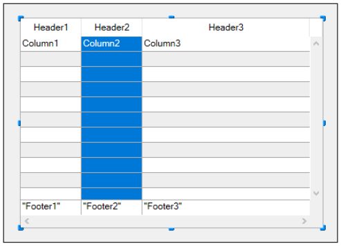
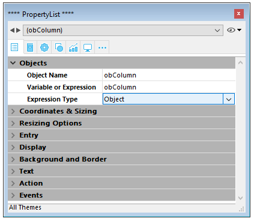

リストボックスは、それぞれ固有のプロパティを持つ 1つ以上の列オブジェクトから構成されています。 列を選択するには、フォームエディターでリストボックスオブジェクトが選択されているときに任意の列をクリックします:



リストボックスの各列毎に標準のプロパティ (テキスト、背景色など)  を設定できます。設定すると、リストボックスに対する設定よりもこちらが優先されます。

> 配列型リストボックスのカラムについては、[式タイプ](properties_Object.md#式の型-式タイプ)
> (テキスト、数値、整数、ブール、ピクチャー、時間、日付、あるいはオブジェクト) を定義することができます。

## カラム特有のプロパティ {#column-specific-properties}

[オブジェクト名](properties_Object.md#オブジェクト名) - [変数あるいは式](properties_Object.md#変数あるいは式) - [式の型](properties_Object.md#式の型式タイプ) - [CSSクラス](properties_Object.md#cssクラス) - [選択リスト](properties_DataSource.md#選択リスト-静的リスト) - [式](properties_DataSource.md#式) - [幅](properties_CoordinatesAndSizing.md#幅) - [入力可](properties_Entry.md#入力可) - [フォーカス可](properties_Entry.md#フォーカス可) - [コンテキストメニュー](properties_Entry.md#コンテキストメニュー) - [デフォルト値](properties_DataSource.md#デフォルト値) - [選択リスト](properties_DataSource.md#選択リスト) - [式](properties_DataSource.md#式) - [データタイプ (リスト)](properties_DataSource.md#データタイプ-リスト) - [関連付け](properties_DataSource.md#関連付け) - [自動行高](properties_CoordinatesAndSizing.md#自動行高) - [最小幅](properties_CoordinatesAndSizing.md#最小幅) - [最大幅](properties_CoordinatesAndSizing.md#最大幅) - [横方向パディング](properties_CoordinatesAndSizing.md#横方向パディング) - [縦方向パディング](properties_CoordinatesAndSizing.md#縦方向パディング) - [サイズ変更可](properties_ResizingOptions.md#サイズ変更可) - [指定リスト](properties_RangeOfValues.md#指定リスト) - [除外リスト](properties_RangeOfValues.md#除外リスト) - [表示タイプ](properties_Display.md#d表示タイプ) - [文字フォ－マット](properties_Display.md#文字フォ－マット) - [日付フォーマット](properties_Display.md#日付フォーマット) - [時間フォーマット](properties_Display.md#時間フォーマット) - [数値フォーマット](properties_Display.md#数値フォーマット) - [テキスト (True時)/テキスト (False時)](properties_Display.md#テキスト-true時-テキスト-false時) - [ピクチャーフォーマット](properties_Display.md#ピクチャーフォーマット) - [非表示](properties_Display.md#表示状態) - [ワードラップ](properties_Display.md#ワードラップ) - [エリプシスを使用して省略](properties_Display.md#エリプシスを使用して省略) - [背景色](properties_BackgroundAndBorder.md#背景色-塗りカラー) - [交互に使用する背景色](properties_BackgroundAndBorder.md#交互に使用する背景色) - [背景色式](properties_BackgroundAndBorder.md#背景色式) - [行背景色配列](properties_BackgroundAndBorder.md#行背景色配列) - [フォント](properties_Text.md#フォント) - [太字](properties_Text.md#太字) - [イタリック](properties_Text.md#イタリック) - [下線](properties_Text.md#下線) - [行スタイル配列](properties_Text.md#行スタイル配列) - [スタイル式](properties_Text.md#スタイル式) - [フォントカラー](properties_Text.md#フォントカラー) - [行フォントカラー配列](properties_Text.md#行フォントカラー配列) - [横揃え](properties_Text.md#横揃え) - [縦揃え](properties_Text.md#縦揃え) - [マルチスタイル](properties_Text.md#マルチスタイル) - [メソッド](properties_Action.md#メソッド)

## サポートされるフォームイベント {#supported-form-events}

| フォームイベント             | 返される追加のプロパティ(主なプロパティについては[Form event](../commands/form-event.md) を参照してください)                                                                                                                                                                                                                         | コメント                                                                                                                         |
| -------------------- | ---------------------------------------------------------------------------------------------------------------------------------------------------------------------------------------------------------------------------------------------------------------------------------------------------------------------- | ---------------------------------------------------------------------------------------------------------------------------- |
| On After Edit        | <ul><li>[column](./listbox-object.md#additional-properties)</li><li>[columnName](./listbox-object.md#additional-properties)</li><li>[row](./listbox-object.md#additional-properties)</li></ul>                                                                                                                         |                                                                                                                              |
| On After Keystroke   | <ul><li>[column](./listbox-object.md#additional-properties)</li><li>[columnName](./listbox-object.md#additional-properties)</li><li>[row](./listbox-object.md#additional-properties)</li></ul>                                                                                                                         |                                                                                                                              |
| On After Sort        | <ul><li>[column](./listbox-object.md#additional-properties)</li><li>[columnName](./listbox-object.md#additional-properties)</li><li>[headerName](./listbox-object.md#additional-properties)</li></ul>                                                                                                                  | *複合フォーミュラはソート不可 <br/>(例: This.firstName + This.lastName)* |
| On Alternative Click | <ul><li>[column](./listbox-object.md#additional-properties)</li><li>[columnName](./listbox-object.md#additional-properties)</li><li>[row](./listbox-object.md#additional-properties)</li></ul>                                                                                                                         | *配列リストボックスのみ*                                                                                                                |
| On Before Data Entry | <ul><li>[column](./listbox-object.md#additional-properties)</li><li>[columnName](./listbox-object.md#additional-properties)</li><li>[row](./listbox-object.md#additional-properties)</li></ul>                                                                                                                         |                                                                                                                              |
| On Before Keystroke  | <ul><li>[column](./listbox-object.md#additional-properties)</li><li>[columnName](./listbox-object.md#additional-properties)</li><li>[row](./listbox-object.md#additional-properties)</li></ul>                                                                                                                         |                                                                                                                              |
| On Begin Drag Over   | <ul><li>[column](./listbox-object.md#additional-properties)</li><li>[columnName](./listbox-object.md#additional-properties)</li><li>[row](./listbox-object.md#additional-properties)</li></ul>                                                                                                                         |                                                                                                                              |
| On Clicked           | <ul><li>[column](./listbox-object.md#additional-properties)</li><li>[columnName](./listbox-object.md#additional-properties)</li><li>[row](./listbox-object.md#additional-properties)</li></ul>                                                                                                                         |                                                                                                                              |
| On Column Moved      | <ul><li>[columnName](./listbox-object.md#additional-properties)</li><li>[newPosition](./listbox-object.md#additional-properties)</li><li>[oldPosition](./listbox-object.md#additional-properties)</li></ul>                                                                                                            |                                                                                                                              |
| On Column Resize     | <ul><li>[column](./listbox-object.md#additional-properties)</li><li>[columnName](./listbox-object.md#additional-properties)</li><li>[newSize](./listbox-object.md#additional-properties)</li><li>[oldSize](./listbox-object.md#additional-properties)</li></ul>                                                        |                                                                                                                              |
| On Data Change       | <ul><li>[column](./listbox-object.md#additional-properties)</li><li>[columnName](./listbox-object.md#additional-properties)</li><li>[row](./listbox-object.md#additional-properties)</li></ul>                                                                                                                         |                                                                                                                              |
| On Double Clicked    | <ul><li>[column](./listbox-object.md#additional-properties)</li><li>[columnName](./listbox-object.md#additional-properties)</li><li>[row](./listbox-object.md#additional-properties)</li></ul>                                                                                                                         |                                                                                                                              |
| On Drag Over         | <ul><li>[area](./listbox-object.md#additional-properties)</li><li>[areaName](./listbox-object.md#additional-properties)</li><li>[column](./listbox-object.md#additional-properties)</li><li>[columnName](./listbox-object.md#additional-properties)</li><li>[row](./listbox-object.md#additional-properties)</li></ul> |                                                                                                                              |
| On Drop              | <ul><li>[column](./listbox-object.md#additional-properties)</li><li>[columnName](./listbox-object.md#additional-properties)</li><li>[row](./listbox-object.md#additional-properties)</li></ul>                                                                                                                         |                                                                                                                              |
| On Footer Click      | <ul><li>[column](./listbox-object.md#additional-properties)</li><li>[columnName](./listbox-object.md#additional-properties)</li><li>[footerName](./listbox-object.md#additional-properties)</li></ul>                                                                                                                  | *配列、カレントセレクション&命名セレクションリストボックスのみ*                                                                        |
| On Getting Focus     | <ul><li>[column](./listbox-object.md#additional-properties)</li><li>[columnName](./listbox-object.md#additional-properties)</li><li>[row](./listbox-object.md#additional-properties)</li></ul>                                                                                                                         | *追加プロパティの取得はセル編集時のみ*                                                                                                         |
| On Header Click      | <ul><li>[column](./listbox-object.md#additional-properties)</li><li>[columnName](./listbox-object.md#additional-properties)</li><li>[headerName](./listbox-object.md#additional-properties)</li></ul>                                                                                                                  |                                                                                                                              |
| On Load              |                                                                                                                                                                                                                                                                                                                        |                                                                                                                              |
| On Losing Focus      | <ul><li>[column](./listbox-object.md#additional-properties)</li><li>[columnName](./listbox-object.md#additional-properties)</li><li>[row](./listbox-object.md#additional-properties)</li></ul>                                                                                                                         | *追加プロパティの取得はセル編集完了時のみ*                                                                                                       |
| On Row Moved         | <ul><li>[newPosition](./listbox-object.md#additional-properties)</li><li>[oldPosition](./listbox-object.md#additional-properties)</li></ul>                                                                                                                                                                            | *配列リストボックスのみ*                                                                                                                |
| On Scroll            | <ul><li>[horizontalScroll](./listbox-object.md#additional-properties)</li><li>[verticalScroll](./listbox-object.md#additional-properties)</li></ul>                                                                                                                                                                    |                                                                                                                              |
| On Unload            |                                                                                                                                                                                                                                                                                                                        |                                                                                                                              |

## オブジェクト配列の使用

リストボックスのカラムはオブジェクト配列を扱えます。 オブジェクト配列は異なる種類のデータを格納できるので、この強力な機能を使用すれば、単一のカラム内の行ごとに異なる入力タイプを混ぜたり、様々なウィジェットを表示したりといったことができるようになります。 たとえば、最初の行にテキスト入力を挿入し、二行目にチェックボックスを、そして産業目にドロップダウンを挿入する、と言ったことが可能になります。 また、オブジェクト配列は、ボタンやカラーピッカーと言った新しいウィジェットへのアクセスも可能にします。

以下のリストボックスはオブジェクト配列を使用してデザインされました:


### オブジェクト配列カラムの設定

オブジェクト配列をリストボックスのカラムに割り当てるには、プロパティリスト (の "変数名" 欄) にオブジェクト配列名を設定するか、配列型のカラムのように [LISTBOX INSERT COLUMN](../commands-legacy/listbox-insert-column.md) コマンドを使用します。 プロパティリスト内では、カラムにおいて "式タイプ" にオブジェクトを選択できます:



オブジェクトカラムに対しては、座標、サイズ、スタイルなどに関連した標準のプロパティが使用可能です。 プロパティリストを使用して定義する方法のほかにも、オブジェクト型のリストボックスカラムのそれぞれの行に対してスタイル、フォントカラー、背景色、表示状態をプログラムで定義することもできます。 これらのタイプのカラムは非表示にすることも可能です。

しかしながら、データソーステーマは、オブジェクト型のリストボックスカラムに対しては選択できません。 実際、カラムの各セルの中身は、それに対応するオブジェクト配列の要素の属性に基づいています。 配列の各オブジェクト要素には、以下を定義できます:

値の型 (必須): テキスト、カラー、イベント、他<br />
値そのもの (任意): 入力/出力に使用<br />
セルの内容表示 (任意): ボタン、リスト、他<br />
追加の設定 (任意): 値の型によります<br />
これらのプロパティを定義するには、適切な属性をオブジェクト内に設定する必要があります (使用可能な属性は以下に一覧としてまとめてあります)。  たとえば、以下ような簡単なコードを使用してオブジェクトカラム内に "Hello World!" 書き込むことができます:

```4d
ARRAY OBJECT(obColumn;0) //カラム配列
 var $ob : Object //第一要素
 OB SET($ob;"valueType";"text") //値の型を定義 (必須)
 OB SET($ob;"value";"Hello World!") //値を定義
 APPEND TO ARRAY(obColumn;$ob)  
```


> 表示フォーマットと入力フィルターはオブジェクトカラムに対しては設定できません。 これらは値の型に応じて自動的に変わるからです。

#### valueTypeとデータ表示

リストボックスカラムにオブジェクト配列が割り当てられているとき、セルの表示・入力・編集の方法は、配列の要素の valueType 属性に基づきます。 次の valueType の値がサポートされています:

- "text": テキスト値
- "real": セパレーターを含む数値。セパレーターの例: `<space>`, `<.>`, `<,>`
- "integer": 整数値
- "boolean": true/false 値
- "color": 背景色を定義
- "event": ラベル付ボタンを表示

4D は "valueType" の値に応じたデフォルトのウィジェットを使用します (つまり、"text" と設定すればテキスト入力ウィジェットが表示され、"boolean" と設定すればチェックボックスが表示されます)。 しかし、オプションを使用することによって表示方法の選択が可能な場合もあります (たとえば、"real" と設定した場合、ドロップダウンメニューとしても表示できます)。 以下の一覧はそれぞれの値の型に対してのデフォルトの表示方法と、他に選択可能な表示方の一覧を表しています:

| valueType | デフォルトのウィジェット                               | 他に選択可能なウィジェット                                                                                   |
| --------- | ------------------------------------------ | ----------------------------------------------------------------------------------------------- |
| text      | テキスト入力                                     | ドロップダウンメニュー (指定リスト) またはコンボボックス (選択リスト)                    |
| real      | 管理されたテキスト入力 (数字とセパレーター) | ドロップダウンメニュー (指定リスト) またはコンボボックス (選択リスト)                    |
| integer   | 管理されたテキスト入力 (数字のみ)      | ドロップダウンメニュー (指定リスト) またはコンボボックス (選択リスト) またはスリーステートチェックボックス |
| boolean   | チェックボックス                                   | ドロップダウンメニュー (指定リスト)                                                          |
| color     | 背景色                                        | text                                                                                            |
| event     | ラベル付ボタン                                    |                                                                                                 |
|           |                                            | すべてのウィジェットには、単位切り替えボタン または 省略ボタン を追加でセルに付属させることができます                                            |

セルの表示とオプションは、オブジェクト内の特定の属性を使用することによって設定できます (以下を参照ください)。

#### 表示フォーマットと入力フィルター

オブジェクト型のリストボックスのカラムにおいては、表示フォーマットと入力フィルターを設定することはできません。 これらは値の型に応じて自動的に定義されます。 どのように定義されるかについては、以下一覧にまとめてあります:

| 値の型     | デフォルトのフォーマット                                                | 入力コントロール                               |
| ------- | ----------------------------------------------------------- | -------------------------------------- |
| text    | オブジェクト内で定義されているものと同じ                                        | 制限なし                                   |
| real    | オブジェクト内で定義されているものと同じ (システムの小数点セパレーターを使用) | "0-9" と "." と "-"      |
|         |                                                             | min>=0 の場合、"0-9" と "." |
| integer | オブジェクト内で定義されているものと同じ                                        | "0-9" と "-"                            |
|         |                                                             | min>=0 の場合、"0-9"                       |
| Boolean | チェックボックス                                                    | N/A                                    |
| color   | N/A                                                         | N/A                                    |
| event   | N/A                                                         | N/A                                    |

### 属性

オブジェクト配列の各要素は、セルの中身とデータ表示を定義する一つ以上の属性を格納するオブジェクトです (上記の例を参照ください)。

唯一必須の属性は "valueType" であり、サポートされる値は "text"、"real"、"integer"、"boolean"、"color" そして "event"です。 以下の表には、リストボックスオブジェクト配列において "valueType"の値に応じてサポートされるすべての属性がまとめてあります (他の属性はすべて無視されます)。 表示フォーマットに関しては、その更に下に詳細な説明と例があります。

|                       | valueType                                   | text | real | integer | boolean | color | event |
| --------------------- | ------------------------------------------- | ---- | ---- | ------- | ------- | ----- | ----- |
| *属性*                  | *説明*                                        |      |      |         |         |       |       |
| value                 | セルの値 (入力または出力)           | ○    | ○    | ○       |         |       |       |
| min                   | 最小値                                         |      | ○    | ○       |         |       |       |
| max                   | 最大値                                         |      | ○    | ○       |         |       |       |
| behavior              | "スリーステート" の値                                |      |      | ○       |         |       |       |
| requiredList          | オブジェクト内で定義されたドロップダウンリスト                     | ○    | ○    | ○       |         |       |       |
| choiceList            | オブジェクト内で定義されたコンボボックス                        | ○    | ○    | ○       |         |       |       |
| requiredListReference | 4D リスト参照 ("saveAs"の値による) | ○    | ○    | ○       |         |       |       |
| requiredListName      | 4D リスト名 ("saveAs"の値による)  | ○    | ○    | ○       |         |       |       |
| saveAs                | "reference" または "value"                     | ○    | ○    | ○       |         |       |       |
| choiceListReference   | 4D リスト参照、コンボボックスを表示                         | ○    | ○    | ○       |         |       |       |
| choiceListName        | 4D リスト名、コンボボックスを表示                          | ○    | ○    | ○       |         |       |       |
| unitList              | X要素の配列                                      | ○    | ○    | ○       |         |       |       |
| unitReference         | 選択された要素のインデックス                              | ○    | ○    | ○       |         |       |       |
| unitsListReference    | 単位の4D リスト参照                                 | ○    | ○    | ○       |         |       |       |
| unitsListName         | 単位の4D リスト名                                  | ○    | ○    | ○       |         |       |       |
| alternateButton       | 切り替えボタンを追加                                  | ○    | ○    | ○       | ○       | ○     |       |

#### value

セルの値は "value" 属性に保存されています。 この属性は入力と出力に使用されるほか、 この属性は入力と出力に使用されるほか、 リストを使用する際のデフォルト値を定義するのにも使用できます (以下参照)。 リストを使用する際のデフォルト値を定義するのにも使用できます (以下参照)。

```4d
 ARRAY OBJECT(obColumn;0) //カラム配列
 var $ob1;$ob2;$ob3 : Object
 var $entry:="Hello world!"
 OB SET($ob1;"valueType";"text")
 OB SET($ob1;"value";$entry) // ユーザーが新しい値を入力した場合、編集された値は $entry に格納されます

 OB SET($ob2;"valueType";"real")
 OB SET($ob2;"value";2/3)

 OB SET($ob3;"valueType";"boolean")
 OB SET($ob3;"value";True)

 APPEND TO ARRAY(obColumn;$ob1)
 APPEND TO ARRAY(obColumn;$ob2)
 APPEND TO ARRAY(obColumn;$ob3)
```


> null 値はサポートされており、空のセルとして表示されます。

#### min と max

"valueType" が"real" または "integer" であるとき、min と max 属性もオブジェクトに設定できます (値は適切な範囲で、かつ、valueType と同じ型である必要があります)。

これらの属性を使用すると入力値の範囲を管理することができます。 セルが評価されたとき (フォーカスを失ったとき)、入力された値が min の値より低い場合、または max の値より大きい場合には、その値は拒否されます。 この場合、入力をする前の値が保持され、tip として説明が表示されます。

```4d
 var $ob3 : Object
 var $entry3:=2015
 OB SET($ob3;"valueType";"integer")
 OB SET($ob3;"value";$entry3)
 OB SET($ob3;"min";2000)
 OB SET($ob3;"max";3000)
```


#### behavior

behavior 属性は、値の通常の表示とは異なる表示方法を提供します。 4D v15では、一つだけ他の表示方法が用意されています:

| 属性       | 使用可能な値      | valueType | 説明                                                                                                                                           |
| -------- | ----------- | --------- | -------------------------------------------------------------------------------------------------------------------------------------------- |
| behavior | threeStates | integer   | 数値をスリーステートチェックボックスとして表します。<br/> 2=セミチェックボックス、1=チェックされている、0=チェックされていない、-1=非表示チェックボックス、-2=チェックされていない、入力不可、-3=チェックされている、入力不可、-4=セミチェックボックス、入力不可 |

```4d
 var $ob3; $ob4 : Object
 OB SET($ob3;"valueType";"integer")
 OB SET($ob3;"value";-3)
 OB SET($ob4;"valueType";"integer")
 OB SET($ob4;"value";-3)
 OB SET($ob4;"behavior";"threeStates")
```


#### requiredList と choiceList

"choiceList" または "requiredList" 属性がオブジェクト内に存在しているとき、テキスト入力は以下の属性に応じて、ドロップダウンリストまたはコンボボックスで置き換えられます:

- 属性が "choiceList" の場合、セルはコンボボックスとして表示されます。 これはつまり、ユーザーは値を選択、または入力できるということです。
- 属性が "requiredList" の場合、セルはドロップダウンリストとして表示されます。 これはつまり、ユーザーはリストに提供されている値からどれか一つを選択するしかないということです。

どちらの場合においても、"value" 属性を使用してウィジェット内の値を事前に選択することができます。

> ウィジェットの値は配列を通して定義されます。 既存の 4Dリストをウィジェットに割り当てたい場合、"requiredListReference"、"requiredListName"、"choiceListReference"、または "choiceListName" 属性を使用する必要があります。

例:

- 選択肢が二つ ("Open" または "Closed") しかないドロップダウンリストを表示したい場合を考えます。 デフォルトでは "Closed" が選択された状態にしたいとします:

```4d
	ARRAY TEXT($RequiredList;0)
	APPEND TO ARRAY($RequiredList;"Open")
	APPEND TO ARRAY($RequiredList;"Closed")
	var $ob : Object
	OB SET($ob;"valueType";"text")
	OB SET($ob;"value";"Closed")
	OB SET ARRAY($ob;"requiredList";$RequiredList)
```


- 整数値であればすべて受け入れ可能な状態にしておいた上で、もっとも一般的な値を提示するためにコンボボックスを表示したい場合を考えます:

```4d
	ARRAY LONGINT($ChoiceList;0)
	APPEND TO ARRAY($ChoiceList;5)
	APPEND TO ARRAY($ChoiceList;10)
	APPEND TO ARRAY($ChoiceList;20)
	APPEND TO ARRAY($ChoiceList;50)
	APPEND TO ARRAY($ChoiceList;100)
	var $ob : Object
	OB SET($ob;"valueType";"integer")
	OB SET($ob;"value";10) //10 をデフォルト値として使用
	OB SET ARRAY($ob;"choiceList";$ChoiceList)
```


#### requiredListName と requiredListReference

"requiredListName" と "requiredListReference" 属性を使用すると、デザインモード (ツールボックス内) またはプログラミングによって (<code>New list</code> コマンドを使用して) 4Dで定義されたリストをリストボックスセル内において使用することが出来るようになります。 セルはドロップダウンリストとして表示されるようになります。 これはつまり、ユーザーはリスト内に提供された値のどれか一つのみを選択できるということを意味します。

"requiredListName" または "requiredListReference" は、リストの作成元に応じて使い分けます。 リストがツールボックスで作成された場合、リスト名を渡します。 リストがプログラミングによって定義された場合は、リストの参照を渡します。 どちらの場合においても、"value" 属性を使用してウィジェット内の値を事前に選択することができます。

> - これらの値を単純な配列を通して定義したい場合は、"requiredList" 属性を使用する必要があります。
> - リストが実数値を表すテキストを含んでいる場合、小数点はローカル設定に関わらず、ピリオド (".") である必要があります。 例: "17.6" "1234.456"

例:

- ツールボックスで定義された "colors" リスト ("blue"、"yellow"、そして "green" の値を格納) に基づいたドロップダウンリストを表示し、値として保存し、デフォルトの表示は "blue" にしたい場合を考えます:


```4d
	var $ob : Object
	OB SET($ob;"valueType";"text")
	OB SET($ob;"saveAs";"value")
	OB SET($ob;"value";"blue")
	OB SET($ob;"requiredListName";"colors")
```


- プログラミングによって定義されたリストに基づいたドロップダウンリストを表示し、参照として保存したい場合を考えます:

```4d
	<>List:=New list
	APPEND TO LIST(<>List;"Paris";1)
	APPEND TO LIST(<>List;"London";2)
	APPEND TO LIST(<>List;"Berlin";3)
	APPEND TO LIST(<>List;"Madrid";4)
	var $ob : Object
	OB SET($ob;"valueType";"integer")
	OB SET($ob;"saveAs";"reference")
	OB SET($ob;"value";2) //デフォルトで London を表示
	OB SET($ob;"requiredListReference";<>List)
```


#### choiceListName と choiceListReference

"choiceListName" と "choiceListReference" 属性を使用すると、デザインモード (ツールボックス内) またはプログラミングによって (<code>New list</code> コマンドを使用して) 4Dで定義されたリストをリストボックスセル内において使用することが出来るようになります。 セルはコンボボックスとして表示されるようになります。 これはつまり、ユーザーは値を選択、または入力できるということを意味します。

"choiceListName" または "choiceListReference" は、リストの作成元に応じて使い分けます。 リストがツールボックスで作成された場合、リスト名を渡しま す。 リストがプログラミングによって定義された場合は、リストの参照を渡します。 どちらの場合においても、"value" 属性を使用してウィジェット内の値を事前に選択することができます。

> - これらの値を単純な配列を通して定義したい場合は、"choiceList" 属性を使用する必要があります。
> - リストが実数値を表すテキストを含んでいる場合、小数点はローカル設定に関わらず、ピリオド (".") である必要があります。 例: "17.6" "1234.456"

例:

ツールボックスで定義された "colors" リスト ("blue"、"yellow"、そして "green" の値を格納) に基づいたドロップダウンリストを表示し、値として保存し、デフォルトの表示は "green" にしたい場合を考えます:


```4d
 var $ob : Object
 OB SET($ob;"valueType";"text")

 OB SET($ob;"value";"blue")
 OB SET($ob;"choiceListName";"colors")
```


#### unitsList、unitsListName、 unitsListReference と unitReference

特定の値を使用することで、セルの値に関連した単位を追加することができます (*例*: "10 cm", "20 pixels" 等)。 単位リストを定義するためには、以下の属性のどれか一つを使用します: 単位リストを定義するためには、以下の属性のどれか一つを使用します:

- "unitsList": 利用可能な単位 (例: "cm"、"inches"、"km"、"miles"、他) を定義するのに使用する x 要素を格納した配列。 オブジェクト内で単位を定義するためには、この属性を使用します。
- "unitsListReference": 利用可能な単位を含んだ 4Dリストへの参照。 [`New list`](../commands-legacy/new-list.md) コマンドで作成された 4D リストで単位を定義するためには、この属性を使用します。
- "unitsListName": 利用可能な単位を含んだデザインモードで作成された 4Dリスト名。 ツールボックスで作成された 4Dリストで単位を定義するためには、この属性を使用します。

単位リストが定義された方法に関わらず、以下の属性を関連付けることができます:

- "unitReference": "unitList"、"unitsListReference" または "unitsListName" の値リスト内で選択された項目へのインデックス (1からx) を格納する単一の値。

カレントの単位は、ボタンとして表示されます。このボタンは、クリックするたびに "unitList"、"unitsListReference" または "unitsListName" の値を切り替えていきます (例: "pixels" -> "rows" -> "cm" -> "pixels" -> 等)。

例:

数値の入力と、その後に可能性のある二つの単位 ("lines" または "pixels") を続けて表示したい場合を考えます。 カレントの値は "2" + "lines" と、 オブジェクト内で直接定義された値 ("unitsList" 属性) を使用するものとします:

```4d
ARRAY TEXT($_units;0)
APPEND TO ARRAY($_units;"lines")
APPEND TO ARRAY($_units;"pixels")
var $ob : Object
OB SET($ob;"valueType";"integer")
OB SET($ob;"value";2) // 2 "units"
OB SET($ob;"unitReference";1) //"lines"
OB SET ARRAY($ob;"unitsList";$_units)
```


#### alternateButton

セルに省略ボタン [...] を追加したい場合、"alternateButton" 属性に true の値を入れてオブジェクトに渡すだけです。 省略ボタンは自動的にセル内に表示されます。 省略ボタンは自動的にセル内に表示されます。

このボタンがユーザーによってクリックされた場合、`On Alternate Click` イベントが生成され、そのイベントを自由に管理することができます (詳細な情報に関しては [イベント管理](#イベント管理) の章を参照ください)。

例:

```4d
var $ob1 : Object
var $entry:="Hello world!"
OB SET($ob;"valueType";"text")
OB SET($ob;"alternateButton";True)
OB SET($ob;"value";$entry)
```


#### color valueType

"color" valueType を使用すると、色、または色を表すテキストを表示することができます。

- 値が数字の場合、色付けされた長方形がセル内に表示されます。 例:

  ```4d
  var $ob4 : Object
  OB SET($ob4;"valueType";"color")
  OB SET($ob4;"value";0x00FF0000)
  ```


- 値がテキストの場合、そのテキストが表示されます (*例*: "value";"Automatic")。

#### event valueType

"event" valueType を使用すると、クリックした際に `On Clicked` イベントを生成する単純なボタンを表示します。 データまたは値を渡す/返すことはできません。 データまたは値を渡す/返すことはできません。

オプションとして、"label" 属性を渡すことができます。

例:

```4d
var $ob : Object
OB SET($ob;"valueType";"event")
OB SET($ob;"label";"Edit...")
```


### イベント管理

オブジェクトリストボックス配列を使用している際には、複数のイベントを管理することができます:

- **On Data Change**: 以下の場所において、どんな値でも変更された場合には `On Data Change` イベントがトリガーされます:
  - テキスト入力
  - ドロップダウンリスト
  - コンボボックスエリア
  - 単位ボタン (値 x が値 x+1 へとスイッチしたとき)
  - チェックボックス (チェック/チェックなしの状態がスイッチしたとき)
- **On Clicked**: ユーザーが、"event" *valueType* 属性を使用して実装されたボタンをクリックした場合、`On Clicked` イベントが生成されます。 このイベントはプログラマーによって管理されます。 このイベントはプログラマーによって管理されます。
- **On Alternative Click**: ユーザーが省略ボタン ("alternateButton" 属性) をクリックした場合、`On Alternative Click` イベントが生成されます。 このイベントはプログラマーによって管理されます。 このイベントはプログラマーによって管理されます。
