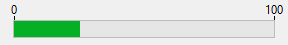

進捗インジケーター (または "サーモメーター") は図形を用いて値を表示するオブジェクトです。



## インジケーターの使用

インジケーターを使用して値の表示や設定ができます。 たとえば、メソッドを用いてサーモメーターに値を指定すると、その値が表示されます。 ユーザーがインジケーターポイントをドラッグすると、その値が変更されます。 この値はフィールド、入力可オブジェクト、入力不可オブジェクト等の他のオブジェクトで使用することができます。

インジケーターに関連付けた変数により、その表示を管理します。 メソッドを用いて、この変数に値を代入したり、またはインジケーターの値を使用したりします。 たとえば、フィールドまたは入力可オブジェクトのメソッドを使用して、サーモメーターを管理できます:

```4d
 vTherm:=[Employees]Salary
```

このメソッドは Salary フィールドの値を vTherm 変数に代入します。 このメソッドは、たとえばフォーム上で Salary フィールドのオブジェクトメソッドとして記述できます。

逆にインジケーターを使用してフィールドの値を管理することも可能です。 ユーザーはインジケーターをドラッグして値を設定します。 このメソッドは次の通りです:

```4d
 [Employees]Salary:=vTherm
```

このメソッドはインジケーターの値を Salary フィールドに代入します。 ユーザーがインジケーターをドラッグすると、Salary フィールドの値が変わります。

## デフォルトサーモメーター


サーモメーターはデフォルトの進捗インジケーターです。

縦または横のサーモメーターバーを表示できます。 どちらになるかはフォームエディター上に描かれたオブジェクトの形により決定されます。

描画に関するプロパティをいくつか設定することができます: 最小/最大値、目盛りの単位、ステップ、その他の表示オプションなどです。

### プロパティ一覧

[Barber shop](properties_Scale.md#barber-shop) - [Bold](properties_Text.md#bold) - [Border Line Style](properties_BackgroundAndBorder.md#border-line-style) -[Bottom](properties_CoordinatesAndSizing.md#bottom) - [Class](properties_Object.md#css-class) - [Display graduation](properties_Scale.md#display-graduation) - [Enterable](properties_Entry.md#enterable) - [Execute object method](properties_Action.md#execute-object-method) - [Expression Type](properties_Object.md#expression-type) (only "integer", "number", "date", or "time") - [Font](properties_Text.md#font) - [Font Color](properties_Text.md#font-color) - [Font Size](properties_Text.md#font-size) - [Height](properties_CoordinatesAndSizing.md#height) - [Italic](properties_Text.md#italic) - [Graduation step](properties_Scale.md#graduation-step) -[Help Tip](properties_Help.md#help-tip) - [Horizontal Sizing](properties_ResizingOptions.md#horizontal-sizing) - [Label Location](properties_Scale.md#label-location) - [Left](properties_CoordinatesAndSizing.md#left) - [Maximum](properties_Scale.md#maximum) - [Minimum](properties_Scale.md#minimum) - [Number Format](properties_Display.md#number-format) - [Object Name](properties_Object.md#object-name) - [Right](properties_CoordinatesAndSizing.md#right) - [Step](properties_Scale.md#step) - [Top](properties_CoordinatesAndSizing.md#top) - [Type](properties_Object.md#type) - [Underline](properties_Text.md#underline) - [Variable or Expression](properties_Object.md#variable-or-expression) - [Vertical Sizing](properties_ResizingOptions.md#vertical-sizing) - [Visibility](properties_Display.md#visibility) - [Width](properties_CoordinatesAndSizing.md#width)

## バーバーショップ


**バーバーショップ** はデフォルトサーモメーターの一種です。 このバリエーションを選択するには [バーバーショップ](properties_Scale.md#バーバーショップ) プロパティをチェックします。

> JSON コードにおいては、デフォルトサーモメーターのオブジェクトから "max" プロパティを取り除くだけで、インジケーターがバーバーショップになります。

バーバーショップは [スピナー](spinner.md) のように連続したアニメーションを表示します。 このタイプのサーモメーターは通常プログラムが何らかの処理を行っていて、それが終了する時間が予測できない場合、そのことをユーザーに通知するために使用します。 このバリエーションが選択されるとプロパティリストの [スケール](properties_Scale.md) テーマは非表示になります。

フォームが実行されたとき、オブジェクトのアニメーションは開始されません。 [割り当てられた変数](properties_Object.md#変数あるいは式) に値を代入してアニメーションを管理します:

- 1 = アニメーション開始
- 0 = アニメーション停止

### プロパティ一覧

[Barber shop](properties_Scale.md#barber-shop) - [Bold](properties_Text.md#bold) - [Border Line Style](properties_BackgroundAndBorder.md#border-line-style) -[Bottom](properties_CoordinatesAndSizing.md#bottom) - [Class](properties_Object.md#css-class) - [Enterable](properties_Entry.md#enterable) - [Execute object method](properties_Action.md#execute-object-method) - [Expression Type](properties_Object.md#expression-type) (only "integer", "number", "date", or "time") - [Font](properties_Text.md#font) - [Font Color](properties_Text.md#font-color) - [Font Size](properties_Text.md#font-size) - [Height](properties_CoordinatesAndSizing.md#height) - [Help Tip](properties_Help.md#help-tip) - [Horizontal Sizing](properties_ResizingOptions.md#horizontal-sizing) - [Italic](properties_Text.md#italic) - [Left](properties_CoordinatesAndSizing.md#left) - [Object Name](properties_Object.md#object-name) - [Right](properties_CoordinatesAndSizing.md#right) - [Top](properties_CoordinatesAndSizing.md#top) - [Type](properties_Object.md#type) - [Underline](properties_Text.md#underline) - [Variable or Expression](properties_Object.md#variable-or-expression) - [Vertical Sizing](properties_ResizingOptions.md#vertical-sizing) - [Visibility](properties_Display.md#visibility) - [Width](properties_CoordinatesAndSizing.md#width)

## 参照

- [ルーラー](ruler.md)
- [steppers](stepper.md)
