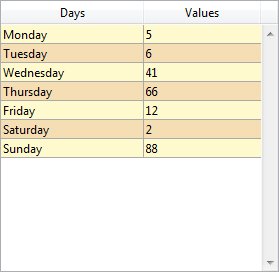

## 交互に使用する背景色

奇数番の行/列に使用するための異なる背景色を設定することができます。デフォルトでは、*自動* が選択されており、リストボックスレベルで設定されている "交互に使用する背景色" を列も使用します。

このプロパティは[`OBJECT SET RGB COLORS`](../commands/object-set-rgb-colors) コマンドを使用しても設定することができます。

#### JSON 文法

| 名称            | データタイプ | とりうる値                                                      |
| ------------- | ------ | ---------------------------------------------------------- |
| alternateFill | string | 任意の CSS値; "transparent"; "automatic"; "automaticAlternate" |

#### 対象オブジェクト

[リストボックス](listbox_overview.md) - [リストボックスカラム](listbox-column.md)

#### コマンド

[`OBJECT GET RGB COLORS`](../commands/object-get-rgb-colors) - [`OBJECT SET RGB COLORS`](../commands/object-set-rgb-colors)

---

## Background Color / Fill color

Defines the background color / fill color of an object. 一部の標準のオブジェクト(`fill` JSON プロパティを使用) あるいは["カスタムスタイル" オブジェクト](#カスタムスタイルのボタン、チェックボックス、あるいはカスタムのラジオボタン) (`borderFillColor` JSON プロパティを使用) に対して定義することが可能です。 [hh](#)

:::note

The **Fill color** property is named **Background color** with [List Box](listbox_overview.md), [List Box Column](listbox-column.md) and [List Box Footer](listbox-header-footer.md#footers) objects.

:::

### 標準のオブジェクト

リストボックスの場合にはデフォルトで、*自動* が選択されており、リストボックスレベルで設定されている背景色を列も使用します。

#### JSON 文法

| 名称   | データタイプ | とりうる値                                |
| ---- | ------ | ------------------------------------ |
| fill | string | 任意の css値; "transparent"; "automatic" |

#### 対象オブジェクト

[階層リスト](list_overview.md) - [リストボックス](listbox_overview.md) - [リストボックスカラム](listbox-column.md) - [リストボックスフッター](listbox-header-footer.md#フッター) - [楕円](shapes_overview.md#楕円) - [四角](shapes_overview.md#四角) - [テキストエリア](text.md)

#### コマンド

[`LISTBOX Get row color`](../commands/listbox-get-row-color) - [`LISTBOX SET ROW COLOR`](../commands/listbox-set-row-color) - [`OBJECT GET RGB COLORS`](../commands/object-get-rgb-colors) - [`OBJECT SET RGB COLORS`](../commands/object-set-rgb-colors)

### カスタムボタン、カスタムチェックボックス、あるいはカスタムのラジオボタン

このプロパティを使用することで、[カスタムボタン](./button_overview.md#カスタム) 、[カスタムのチェックボックス](./checkbox_overview.md#カスタム) 、あるいは[カスタムのラジオボタン](./radio_overview.md#カスタム) に対して塗りカラー属性を割り当てることができます。さらに、[カスタムボタン](./button_overview.md#カスタム) の場合には、["カスタム" 境界線スタイル](#border-line-style) になっている必要があります。その他のコンテキストにおいては、このプロパティは無視されます。

#### JSON 文法

| 名称              | データタイプ | とりうる値                                |
| --------------- | ------ | ------------------------------------ |
| borderFillColor | string | 任意の css値; "transparent"; "automatic" |

#### 対象オブジェクト

[カスタムボタン](button_overview.md#カスタム)(["カスタム" の境界線スタイル](#border-line-style) のもの) - [カスタムチェックボックス](checkbox_overview.md#カスタム) - [カスタムラジオボタン](radio_overview.md#カスタム)

#### コマンド

[`OBJECT GET RGB COLORS`](../commands/object-get-rgb-colors) - [`OBJECT SET RGB COLORS`](../commands/object-set-rgb-colors)

#### 参照

[透過](#透過)

---

## 背景色式 {#background-color-expression}

`セレクションとコレクション型リストボックス`

リストボックスの各行にカスタムの背景色を指定するための式または変数 (配列変数は使用不可)。式または変数は表示行ごとに評価され、RGB値を返さなくてはなりません。詳細については、[`OBJECT SET RGB COLORS`](../commands/object-set-rgb-colors) コマンドの詳細を参照してください。

また、このプロパティは [`LISTBOX SET PROPERTY`](../commands/listbox-set-property) コマンドに `lk background color expression` 定数を指定して設定することもできます。

> コレクション/エンティティセレクション型リストボックスでは、このプロパティは [メタ情報式](properties_Text.md#メタ情報式) を使用しても設定することができます。

#### JSON 文法

| 名称            | データタイプ | とりうる値       |
| ------------- | ------ | ----------- |
| rowFillSource | string | RGBカラー値を返す式 |

#### 対象オブジェクト

[リストボックス](listbox_overview.md) - [リストボックスカラム](listbox-column.md)

#### コマンド

[`LISTBOX Get property`](../commands/listbox-get-property) - [`LISTBOX SET PROPERTY`](../commands/listbox-set-property)

---

## 境界線カラー{#border-color}

以下のオブジェクトに対して、内側の境界線のカラーを定義します:

- ["カスタム" 境界線スタイル](#境界線スタイル) を持った[カスタムボタン](./button_overview.md#カスタム)
- [カスタムチェックボックス](./checkbox_overview.md#カスタム)
- [カスタムラジオボタン](./radio_overview.md#カスタム)

その他のコンテキストにおいては、このプロパティは無視されます。

境界線は、[幅](#border-width) が> 0 (0 より大きい)の場合にのみ表示されるという点に注意して下さい。

#### JSON 文法

| 名称          | データタイプ | とりうる値                                |
| ----------- | ------ | ------------------------------------ |
| borderColor | string | 任意の css値; "transparent"; "automatic" |

#### 対象オブジェクト

[カスタムボタン](button_overview.md#カスタム)(["カスタム" の境界線スタイル](#border-line-style) のもの) - [カスタムチェックボックス](checkbox_overview.md#カスタム) - [カスタムラジオボタン](radio_overview.md#カスタム)

#### コマンド

[`OBJECT GET RGB COLORS`](../commands/object-get-rgb-colors) - [`OBJECT SET RGB COLORS`](../commands/object-set-rgb-colors)

## 境界線スタイル{#border-line-style}

リストボックスの境界線のスタイルを設定します。

:::note

[カスタムボタン](./button_overview.md#カスタム) においては、**カスタム** の境界線スタイルを使用すると内部フレームデザインが有効化され、これによって以下のプロパティのセットが追加されます: [塗りカラー](#background-color--fill-color)、[フレームカラー](#frame-color)、[フレーム幅](#frame-width)、および[角の半径](./properties_BackgroundAndBorder.md#角の半径)。


:::

:::tip 関連したblog 記事

[Customize Buttons, Radio Buttons, and Check Boxes with Background and Border Properties](https://blog.4d.com/customize-buttons-radio-buttons-and-check-boxes-with-background-and-border-properties).

:::

#### JSON 文法

| 名称          | データタイプ | とりうる値                                                                       |
| ----------- | ------ | --------------------------------------------------------------------------- |
| borderStyle | text   | "system", "none", "solid", "dotted", "raised", "sunken", "double", "custom" |

#### 対象オブジェクト

[4D View Pro エリア](viewProArea_overview.md) -
[4D Write Pro エリア](writeProArea_overview.md) -
[ボタン](button_overview.md) -
[ボタングリッド](buttonGrid_overview.md) -
[階層リスト](list_overview.md) -
[入力](input_overview.md) -
[リストボックス](listbox_overview.md) -
[ピクチャーボタン](pictureButton_overview.md) -
[ピクチャーポップアップメニュー](picturePopupMenu_overview.md) -
[プラグインエリア](pluginArea_overview.md) -
[進捗インジケーター](progressIndicator.md) -
[ルーラー](ruler.md) -
[スピナー](spinner.md) -
[ステッパー](stepper.md) -
[サブフォーム](subform_overview.md) -
[テキストエリア](text.md) -
[Web エリア](webArea_overview.md)

#### コマンド

[`OBJECT Get border style`](../commands/object-get-border-style) - [`OBJECT SET BORDER STYLE`](../commands/object-set-border-style)

---

## 境界線幅{#border-width}

以下のオブジェクトに対して、内側の境界線の幅を定義します:

- ["カスタム" 境界線スタイル](#境界線スタイル) を持った[カスタムボタン](./button_overview.md#カスタム)
- [カスタムチェックボックス](./checkbox_overview.md#カスタム)
- [カスタムラジオボタン](./radio_overview.md#カスタム)

その他のコンテキストにおいては、このプロパティは無視されます。

値はピクセル単位で指定しなければなりません。

#### JSON 文法

| 名称          | データタイプ | とりうる値                                |
| ----------- | ------ | ------------------------------------ |
| borderWidth | number | 整数値(ピクセル)。最小値 = 0 |

#### 対象オブジェクト

[カスタムボタン](button_overview.md#カスタム)(["カスタム" の境界線スタイル](#border-line-style) のもの) - [カスタムチェックボックス](checkbox_overview.md#カスタム) - [カスタムラジオボタン](radio_overview.md#カスタム)

---

## 角の半径

<details><summary>履歴</summary>

| リリース  | 内容                                |
| ----- | --------------------------------- |
| 21 R5 | カスタムスタイルのボタン、ラジオボタン、チェックボックスのサポート |
| 19 R7 | テキストと入力オブジェクトをサポート                |

</details>

フォームオブジェクトの角の丸みをピクセル単位で指定します。デフォルトでは、角の半径は 0ピクセルとなっています。このプロパティを変更することによって独自の形の角の丸いフォームオブジェクトを描画することができます:


最小値は 0 で、この場合には標準の (角の丸くない) フォームオブジェクトが描画されます。最大値は四角のサイズに応じて変化し、動的に計算されます (ただし四角の短辺の半分を超えることはできません)。

[テキストエリア](./text.md) および[入力](./input_overview.md) では以下のように振る舞います:

- 角の半径プロパティは、[境界線スタイル](#border-line-style)が "なし"、"標準"、"ドット" の場合にのみ利用可能です
- 角の丸みはフォームオブジェクトの**外側**に描画されます (つまり、オブジェクトはより大きく表示されますが、[幅](properties_CoordinatesAndSizing.md#幅) と [高さ](properties_CoordinatesAndSizing.md#高さ) プロパティは変更されません)。


[カスタムボタン](./button_overview.md#カスタム) (["カスタム" 境界線スタイル](#border-line-style)を使用)、 [カスタムチェックボックス](checkbox_overview.md#カスタム) および[カスタムラジオボタン](radio_overview.md#カスタム) においては、角の丸みはオブジェクトのエリアの**内側**に描画されます。

#### JSON 文法

| 名称           | データタイプ  | とりうる値                  |
| ------------ | ------- | ---------------------- |
| borderRadius | integer | 最小値: 0 |

#### 対象オブジェクト

[カスタムボタン](./button_overview.md#カスタム) (["カスタム" 境界線スタイル](#border-line-style)を使用しているもの) - [カスタムチェックボックス](checkbox_overview.md#カスタム) - [入力](input_overview.md) - [四角形](shapes_overview.md#四角形) - [テキストエリア](text.md) - [カスタムラジオボタン](radio_overview.md#カスタム)

#### コマンド

[OBJECT GET CORNER RADIUS](../commands/object-get-corner-radius) - [OBJECT SET CORNER RADIUS](../commands/object-set-corner-radius)

---

## 点線タイプ {#dotted-line-type}

点線のタイプを、点と白のパターンにより指定します。

#### JSON 文法

| 名称              | データタイプ     | とりうる値                                                                                                                                      |
| --------------- | ---------- | ------------------------------------------------------------------------------------------------------------------------------------------ |
| strokeDashArray | 数値配列または文字列 | 例:  例:  6個の点と1個の空白のパターンは "6 1" または \[6,1\] によって表します。 |

#### 対象オブジェクト

[四角](shapes_overview.md#四角) - [楕円](shapes_overview.md#楕円) - [線](shapes_overview.md#線)

---

## 追加の空白の行を非表示

リストボックスオブジェクト下部に追加される余分な空白行の表示を管理します。デフォルトで、4D は空のエリアを埋めるためにこのような行を追加します:


このオプションをチェックすると、これらの空白行を除去することができます。リストボックスオブジェクトの下部は空のままになります:



#### JSON 文法

| 名称                 | データタイプ  | とりうる値       |
| ------------------ | ------- | ----------- |
| hideExtraBlankRows | boolean | true, false |

#### 対象オブジェクト

[リストボックス](listbox_overview.md)

#### コマンド

[`LISTBOX Get property`](../commands/listbox-get-property) - [`LISTBOX SET PROPERTY`](../commands/listbox-set-property)

---

## 線カラー

オブジェクトの線の色を指定します。カラーは次の方法で指定できます:

- カラーネーム - 例: "red"
- 16進数値 - 例: "#ff0000"
- RGB値 - 例: "rgb(255,0,0)"

このプロパティは[`OBJECT SET RGB COLORS`](../commands/object-set-rgb-colors) コマンドを使用しても設定することができます。

#### JSON 文法

| 名称     | データタイプ | とりうる値                                |
| ------ | ------ | ------------------------------------ |
| stroke | string | 任意の css値; "transparent"; "automatic" |

> このプロパティはテキスト系のオブジェクトでも利用可能です。この場合、このプロパティはフォントカラーおよびオブジェクトの線カラーの両方を指定します ([フォントカラー](properties_Text.md#フォントカラー) 参照)。

#### 対象オブジェクト

[線](shapes_overview.md#線) - [楕円](shapes_overview.md#楕円) - [四角](shapes_overview.md#四角)

#### コマンド

[`OBJECT GET RGB COLORS`](../commands/object-get-rgb-colors) - [`OBJECT SET RGB COLORS`](../commands/object-set-rgb-colors)

---

## 線幅

線の幅を指定します。

#### JSON 文法

| 名称          | データタイプ | とりうる値                                                      |
| ----------- | ------ | ---------------------------------------------------------- |
| strokeWidth | number | 印刷されるフォームにおける最小幅 0 から、整数値 < 20 まで |

#### 対象オブジェクト

[線](shapes_overview.md#線) - [楕円](shapes_overview.md#楕円) - [四角](shapes_overview.md#四角)

---

## 行背景色配列 {#row-background-color-array}

`配列型リストボックス`

リストボックスまたはリストボックス列の各行にカスタムの背景色を適用するのに使用する配列名です。

倍長整数型の配列の名前を入力しなければなりません。配列のそれぞれの要素はリストボックスの行 (あるいは列のセル) に対応します。 つまりこの配列は、各列に関連づけられている配列と同じサイズでなければいけません。 [`OBJECT SET RGB COLORS`](../commands/object-set-rgb-colors) コマンドの章で説明されている定数を使用することができます。もし上のレベルで定義されている背景色をそのままセルに継承したい場合には、対応する配列の要素に -255 を渡します。

たとえば、リストボックスプロパティにてグレー/ライトグレーカラーが行の交互背景色として設定されているとします。同じリストボックスに行背景色配列が指定されており、行内で負の値が一つでもあれば色をオレンジに変えます:

```4d
 <>_BgndColors{$i}:=0x00FFD0B0 // オレンジ
 <>_BgndColors{$i}:=-255 // デフォルト値
```


次に、負の値を持つセルの色を濃いオレンジで示したい場合、各列にも行背景色配列を設定します (例: `<>_BgndColor_1`, `<>_BgndColor_2` と `<>_BgndColor_3`)。これらの配列の値は、リストボックスプロパティに設定されているものや、全体用の行背景色配列よりも優先されます。

```4d
 <>_BgndColorsCol_3{2}:=0x00FF8000 // 濃いオレンジ
 <>_BgndColorsCol_2{5}:=0x00FF8000
 <>_BgndColorsCol_1{9}:=0x00FF8000
 <>_BgndColorsCol_1{16}:=0x00FF8000
```


[`LISTBOX SET ROW FONT STYLE`](../commands/listbox-set-row-font-style) および [`LISTBOX SET ROW COLOR`](../commands/listbox-set-row-color) コマンドを使用することでも同じ結果を得ることができます。コマンドを使う利点は、スタイル/カラー配列をあらかじめ列に設定する必要がないことです。 この場合、これらはコマンドによって動的に作成されます。

#### JSON 文法

| 名称            | データタイプ | とりうる値      |
| ------------- | ------ | ---------- |
| rowFillSource | string | 倍長整数型配列の名前 |

#### 対象オブジェクト

[リストボックス](listbox_overview.md) - [リストボックスカラム](listbox-column.md)

#### コマンド

[`LISTBOX Get array`](../commands/listbox-get-array) - [`LISTBOX GET ARRAYS`](../commands/listbox-get-arrays)

---

## 透過

リストボックスの背景を透明にします。このプロパティが有効になっていると、列に対して設定されている [交互に使用する背景色](#交互に使用する背景色) および [背景色](#背景色-塗りカラー) の設定は無視されます。

#### JSON 文法

| 名称   | データタイプ | とりうる値         |
| ---- | ------ | ------------- |
| fill | text   | "transparent" |

#### 対象オブジェクト

[リストボックス](listbox_overview.md)

#### コマンド

[`OBJECT GET RGB COLORS`](../commands/object-get-rgb-colors) - [`OBJECT SET RGB COLORS`](../commands/object-set-rgb-colors)

#### 参照

[背景色/塗りカラー](#背景色-塗りカラー)

