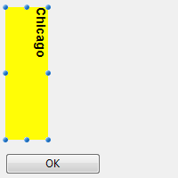
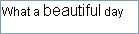

---

## ピッカーの使用を許可

このプロパティが有効化されている場合、[OPEN FONT PICKER](../commands/open-font-picker) および [OPEN COLOR PICKER](../commands/open-color-picker) コマンドを呼び出すことでシステムフォントウィンドウとカラーピッカーウィンドウを表示することができます。 これらのピッカーウィンドウを使用して、ユーザーはフォームオブジェクトのフォントやカラーをクリックによって変更できます。 このプロパティが無効になっていると (デフォルト)、ピッカーを開くコマンドは使用できません。 これらのピッカーウィンドウを使用して、ユーザーはフォームオブジェクトのフォントやカラーをクリックによって変更できます。 このプロパティが無効になっていると (デフォルト)、ピッカーを開くコマンドは使用できません。

#### JSON 文法

| プロパティ                | データタイプ  | とりうる値                                  |
| -------------------- | ------- | -------------------------------------- |
| allowFontColorPicker | boolean | false (デフォルト), true |

#### 対象オブジェクト

[入力](input_overview.md)

---

## 太字

選択テキストの線を太くし、濃く見えるようにします。

このプロパティは[**OBJECT SET FONT STYLE**](../commands/object-set-font-style) コマンドを使用しても設定することができます。

> これは通常のテキストです。<br/>
> **これは太字のテキストです。**

#### JSON 文法

| プロパティ      | データタイプ | とりうる値            |
| ---------- | ------ | ---------------- |
| fontWeight | text   | "normal", "bold" |

#### 対象オブジェクト

[ボタン](button_overview.md) -
[チェックボックス](checkbox_overview.md) -
[コンボボックス](comboBox_overview.md) -
[ドロップダウンリスト](dropdownList_Overview.md) -
[グループボックス](groupBox.md) -
[階層リスト](list_overview.md) -
[入力](input_overview.md) -
[リストボックス](listbox_overview.md) -
[リストボックス列](listbox-column.md) -
[リストボックスフッター](listbox-header-footer.md#フッター) -
[リストボックスヘッダー](listbox-header-footer.md#ヘッダー) -
[ラジオボタン](radio_overview.md) -
[テキストエリア](text.md)

#### コマンド

[OBJECT Get font style](../commands/object-get-font-style) - [OBJECT SET FONT STYLE](../commands/object-set-font-style)

---

## イタリック

選択テキストの線を右斜めに傾けます。

このプロパティは[**OBJECT SET FONT STYLE**](../commands/object-set-font-style) コマンドを使用しても設定することができます。

> これは通常のテキストです。<br/>
> *これはイタリックのテキストです。*

#### JSON 文法

| 名称        | データタイプ | とりうる値              |
| --------- | ------ | ------------------ |
| fontStyle | string | "normal", "italic" |

#### 対象オブジェクト

[ボタン](button_overview.md) -
[チェックボックス](checkbox_overview.md) -
[コンボボックス](comboBox_overview.md) -
[ドロップダウンリスト](dropdownList_Overview.md) -
[グループボックス](groupBox.md) -
[階層リスト](list_overview.md) -
[入力](input_overview.md) -
[リストボックス](listbox_overview.md) -
[リストボックス列](listbox-column.md) -
[リストボックスフッター](listbox-header-footer.md#フッター) -
[リストボックスヘッダー](listbox-header-footer.md#ヘッダー) -
[ラジオボタン](radio_overview.md) -
[テキストエリア](text.md)

#### コマンド

[OBJECT Get font style](../commands/object-get-font-style) - [OBJECT SET FONT STYLE](../commands/object-set-font-style)

---

## 下線

選択テキストの下に線を引きます。

#### JSON 文法

| 名称             | データタイプ | とりうる値                 |
| -------------- | ------ | --------------------- |
| textDecoration | string | "normal", "underline" |

#### 対象オブジェクト

[ボタン](button_overview.md) -
[チェックボックス](checkbox_overview.md) -
[コンボボックス](comboBox_overview.md) -
[ドロップダウンリスト](dropdownList_Overview.md) -
[グループボックス](groupBox.md) -
[階層リスト](list_overview.md) -
[入力](input_overview.md) -
[リストボックス](listbox_overview.md) -
[リストボックス列](listbox-column.md) -
[リストボックスフッター](listbox-header-footer.md#フッター) -
[リストボックスヘッダー](listbox-header-footer.md#ヘッダー) -
[ラジオボタン](radio_overview.md) -
[テキストエリア](text.md)

#### コマンド

[OBJECT Get font style](../commands/object-get-font-style) - [OBJECT SET FONT STYLE](../commands/object-set-font-style)

---

## フォント

このプロパティは、オブジェクトで使用される **フォントテーマ** または **フォントファミリー** を指定します。

> **フォントテーマ** と **フォントファミリー** プロパティは、どちらか一方しか指定できません。 フォントテーマは、サイズを含めたフォント属性を定めます。 フォントファミリーの場合は、フォント名・フォントサイズ・フォントカラーをそれぞれ定義することができます。 フォントテーマは、サイズを含めたフォント属性を定めます。 フォントファミリーの場合は、フォント名・フォントサイズ・フォントカラーをそれぞれ定義することができます。

### フォントテーマ

フォントテーマプロパティには、自動スタイルの名前を指定します。 自動スタイルは、オブジェクトに使われるフォントファミリー・フォントサイズ・フォントカラーをシステムパラメーターに応じて動的に定めます。 これらのパラメーターは次に依存します:

- プラットフォーム
- システム言語
- フォームオブジェクトのタイプ

フォントテーマを使うことで、システムの現インターフェース標準に沿うようにタイトルが表示されることが保証されます。 ただし、マシンごとにサイズが変わるかもしれません。

3つのフォントテーマが提供されています:

- **normal**: フォームエディター内で作成された新規オブジェクトにデフォルトで適用される自動スタイルです。
- **main** および **additional** フォントテーマは [テキストエリア](text.md) と [入力](input_overview.md) オブジェクトでのみサポートされています。 これらのテーマは、おもにダイアログボックスのデザインを目的に提供されています。 インターフェースウィンドウにおいて main フォントテーマは本文用、additional テーマは詳細情報を追記するためのものです。 下に macOS および Windows にてこれらのフォントテーマを使ったダイアログボックスの例を示します: これらのテーマは、おもにダイアログボックスのデザインを目的に提供されています。 インターフェースウィンドウにおいて main フォントテーマは本文用、additional テーマは詳細情報を追記するためのものです。 下に macOS および Windows にてこれらのフォントテーマを使ったダイアログボックスの例を示します:


> フォントテーマはフォントだけでなく、サイズやカラーも定めます。 一部のカスタムスタイルプロパティ (太字、イタリック、下線) は動作に影響なく適用することができます。

#### JSON 文法

| 名称        | データタイプ | とりうる値                          |
| --------- | ------ | ------------------------------ |
| fontTheme | string | "normal", "main", "additional" |

#### 対象オブジェクト

[ボタン](button_overview.md) -
[チェックボックス](checkbox_overview.md) -
[コンボボックス](comboBox_overview.md) -
[ドロップダウンリスト](dropdownList_Overview.md) -
[グループボックス](groupBox.md) -
[階層リスト](list_overview.md) -
[入力](input_overview.md) -
[リストボックス](listbox_overview.md) -
[リストボックス列](listbox-column.md) -
[リストボックスフッター](listbox-header-footer.md#フッター) -
[リストボックスヘッダー](listbox-header-footer.md#ヘッダー) -
[ラジオボタン](radio_overview.md) -
[テキストエリア](text.md)

#### コマンド

[OBJECT Get style sheet](../commands/object-get-style-sheet) - [OBJECT SET STYLE SHEET](../commands/object-set-style-sheet)

### フォントファミリー

次の 2種類のフォントファミリーが存在します:

- *フォントファミリー:* "times", "courier", "arial" などのフォントファミリーの名称。
- *総称ファミリー:* "serif", "sans-serif", "cursive", "fantasy", "monospace" などの汎用ファミリーの名称。

これは、[`OBJECT SET FONT`](../commands/object-set-font) コマンドを使用しても設定することができます。

#### JSON 文法

| 名称         | データタイプ | とりうる値          |
| ---------- | ------ | -------------- |
| fontFamily | string | CSS フォントファミリー名 |

> 4D では [Webセーフ](https://www.w3schools.com/cssref/css_websafe_fonts.asp) フォントだけを使うことを推奨しています。

#### 対象オブジェクト

[ボタン](button_overview.md) -
[チェックボックス](checkbox_overview.md) -
[コンボボックス](comboBox_overview.md) -
[ドロップダウンリスト](dropdownList_Overview.md) -
[グループボックス](groupBox.md) -
[階層リスト](list_overview.md) -
[入力](input_overview.md) -
[リストボックス](listbox_overview.md) -
[リストボックス列](listbox-column.md) -
[リストボックスフッター](listbox-header-footer.md#フッター) -
[リストボックスヘッダー](listbox-header-footer.md#ヘッダー) -
[ラジオボタン](radio_overview.md) -
[テキストエリア](text.md)

#### コマンド

[OBJECT Get font](../commands/object-get-font) - [OBJECT SET FONT](../commands/object-set-font)

## フォントサイズ

文字の大きさをポイントで指定します。

#### JSON 文法

| 名称       | データタイプ  | とりうる値                                                                                                    |
| -------- | ------- | -------------------------------------------------------------------------------------------------------- |
| fontSize | integer | フォントサイズ (ポイント単位) 最小値: 0 最小値: 0 最小値: 0 |

#### 対象オブジェクト

[ボタン](button_overview.md) -
[チェックボックス](checkbox_overview.md) -
[コンボボックス](comboBox_overview.md) -
[ドロップダウンリスト](dropdownList_Overview.md) -
[グループボックス](groupBox.md) -
[階層リスト](list_overview.md) -
[入力](input_overview.md) -
[リストボックス](listbox_overview.md) -
[リストボックス列](listbox-column.md) -
[リストボックスフッター](listbox-header-footer.md#フッター) -
[リストボックスヘッダー](listbox-header-footer.md#ヘッダー) -
[ラジオボタン](radio_overview.md) -
[テキストエリア](text.md)

#### コマンド

[OBJECT Get font size](../commands/object-get-font-size) - [OBJECT SET FONT SIZE](../commands/object-set-font-size)

---

## フォントカラー

文字の色を指定します。

> オブジェクトの境界線スタイル に "標準" または "ドット" が使用されている場合、このプロパティはその境界線の色も指定します。

カラーは次の方法で指定できます:

- カラーネーム - 例: "red"
- 16進数値 - 例: "#ff0000"
- RGB値 - 例: "rgb(255,0,0)"

このプロパティは[**OBJECT SET RGB COLORS**](../commands/object-set-rgb-colors) コマンドを使用しても設定することができます。

#### JSON 文法

| 名称     | データタイプ | とりうる値                                |
| ------ | ------ | ------------------------------------ |
| stroke | string | 任意の css値; "transparent"; "automatic" |

#### 対象オブジェクト

[ボタン](button_overview.md) -
[チェックボックス](checkbox_overview.md) -
[コンボボックス](comboBox_overview.md) -
[ドロップダウンリスト](dropdownList_Overview.md) -
[グループボックス](groupBox.md) -
[階層リスト](list_overview.md) -
[入力](input_overview.md) -
[リストボックス](listbox_overview.md) -
[リストボックスカラム](listbox-column.md) -
[リストボックスフッター](listbox-header-footer.md#フッター) -
[リストボックスヘッダー](listbox-header-footer.md#ヘッダー) -
[進捗インジケーター](progressIndicator.md) -
[ルーラー](ruler.md) -
[ラジオボタン](radio_overview.md) -
[テキストエリア](text.md)

#### コマンド

[OBJECT GET RGB COLORS](../commands/object-get-rgb-colors) - [OBJECT SET RGB COLORS](../commands/object-set-rgb-colors)

---

## フォントカラー式

`セレクションおよびコレクション/エンティティセレクション型のリストボックス`

リストボックスの各行にカスタマイズしたフォントカラーを適用するために使用します。 RGBカラーを使用しなければなりません。 この点の詳細については、[`OBJECT SET RGB COLORS`](../commands/object-set-rgb-colors) コマンドの詳細を参照してください。

式または変数 (配列を除く) を入力します。 表示される行ごとに式や変数は評価されます。 [`OBJECT SET RGB COLORS`](../commands/object-set-rgb-colors) コマンドの章で説明されている定数を使用することができます。

このプロパティは[`LISTBOX SET PROPERTY`](../commands/listbox-set-property) と `lk font color expression` 定数を組み合わせて使用しても設定することができます。

> このプロパティは [メタ情報式](properties_Text.md#メタ情報式) を使用しても設定することができます。

以下の例は変数名を使用しています。**フォントカラー式** に *CompanyColor* を入力し、フォームメソッドに以下のコードを書きます:

```4d
CompanyColor:=Choose([Companies]ID;Background color;Light shadow color;   
Foreground color;Dark shadow color)
```

#### JSON 文法

| 名称              | データタイプ | とりうる値    |
| --------------- | ------ | -------- |
| rowStrokeSource | string | フォントカラー式 |

#### 対象オブジェクト

[リストボックス](listbox_overview.md)

#### コマンド

[LISTBOX Get property](../commands/listbox-get-property) - [LISTBOX SET PROPERTY](../commands/listbox-set-property)

---

## スタイル式 {#style-expression}

`セレクションおよびコレクション/エンティティセレクション型のリストボックス`

リストボックスの各行にカスタマイズされた文字スタイルを適用するために使用します。

式または変数 (配列を除く) を入力します。 式や変数は、表示行ごと (リストボックスのプロパティの場合) または表示セルごと (リストボックス列のプロパティの場合) に評価されます。 式または変数 (配列を除く) を入力します。 式や変数は、表示行ごと (リストボックスのプロパティの場合) または表示セルごと (リストボックス列のプロパティの場合) に評価されます。 [`LISTBOX SET ROW FONT STYLE`](../commands/listbox-set-row-font-style) コマンドのページ内で提示されている定数を使用することができます。

例:

```4d
Choose([Companies]ID;Bold;Plain;Italic;Underline)
```

このプロパティは[`LISTBOX SET PROPERTY`](../commands/listbox-set-property) と `lk font style expression` 定数を組み合わせて使用しても設定することができます。

> このプロパティは [メタ情報式](properties_Text.md#メタ情報式) を使用しても設定することができます。

#### JSON 文法

| 名称             | データタイプ | とりうる値                   |
| -------------- | ------ | ----------------------- |
| rowStyleSource | string | 表示される行/セルごとに評価されるスタイル式。 |

#### 対象オブジェクト

[リストボックス](listbox_overview.md) - [リストボックスカラム](listbox-column.md)

#### コマンド

[LISTBOX Get property](../commands/listbox-get-property) - [LISTBOX SET PROPERTY](../commands/listbox-set-property)

---

## 横揃え

エリア中のテキストの横位置を指定します。

#### JSON 文法

| 名称        | データタイプ | とりうる値                                             |
| --------- | ------ | ------------------------------------------------- |
| textAlign | string | "right", "center", "left", "automatic", "justify" |

:::note

- "automatic" は、[チェックボックス](checkbox_overview.md) および [ラジオボタン](radio_overview.md) ではサポートされていません。
- "justify" は、[入力](input_overview.md) と [テキストエリア](text.md) でのみサポートされています。

:::

#### 対象オブジェクト

[ボタン](button_overview.md) -
[チェックボックス](checkbox_overview.md) (通常とフラット以外のスタイル) -
[コンボボックス](comboBox_overview.md) -
[ドロップダウンリスト](dropdownList_Overview.md) -
[グループボックス](groupBox.md) -
[入力](input_overview.md) -
[リストボックス](listbox_overview.md) -
[リストボックスカラム](listbox-column.md) -
[リストボックスヘッダー](listbox-header-footer.md#ヘッダー) -
[リストボックスフッター](listbox-header-footer.md#フッター) -
[ラジオボタン](radio_overview.md) (通常とフラット以外のスタイル) -
[テキストエリア](text.md)

#### コマンド

[OBJECT Get horizontal alignment](../commands/object-get-horizontal-alignment) - [OBJECT SET HORIZONTAL ALIGNMENT](../commands/object-set-horizontal-alignment)

---

## 縦揃え

エリア中のテキストの縦位置を指定します。

**デフォルト** オプション (JSON値: `automatic`) の場合は、各列のデータ型に基づき整列方向が決定されます:

- ピクチャーを除き、すべて `下` です。
- ピクチャーは `上` です。

このプロパティは、[`OBJECT Get vertical alignment`](../commands/object-get-vertical-alignment) および [`OBJECT SET VERTICAL ALIGNMENT`](../commands/object-set-vertical-alignment) コマンドを使用しても管理することができます。

#### JSON 文法

| 名称            | データタイプ | とりうる値                                  |
| ------------- | ------ | -------------------------------------- |
| verticalAlign | string | "automatic", "top", "middle", "bottom" |

#### 対象オブジェクト

[リストボックス](listbox_overview.md) - [リストボックスカラム](listbox-column.md) - [リストボックスフッター](listbox-header-footer.md#footers) - [リストボックスヘッダー](listbox-header-footer.md#headers)

#### コマンド

[`OBJECT Get vertical alignment`](../commands/object-get-vertical-alignment) - [`OBJECT SET VERTICAL ALIGNMENT`](../commands/object-set-vertical-alignment)

---

## メタ情報式

`コレクションまたはエンティティセレクション型リストボックス`

表示される行ごとに評価される式あるいは変数を指定します。 行テキスト属性全体を定義することができます。 **オブジェクト変数**、あるいは **オブジェクトを返す式** を指定する必要があります。 以下のプロパティがサポートされています:

| プロパティ名         | 型       | 説明                                                                                                                                                                                                                                                                          |
| -------------- | ------- | --------------------------------------------------------------------------------------------------------------------------------------------------------------------------------------------------------------------------------------------------------------------------- |
| stroke         | string  | フォントカラー。 任意の CSSカラー (例: "#FF00FF"), "automatic", "transparent"                                                                                                                                                                           |
| fill           | string  | 背景色。 任意の CSSカラー (例: "#F00FFF"), "automatic", "transparent"                                                                                                                                                                               |
| fontStyle      | string  | "normal","italic"                                                                                                                                                                                                                                                           |
| fontWeight     | string  | "normal","bold"                                                                                                                                                                                                                                                             |
| textDecoration | string  | "normal","underline"                                                                                                                                                                                                                                                        |
| unselectable   | boolean | 対応する行が選択不可 (つまりハイライトすることができない状態) であることを指定します。 このオプションが有効化されている場合、入力可能エリアは入力可能ではなくなります (ただし "シングルクリック編集" オプションが有効化されている場合を除く)。 チェックボックスやリストといったコントロール類は引き続き稼働します。 この設定はリストボックスの選択モードが "なし" の場合には無視されます。 デフォルト値: false。 |
| disabled       | boolean | 対応する行を無効化します。 このオプションが有効化されると、入力可能エリアは入力可能ではなくなります。 テキストや、(チェックボックス、リストなどの)  コントロール類は暗くなっているかグレーアウトされます。 デフォルト値: false。                                                                                                                  |

特別な "cell" プロパティを使用すると、特定の列にプロパティをまとめて適用することができます:

| プロパティ名 |              |                | 型      | 説明                                                                                                                                                                                                          |
| ------ | ------------ | -------------- | ------ | ----------------------------------------------------------------------------------------------------------------------------------------------------------------------------------------------------------- |
| cell   |              |                | object | 特定の列に適用するプロパティ                                                                                                                                                                                              |
|        | *columnName* |                | object | *columnName* はリストボックス列のオブジェクト名です。                                                                                                                                                                           |
|        |              | *propertyName* | string | "stroke", "fill", "fontStyle", "fontWeight", または "textDecoration" プロパティ (前述参照)。 **注**: "unselectable" および "disabled" プロパティは行レベルでのみ定義可能です。 "セル" オブジェクトに指定した場合、これらは無視されます。 |

> このプロパティで設定されたスタイルは、プロパティリスト内で他のスタイル設定が式により定義されている場合には無視されます ([スタイル式](#スタイル式)、[フォントカラー式](#フォントカラー式)、[背景色式](./properties_BackgroundAndBorder.md#背景色式))。

**例題**

*Color* プロジェクトメソッドに以下のコードを書きます:

```4d
// Color メソッド
// 特定の行に対してフォントカラーを、そしてカラム Col2 および Col3 に対して背景色を設定します:
Form.meta:=New object
If(This.ID>5) // ID はコレクションオブジェクト/エンティティの属性です
  Form.meta.stroke:="purple"
  Form.meta.cell:=New object("Col2";New object("fill";"black");\
    "Col3";New object("fill";"red"))
Else
  Form.meta.stroke:="orange"
End if
```

**ベストプラクティス:** 最適化のため、このような場合にはフォームメソッド内で `meta.cell` オブジェクトを作成しておくことが推奨されます。

```4d
  // フォームメソッド
 Case of
    :(Form event code=On Load)
       Form.colStyle:=New object("Col2";New object("fill";"black");\
        "Col3";New object("fill";"red"))  
 // 他のスタイルセットも定義できます  
       Form.colStyle2:=New object("Col2";New object("fill";"green");\
        "Col3";New object("fontWeight";"bold"))  
 End case
```

*Color* メソッドには、以下のコードを書きます:

```4d
  // Color メソッド
 ...
 If(This.ID>5)
    Form.meta.stroke:="purple"
    Form.meta.cell:=Form.colStyle // より良いパフォーマンスのため、同じオブジェクトを再利用します
 Else
    Form.meta.stroke:="orange"
    Form.meta.cell:=Form.colStyle2
 End if
```

#### JSON 文法

| 名称         | データタイプ | とりうる値                     |
| ---------- | ------ | ------------------------- |
| metaSource | string | 表示される行/セルごとに評価されるオブジェクト式。 |

#### 対象オブジェクト

[リストボックス](listbox_overview.md)

#### コマンド

[LISTBOX Get property](../commands/listbox-get-property) - [LISTBOX SET PROPERTY](../commands/listbox-set-property)

---

## マルチスタイル

このプロパティは、選択された領域で[特定のスタイル](https://doc.4d.com/4Dv20/4D/20.6/Supported-tags.300-7488021.ja.html)を使用する可能性を有効にします。 プロパティリストでこのオプションがチェックされていると、4D はエリア中の `<SPAN>` HTMLタグをスタイル属性として解釈します。 プロパティリストでこのオプションがチェックされていると、4D はエリア中の `<SPAN>` HTMLタグをスタイル属性として解釈します。

デフォルトでは、このオプションは有効化されていません。

#### JSON 文法

| 名称         | データタイプ  | とりうる値       |
| ---------- | ------- | ----------- |
| styledText | boolean | true, false |

#### 対象オブジェクト

[入力](input_overview.md) - [リストボックスカラム](listbox-column.md)

#### コマンド

[LISTBOX Get property](../commands/listbox-get-property) - [LISTBOX SET PROPERTY](../commands/listbox-set-property) - [OBJECT Is styled text](../commands/object-is-styled-text)

### Supported tags

You can use the following tags in 4D multi-style text areas.

#### 4D Expression

```html
<span style="-d4-ref:'expression'"> </span>
```

This tag inserts a 4D expression (expression, method, field, variable, command, etc.) in the text. The expression is tokenized and evaluated:

- when the expression is inserted
- when the object is loaded
- when the `computeExpressions` standard action is called from an interface object or by the [`INVOKE ACTION`](../commands/invoke-action) command
- when the [`ST COMPUTE EXPRESSIONS`](../commands/st-compute-expressions) command is executed
- when the [`ST FREEZE EXPRESSIONS`](../commands/st-freeze-expressions) command is executed, if the second `*` parameter is passed.

The evaluated value of the expression is not saved in the `<span>` tag, only its reference is.

Note: To ensure that expressions will be evaluated correctly regardless of the 4D language or version used, we recommend using the token syntax for elements whose name might vary between different versions (commands, tables, fields, constants). たとえば、`Current time` コマンドを挿入するには、"`Current time:C178`"と入力します。 For more information about this, refer to *Using tokens in formulas*.

#### URL

```html
<span><a href="url">Visible label</a></span>
```

This tag inserts a URL in the text. 例:

```html
<span><a href="http://www.4d.com/">4D Web Site</a></span>
```

#### User link

```html
<span style="-d4-ref-user:'myUserLink'">Click here</span>
```

"User links" look the same as URLs, but when you click them, they do not automatically open the source. You can pass any string you want as reference, and it is up to the developer to program any custom actions that occur when it is clicked. This means you can create links which are not URLs but references to files, 4D methods, and so on, that you can open or execute when they are clicked. The [`ST Get content type`](../commands/st-get-content-type) command detects if a user link has been clicked.

User links are defined using the [`ST SET TEXT`](../commands/st-set-text) command. 例:

```4d
ST SET TEXT(txtVar;"This is a user link: <span style=\"-d4-ref-user:'UserLink'\">User Label</span>";$start;$end)
```

#### Custom tags

You can insert any tag in plain text, for example ``. It is stored in the code of the plain text without being interpreted or displayed. This is particularly useful in the context of e-mails in HTML format and including pictures for example.

#### Style tags

This paragraph lists the attributes of \<SPAN> tags that are supported by 4D in rich text areas. You can use these tags to implement custom style handling. Only the tags listed below are supported by 4D for style variations.

- Font name: `<SPAN STYLE="font-family: DESDEMONA"> ... </SPAN>`
- Font size: `<SPAN STYLE="font-size: 20pt"> ... </SPAN>`
- フォントスタイル:
  - Bold `<SPAN STYLE="font-weight: bold"> ... </SPAN>`
  - Italic `<SPAN STYLE="font-style: italic"> ... </SPAN>`
  - Normal `<SPAN STYLE="font-style: normal"> ... </SPAN>`
  - Underline `<SPAN STYLE="text-decoration: underline"> ... </SPAN>`
  - Strikethrough `<SPAN STYLE="text-decoration:line-through">...</SPAN>`

*Note: The "strikethrough" style is not supported under macOS, but this tag can still be managed by programming.*

- Font colors: `<SPAN STYLE="color:green"> ... </SPAN>` or `<SPAN STYLE="color:#006CCC">...</SPAN>`
- Background colors: `<SPAN STYLE="background-color:green"> ... </SPAN>` or `<SPAN STYLE="background-color:#006CCC">...</SPAN>`

#### Color values

For font color and background color attributes, the color value can be either the hexadecimal code for an RGB color, or the name of one of the 16 HTML colors defined for standard CSS by the W3C:


---

## 方向

テキストエリアの角度 (回転) を変更します。 テキストエリアは、90°単位で回転させることができます。 それぞれの回転角度を適用するとき、オブジェクトの左下の角は固定されたままで回転していきます:

| 戻り値                          | 戻り値                                            |
| ---------------------------- | ---------------------------------------------- |
| 0 (デフォルト) |  |
| 90                           |  |
| 180                          |  |
| 270                          |  |

[スタティックなテキストエリア](text.md) のほかに、[入力不可](properties_Entry.md#入力可) に設定された [入力オブジェクト](input_overview.md) も回転させることが出来ます。 入力オブジェクトの方向プロパティにて 0°以外のオプションを選んだ場合、 入力可プロパティは (選択されていた場合) 自動的に解除されます。 その際、このオブジェクトは入力順から自動的に除外されます。 入力オブジェクトの方向プロパティにて 0°以外のオプションを選んだ場合、 入力可プロパティは (選択されていた場合) 自動的に解除されます。 その際、このオブジェクトは入力順から自動的に除外されます。

#### JSON 文法

| 名称        | データタイプ | とりうる値           |
| --------- | ------ | --------------- |
| textAngle | number | 0, 90, 180, 270 |

#### 対象オブジェクト

[入力](input_overview.md) (入力不可) - [テキストエリア](text.md)

#### コマンド

[OBJECT Get text orientation](../commands/object-get-text-orientation) - [OBJECT SET TEXT ORIENTATION](../commands/object-set-text-orientation)

---

## 行フォントカラー配列 {#row-font-color-array}

`配列型リストボックス`

リストボックスの各行/セルにカスタマイズしたフォントカラーを適用するために使用します。

倍長整数型の配列の名前を入力しなければなりません。 配列のそれぞれの要素はリストボックスの行 (あるいは列のセル) に対応します。 つまりこの配列は、各列に関連づけられている配列と同じサイズでなければいけません。 [`OBJECT SET RGB COLORS`](../commands/object-set-rgb-colors) コマンドの章で説明されている定数を使用することができます。 もし上のレベルで定義されている背景色をそのままセルに継承したい場合には、対応する配列の要素に -255 を渡します。

#### JSON 文法

| 名称              | データタイプ | とりうる値      |
| --------------- | ------ | ---------- |
| rowStrokeSource | string | 倍長整数型配列の名前 |

#### 対象オブジェクト

[リストボックス](listbox_overview.md) - [リストボックスカラム](listbox-column.md)

#### コマンド

[`LISTBOX Get array`](../commands/listbox-get-array) - [`LISTBOX GET ARRAYS`](../commands/listbox-get-arrays) - [`LISTBOX SET ARRAY`](../commands/listbox-set-array)

---

## 行スタイル配列 {#row-style-array}

`配列型リストボックス`

リストボックスの各行/セルにカスタマイズされた文字スタイルを適用するために使用します。

倍長整数型の配列の名前を入力しなければなりません。 配列のそれぞれの要素はリストボックスの行 (あるいは列のセル) に対応します。 つまりこの配列は、各列に関連づけられている配列と同じサイズでなければいけません。 メソッドを使用して配列を作成するためには、[`LISTBOX SET ROW FONT STYLE`](../commands/listbox-set-row-font-style) コマンドのページ内で提示されている定数を使用することができます。 定数同士を足し合わせてスタイルを組み合わせることもできます。 もし上のレベルで定義されているスタイルをそのままセルに継承したい場合には、対応する配列の要素に -255 を渡します。

#### JSON 文法

| 名称             | データタイプ | とりうる値      |
| -------------- | ------ | ---------- |
| rowStyleSource | string | 倍長整数型配列の名前 |

#### 対象オブジェクト

[リストボックス](listbox_overview.md) - [リストボックスカラム](listbox-column.md)

#### コマンド

[`LISTBOX Get array`](../commands/listbox-get-array) - [`LISTBOX GET ARRAYS`](../commands/listbox-get-arrays) - [`LISTBOX SET ARRAY`](../commands/listbox-set-array)

---

## スタイルタグを全て保存

このプロパティは [マルチスタイル](#マルチスタイル) 入力エリアの場合にのみ提供されます。
このオプションがチェックされている場合には、たとえ変更がおこなわれていなくても、エリアはテキストとともにスタイルタグを格納します。 この場合、タグはデフォルトスタイルが適用されます。 このオプションがチェックされていないと、変更されたスタイルタグのみが格納されます。

たとえば、以下のようにスタイルが変更されたテキストがあります:



このプロパティが無効な場合、エリアは更新されたスタイルのみを格納します。 つまり、格納される内容は以下のようになります:

```
What a <SPAN STYLE="font-size:13.5pt">beautiful</SPAN> day!
```

同プロパティが有効な場合には、エリアはすべてのフォーマット情報を格納します。 先頭の汎用タグはデフォルトスタイルを定義し、変更されたスタイルはネストされたタグに書き込まれます。 格納される内容は以下のようになります:

```
<SPAN STYLE="font-family:'Arial';font-size:9pt;text-align:left;font-weight:normal;font-style:normal;text-decoration:none;color:#000000;background-color:#FFFFFF">What a <SPAN STYLE="font-size:13.5pt">beautiful</SPAN> day!</SPAN>
```

#### JSON 文法

| 名称                | データタイプ  | とりうる値                                  |
| ----------------- | ------- | -------------------------------------- |
| storeDefaultStyle | boolean | true, false (デフォルト) |

#### 対象オブジェクト

[入力](input_overview.md)

