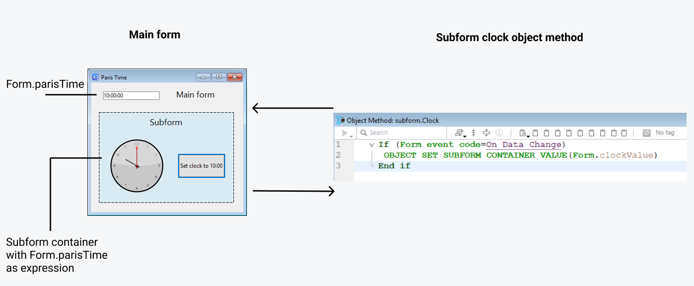

サブフォームとは、他のフォームに組み込まれるフォームのことです。


## 用語

サブフォームに実装されたコンセプトを明確に説明するために、いくつかの用語についてここで定義します:

*   **サブフォーム**: 他のフォームに組み込まれることを意図したフォーム。
*   **親フォーム**: 1つ以上のサブフォームを含むフォーム。
*   **サブフォームコンテナー**: 親フォームに組み込まれた、サブフォームのインスタンスを表示するオブジェクト。
*   **サブフォームインスタンス**: 親フォームに表示されたサブフォームの実体。 このコンセプトはとても重要です。親フォームには、同じサブフォームのインスタンスを複数表示することができるからです。
*   **リストフォーム**: データをリストとして表示するサブフォームインスタンス。
*   **詳細フォーム**: リストサブフォームをダブルクリックすることでアクセスすることができる、ページタイプの入力フォーム。


## リストサブフォーム

リストサブフォームを使うことで、他のテーブルのデータを入力、表示、および更新することができます。 通常は 1対Nリレーションが設定されたデータベースでリストサブフォームを使用します。 リレートされた 1テーブルのフォーム上のリストサブフォームでは、リレートされた Nテーブルのデータを入力・表示・更新します。 一つのフォーム上に、それぞれ異なるテーブルに属する複数のサブフォームを配置できます。 しかし、フォームの同じページ上には、同じテーブルに属するサブフォームを複数配置することはできません。

たとえば、連絡先管理データベースでは、ある連絡先のすべての電話番号を表示するためにリストサブフォームが使用されるでしょう。 連絡先テーブルの画面に電話番号が表示されますが、情報はリレートテーブルに格納されています。 1対Nリレーションを使用することで、このデータベース設計は連絡先ごとに複数の電話番号を簡単に格納できるようになっています。 自動リレーションにより、リレートされている Nテーブルへのデータ入力がプログラムなしで直接おこなうことができます。

リストサブフォームは通常 Nテーブルに結び付けられますが、それだけでなく他の任意のデータベーステーブルのレコードをサブフォームのインスタンスに表示することもできます。

また、ユーザーがリストサブフォームに直接データを入力するようにもできます。 サブフォームの設定に基づき、ユーザーがサブレコード上でダブルクリックするか、サブレコードを追加/編集するコマンドを使用すると、詳細フォームが表示されます。

> 4Dはサブレコードを管理する基本的なニーズに応える 3つの標準アクション `editSubrecord` (サブレコード編集)、`deleteSubrecord` (サブレコード削除) および `addSubrecord` (サブレコード追加) を提供しています。 フォームに複数のサブフォームインスタンスが含まれる場合、フォーカスを持っているサブフォームにアクションが適用されます。


## ページサブフォーム

ページサブフォームは、カレントサブレコードのデータや、コンテキストに基づく関連する値 (変数やピクチャーなど) を表示できます。 ページサブフォームを使用する利点の一つは、それらが高度な機能を提供したり、親フォームと相互作用したりできることです (ウィジェット)。 ページサブフォームには専用のプロパティやイベントがあり、プログラムから完全に制御することができます。

ページサブフォームは [詳細フォーム](properties_Subform.md#詳細フォーム) プロパティで指定された入力フォームを使用します。 リストサブフォームと異なり、使用されるフォームは親フォームと同じテーブルに所属していてもかまいません。 また、プロジェクトフォームを使用することもできます。 実行時、ページサブフォームは入力フォームと同じ標準の表示特性を持ちます。

> 4Dウィジェットは、ページサブフォームに基づいた定義済みの複合オブジェクトです。 詳細は専用のドキュメント [4D Widgets (ウィジェット)](https://doc.4d.com/4Dv19/4D/19/4D-Widgets.100-5462909.ja.html) を参照してください。


### バインドされた変数あるいは式の管理

サブフォームコンテナーオブジェクトには、[変数あるいは式](properties_Object.md#変数あるいは式) をバインドすることができます。 これは、親フォームとサブフォーム間で値を同期するのに便利です。

By default, 4D binds a variable or expression of [object type](properties_Object.md#expression-type) to each subform. The contents of this object can be read and/or modified from within the parent form and from the subform, allowing you to share multiple values in a local context.

- バインドするスカラー型の変数あるいは式を定義し、[On Bound Variable Change](../Events/onBoundVariableChange.md) や [On Data Change](../Events/onDataChange.md) フォームイベントが発生したときに、`OBJECT Get subform container value` や `OBJECT SET SUBFORM CONTAINER VALUE` コマンドを呼び出して値を共有します。 この方法は、単一の値を同期させるのに推奨されます。
- または、バインドされた **オブジェクト** 型の変数あるいは式を定義し、`Form` コマンドを使用してサブフォームからそのプロパティにアクセスします。 この方法は、複数の値を同期させるのに推奨されます。


### 親フォームとサブフォームの同期 (単一値)

親フォームにおいて、他のオブジェクトとサブフォームコンテナーとに同じ "変数あるいは式" を設定することで、親フォームとサブフォームのコンテキストをリンクし、洗練されたインターフェースを作成することができます。 たとえば、入力可の時間型変数が置かれている親フォームに、アナログ時計を表示するサブフォームを置くとします:


In the parent form, both objects (time variable and subform container) ***have the same value as ***Variable or Expression******. 変数 (例: `parisTime`)、あるいは式 (例: `Form.parisTime`) を設定することができます。

サブフォームにおいては、時計オブジェクトの同プロパティとして `Form.clockValue` が設定されています。


#### サブフォームの内容を更新する

ケース1: 親フォームの変数あるいは式の値が更新され、この更新をサブフォームに反映させる必要があります。

この例では、親フォームにおいて `Form.parisTime` の値がユーザー入力、あるいは動的に (たとえば `Current time` コマンドで) 12:15:00 に変更されました。 これは、サブフォームのフォームメソッドで [On Bound Variable Change](../Events/onBoundVariableChange.md) イベントをトリガーします。

以下のコードが実行されます:

```4d  
// サブフォームのフォームメソッド
If (Form event code=On Bound Variable Change) 
// 親フォーム内でバインドされた変数あるいは式が変更されました
    Form.clockValue:=OBJECT Get subform container value 
    // 親フォームのサブフォームコンテナー値を取得し、ローカルの値を同期させます
End if
```

上のコードは、サブフォームの `Form.clockValue` の値を更新します:


[On Bound Variable Change](../Events/onBoundVariableChange.md) フォームイベントは以下のときに生成されます:

- 親フォームの変数/式に値が割り当てられたとき (同じ値が再代入された場合でも) で、
- サブフォームが 0ページまたはカレントフォームページに置かれているとき。

先の例のとおり、式を直接使用するのではなく、親フォームのサブフォームコンテナーの式の値を取得する `OBJECT Get subform container value` コマンドの利用が推奨されます。 親フォームに同じサブフォームを複数配置することが可能だからです (たとえば、複数のタイムゾーンを表示するために時計を複数表示するウィンドウ)。

バインドされた変数あるいは式を変更すると、フォームイベントが発生し、親フォームとサブフォームの値を同期させることができます:

- 親フォームのサブフォームコンテナーの変数あるいは式が変更されたことをサブフォーム (のフォームメソッド) に通知するには、サブフォームの [On Bound Variable Change](../Events/onBoundVariableChange.md) フォームイベントを使用します。
- 同様に、サブフォーム内で変数あるいは式の値が変更されたことを親フォームのサブフォームコンテナーに通知するには、サブフォームの [On Data Change](../Events/onDataChange.md) フォームイベントを使用します。


#### 親フォームの内容を更新する

ケース2: サブフォームの内容が更新され、その更新を親フォームに反映させる必要があります。

サブフォーム内で、時計オブジェクトに紐づいた `Form.clockValue` 式 (時間型) の値がボタンによって変更されます。 これにより、時計オブジェクトの内部で [On Data Change](../Events/onDataChange.md) フォームイベント (当該イベントがオブジェクトに対して選択されている必要があります) がトリガーされ、親フォームの `Form.parisTime` 値を更新します。

以下のコードが実行されます:

```4d  
// サブフォームの時計オブジェクトのメソッド
If (Form event code=On Data Change) 
// 値が変化したときに
    OBJECT SET SUBFORM CONTAINER VALUE(Form.clockValue) 
    // 親フォームのサブフォームコンテナーに値をプッシュします
End if
```



サブフォームの `Form.clockValue` の値が変化するたびに、サブフォームコンテナーの `Form.parisTime` も更新されます。


> 変数あるいは式の値が複数の場所で設定されている場合、4D は最後にロードされた値を使用します。 以下のロード順が適用されます:<br /> 1 - サブフォームのオブジェクトメソッド<br /> 2 - サブフォームのフォームメソッド<br /> 3 - 親フォームのオブジェクトメソッド<br /> 4 - 親フォームのフォームメソッド


### 親フォームとサブフォームの同期 (複数値)

By default, 4D creates a variable or expression of [object type](properties_Object.md#expression-type) for a subform container, which allows you to share values in the context of the subform using the `Form` command ([see below](#using-the-subform-bound-object)). このオブジェクトの中身は親フォームおよびサブフォームから読み書き可能なため、ローカルなコンテキストにおいて複数の値を共有することができます。

親フォームのサブフォームコンテナーにバインドされたオブジェクトは、サブフォーム内では直接 `Form` コマンドによって返されます。 オブジェクトは常に参照によって渡されるため、ユーザーがサブフォーム内でプロパティ値を変更した場合には、その値は自動的にオブジェクト自身に保存され、親フォームでも利用できるようになります。 一方、ユーザーによって、あるいはプログラミングによってオブジェクトのプロパティが親フォーム内で変更された場合も、その値はサブフォーム内で自動更新されます。 つまり、イベント管理は必要ありません。

たとえば、サブフォームでは、入力は (サブフォームの) `Form` オブジェクトプロパティにバインドされています。


親フォームで、このサブフォームを 2回表示するとします。 各サブフォームコンテナーは、(親フォームの) `Form` オブジェクトのプロパティである式にバインドされています。


下のボタンは、親フォームの `Form` オブジェクトに `mother` と `father` プロパティを作成します。

```4d
// Add values ボタンのオブジェクトメソッド
Form.mother:=New object("lastname"; "Hotel"; "firstname"; "Anne")
Form.father:=New object("lastname"; "Golf"; "firstname"; "Félix")
```

フォームを実行してボタンをクリックすると、サブフォームを含め、すべての値が正しく表示されていることがわかります:


同じオブジェクトが使用されているため、親フォームまたはサブフォームで値を変更すると、もう一方のフォームでも値が自動更新されます:

 

### ポインターの使用 (互換性)

4D v19 R5 以前のバージョンでは、親フォームとサブフォーム間の同期は **ポインター** を使っておこなわれていました。 たとえば、サブフォームオブジェクトを更新するには、以下のコードを呼び出しておこえます:

```4d  
// サブフォームメソッド
If (Form event code=On Bound Variable Change) 
    ptr:=OBJECT Get pointer(Object subform container) 
    clockValue:=ptr-> 
End if
```

**この方法は互換性のために引き続きサポートされますが、サブフォームに式をバインドすることができないため、廃止予定となります。** 今後の開発では、この原則は使うべきではありません。 すべての場合において、フォームとサブフォームの値を同期させるには、[`Form` コマンド](#親フォームとサブフォームの同期-複数値) か [`OBJECT Get subform container value` と `OBJECT SET SUBFORM CONTAINER VALUE` コマンド](#親フォームとサブフォームの同期-単一値) を使用することが推奨されます。


### 高度なフォーム間通信プログラム

親フォームとサブフォームインスタンス間の通信では、バインドした変数を通して値を交換する以上のことをおこなう必要がある場合があります。 実際、親フォームでおこなわれたアクションに基づきサブフォーム中の変数を更新したり、その逆の処理をしたい場合があるでしょう。 先の "動的な時計" タイプのサブフォームの例で言えば、各時計ごとにアラーム時刻を複数設定したい場合が考えられます。

このようなニーズにこたえるため、4Dは以下のメカニズムを実装しています:

- `CALL SUBFORM CONTAINER` コマンドを使用してサブフォームからコンテナーオブジェクトを呼び出す、
- `EXECUTE METHOD IN SUBFORM` コマンドを使用してサブフォームのコンテキストでメソッドを実行する。

> `GOTO OBJECT` はサブフォームから実行されても、親フォーム内にて目的のオブジェクトを検索します。


#### CALL SUBFORM CONTAINER コマンド

`CALL SUBFORM CONTAINER` コマンドを使用すると、サブフォームインスタンスからサブフォームコンテナーオブジェクトに [イベント](../Events/overview.md) を送信できます。 イベントはコンテナーオブジェクトメソッドで受信されます。 (クリックやドラッグ＆ドロップなど) サブフォームにより検知されたすべてのイベントの発生元となりえます。

送信するイベントコードに制限はありません (たとえば 20000 や -100 など)。 既存のイベントに対応するコード (たとえば `On Validate` に対応する 3) を使用することも、カスタムコードを使用することもできます。 前者のケースでは、サブフォームコンテナーのプロパティリストでチェックを入れたイベントのみを使用できます。 後者の場合、使用するコードは既存のフォームイベントに対応してはいけません。 将来の 4Dバージョンで番号が衝突しないようにするために、負数の使用が推奨されます。

詳細は `CALL SUBFORM CONTAINER` コマンドの説明を参照してください。

#### EXECUTE METHOD IN SUBFORM コマンド

`EXECUTE METHOD IN SUBFORM` コマンドを使用すると、親フォームやそのオブジェクトから、サブフォームインスタンスのコンテキストにおけるメソッド実行をリクエストできます。これにより、サブフォームの変数やオブジェクト等にアクセスすることができます。 このメソッドは引数も受け取れます。

このメカニズムを図示すると以下のようになります:


詳細は `EXECUTE METHOD IN SUBFORM` コマンドの説明を参照してください。


## プロパティ一覧

[Border Line Style](properties_BackgroundAndBorder.md#border-line-style) - [Bottom](properties_CoordinatesAndSizing.md#bottom) - [Class](properties_Object.md#css-class) - [Detail Form](properties_Subform.md#detail-form) - [Double click on empty row](properties_Subform.md#double-click-on-empty-row) - [Double click on row](properties_Subform.md#double-click-on-row) - [Enterable in list](properties_Subform.md#enterable-in-list) - [Expression Type](properties_Object.md#expression-type) - [Focusable](properties_Entry.md#focusable) - [Height](properties_CoordinatesAndSizing.md#height) - [Hide focus rectangle](properties_Appearance.md#hide-focus-rectangle) - [Horizontal Scroll Bar](properties_Appearance.md#horizontal-scroll-bar) - [Horizontal Sizing](properties_ResizingOptions.md#horizontal-sizing) - [Left](properties_CoordinatesAndSizing.md#left) - [List Form](properties_Subform.md#list-form) - [Method](properties_Action.md#method) - [Object Name](properties_Object.md#object-name) - [Print Frame](properties_Print.md#print-frame) - [Right](properties_CoordinatesAndSizing.md#right) - [Selection mode](properties_Subform.md#selection-mode) - [Source](properties_Subform.md#source) - [Top](properties_CoordinatesAndSizing.md#top) - [Type](properties_Object.md#type) - [Variable or Expression](properties_Object.md#variable-or-expression) - [Vertical Scroll Bar](properties_Appearance.md#vertical-scroll-bar) - [Vertical Sizing](properties_ResizingOptions.md#vertical-sizing) - [Visibility](properties_Display.md#visibility) - [Width](properties_CoordinatesAndSizing.md#width) 
