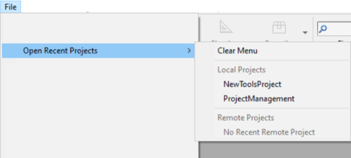

4D projects are created and developed using the **4D** application, which provides a comprehensive Integrated Development Environment (IDE). **4D Server** can also create new, empty projects.

## プロジェクトの作成

New 4D application projects can be created from **4D** or **4D Server**. いずれの場合も、プロジェクトファイルはローカルマシン上に保存します。

新規プロジェクトを作成するには:

1. 4D または 4D Server を起動します。

2. 次のいずれかの方法をおこないます:
   - Select **New > Project...** from the **File** menu: 
   - (4D only) Select **Project...** from the **New** toolbar button:

A standard **Save** dialog appears so you can choose the name and location of the 4D project's main folder.

3. Enter the name of your project folder and click **Save**. この名称はつぎの場所に使用されます:

   - プロジェクト全体を保存するフォルダーの名称
   - as the name of the .4DProject file at the first level of the ["Project" folder](../Project/architecture.md#project-folder).

OS によって許可されている名称であれば使用可能です。 しかしながら、異なる OS での使用を予定していたり、ソース管理ツールを利用したりするのであれば、それらの命名規則を考慮する必要があります。

When you validate the **Save** dialog, 4D closes the current project (if any), creates a project folder at the indicated location, and puts all files needed for the project into it. For more information, refer to [Architecture of a 4D Project](Project/architecture.md).

これで、プロジェクトの開発を始めることができます。

## プロジェクトを開く

既存のプロジェクトを 4D で開くには:

1. 次のいずれかの方法をおこないます:

   - Select **Open/Local Project...** from the **File** menu or the **Open** toolbar button.
   - Select **Open a local application project** in the Welcome Wizard dialog

標準のファイルを開くためのダイアログが表示されます。

2. Select the project's `.4dproject` file (located inside the ["Project" folder of the project](../Project/architecture.md#project-folder)) and click **Open**.

   デフォルトで、プロジェクトはカレントデータファイルとともに開かれます。 ほかにも、次のファイルタイプを選択できます:

   - _Packed project files_: `.4dz` extension  - deployment projects
   - _Shortcut files_: `.4DLink` extension - store additional parameters needed for opening projects or applications (addresses, identifiers, etc.)
   - _Binary files_: `.4db` or `.4dc` extension - legacy 4D database formats

### オプション

In addition to standard system options, the _Open_ dialog in 4D provides two menus with specific options that are available using the **Open** button and the **Data file** menu.

- **Open** - opening mode of the project:
  - **Interpreted** or **Compiled**: These options are available when the selected project contains both [interpreted and compiled code](Concepts/interpreted.md).
  - **[Maintenance Security Center](MSC/overview.md)**: Opening in secure mode allowing access to damaged projects in order to perform any necessary repairs.

- **Data file** - specifies the data file to be used with the project. By default, the **Current data file** option is selected.

## プロジェクトを開く (その他の方法)

4D では、開くダイアログを経由しなくてもプロジェクトを開くことのできる方法がいくつかあります:

- メニューを使用:
  - _Menu bar_ - **File** > **Open Recent Projects / {project name}**
  - _4D Tool bar_ -  Select the project from the menu associated with the **Open** button

- 4D 環境設定を使用:
  - Set the **At startup** general preference to **Open last used project**.

- using a `.4DLink` file.

### 4DLinkファイルを使ってプロジェクトを開く

You can use a [`.4DLink` file](#about-4DLink-files) to launch the 4D application and open the target 4D project. これをおこなうには 2つの方法があります:

- double-click or drag and drop the `.4DLink` file onto the 4D application
- go to **File** > **Open Recent Projects** and select a project

"リモートプロジェクト" タイプの .4DLinkファイルは、他のマシンにコピーして使用することができます。

> 4D と 4D Server の接続ダイアログで 4DLinkファイルを選択することもできます (ローカルプロジェクトの開始のみ)。

## 4DLinkファイルについて

Files with the `.4DLink` extension are XML files that contain parameters intended to automate and simplify opening local or remote 4D projects.

`.4DLink` files can save the address of a 4D project as well as its connection identifiers and opening mode, saving you time when opening projects.

4D automatically generates a `.4DLink` file when a local project is opened for the first time or when connecting to a server for the first time. このファイルは、次の場所にあるローカル環境設定フォルダーに置かれます:

- Windows: C:\Users\UserName\AppData\Roaming\4D\Favorites vXX\
- macOS: Users/UserName/Library/Application Support/4D/Favorites vXX/

XX はアプリケーションのバージョン番号を意味します。 たとえば、4D v19 なら "Favorites v19" となります。

このフォルダーには、2つのサブフォルダーがあります:

- the **Local** folder contains the `.4DLink` files that can be used to open local projects
- the **Remote** folder contains the `.4DLink` files of recent remote projects

`.4DLink` files can also be created with an XML editor.

4D provides a DTD describing the XML keys that can be used to build a `.4DLink` file. この DTD は database_link.dtd という名前で、4Dアプリケーションの `\Resources\DTD\` サブフォルダーにあります。
