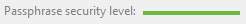

You can use this page to encrypt or _decrypt_ (i.e. remove encryption from) the data file, according to the **Encryptable** attribute status defined for each table in the database.

:::info

For detailed information about data encryption in 4D, please refer to the [Encrypting data](https://doc.4d.com/4Dv20/4D/20/Encrypting-data.300-6263735.en.html) section in the _Design Reference_ manual. You can also read the [A deeper look into 4D data encryption](https://blog.4d.com/a-deeper-look-into-4d-data-encryption/) blog post.

:::

暗号化/復号化操作をおこなうたびに、新しいフォルダーが作成されます。 It is named "Replaced Files (Encrypting) _yyyy-mm-dd hh-mm-ss_> or "Replaced Files (Decrypting) _yyyy-mm-dd hh-mm-ss_".

> Encryption is only available in [maintenance mode](overview.md#display-in-maintenance-mode). 標準モードでこの操作を実行しようとすると、警告ダイアログが表示され、アプリケーションを終了してメンテナンスモードで再起動することを知らせます。

**Warning:**

- データファイルの暗号化は時間がかかる操作です。 実行中は (ユーザーによって割り込み可能な) 進捗インジケーターが表示されます。 また、アプリケーションの暗号化操作には必ず圧縮のステップが含まれるという点に注意してください。
- 暗号化操作をおこなうたびに、その操作はデータファイルのコピーを作成し、その結果アプリケーションファイルのサイズは増大します。 アプリケーションのサイズが過剰に増加しな いよう、これを考慮することが大切です (とくに、4Dアプリケーションがパッケージとして表示される macOS の場合)。 パッケージのサイズを小さく保つには、パッケージ内オリジナルファイルのコピーを手動で削除/移動することも役立ちます。

## データを初めて暗号化する場合

MSC でデータファイルを初めて暗号化する場合、以下のような手順を踏む必要があります:

1. In the Structure editor, check the **Encryptable** attribute for each table whose data you want to encrypt. 詳細は "テーブルプロパティ" の章を参照してください。
2. MSC の暗号化ページを開きます。
   If you open the page without setting any tables as **Encryptable**, the following message is displayed in the page:
   
   Otherwise, the following message is displayed:
   

   This means that the **Encryptable** status for at least one table has been modified and the data file still has not been encrypted.
   \*\*Note: \*\*The same message is displayed when the **Encryptable** status has been modified in an already encrypted data file or after the data file has been decrypted (see below).

3. Click on the Encrypt picture button.\
   \
   You will be prompted to enter a passphrase for your data file:
   
   The passphrase is used to generate the data encryption key. パスフレーズはパスワードの強化版のようなもので、大量の文字を含めることができます。 たとえば、"We all came out to Montreux" あるいは "My 1st Great Passphrase!!" のようなパスフレーズを入力することが可能です。
   The security level indicator can help you evaluate the strength of your passphrase:
   
   (deep green is the highest level)
4. Enter を押して安全なパスフレーズの入力を確定します。

暗号化プロセスがスタートします。 MSC が標準モードで開かれていた場合、アプリケーションはメンテナンスモードで再起動されます。

4D offers to save the encryption key (see [Saving the encryption key](#saving-the-encryption-key) below). 暗号化キーの保存は、このタイミングか、あるいは後でおこなうこともできます。 また暗号化ログファイルを開くこともできます。

暗号化プロセスが正常に完了した場合、暗号化ページは <a href="#暗号化メンテナンスオペレーション">暗号化メンテナンスオペレーション</a> ボタンを表示します。

**Warning:** During the encryption operation, 4D creates a new, empty data file and fills it with data from the original data file. "暗号化可能" テーブルに属しているレコードは暗号化後にコピーされ、他のレコードは単にコピーされるだけです (圧縮オペレーションも実行されます)。 操作が正常に完了した場合、もとのデータファイルは "Replaced Files (Encrypting)" フォルダーへ移動されます。 暗号化されたデータファイルを配布する場合、暗号化されていないデーファイルをアプリケーションフォルダーからすべて移動/削除しておくようにしてください。

## 暗号化メンテナンスオペレーション

アプリケーションが暗号化されているとき (上記参照)、暗号化ページでは、標準のシナリオに対応した様々の暗号化メンテナンスオペレーションを提供します。

### カレントの暗号化キーを入力する

セキュリティ上の理由から、すべての暗号化メンテナンスオペレーションはカレントのデータ暗号化キーの入力を要求します。

- データ暗号化キーが既に 4Dキーチェーン (1) に読み込まれている場合、そのキーは 4D によって自動的に再利用されます。
- データ暗号化キーが見つからない場合、それを入力する必要があります。 The following dialog is displayed:
  

この段階では 2つの選択肢があります:

- enter the current passphrase(2) and click **OK**.
  OR
- connect a device such as a USB key and click the **Scan devices** button.

(1) 4Dキーチェーンは、アプリケーションのセッション中に入力されたすべての有効なデータ暗号化キーを保管します。\
(2) カレントのパスフレーズとは、カレントのデータ暗号化キーを生成するのに使用されたパスフレーズです。

いずれの場合においても、有効なパスフレーズ/暗号化キーが提供されると、4D は (まだメンテナンスモードではなかった場合は) メンテナンスモードで再起動し、選択されたオペレーションを実行します。

### カレントの暗号化キーでデータを再暗号化する

This operation is useful when the **Encryptable** attribute has been modified for one or more tables containing data. この場合、データの整合性を保つために、4D はアプリケーション内のそのテーブルのレコードへの書き込みアクセスを禁止します。 有効な暗号化ステータスを得るために、データの再暗号化が必要になります。

1. Click on **Re-encrypt data with the current encryption key**.
2. カレントのデータ暗号化キーを入力します。

The data file is properly re-encrypted with the current key and a confirmation message is displayed:

### パスフレーズを変更してデータを再暗号化する

この操作は、カレントの暗号化データキーを変更したい場合に有用です。 たとえば、セキュリティ上のルール (3ヶ月ごとにパスプレーズを変更する必要があるなど) を遵守するために変更をおこないたいケースが考えられます。

1. Click on **Change your passphrase and re-encrypt data**.
2. カレントのデータ暗号化キーを入力します。
3. Enter the new passphrase (for added security, you are prompted to enter it twice):
   
   The data file is encrypted with the new key and the confirmation message is displayed.
   

### 全データを復号化

この操作は、データファイルからすべての暗号化を取り除きます。 データを暗号化しておきたくない場合、以下の手順に従ってください:

1. Click on **Decrypt all data**.
2. カレントのデータ暗号化キーを入力します (<a href="#カレントの暗号化キーを入力する">カレントの暗号化キーを入力する</a> 参照)。

The data file is fully decrypted and a confirmation message is displayed:

> データファイルが復号化されると、テーブルの暗号化ステータスは暗号化可能属性と合致しなくなります。 To restore a matching status, you must deselect all **Encryptable** attributes at the database structure level.

## 暗号化キーを保存する

4D ではデータ暗号化キーを専用ファイルに保存しておくことができます。 The file name must have the `.4DKeyChain` extension, for example "myKeys.4DKeyChain". このファイルを USBキーなどの外部デバイスに保存しておくと、暗号化されたアプリケーションを使うのが簡単になります。なぜならユーザーは暗号化されたデータにアクセスするには、アプリケーションを開く前にデバイスを接続してキーを提供すればよいからです。

新しいパスフレーズが提供されるたびに暗号化キーを保存することができます:

- アプリケーションが最初に暗号化されたとき
- アプリケーションが新しいパスフレーズで再暗号化されたとき

連続した暗号化キーを同じデバイスに保存することが可能です。

:::caution

Storing the data encryption key file at the first level of the device is mandatory when you use the  [Automatic restore and log integration feature](../Backup/settings.md#automatic-restore-and-log-integration). 復元処理がトリガーされるとき、4D は暗号化キーファイルにアクセスできなくてはなりません。できない場合には、エラーが発生します。

:::

## ログファイル

暗号化オペレーションが完了すると、4D はアプリケーションの Logsフォルダー内にファイルを生成します。 It is created in XML format and named "_ApplicationName_Encrypt_Log_yyyy-mm-dd hh-mm-ss.xml_" or "_ApplicationName_Decrypt_Log_yyyy-mm-dd hh-mm-ss.xml_".

新しくログファイルが生成されるたび、MSCページに <strong x-id="1">ログファイルを開く</strong> ボタンが表示されます。

このログファイルには、暗号化/復号化プロセスの間に実行された内部オペレーションがすべて記録されているほか、エラー (あれば) が記録されています。
