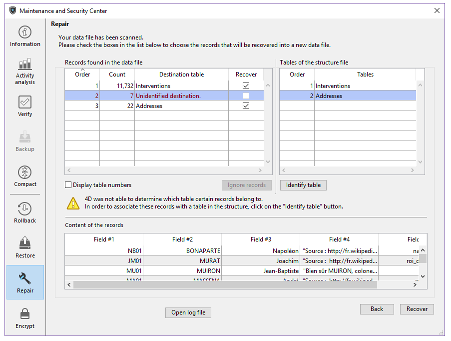

このページは、データファイルが損傷を受けたとき、それを修復するために使用します。 一般的にこれらの機能は、4Dの起動時や MSC による [検査](verify.md) の結果アプリケーションに損傷を見つけたときに、4D技術者の監督下で実行します。

**警告**: 修復操作は毎回オリジナルファイルのコピーを伴うため、アプリケーションフォルダーのサイズが大きくなります。 アプリケーションのサイズが過剰に増加しな いよう、これを考慮することが大切です (とくに、4Dアプリケーションがパッケージとして表示される macOS の場合)。 パッケージのサイズを小さく保つには、パッケージ内オリジナルファイルのコピーを手動で削除することも役立ちます。

> 修復はメンテナンスモードでのみ可能です。 標準モードでこの操作を実行しようとすると、警告ダイアログが表示され、アプリケーションを終了してメンテナンスモードで再起動することを知らせます。

> データベースが暗号化されている場合、復号化と暗号化のステップが修復過程に含まれるため、カレントデータの暗号化キーが必要になります。 有効な暗号化キーがまだ提供されていない場合、パスフレーズ、あるいは暗号化キーを要求するダイアログが表示されます (暗号化ページ参照)。

## データファイル修復

### 修復するデータ

カレントデータファイルのパス名。 **[...]** ボタンを使って、他のデータファイルを指定することができます。 このボタンをクリックすると標準のファイルを開くダイアログが表示され、修復するデータファイルを選択することができます。 [標準の修復](#標準の修復) を実行する場合、開かれたストラクチャーに対応するデータファイルを選択しなければなりません。 [レコードヘッダーによる再生](#レコードヘッダーによる再生) を実行する場合、どのデータファイルでも選択できます。 このダイアログを受け入れると、ウィンドウには修復対象のファイルのパス名が表示されます。

### オリジナルをここに移動

デフォルトで修復処理の前に元のデータファイルが複製されます。 このファイルは、アプリケーションフォルダーの "Replaced files (repairing)" サブフォルダーに配置されます。 二つ目の **[...]** ボタンを使用して、複製ファイルの保存先を変更できます。 とくに大きなデータファイルを修復する際、コピー先を別のディスクに変更するためにこのオプションを使用します。

### 修復済ファイル

4Dは元のファイルの場所に空のデータファイルを新規作成します。 元のファイルは、"\Replaced Files (Repairing) {日付} {時刻}"という名前のフォルダーがオリジナルの移動先に指定したフォルダー内に作成され (デフォルトはアプリケーションフォルダー)、そこに移動されます。 修復されたデータは、新規作成された空のファイルに格納されます。

## 標準の修復

少数のレコードやインデックスが損傷を受けているケース (アドレステーブルは損傷を受けていない) では、標準の修復を選択します。 データは圧縮および修復されます。 このタイプの修復をおこなうには、データファイルとストラクチャーファイルが対応していなければなりません。

修復操作が完了すると、MSCの "修復" ページが表示され、修復の結果が表示されます。 修復に成功していれば、その旨のメッセージが表示されます。 その場合、アプリケーションをそのまま使い始めることができます。

## レコードヘッダーによる再生

このローレベルな修復オプションは、データファイルが大きく損傷していて、バックアップの復元や標準の修復など、他の手段では回復できなかった場合にのみ使用します。

4Dのレコードはサイズが可変です。故に、そのレコードをロードするには、ディスク上のどこに格納されているか、その場所を "アドレステーブル" という専用テーブルに記録しておく必要があります。 プログラムは、インデックスやアドレステーブルを経由して、レコードのアドレスにアクセスします。 レコードやインデックスのみが損傷を受けている場合、標準の修復を使用すれば通常は問題が解決されます。 しかし、アドレステーブル自身が損傷を受けている場合には、これを再構築しなくてはならないため、より高度な修復作業が必要となります。 これをおこなうために、MSC は各レコードのヘッダーに位置するマーカーを使用します。 マーカーがレコード情報のサマリーと比較されることにより、アドレステーブルが再構築可能となります。

> ストラクチャーのテーブルプロパティで **レコードを完全に削除** オプションを解除していると、ヘッダーマーカーを使用した復旧によって削除したはずのレコードが復活する原因となります。
>
> ヘッダーによる再生において、整合性の制約は考慮されません。 この処理をおこなった後、重複不可フィールドに重複する値が現れたり、**NULL値を許可しない** に定義したフィールドに NULL値が現れたりするかもしれません。

**スキャンおよび修復...** ボタンをクリックすると、4Dはデータファイルを完全にスキャンします。 スキャンを完了すると、結果が以下のウィンドウに表示されます:

> すべてのレコードおよびすべてのテーブルに割当先が見つかった場合は、メインエリアのみが表示されます。

"データファイル中で見つかったレコード" エリアには 2つのリストがあり、データスキャン結果の概要が表示されます。

- 左のリストには、データファイルスキャンの情報が表示されます。 各行には、データファイル中の再生可能なレコードのグループが表示されます:
  - **順番** の列には、レコードグループの再生順が表示されます。
  - **カウント** 列には、グループに含まれるレコード数が表示されます。
  - **割当先テーブル** 列には、識別されたレコードのグループに割り当てられたテーブルの名前が表示されます。 割り当てられたテーブルの名前は自動で緑色で表示されます。 割り当てされなかったグループ、つまりどのレコードにも関連づけることができなかったテーブルは赤色で表示されます。
  - **再生** 列では、レコードを再生するかどうかを各グループごとに指定できます。 デフォルトで、テーブルに割り当てられるすべてのグループが選択されています。

- 右側のリストには、プロジェクトファイルのテーブルが表示されます。

### 手動による割り当て

アドレステーブルが損傷を受けているため、テーブルに割り当てることのできないレコードグループがある場合、それらを手動で割り当てることができます。
これにはまず、左側のリストの中で割り当てられていないレコードグループを選択します。 グループ先頭の複数レコードの内容が "レコードの内容" エリアにプレビューされるため、それがどのテーブルのレコードか判断しやすくなります:

次に "割り当てられていないテーブル" リストから、グループを割り当てるテーブルを選択し、**テーブルを識別** ボタンをクリックします。 割り当てのためにドラッグ＆ドロップを使用することもできます。
結果そのレコードグループは選択したテーブルに割り当てられ、そのテーブルのレコードとして再生されます。 手動で割り当てられたテーブルはリスト中黒色で表示されます。
**レコードを無視する** ボタンをクリックすると、レコードグループに対するテーブルの割り当てを手動で解除できます。

## ログファイルを開く

修復が完了すると、4D はプロジェクトの Logsフォルダーにログファイルを生成します。 このファイルを使用すると実行されたオペレーションをすべて閲覧することができます。 このファイルは XML形式で作成され、<em x-id="3">ApplicationName_Repair_Log_yyyy-mm-dd hh-mm-ss.xml</em> というファイル名がつけられます。

- _ApplicationName_ は拡張子を除いたプロジェクトファイルの名前です (例: "Invoices" 等)
- _yyyy-mm-dd hh-mm-ss_ はファイルのタイムスタンプです。これはローカルのシステム時間でメンテナンスオペレーションが開始された時刻に基づいています (例: "2019-02-11 15-20-45")。

**ログファイルを開く** ボタンをクリックすると、4Dはマシンのデフォルトブラウザーを使用して直近のログファイルを開きます。
