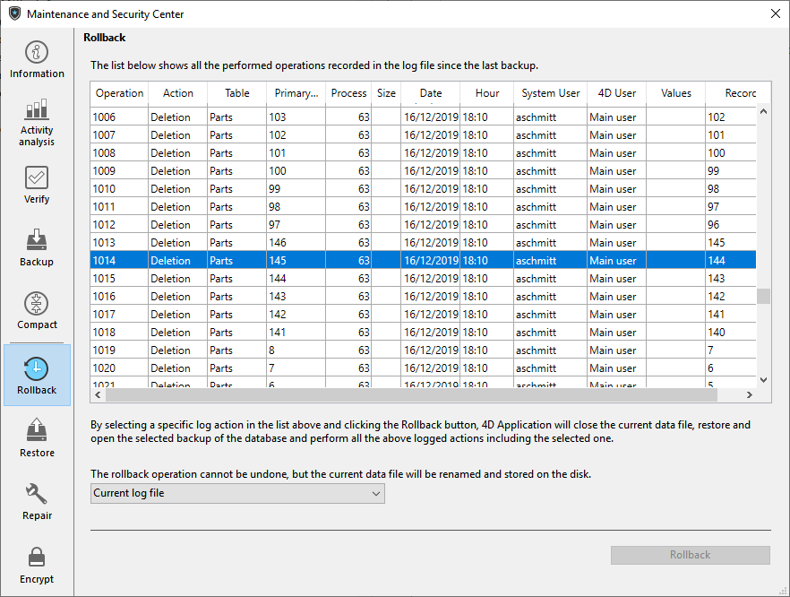
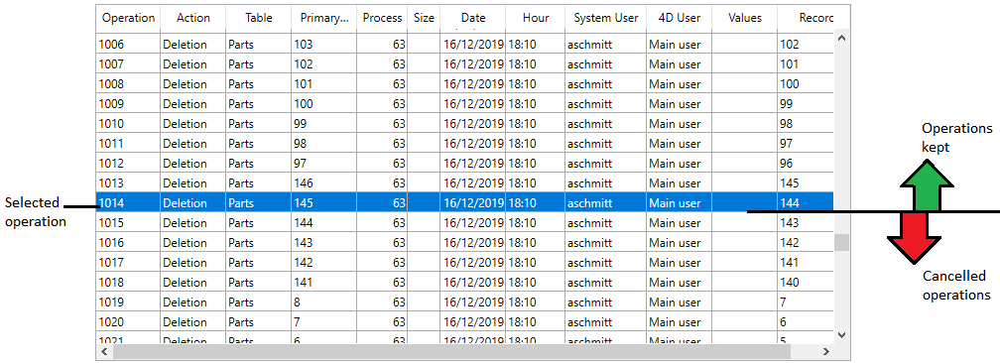

このページは、データファイルに対して実行された操作をロールバックする機能を提供します。 この機能は、複数レベルに適用された取り消し機能に似ています。 この機能はとくに、間違ってデータベースレコードを削除した場合に便利です。

この機能は、アプリケーションのログファイルが有効なときにのみ使用できます。

> データベースが暗号化されており、開かれたログファイルに対応する有効なデータキーが提供されていない場合、暗号化された値は **値** カラムには表示されません。そのような状況で **ロールバック** ボタンをクリックすると、パスフレーズまたはデータキーを要求するダイアログボックスが表示されます。

操作リストの内容と動作は [ログ解析](analysis.md) ページのものと同じです。

操作のロールバックをおこなうには、それ以降の全操作をキャンセルする行を選択します。 選択された行が保持される最後の操作になります。 たとえば削除をキャンセルしたい場合、その削除操作のひとつ前の行を選択します。 すると、削除操作とそれ以降の処理がすべてキャンセルされます。

次に、**ロールバック** ボタンをクリックします。 4Dは処理を続行してもよいか、確認してきます。 **OK** をクリックすると、データは選択された行の状態に戻ります。

アーカイブされたファイルから復旧したデータベースに対してロールバックをおこなう場合には、ウィンドウの下部にあるメニューを使用して適用するログファイルを選択できます。 この場合、アーカイブに対応するログファイルを指定しなければなりません。

ロールバックは次のように動作します: ユーザーが **ロールバック** ボタンをクリックすると、4Dはカレントデータベースを閉じ、最新のバックアップからデータベースデータの復元をおこないます。 復元されたデータベースが開かれ、4Dはログファイル中で選択された操作までを統合します。 データベースがまだ保存されていない場合、4Dは空のデータファイルを使います。
