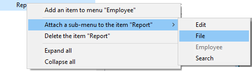

メニューおよびメニューバーを作成するには次の 2つの方法があります:

- 4Dツールボックスウィンドウのメニューエディターを使用する。 この場合、メニューとメニューバーはアプリケーションのストラクチャーに保存されます。
- "メニュー" テーマのランゲージコマンドを使用して動的におこなう。 この場合、メニューとメニューバーは保存されず、メモリ内にのみ存在します。

両方の機能を組み合わせて、メモリ内のメニューを定義するのに、ストラクチャーに作成したメニューをテンプレートとして使うこともできます。

## デフォルトメニューバー

カスタムアプリケーションには、少なくとも 1つのメニューを持つ 1つのメニューバーが必要です。 新規にプロジェクトを作成すると、4D は自動でデフォルトメニューバー (メニューバー#1) を作成します。 このデフォルトメニューバーには、標準のメニューとデザインモードに入るためのコマンドが用意されています。

このメニューが用意されているため、ユーザーはプロジェクトを起動するとすぐにアプリケーションモードを使用できます。 **実行** メニューから **アプリケーションモード** コマンドを選択すると、自動でメニューバー#1 が呼び出されます。

デフォルトメニューバーには 3つメニューがあります:

- **ファイル**: このメニューには **終了** コマンドだけが含まれています。 このコマンドには _quit_ 標準アクションが割り当てられていて、選択されるとアプリケーションが終了します。
- **編集**: 編集メニューは標準であり、内容の変更が可能です。 編集メニューのコマンド (コピーやペーストなど) は標準アクションで指定できます。
- **モード**: モードメニューにはデフォルトで、アプリケーションモードを終了するための **デザインモードに戻る** コマンドが含まれます。

> メニュータイトルはハードコードされたテキストではなく、xliff参照を使用しています。 この点については [タイトルプロパティ](properties.md#タイトル) を参照してください。

このメニューバーを必要に応じて変更したり、新しく追加したりできます。

## メニューの作成

### メニューエディターを使用する

1. 作成する対象 (メニューバーまたはメニュー) を選択し、エリアの下にある追加ボタン  をクリックします。
   または 
   リストのコンテキストメニューあるいはリストの下にあるオプションメニューから **新規メニューバー作成** または **新規メニュー作成** を選択します。
   メニューバーを作成した場合は、新しいメニューバーがリスト中に追加され、デフォルトメニュー (ファイルと編集) があらかじめ添付されています。
2. (任意) メニューバー/メニューの名前の上でダブルクリックすると、名前を編集できるモードになり、名前を変更することができます。
   または  
   ウィンドウ右の "タイトル" エリアに名前を入力します。
   メニューバー名はユニークでなければなりません。 名前には 31文字までの文字列を指定できます。 メニューのタイトルには文字列リテラルのほかに、参照も使用できます ([タイトルプロパティ](properties.md#タイトル) の説明を参照ください)。

### 4Dランゲージを使用する

`Create menu` コマンドを使って、新規メニューバーまたはメニュー参照 (_MenuRef_) をメモリ上に作成します。

メニューが _MenuRef_ 参照を使用して処理される場合、メニューとメニューバーの間に違いはありません。 両方とも項目のリストから構成されます。 それらの利用方法のみが異なります。 メニューバーの各項目は、それ自身が 1つのメニューであり、項目から構成されています。

`Create menu` で空のメニューを作成した場合には、`APPEND MENU ITEM` または `INSERT MENU ITEM` コマンドによって項目を追加していきます。また、同コマンドのソースメニューとして、メニューエディターで定義されたメニューを指定した場合には、そのコピーが新しいメニューとして作成されます。

## 項目の追加

各メニューには、メニューがクリックされたときにドロップダウン表示されるメニュー項目を作成しなければなりません。 項目を追加してメソッドや標準アクションを割り当てたり、他のメニューをサブメニューとして添付したりできます。

### メニューエディターを使用する

メニュー項目を追加するには:

1. ソースメニューリスト中で、項目を追加するメニューを選択します。
   メニューが既に項目を持っていれば、それが中央のリストに表示されます。 新しい項目を挿入するには、その上にくる項目を選択します。 ドラッグ＆ドロップ操作で、後から順番を変更することも可能です。
2. メニューエディターのオプションメニュー、またはエディターのコンテキストメニュー (中央のリスト内で右クリック) から **メニューバー/メニュー "メニュー名" に項目を追加** を選択します。
   または   中央のリストの下にある追加ボタン  をクリックします。
   項目が追加され、デフォルト名 "項目 X" が割り当てられます (X は項目の番号)。
3. 項目名の上でダブルクリックすると、名前を編集できるモードになり、名前を変更することができます。
   または  
   ウィンドウ右の "タイトル" エリアに名前を入力します。 名前には 31文字までの文字列を指定できます。 メニューのタイトルには文字列リテラルのほかに、参照も使用できます (後述参照)。

### 4Dランゲージを使用する

既存のメニュー参照にメニュー項目を挿入するには `INSERT MENU ITEM` または `APPEND MENU ITEM` コマンドを使います。

## メニューや項目の削除

### メニューエディターを使用する

メニューエディターを使って、メニューバー、メニュー、メニュー項目をいつでも削除できます。 各メニューやメニューバーは 1つの参照しか持たない点に留意してください。 あるメニューが、複数のメニューバーやメニューに添付されていた場合、そのメニューに対しておこわれた変更や削除はこのメニューのすべての他のオカレンスに対しても有効となります。 メニューを削除すると、参照だけが削除されます。 特定のメニューへの最後の参照を削除しようとすると、4Dはアラートを表示します。

メニューバー、メニュー、メニューコマンドを削除するには:

- 削除する項目を選択し、リストの下にある削除ボタン  をクリックします。
- コンテキストメニューまたはエディターのオプションメニューから **〜 を削除** コマンドを選択します。

> メニューバー#1 を削除することはできません。

### 4Dランゲージを使用する

`DELETE MENU ITEM` コマンドを使ってメニュー参照から項目を削除します。 メニュー参照をメモリからアンロードするには `RELEASE MENU` コマンドを使います。

## メニューの添付

メニューを作成したら、それをメニューバーや別のメニューに (サブメニューとして) 添付できます。

サブメニューは、テーマに基づき機能をグループ化する目的で使用されます。 サブメニューとその項目は、メニューと同じ属性 (アクション、メソッド、ショートカット、アイコン等) を持つことができます。 サブメニューの項目は元の特性やプロパティを保持し、サブメニューの動作は標準のメニューと同じです。

サブメニューのサブメニューを作成することができ、階層化に制限はありません。 しかし、インターフェース標準に沿うには、2レベルを超えるサブメニューは推奨されません。

ランタイムにおいてプログラミングによりメニューを変更した場合、そのメニューが添付されているすべてのインスタンスに変更が反映されます。

### メニューエディターを使用する

各メニューは、メニューバーあるいは別のメニューに添付できます。

- メニューバーにメニューを添付するには: メニューバーを右クリックし、**メニューバー "メニューバー名" にメニューを添付 >** を選択、そしてサブメニューから添付するメニューを選択します: 
  また、メニューバーを選択してから、リストの下にあるオプションメニューをクリックする方法もあります。
- メニューに他のメニューを添付するには: 左のリスト中でメニューを選択し、次に中央リストのメニュー項目上で右クリックし、**項目 "項目名" にサブメニューを添付 >** を選択、そしてサブメニューとして使用するメニューを選択します:\
  
  また、メニュー項目を選択してから、リストの下にあるオプションメニューをクリックする方法もあります。
  添付されたメニューはサブメニューとなります。 項目のタイトルは保持されますが (元のサブメニュー名は無視されます)、このタイトルを変更することができます。

#### メニューの分離

メニューバーからメニューを、あるいはメニューからサブメニューを分離できます。 分離されたメニューは、メニューバーやメニューから利用できなくなります。しかしメニューリストには残されます。

メニューを分離するには、中央リスト内の分離したいメニュー上で右クリックし、**メニュー "メニュー名" をメニューバー "メニューバー名" から分離** または **項目 "項目名" のサブメニューを分離** を選択します。

### 4Dランゲージを使用する

4Dランゲージにおいてはメニューとメニューバーの違いはないため、メニューおよびサブメニューの添付は同じ手順でおこないます: `APPEND MENU ITEM` コマンドの _subMenu_ パラメーターを指定して、メニューやメニューバーにメニューを添付します。
