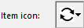

アクション、フォントスタイルや区切り線、キーボードショートカット、アイコンなど様々なメニュー項目プロパティを設定できます。

## タイトル

The **Title** property contains the label of a menu or menu item as it will be displayed on the application interface.

メニューエディターを使って、テキストリテラルを直接、ラベルとして入力することができます。 または、変数参照、xliff参照を使用することもできます。これによりアプリケーションの翻訳が容易になります。 次のの参照タイプを使用できます:

- :xliff:MyLabel という形の XLIFFリソース参照。 For more information about XLIFF references, refer to _XLIFF Architecture_ section in _4D Design Reference_.
- An interprocess variable name followed by a number, for example: `:<>vlang,3`. この変数の内容を変更すると、メニューが表示される際にラベルも変更されます。 この場合、ラベルは XLIFFリソースを呼び出します。 The value contained in the `<>vlang` variable corresponds to the _id_ attribute of the _group_ element. The second value (3 in this example) designates the _id_ attribute of the _trans-unit_ element.

Using the 4D language, you set the title property through the _itemText_ parameter of the `APPEND MENU ITEM`, `INSERT MENU ITEM`, and `SET MENU ITEM` commands.

### 制御文字の使用

メニュータイトルに制御文字 (メタ文字) を直接使用し、メニューのプロパティをいくつか設定することができます。 たとえば、メニュータイトルに "/G" という文字を入れると、キーボードショートカットである Ctrl+G (Windows) または Command+G (macOS) を割り当てることができます。

制御文字は、表示されるメニューラベルには含まれません。 したがって、制御文字として利用しない場合は、これらの文字の並びをタイトルに使用しないことが推奨されます。 制御文字には次のようなものがあります:

| 文字                   | 説明               | 効果                                                                                  |
| -------------------- | ---------------- | ----------------------------------------------------------------------------------- |
| ( | 開く括弧             | 項目を無効化                                                                              |
| \<B                  | 小なりB             | 太字                                                                                  |
| \<I                  | 小なりI             | イタリック                                                                               |
| \<U                  | 小なりU             | 下線                                                                                  |
| !文字                  | エクスクラメーションマーク+文字 | 文字をチェックマークとして追加 (macOS); チェックマークを追加 (Windows) |
| /文字                  | スラッシュ+文字         | 文字をショートカットとして追加                                                                     |

## 引数

各メニュー項目にカスタム引数を関連付けることができます。 メニュー項目の引数は、その内容を自由に設定できる文字列です。 It can be set in the Menu editor, or through the `SET MENU ITEM PARAMETER` command.

Menu item parameters are useful with programmed management of menus, in particular when using the `Dynamic pop up menu`, `Get menu item parameter` and `Get selected menu item parameter` commands.

## 動作

メニューにはプロジェクトメソッドや標準アクションを割り当てることができます。 メニュー項目が選択されると、4D は割り当てられた標準アクションまたはプロジェクトメソッドを実行します。 For example, a **Monthly Report** menu command can call a project method that prepares a monthly report from a table containing financial data. The **Cut** menu command usually calls the `cut` standard action in order to move the selection to the clipboard and erase it from the window in the foreground.

標準アクションやメソッドをメニューに割り当てていない場合、そのメニューを選択すると、4D はアプリケーション環境からデザインモードに戻ります。 デザインモードに移行できない場合は、4D を終了します。

Standard actions can be used to carry out various current operations linked to system functions (copy, quit, etc.) or to those of the database (add record, select all, etc.).

標準アクションとプロジェクトメソッドの両方をメニューに割り当てることも可能です。 この場合、標準アクションが実行されることはありません。しかし、4D はこのアクションを使用し、状況に合わせてメニューコマンドを使用可／使用不可に設定します。 メニューが使用不可の場合、割り当てられたプロジェクトメソッドは実行されません。

求める結果の種類によって、標準アクションまたはプロジェクトメソッドのいずれを割り当てるかを選択します。 原則として、標準アクションは最適化された方法で実行される (コンテキストに応じたメニューの有効/無効の自動切り替え) ため、できるだけこちらを選ぶ方が良いでしょう。

### プロジェクトメソッドまたは標準アクションの割り当て

メニューエディターにて、標準アクション/プロジェクトメソッドをメニューに割り当てることができます:

- **Method Name**: Select an existing project method name in the combo box. If the project method does not exist, enter its name in the "Method Name" combo box then click on the [...] ボタン. すると、4D はメソッド作成ダイアログボックスを表示し、コードエディターを開きます。
- **Associated Standard Action**: Choose or write the action you want to assign in the "Associated Standard Action" combo box. サポートされているアクションと引数 (任意) であれば、エリア内に入力することができます。 For a comprehensive list of standard actions, please refer to the **Standard actions** section in the _Design Reference_.
  **Note for macOS:** Under macOS, the custom menu commands associated with the _Quit_ action are automatically placed in the application menu, in compliance with the platform interface standards.

Using the 4D language, you can associate a project method using the `SET MENU ITEM METHOD` command, and a standard action using the `SET MENU ITEM PROPERTY` command.

### 新規プロセスで開始

The **Start a New Process** option is available for menu commands associated to methods. It can be set through a check box in the Menu editor, or through the _property_ parameter of the `SET MENU ITEM PROPERTY` command.

When the **Start a New Process** option is enabled, a new process is created when the menu command is chosen.
通常、メニューコマンドに割り当てたメソッドは、明示的にプログラムから新規プロセスを作成しない限り、カレントプロセスで実行されます。 The **Start a New Process** option makes it easier to start a new process. このチェックボックスを選択した場合は、このメニューコマンドを選択すると新規プロセスが作成されます。

プロセスリストにおいて、4D は "ML_プロセス番号" というフォーマットのデフォルト名を新規プロセスに割り当てます。
このように、メニューから開始されたプロセスの名前は、接頭辞 "ML_" とプロセス番号を組み合わせて設定されます。

### イベントを発生させない

The **Execute without validating** option is available for menu commands associated to standard actions in the Menu editor only.

このオプションを選択すると、4D は関連アクションを実行する前に、カーソルが置かれているフィールドの "確定 (バリデート)" をおこないません。
This option is mainly intended for **Edit** menu commands. By default, 4D processes and "validates" the contents of a field before executing a standard action (via a menu command or a shortcut), which has the effect of generating an `On Data Change` form event. This can disrupt the functioning of copy or paste type commands because when they are called, the `On Data Change` form event is generated unexpectedly. In this case, it is useful to check the **Execute without validating** option.

## アクセス権

このメニューエディターのオプションを使って、メニューコマンドにアクセスグループを設定することができます。4Dリモートアプリケーションで接続する場合、当該アクセスグループのユーザーのみがこのメニューを使うことができます (ユーザー＆グループ参照)。

## オプション

### 区切り線

メニュー内のメニューコマンドグループは区切り線を使って分割できます。 この表示方法は、機能ごとにメニューコマンドをグループ化するのに便利です。

区切り線を追加するには、専用のメニューコマンドを作成します。

In the Menu editor, instead of entering the menu command’s text in the title area, you simply select the **Separator Line** option. すると、カレントメニューバーのエリアに線が表示されます。 このオプションが選択されると、ほかのプロパティは無効になります。
**Note:** Under macOS, if you use the dash “-” as the first character of a menu item, it will appear as a separator line.

In the 4D language, you insert a separator line by entering `-` or `(-` as itemText for `APPEND MENU ITEM`, `INSERT MENU ITEM`, or `SET MENU ITEM` commands.

### ショートカット

メニューコマンドにはショートカットを割り当てることができます。 メニューコマンドにキーボードショートカットが割り当てられると、メニューを開いたときにそれがメニューコマンドの右に表示されます。 For example, "Ctrl+C" (Windows) or "Command+C" (macOS) appears next to the **Copy** menu command in the **Edit** menu.

You can also add the **Shift** key as well as the **Alt** key (Windows) or **Option** key (macOS) to the shortcut associated with a menu command. これにより使用できるショートカットの数を増やすことができます。 以下のタイプのショートカットを定義できます:

- Windows:
  - Ctrl+文字
  - Ctrl+Shift+文字
  - Ctrl+Alt+文字
  - Ctrl+Shift+Alt+文字

- macOS:
  - Command+文字
  - Command+Shift+文字
  - Command+Option+文字
  - Command+Shift+Option+文字

> 標準アクションに割り当てられたデフォルトのキーボードショートカットは変更しないことをお勧めします。

You can use any alphanumeric keys as a keyboard shortcut, except for the keys reserved by standard menu commands that appear in the **Edit** and **File** menus, and the keys reserved for 4D menu commands.

予約されている組み合わせは以下の通りです:

| キー (Windows)                  | キー (macOS)                       | 演算   |
| ------------------------------------------------ | --------------------------------------------------- | ---- |
| Ctrl+C                                           | Command+C                                           | コピー  |
| Ctrl+Q                                           | Command+Q                                           | 終了   |
| Ctrl+V                                           | Command+V                                           | ペースト |
| Ctrl+X                                           | Command+X                                           | カット  |
| Ctrl+Z                                           | Command+Z                                           | 取り消し |
| Ctrl+. (ピリオド) | Command+. (ピリオド) | 実行停止 |

メニューエディターでキーボードショートカットを割り当てるには:

キーボードショートカットを割り当てるメニュー項目を選択します。
Click on the [...] button to the right of the "Shortcut" entry area. 以下のウィンドウが表示されます:

Enter the character to use then (optional) click the **Shift** and/or **Alt** (**Option**) checkboxes according to the combination desired.
You can also directly press the keys that make up the desired combination (do not press the **Ctrl/Command** key).

> Ctrl/Command キーの選択を解除することはできません。このキーは必須です。
> To start over, click on **Clear**. Click **OK** to validate the changes. 指定したショートカットが "ショーとカット" 入力エリアに表示されます:

To assign a keyboard shortcut using the 4D language, use the `SET ITEM SHORTCUT` command.

> アクティブオブジェクトにも、キーボードショートカットを割り当てることができます。 If the **Ctrl/Command** key assignments conflict, the active object takes precedence.

### 選択可

メニューエディターにて、メニュー項目を有効として表示するか無効として表示するかを選択できます。 ユーザーは有効なメニュー項目を選択できます。無効なメニュー項目は灰色で表示され、選択することはできません。 When the **Enabled Item** check box is unchecked, the menu command appears dimmed, indicating that it cannot be chosen.

明示的に設定しない限り、4D は自動でカスタムメニュ－に追加された項目を有効にします。 You can disable an item in order, for example, to enable it only using programming with `ENABLE MENU ITEM` and `DISABLE MENU ITEM` commands.

### チェック

このオプションを使用して、メニュー項目にシステムチェックマークを関連付けることができます。 You can then manage the display of the check mark using language commands (`SET MENU ITEM MARK` and `Get menu item mark`).

通常チェックマークは連続したアクションをおこなうメニュー項目に付けられ、そのアクションを現在実行中であることを示すために使用されます。

### フォントスタイル

メニューコマンドにフォントスタイル (太字、下線、イタリック) を適用することができます。 You can customize your menus with the Bold, Italic or Underline styles through options in the Menu editor, or using the `SET MENU ITEM STYLE` language command.

一般的なルールとして、フォントスタイルの適用は慎重におこなってください。煩雑なスタイルの使用はユーザーの注意をそらし、アプリケーションの見た目を悪くします。

> You can also apply styles by inserting special characters in the menu title (see [Using control characters](properties.md#using-control-characters) above).

### 項目アイコン

メニュー項目にアイコンを関連付けることができます。 設定されたアイコンはメニューの左に表示されます:

To define the icon in the Menu editor, click on the "Item icon" area and select **Open** to open a picture from the disk. プロジェクトの Resources フォルダーに格納されていないピクチャーファイルを選択した場合、そのファイルは自動的に Resources フォルダーにコピーされます。 項目アイコンを設定すると、プレビューエリアに表示されます:

To remove the icon from the item, choose the **No Icon** option from the "Item Icon" area.

To define item icons using the 4D language, call the `SET MENU ITEM ICON` command.
