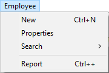
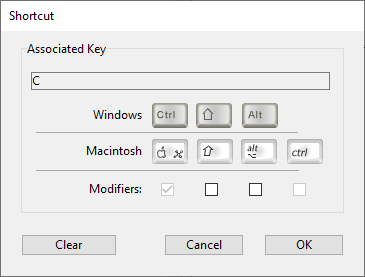
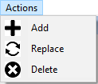

アクション、フォントスタイルや区切り線、キーボードショートカット、アイコンなど様々なメニュー項目プロパティを設定できます。

## タイトル

**タイトル** プロパティには、アプリケーションインターフェースに表示されるメニュー/メニュー項目のラベルを指定します。

メニューエディターを使って、テキストリテラルを直接、ラベルとして入力することができます。 または、変数参照、xliff参照を使用することもできます。これによりアプリケーションの翻訳が容易になります。 次のの参照タイプを使用できます:

- :xliff:MyLabel という形の XLIFFリソース参照。 XLIFF参照についての詳細は、_4D デザインリファレンス_ の [XLIFF アーキテクチャー](https://doc.4d.com/4Dv18/4D/18/Appendix-B-XLIFF-architecture.300-4575737.ja.html) の章を参照ください。
- `:<>vlang,3` という形のインタープロセス変数名と、それに続く数値。 この変数の内容を変更すると、メニューが表示される際にラベルも変更されます。 この場合、ラベルは XLIFFリソースを呼び出します。 `<>vlang` 変数に含まれる値は _group_ 要素の _id_ 属性値に対応します。 二つ目の値 (例では3) は _trans-unit_ 要素の _id_ 属性の値を指定します。

4Dランゲージを使う場合は、`APPEND MENU ITEM`、`INSERT MENU ITEM`、および `SET MENU ITEM` コマンドの _itemText_ パラメーターでタイトルプロパティを設定します。

### 制御文字の使用

メニュータイトルに制御文字 (メタ文字) を直接使用し、メニューのプロパティをいくつか設定することができます。 たとえば、メニュータイトルに "/G" という文字を入れると、キーボードショートカットである Ctrl+G (Windows) または Command+G (macOS) を割り当てることができます。

制御文字は、表示されるメニューラベルには含まれません。 したがって、制御文字として利用しない場合は、これらの文字の並びをタイトルに使用しないことが推奨されます。 制御文字には次のようなものがあります:

| 文字                          | 説明               | 効果                                                                                  |
| --------------------------- | ---------------- | ----------------------------------------------------------------------------------- |
| (        | 開く括弧             | 項目を無効化                                                                              |
| <B | 小なりB             | 太字                                                                                  |
| <I | 小なりI             | イタリック                                                                               |
| <U | 小なりU             | 下線                                                                                  |
| !文字                         | エクスクラメーションマーク+文字 | 文字をチェックマークとして追加 (macOS); チェックマークを追加 (Windows) |
| /文字                         | スラッシュ+文字         | 文字をショートカットとして追加                                                                     |

## 引数

各メニュー項目にカスタム引数を関連付けることができます。 メニュー項目の引数は、その内容を自由に設定できる文字列です。 メニュエディターで設定するほかに、`SET MENU ITEM PARAMETER` コマンドを使う方法もあります。

メニュー項目の引数は、とくに `Dynamic pop up menu`、`Get menu item parameter`、そして `Get selected menu item parameter` コマンドを使用する際など、メニューをプログラムで管理するのに便利です。

## 動作

メニューにはプロジェクトメソッドや標準アクションを割り当てることができます。 メニュー項目が選択されると、4D は割り当てられた標準アクションまたはプロジェクトメソッドを実行します。 例えば、**月次報告書** メニューコマンドを設定し、財務データを格納したテーブルをもとに月次報告書を作成するプロジェクトメソッドを呼び出すことができます。 **カット** メニューコマンドは、`cut` 標準アクションを呼び出して、選択項目をクリップボードへ移動し、それを前面にあるウインドウから消去します。

標準アクションやメソッドをメニューに割り当てていない場合、そのメニューを選択すると、4D はアプリケーション環境からデザインモードに戻ります。 デザインモードに移行できない場合は、4D を終了します。

標準アクションは、システム機能に関連した操作 (コピー、終了、等) や、 データベースに関連した操作 (レコード追加、全選択、等) を実行するのに使用します。

標準アクションとプロジェクトメソッドの両方をメニューに割り当てることも可能です。 この場合、標準アクションが実行されることはありません。しかし、4D はこのアクションを使用し、状況に合わせてメニューコマンドを使用可／使用不可に設定します。 メニューが使用不可の場合、割り当てられたプロジェクトメソッドは実行されません。

求める結果の種類によって、標準アクションまたはプロジェクトメソッドのいずれを割り当てるかを選択します。 原則として、標準アクションは最適化された方法で実行される (コンテキストに応じたメニューの有効/無効の自動切り替え) ため、できるだけこちらを選ぶ方が良いでしょう。

### プロジェクトメソッドまたは標準アクションの割り当て

メニューエディターにて、標準アクション/プロジェクトメソッドをメニューに割り当てることができます:

- **メソッド名**: 既存のプロジェクトメソッドをコンボボックスで選択します。 プロジェクトメソッドがまだ存在しない場合、"メソッド名" コンボボックスにメソッド名を入力し、[...]  ボタンをクリックします。 すると、4D はメソッド作成ダイアログボックスを表示し、コードエディターを開きます。
- **標準アクション**: 割り当てたいアクションを "標準アクション" コンボボックスから選択するか、記述します。 サポートされているアクションと引数 (任意) であれば、エリア内に入力することができます。 標準アクションの一覧については、_デザインリファレンス_ の [標準アクション](https://doc.4d.com/4Dv18/4D/18/Standard-actions.300-4575620.ja.html) を参照してください。
  **macOS に関する注記:** macOS の場合、プラットフォームインタフェース標準に合わせるために、_quit_ (終了) アクションが割り当てられたカスタムメニューコマンドは自動でアプリケーションメニュー内に置かれます。

4Dランゲージで割り当てをおこなう場合、プロジェクトメソッドには `SET MENU ITEM METHOD` コマンド、標準アクションには `SET MENU ITEM PROPERTY` コマンドを使います。

### 新規プロセスで開始

メソッドを割り当てたメニューの場合、**新規プロセスで開始** オプションが利用可能です。 このオプションは、メニューエディターのチェックボックスによって設定するほかに、`SET MENU ITEM PROPERTY` コマンドに _property_ 引数を渡して設定することもできます。

**新規プロセスで開始** チェックボックスを選択した場合、4D はそのメニューコマンドが選択されると新しいプロセスを作成します。
通常、メニューコマンドに割り当てたメソッドは、明示的にプログラムから新規プロセスを作成しない限り、カレントプロセスで実行されます。 **新規プロセスで開始** チェックボックスを選択すると、新規プロセスを簡単に開始することができます。 このチェックボックスを選択した場合は、このメニューコマンドを選択すると新規プロセスが作成されます。

プロセスリストにおいて、4D は "ML_プロセス番号" というフォーマットのデフォルト名を新規プロセスに割り当てます。
このように、メニューから開始されたプロセスの名前は、接頭辞 "ML_" とプロセス番号を組み合わせて設定されます。

### イベントを発生させない

標準アクションを割り当てたメニューの場合、**イベントを発生させない** オプションがメニューエディター内で利用可能です。

このオプションを選択すると、4D は関連アクションを実行する前に、カーソルが置かれているフィールドの "確定 (バリデート)" をおこないません。
このオプションは主に **編集** メニューコマンドに使用されます。 デフォルトでは、4D はフィールド内容を処理し、"確定" してから、標準アクションを実行します (メニューコマンドやショートカットを使用)。これにより、`On Data Change` フォームイベントが発生します。 しかし、コピー＆ペーストタイプのコマンドの場合、コマンドを呼び出すたびに `On Data Change` フォームイベントが予想外に生成されてしまい、処理に差し支える可能性があります。 その場合は、**イベントを発生させない** オプションを選択するのが有効です。

## アクセス権

このメニューエディターのオプションを使って、メニューコマンドにアクセスグループを設定することができます。4Dリモートアプリケーションで接続する場合、当該アクセスグループのユーザーのみがこのメニューを使うことができます (ユーザー＆グループ参照)。

## オプション

### 区切り線

メニュー内のメニューコマンドグループは区切り線を使って分割できます。 この表示方法は、機能ごとにメニューコマンドをグループ化するのに便利です。

区切り線を追加するには、専用のメニューコマンドを作成します。

メニューエディターでは、メニューのタイトルエリアにテキストを入力する代わりに、**区切り線** オプションを選択します。 すると、カレントメニューバーのエリアに線が表示されます。 このオプションが選択されると、ほかのプロパティは無効になります。
**注:** macOS ではメニュー項目タイトルの一文字目を "-" にすると、その行が区切り線になります。

4Dランゲージを使う場合は、`APPEND MENU ITEM`、`INSERT MENU ITEM`、または `SET MENU ITEM` コマンドの itemText パラメーターに `-` あるいは `(-` を受け渡します。

### ショートカット

メニューコマンドにはショートカットを割り当てることができます。 メニューコマンドにキーボードショートカットが割り当てられると、メニューを開いたときにそれがメニューコマンドの右に表示されます。 たとえば、編集メニューのコピーコマンドの右に "Ctrl+C" (Windows) または "Command+C" (macOS) と表示されます。

ショートカットには **Shift** や **Alt** (Windows) または **Option** (macOS) キーを追加できます。 これにより使用できるショートカットの数を増やすことができます。 以下のタイプのショートカットを定義できます:

- Windows:
  - Ctrl+文字
  - Ctrl+Shift+文字
  - Ctrl+Alt+文字
  - Ctrl+Shift+Alt+文字

- macOS:
  - Command+文字
  - Command+Shift+文字
  - Command+Option+文字
  - Command+Shift+Option+文字

> 標準アクションに割り当てられたデフォルトのキーボードショートカットは変更しないことをお勧めします。

**ファイル** や **編集** メニュー、および 4D のメニューコマンドに予約されている標準メニューのショートカットを除き、すべての英数字をキーボードショートカット文字として使用できます。

予約されている組み合わせは以下の通りです:

| キー (Windows)                  | キー (macOS)                       | 演算   |
| ------------------------------------------------ | --------------------------------------------------- | ---- |
| Ctrl+C                                           | Command+C                                           | コピー  |
| Ctrl+Q                                           | Command+Q                                           | 終了   |
| Ctrl+V                                           | Command+V                                           | ペースト |
| Ctrl+X                                           | Command+X                                           | カット  |
| Ctrl+Z                                           | Command+Z                                           | 取り消し |
| Ctrl+. (ピリオド) | Command+. (ピリオド) | 実行停止 |

メニューエディターでキーボードショートカットを割り当てるには:

キーボードショートカットを割り当てるメニュー項目を選択します。
"ショートカット" 入力エリアの [...]  ボタンをクリックします。 以下のウィンドウが表示されます:

文字を入力し、(必要であれば) **Shift** そして **Alt** (**Option**) チェックボックスを選択します。
指定する組み合わせのキーを押すと、押したキーがウィンドウに反映されます (このときには **Ctrl/Command** キーは押しません)。

> Ctrl/Command キーの選択を解除することはできません。このキーは必須です。
> 内容を消去するには **クリア** をクリックします。 **OK** をクリックすると、内容を確定してウィンドウを閉じます。 指定したショートカットが "ショーとカット" 入力エリアに表示されます:

4Dランゲージでキーボードショートカットを割り当てるには、`SET ITEM SHORTCUT` コマンドを使います。

> アクティブオブジェクトにも、キーボードショートカットを割り当てることができます。 **Ctrl/Command** キーの割り当てが衝突した場合、アクティブオブジェクトが優先されます。

### 選択可

メニューエディターにて、メニュー項目を有効として表示するか無効として表示するかを選択できます。 ユーザーは有効なメニュー項目を選択できます。無効なメニュー項目は灰色で表示され、選択することはできません。 **選択可** チェックボックスの選択が解除されていると、メニューコマンドは灰色で表示され、選択することができません。

明示的に設定しない限り、4D は自動でカスタムメニュ－に追加された項目を有効にします。 たとえば、特定の条件下で `ENABLE MENU ITEM` コマンドを使用して有効化するために、初期状態を無効にすることができます (無効化には `DISABLE MENU ITEM` コマンドを使います)。

### チェック

このオプションを使用して、メニュー項目にシステムチェックマークを関連付けることができます。 その後チェックマークの表示をランゲージコマンド (`SET MENU ITEM MARK` や `Get menu item mark`) で制御できます。

通常チェックマークは連続したアクションをおこなうメニュー項目に付けられ、そのアクションを現在実行中であることを示すために使用されます。

### フォントスタイル

メニューコマンドにフォントスタイル (太字、下線、イタリック) を適用することができます。 メニューエディターのオプションを使用して、または `SET MENU ITEM STYLE` ランゲージコマンドを使って、メニューのスタイルを太字・イタリック・下線でカスタマイズすることができます。

一般的なルールとして、フォントスタイルの適用は慎重におこなってください。煩雑なスタイルの使用はユーザーの注意をそらし、アプリケーションの見た目を悪くします。

> メニュータイトルに制御文字を挿入してスタイルを管理することもできます ([制御文字の使用](properties.md#制御文字の使用) 参照)。

### 項目アイコン

メニュー項目にアイコンを関連付けることができます。 設定されたアイコンはメニューの左に表示されます:

メニューエディターでアイコンを設定するには、"項目アイコン" エリアをクリックし、**開く** を選択してディスクからピクチャーを開きます。 プロジェクトの Resources フォルダーに格納されていないピクチャーファイルを選択した場合、そのファイルは自動的に Resources フォルダーにコピーされます。 項目アイコンを設定すると、プレビューエリアに表示されます:

項目からアイコンを取り除くには、"項目アイコン" エリアのメニューから **アイコンなし** を選択します。

4Dランゲージを使って項目アイコンを設定するには、`SET MENU ITEM ICON` コマンドを使います。
