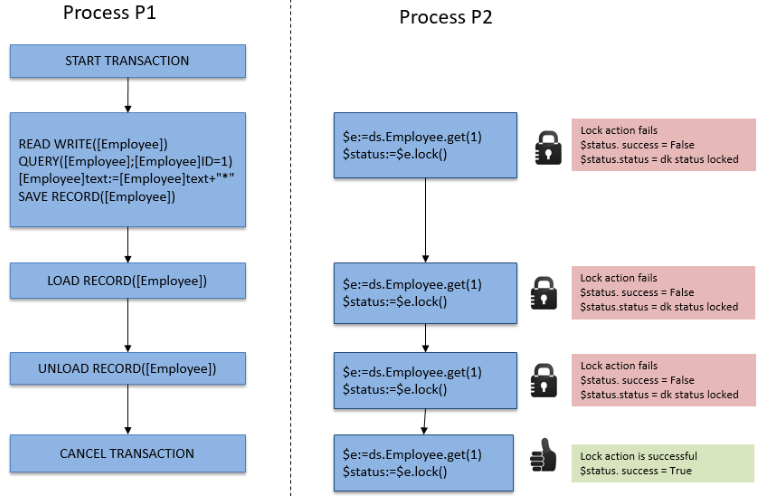

In ORDA, you access data through [entities](dsMapping.md#entity) and [entity selections](dsMapping.md#entity-selection). これらのオブジェクトを使って、データストアのデータを作成・更新・クエリ・ソートすることができます。

## エンティティの作成

データクラス内に新しいエンティティを作成する方法は二つあります:

- Since entities are references to database records, you can create entities by creating records using the 4D language and then reference them with ORDA functions such as [`entity.next()`](../API/EntityClass.md#next) or [`entitySelection.first()`](../API/EntitySelectionClass.md#first).
- You can also create an entity using the [`dataClass.new()`](../API/DataClassClass.md#new) function.

エンティティはメモリ内にしか作成されないという点に注意してください。 If you want to add it to the datastore, you must call the [`entity.save()`](../API/EntityClass.md#save) function.

エンティティ属性は、エンティティオブジェクトのプロパティとして直接利用可能です。 For more information, please refer to [Using entity attributes](#using-entity-attributes).

たとえば、カレントデータストア内の "Employee" データクラスに新しいエンティティを作成し、firstname と name 属性に "John" と "Dupont" を割り当てたい場合を考えます:

```4d
var $myEntity : cs.EmployeeEntity
$myEntity:=ds.Employee.new() // エンティティ型の新規オブジェクトを作成します
$myEntity.name:="Dupont" // 'Dupont' を 'name' 属性に代入します
$myEntity.firstname:="John" // 'John' を 'firstname' 属性に代入します
$myEntity.save() // エンティティを保存します
```

> エンティティは、それが作成されたプロセス内でのみ定義されます。 そのため、たとえばエンティティへの参照を、インタープロセス変数内に保存して他のプロセスで使用する、といったことはできません。

## エンティティと参照

エンティティには、4Dレコードへの参照が格納されています。 異なるエンティティが同じ 4Dレコードを参照することもあり得ます。 また、エンティティは 4Dオブジェクト変数に保存可能であることから、異なる変数が同じエンティティへの参照を格納していることもあり得ます。

以下のコードを実行した場合:

```4d
 var $e1; $e2 : cs.EmployeeEntity
 $e1:=ds.Employee.get(1) //access the employee with ID 1
 $e2:=$e1
 $e1.name:="Hammer"
  //both variables $e1 and $e2 share the reference to the same entity
  //$e2.name contains "Hammer"
```

これは以下のように図解することができます:


次に、以下のコードを実行した場合:

```4d
 var $e1; $e2 : cs.EmployeeEntity
 $e1:=ds.Employee.get(1)
 $e2:=ds.Employee.get(1)
 $e1.name:="Hammer"
  //variable $e1 contains a reference to an entity
  //variable $e2 contains another reference to another entity
  //$e2.name contains "smith"
```

これは以下のように図解することができます:


しかし、両方のエンティティが同じレコードを参照していることに注意してください。 In all cases, if you call the `entity.save( )` method, the record will be updated (except in case of conflict, see [Entity locking](#entity-locking)).

In fact, `$e1` and `$e2` are not the entity itself, but a reference to the entity. これはつまり、どのような関数やメソッドにも直接受け渡すことができ、ポインターのように振る舞うということです。そしてこれは 4Dポインターよりもずっと高速です。 例:

```4d
 For each($entity;$selection)
    do_Capitalize($entity)
 End for each
```

そして do_Capitalize メソッドが以下のような形であった場合:

```4d
 $entity:=$1
 $name:=$entity.lastname
 If(Not($name=Null))
    $name:=Uppercase(Substring($name;1;1))+Lowercase(Substring($name;2))
 End if
 $entity.lastname:=$name
```

You can handle entities like any other object in 4D and pass their references directly as [parameters](Concepts/parameters.md).

:::info

エンティティでは、4Dランゲージのような "カレントレコード" という概念はありません。 エンティティは、いくつでも必要な数を同時に使用することができます。 There is also no automatic lock on an entity (see [Entity locking](#entity-locking)). When an entity is loaded, it uses the [lazy loading](glossary.md#lazy-loading) mechanism, which means that only the needed information is loaded. いずれにせよ、クライアント/サーバーでは必要であればエンティティを直接自動的に読み込むことも可能です。

:::

## エンティティ属性の使用

エンティティ属性はデータを保存し、対応するテーブルの対応するフィールドをマップします。

- attributes of the **storage** kind can be set or get as simple properties of the entity object,
- attributes of the **relatedEntity** kind will return an entity,
- attributes of the **relatedEntities** kind will return an entity selection,
- attributes of the **computed** and **alias** kind can return any type of data, depending on how they are configured.

:::info

For more information on the attribute kind, please refer to the [Storage and Relation attributes](dsMapping.md#storage-and-relation-attributes) paragraph.

:::

たとえば、文字列型のストレージ属性を取得・設定するためには:

```4d
 $entity:=ds.Employee.get(1) // ID1 の社員エンティティを取得します
 $name:=$entity.lastname // 社員のラストネームを取得します。 例: "Smith"
 $entity.lastname:="Jones" // 社員のラストネームを変更します
 $entity.save() // 変更を保存します
```

> Database Blob fields ([scalar blobs](Concepts/dt_blob.md) are automatically converted to and from blob object attributes ([`4D.Blob`](Concepts/dt_blob.md)) when handled through ORDA. BLOBオブジェクト属性を保存する際には、(利用可能なメモリによってのみサイズ制限される BLOBオブジェクトとは異なり) BLOBフィールドのサイズが 2GB に制限されることに注意してください。

リレート属性にアクセスできるかどうかは、属性の型によります。 たとえば、以下のようなストラクチャーがあるとき:


リレートされたオブジェクトを通してデータにアクセスすることができます:

```4d
 $entity:=ds.Project.all().first().theClient // 先頭プロジェクトに関連する Company エンティティを取得します
 $EntitySel:=ds.Company.all().first().companyProjects // 先頭の会社に関連する Project エンティティセレクションを取得します
```

Note that both _theClient_ and _companyProjects_ in the above example are primary relation attributes and represent a direct relationship between the two dataclasses. しかしながら、複数のレベルのリレーションを通したパスに基づいてリレーション属性をビルドすることも可能です(循環参照含む)。 たとえば、以下のようなストラクチャーの場合を考えます:


社員はそれぞれマネージャーにもなりえますし、マネージャーを持つこともできます。 ある社員のマネージャーのマネージャーを取得したい場合、以下のように書くことができます:

```4d
 $myEmp:=ds.Employee.get(50)
 $manLev2:=$myEmp.manager.manager.lastname
```

### ピクチャーまたは Blob属性にファイルを代入する

ピクチャー属性には画像を格納することができます。同様に、任意のバイナリデータを Blob属性に格納することができます。

ORDA lets you assign either the data itself, i.e. an image or a blob object, or a **reference to a file** containing the data to the attribute. この場合、エンティティにはファイルパスのみが保存されます。

この機能により、同じ画像を複製せずに複数のエンティティで利用できるほか、好きなようにファイルを整理したり、4D の外でファイルを使用したりできます。 また、データファイルのサイズを管理するのにも役立ちます。

ファイルの参照として使用できるのは以下のいずれかです:

- 4D.File オブジェクト
- POSIX 形式のパス

例:

```4d
Function createCompany($name : Text; $logo : 4D.File)

	var $company : cs.CompanyEntity
	$company:=ds.Company.new()

	$company.name:=$name
		//assignment using a file object
	$company.logo:=$logo
		//assignment using a path
	$company.datablob:="/RESOURCES/"+$name+"/data.bin"
	$company.save()
```

属性への代入がどのようにされたか (データそのもの、またはファイルの参照) にかかわらず、属性に対する読み取りアクセスはユーザーにとって透過的です。

代入時にファイルがディスク上に存在する必要はありません (この場合にエラーは返されません)。 属性の読み取り時に参照されたファイルが見つからない場合には、null値が返されます。

:::tip

4D は画像やデータをローカルキャッシュに読み込みます。 読み込み後に参照ファイルが変更された場合、アプリケーションで変更を反映するにはファイルを再代入する必要があります。

:::

:::note

ファイル参照の代入はローカルモード (4D Server または 4Dシングルユーザー) でのみサポートされています。 リモートで、または RESTリクエストを介して代入を行うと、エラーが生成されます。

:::

### リレーション属性への値の代入

ORDAアーキテクチャーでは、リレーション属性はエンティティにリレートされたデータを直接格納します:

- An N->1 type relation attribute (**relatedEntity** kind) contains an entity
- A 1->N type relation attribute (**relatedEntities** kind) contains an entity selection

以下の (単純化された) ストラクチャーを見てみましょう:


この例では、"Employee" データクラスに属するエンティティの "employer" 属性には、エンティティ型のオブジェクト (あるいは null値) が格納されます。 "Company" データクラスに属するエンティティの "staff" 属性には、エンティティセレクション型のオブジェクト (あるいは null値) が格納されます。

> ORDAでは、リレーションの自動あるいは手動プロパティは何の効力も持ちません。

"employer" 属性に直接値を代入したい場合には、"Company" データクラスの既存エンティティを渡す必要があります。 例:

```4d
 $emp:=ds.Employee.new() // 新規の社員エンティティを作成します
 $emp.lastname:="Smith" // 属性に値を代入します
 $emp.employer:=ds.Company.query("name =:1";"4D")[0]  // リレーション属性に会社エンティティを代入します
 $emp.save()
```

また、主キー値 (Number または Text) を通して "1"側のリレートエンティティを直接取得することもできます。 例:

```4d
 $emp:=ds.Employee.new()
 $emp.lastname:="Wesson"
 $emp.employer:=ds.Company.get(2)
  // 主キーの値が 2 の Company エンティティを取得し
  // employer 属性に代入します
 $emp.save()
```

これはとくに、リレーショナルデータベースから大量のデータを読み込むときに有用です。 このような読み込みでは通常 "ID" カラムが含まれており、これはリレーション属性に直接割り当て可能なプライマリーキーを参照しています。

"N" データクラス側のリレーション属性を通して、"1" リレートエンティティの属性値を、直接代入・変更することができます。 たとえば、Employee エンティティにリレートされている Company エンティティの name 属性を変更したい場合、以下のように書くことができます:

```code4d
 $emp:=ds.Employee.get(2) // load the Employee entity with primary key 2
 $emp.employer.name:="4D, Inc." //modify the name attribute of the related Company
 $emp.employer.save() //save the related attribute
  //the related entity is updated
```

## エンティティセレクションの作成

You can create an object of type [entity selection](dsMapping.md#entity-selection) as follows:

- Querying the entities [in a dataclass](API/DataClassClass.md#query) or in an [existing entity selection](API/EntitySelectionClass.md#query);
- Using the [`.all()`](API/DataClassClass.md#all) dataclass function to select all the entities in a dataclass;
- Using the [`Create entity selection`](../API/EntitySelectionClass.md#create-entity-selection) command or the [`.newSelection()`](API/DataClassClass.md#newselection) dataclass function to create a blank entity selection;
- Using the [`.copy()`](API/EntitySelectionClass.md#copy) function to duplicate an existing entity selection;
- Using one of the various functions from the [Entity selection class](API/EntitySelectionClass.md) that returns a new entity selection, such as [`.or()`](API/EntitySelectionClass.md#or);
- "リレートエンティティズ" 型のリレーション属性を使用する (以下参照)

データクラスに対して、異なるエンティティセレクションを好きなだけ同時に作成し、使用することができます。 エンティティセレクションは、エンティティへの参照を格納しているに過ぎないという点に注意してください。 異なるエンティティセレクションが同じエンティティへの参照を格納することも可能です。

:::note

You can filter which entities must be included in entity selections for a dataclass depending on any business rules, thanks to the [restricted entity selection](#restricting-entity-selections) feature.

:::

### 共有可能/追加可能なエンティティセレクション

An entity selection can be **shareable** (readable by multiple processes, but not alterable after creation) or **alterable** (supports the [`.add()`](API/EntitySelectionClass.md#add) function, but only usable by the current process).

#### プロパティ

A **shareable** entity selection has the following characteristics:

- 共有オブジェクトまたは共有コレクションに保存することが可能で、複数のプロセス間あるいはワーカー間で引数として受け渡しすることができます。
- it can be stored in several shared objects or collections, or in a shared object or collection which already belongs to a group (it does not have a _locking identifier_);
- 新たにエンティティを追加することはできません。 共有可能なエンティティセレクションに対してエンティティを追加しようとした場合、エラーがトリガーされます (エラー1637 - このエンティティセレクションは編集不可です)。 To add an entity to a shareable entity selection, you must first transform it into a non-shareable entity selection using the [`.copy()`](API/EntitySelectionClass.md#copy) function, before calling [`.add()`](API/EntitySelectionClass.md#add).

> Most entity selection functions (such as [`.slice()`](API/EntitySelectionClass.md#slice), [`.and()`](API/EntitySelectionClass.md#and)...) support shareable entity selections since they do not need to alter the original entity selection (they return a new one).

An **alterable** entity selection has the following characteristics:

- プロセス間での共有はできません。また共有オブジェクト/コレクションへの保存もできません。 共有不可のエンティティセレクションを共有オブジェクト/コレクションに保存しようとした場合、エラーがトリガーされます (エラー -10721 - 共有オブジェクトまたはコレクションにおいてサポートされる値の型ではありません)。
- it accepts the addition of new entities, i.e. it is supports the [`.add()`](API/EntitySelectionClass.md#add) function.

#### 共有可能/追加可能エンティティセレクションの定義

The **shareable** or **alterable** nature of an entity selection is defined when the entity selection is created (it cannot be modified afterwards). You can know the nature of an entity selection using the [.isAlterable()](API/EntitySelectionClass.md#isalterable) function or the `OB Is shared` command.

A new entity selection is **shareable** in the following cases:

- the new entity selection results from an ORDA class function applied to a dataClass: [dataClass.all()](API/DataClassClass.md#all), [dataClass.fromCollection()](API/DataClassClass.md#fromcollection), [dataClass.query()](API/DataClassClass.md#query),
- the new entity selection is based upon a relation [entity._attributeName_](API/EntityClass.md#attributename) (e.g. "company.employees") when _attributeName_ is a one-to-many related attribute but the entity does not belong to an entity selection.
- the new entity selection is explicitely copied as shareable with [entitySelection.copy()](API/EntitySelectionClass.md#copy) or `OB Copy` (i.e. with the `ck shared` option).

例:

```4d
var $myComp : cs.CompanyEntity
var $employees : cs.EmployeeSelection
$myComp:=ds.Company.get(2) // $myComp はエンティティセレクションに属していません
$employees:=$myComp.employees // $employees は共有可能です
```

A new entity selection is **alterable** in the following cases:

- the new entity selection created blank using the [dataClass.newSelection()](API/DataClassClass.md#newselection) function or `Create entity selection` command,
- the new entity selection is explicitely copied as alterable with [entitySelection.copy()](API/EntitySelectionClass.md#copy) or `OB Copy` (i.e. without the `ck shared` option).

例:

```4d
var $toModify : cs.CompanySelection
$toModify:=ds.Company.all().copy() // $toModify は追加可能です
```

A new entity selection **inherits** from the original entity selection nature in the following cases:

- the new entity selection results from one of the various ORDA class functions applied to an existing entity selection ([.query()](API/EntitySelectionClass.md#query), [.slice()](API/EntitySelectionClass.md#slice), etc.) 。
- リレーションに基づいて生成された場合:
  - [entity._attributeName_](API/EntityClass.md#attributename) (e.g. "company.employees") when _attributeName_ is a one-to-many related attribute and the entity belongs to an entity selection (same nature as [.getSelection()](API/EntityClass.md#getselection) entity selection),
  - [entitySelection._attributeName_](API/EntitySelectionClass.md#attributename) (e.g. "employees.employer") when _attributeName_ is a related attribute (same nature as the entity selection),
  - [.extract()](API/EntitySelectionClass.md#extract) when the resulting collection contains entity selections (same nature as the entity selection).

例:

```4d
var $highSal; $lowSal : cs.EmployeeSelection
var $comp; $comp2 : cs.Company

$highSal:=ds.Employee.query("salary >= :1"; 1000000)   

	//$highSal is shareable because of the query on dataClass
$comp:=$highSal.employer //$comp is shareable because $highSal is shareable

$lowSal:=ds.Employee.query("salary <= :1"; 10000).copy()
	//$lowSal is alterable because of the copy()
$comp2:=$lowSal.employer //$comp2 is alterable because $lowSal is alterable
```

:::note Entity selections returned from the server

In client/server architecture, entity selections returned from the server are always shareable on the client, even if [`copy()`](API/EntitySelectionClass.md#copy) was called on the server. To make such an entity selection alterable on the client, you need to execute [`copy()`](API/EntitySelectionClass.md#copy) on the client side. 例:

```4d
	//a function is always executed on the server
exposed Function getSome() : cs.MembersSelection
    return This.query("ID >= :1"; 15).orderBy("ID ASC")

	//in a method, executes on the remote side
var $result : cs.MembersSelection
var $alterable : Boolean
$result:=ds.Members.getSome() //$result is shareable
$alterable:=$result.isAlterable() //False

$result:=ds.Members.getSome().copy() // $result is now alterable
$alterable:=$result.isAlterable() // True
```

:::

#### プロセス間のエンティティセレクションの共有 (例題)

二つのエンティティセレクションを使用し、それらをワーカープロセスに渡して適切な相手にメールを送信したい場合を考えます:

```4d

var $paid; $unpaid : cs.InvoicesSelection
//We get entity selections for paid and unpaid invoices
$paid:=ds.Invoices.query("status=:1"; "Paid")
$unpaid:=ds.Invoices.query("status=:1"; "Unpaid")

//We pass entity selection references as parameters to the worker
CALL WORKER("mailing"; "sendMails"; $paid; $unpaid)

```

The `sendMails` method:

```4d

 #DECLARE ($paid : cs.InvoicesSelection; $unpaid : cs.InvoicesSelection)
 var $invoice : cs.InvoicesEntity

 var $server; $transporter; $email; $status : Object

  //Prepare emails
 $server:=New object()
 $server.host:="exchange.company.com"
 $server.user:="myName@company.com"
 $server.password:="my!!password"
 $transporter:=SMTP New transporter($server)
 $email:=New object()
 $email.from:="myName@company.com"

  //Loops on entity selections
 For each($invoice;$paid)
    $email.to:=$invoice.customer.address // email address of the customer
    $email.subject:="Payment OK for invoice # "+String($invoice.number)

    $status:=$transporter.send($email)
 End for each

 For each($invoice;$unpaid)
    $email.to:=$invoice.customer.address // email address of the customer
    $email.subject:="Please pay invoice # "+String($invoice.number)
    $status:=$transporter.send($email)
 End for each
```

### エンティティセレクションとストレージ属性

すべてのストレージ属性 (テキスト、数値、ブール、日付) はエンティティセレクションの、あるいはエンティティのプロパティとして利用可能です。 エンティティセレクションと組み合わせて使用した場合、スカラー属性はスカラー値のコレクションを返します。 例:

```4d
var $locals : cs.PersonSelection
var $localEmails : Collection
$locals:=ds.Person.query("city = :1";"San Jose") // 個人のエンティティセレクション
$localEmails:=$locals.emailAddress // メールアドレス (文字列) のコレクション
```

This code returns in _$localEmails_ a collection of email addresses as strings.

### エンティティセレクションとリレーション属性

様々なクエリの方法に加えて、リレーション属性をエンティティセレクションのプロパティとして使用することで新しいエンティティセレクションを得ることもできます。 たとえば、以下のようなストラクチャーの場合を考えます:


```4d
var $myParts : cs.PartSelection
var $myInvoices : cs.InvoiceSelection
$myParts:=ds.Part.query("ID < 100") //Return parts with ID less than 100
$myInvoices:=$myParts.invoiceItems.invoice
  //All invoices with at least one line item related to a part in $myParts
```

The last line will return in _$myInvoices_ an entity selection of all invoices that have at least one invoice item related to a part in the entity selection myParts. エンティティセレクションのプロパティとしてリレーション属性が使用されると、返される結果は、たとえ返されるエンティティが一つだけだとしても、常に新しいエンティティセレクションとなります。 エンティティセレクションのプロパティとしてリレーション属性が使用された結果、エンティティが何も返ってこない場合には、返されるのは空のエンティティセレクションであり、null ではありません。

## 制限付エンティティセレクション

ORDAでは、あらゆるデータクラスにおいて、エンティティへのアクセスを制限するフィルターを作成することができます。 Once implemented, a filter is automatically applied whenever the entities of the dataclass are accessed either by **ORDA class functions** such as [`all()`](../API/DataClassClass.md#all) or [`query()`](../API/EntitySelectionClass.md#query), or by the [**REST API**](../category/api-dataclass) (which involves the [Data Explorer](../Admin/dataExplorer.md) and [remote datastores](remoteDatastores.md)).

カレントセッションユーザーなど任意のビジネスルールに基づいて構築されたフィルターは、制限されたデータ表示を可能にします。 たとえば、営業担当者が顧客との取引に使用するようなアプリケーションでは、認証された営業担当者が管理する顧客のみに閲覧を制限することができます。

:::info

Filters apply to **entities**. If you want restrict access to a **dataclass** itself or to one or more of its **attributes**, you might consider using [session privileges](privileges.md) which are more appropriate in this case.

:::

### 制限フィルターの定義

You create a filter for a dataclass by defining an `event restrict` function in the [**dataclass class**](dsMapping.md#dataclass-class) of the dataclass. すると、フィルターは自動的に有効になります。

### `Function event restrict`

#### シンタックス

```4d
Function event restrict() -> $result : cs.*DataClassName*Selection
// code
```

この関数は、データクラスのエンティティセレクションまたはエンティティが要求されるたびに呼び出されます。 フィルターは、エンティティセレクションが作成されたときに一度だけ実行されます。

フィルターは、データクラスのエンティティセレクションを返さなければなりません。 It can be an entity selection built upon a query, stored in the [`Storage`], etc.

:::note

For performance reasons, we recommend to use **indexed attributes** in the definition of the filter.

:::

関数は、データクラスの有効なエンティティセレクションを返さなければなりません。 以下の場合、フィルターは適用されません (初期リクエストに対応するすべてのエンティティが返されます):

- the function returns **null**,
- the function returns **undefined**,
- 関数の戻り値が有効なエンティティセレクションではない

#### 例題

Web または RESTリクエストによりアクセスされた場合、Customersデータクラスが公開するのは、認証された営業担当者が担当している顧客に限定されるようにします。 During the authentication phase, the sales person is stored in the `Session` object. また、他の種類のリクエストも扱います。

```4d
Class extends DataClass


Function event restrict() : cs.CustomersSelection


    	//We work in a web or REST context
    If (Session#Null)

        Case of
                // Only return the customers of the authenticated sales person stored in the session
            : (Session.storage.salesInfo#Null)
                return This.query("sales.internalId = :1"; Session.storage.salesInfo.internalId)

                //Data explorer - No filter is applied
            : (Session.hasPrivilege("WebAdmin"))
                return Null
            Else
                //No customers can be read
                return This.newSelection()

        End case

    Else // We work in client server
        return This.query("sales.userName = :1"; Current user)
    End if
```

### フィルターの有効化に関する詳細

フィルターは、4Dプロジェクト (スタンドアロンおよびクライアント/サーバーアーキテクチャ) で実行されるすべての ORDA または RESTリクエストに適用されます。 A filter is activated as soon as the project is opened, i.e. it can be triggered in the `On Startup` database method.

:::info

Filters do not apply to legacy selections of records handled through the 4D interface or the 4D language (for example when calling `ALL RECORDS`).

:::

| 関数                                                                                                       | 説明                                                                                                                                                                                                                                                                                                                    |
| -------------------------------------------------------------------------------------------------------- | --------------------------------------------------------------------------------------------------------------------------------------------------------------------------------------------------------------------------------------------------------------------------------------------------------------------- |
| [dataclass.get()](../API/DataClassClass.md#get)                       | If the entity does not match the filter, `null` is returned                                                                                                                                                                                                                                                           |
| [entity.reload()](../API/EntityClass.md#reload)                       | クライアント/サーバーおよびリモートデータストアのみ                                                                                                                                                                                                                                                                                            |
| [dataclass.all()](../API/DataClassClass.md#all)                       |                                                                                                                                                                                                                                                                                                                       |
| [dataclass.fromCollection()](../API/DataClassClass.md#fromcollection) | <li>In case of update, only entities matching the filter can be updated. If the collection refers to entities not matching the filter, they are created as new entities (if no duplicate PK error)</li><li>In case of creation, entities not matching the filter are created but will not be read after creation</li> |
| [entitySelection.and()](../API/EntitySelectionClass.md#and)           | フィルターに適合するエンティティのみが返されます                                                                                                                                                                                                                                                                                              |
| [entitySelection.or()](../API/EntitySelectionClass.md#or)             | フィルターに適合するエンティティのみが返されます                                                                                                                                                                                                                                                                                              |
| [entitySelection.minus()](../API/EntitySelectionClass.md#minus)       | フィルターに適合するエンティティのみが返されます                                                                                                                                                                                                                                                                                              |
| [dataclass.query()](../API/DataClassClass.md#query)                   |                                                                                                                                                                                                                                                                                                                       |
| [entitySelection.query()](../API/EntitySelectionClass.md#query)       |                                                                                                                                                                                                                                                                                                                       |
| [entitySelection.attributeName](../API/EntitySelectionClass.md#attributename)            | Filter applied if _attributeName_ is a related entity or related entities of a filtered dataclass (including alias or computed attribute)                                                                                                                                                          |
| [entity.attributeName](../API/EntityClass.md#attributename)                              | Filter applied if _attributeName_ corresponds to related entities of a filtered dataclass (including alias or computed attribute)                                                                                                                                                                  |
| [Create entity selection](../API/EntitySelectionClass.md#create-entity-selection)                        |                                                                                                                                                                                                                                                                                                                       |

その他の ORDA関数によるデータアクセスはフィルターを直接的にトリガーしないものの、その恩恵を受けることがあります。 For example, the [`entity.next()`](../API/EntityClass.md#next) function will return the next entity in the already-filtered entity selection. On the other hand, if the entity selection is not filtered, [`entity.next()`](../API/EntityClass.md#next) will work on non-filtered entities.

:::note

ランタイムにおいてフィルターにエラーがある場合、そのエラーは ORDA関数そのものから発生したかのようにスローされます。

:::

## エンティティロッキング

一般的に、複数のユーザーあるいはプロセスが同じエンティティを同時に読み込んで変更しようとした際にコンフリクトが発生する可能性を管理する必要があります。 レコードロックは、リレーショナルデータベースにおいてデータに矛盾した更新がなされないようにするための手段です。 読み込み時にレコードをロックして他のプロセスが更新できないようにする、あるいは逆に保存時に読み込んでからの間に他のプロセスがレコードを変更していないかどうかを検証する、というのが基本的な概念です。 The former is referred to as **pessimistic record locking** and it ensures that a modified record can be written at the expense of locking records to other users. The latter is referred to as **optimistic record locking** and it trades the guarantee of write privileges to the record for the flexibility of deciding write privileges only if the record needs to be updated. ペシミスティック・レコードロックでは、更新される必要がないときでもレコードはロックされたままです。 オプティミスティック・レコードロックではレコードの書き込みの可能/不可能は更新時に判断されます。

ORDA では、以下の二つのロックモードを提供しています:

- 自動的な "オプティミスティック" モード。多くのアプリケーションに適しています。
- "ペシミスティック" モード。エンティティをアクセスする前にロックすることができます。

### 自動オプティミスティック・ロック

この自動機構は、"オプティミスティック・ロック" に基づいたもので、これは Webアプリケーションの場合にとくに適しています。 この概念は以下のような動作原理に基づいています:

- All entities can always be loaded in read-write; there is no _a priori_ "locking" of entities.
- 各エンティティには保存されるたびにインクリメントされる内部的なロックスタンプを持っています。
- When a user or process tries to save an entity using the `entity.save( )` method, 4D compares the stamp value of the entity to be saved with that of the entity found in the data (in the case of a modification):
  - 値が合致している場合、エンティティは保存され、内部スタンプの値はインクリメントされます。

  - 値が合致しない場合、読み込みから保存までの間に他のユーザーがエンティティを編集したことになります。 保存は実行されず、エラーが返されます。

オプティミスティック・ロックの動作は以下ように図解することができます:

1. Two processes load the same entity.<br/><br/>

2. 最初のプロセスがエンティティを編集し、それを保存しようとします。 The `entity.save( )` method is called. 4Dエンジンは、編集されたエンティティの内部スタンプ値とデータに保存されているエンティティの内部スタンプ値を自動的に比較します。 Since they match, the entity is saved and its stamp value is incremented.<br/><br/>

3. 二つ目のプロセスも読み込んだエンティティを編集し、それを保存しようとします。 The `entity.save( )` method is called. Since the stamp value of the modified entity does not match the one of the entity stored in the data, the save is not performed and an error is returned.<br/><br/>

この流れは以下のコードのように分解することもできます:

```4d
 $person1:=ds.Person.get(1) //Reference to entity
 $person2:=ds.Person.get(1) //Other reference to same entity
 $person1.name:="Bill"
 $result:=$person1.save() //$result.success=true, change saved
 $person2.name:="William"
 $result:=$person2.save() //$result.success=false, change not saved
```

この例では、$person1 に Person の、キーが 1 のエンティティを代入します。 次に、同じエンティティの別の参照を変数 $person2 に代入します。 $person1 を用いて、人物の名前を変更してエンティティを保存します。 同じことを $person2 を使用して実行しようとすると、4D はディスク上のエンティティをチェックし、変数 $person2 に代入されたものと同じかどうかを調べます。 結果としてこれは同じものでは無いので、success プロパティには false が返され、二つ目の変更は保存されません。

When this situation occurs, you can, for example, reload the entity from the disk using the `entity.reload()` method so that you can try to make the modification again. The `entity.save()` method also proposes an "automerge" option to save the entity in case processes modified attributes that were not the same.

> Record stamps are not used in **transactions** because only a single copy of a record exists in this context. Whatever the number of entities that reference a record, the same copy is modified thus `entity.save()` operations will never generate stamp errors.

### ペシミスティック・ロック

エンティティは、データアクセス時に任意にロックおよびアンロックすることができます。 エンティティがプロセスからロックされている場合、そのエンティティはプロセスに読み書き可能モードで読み込まれていますが、他のすべてのプロセスに対してロックされています。 ロックされたエンティティは、他のプロセスからは読み込みモードでのみ読み込むことができます。つまり、その値を編集・保存することはできません。

This feature is based upon two functions of the `Entity` class:

- [`entity.lock()`](../API/EntityClass.md#lock)
- [`entity.unlock()`](../API/EntityClass.md#unlock)

詳細な情報については、これらの関数の説明を参照してください。

> Pessimistic locks can also be handled through the [REST API](../REST/$lock.md).

### 4Dクラシック・ロックとORDAのペシミスティック・ロックの組み合わせ

クラシックコマンドと ORDA コマンドの両方を使用してレコードをロックする場合、以下の原則に注意する必要があります:

- クラシック4Dコマンドを使用してレコードをロックした場合、そのレコードに相当するエンティティを ORDA でロックすることはできません。
- ORDA を使用してエンティティをロックした場合、そのエンティティに相当するレコードをクラシック4Dコマンドでロックすることはできません。

これらの原理は以下のような図に表すことができます:


**Transaction locks** also apply to both classic and ORDA commands. マルチプロセスあるいはマルチユーザーアプリケーションにおいては、トランザクション内でクラシックコマンドを使用してレコードをロックした場合、そのトランザクションが OK あるいはキャンセルされるまで、他のプロセスからそのレコードに相当するエンティティをロックすることはできません (逆もまた然りです)。

- Example with a lock set by a classic command:<br/><br/>
- Example with a lock set by an ORDA function:<br/><br/>
