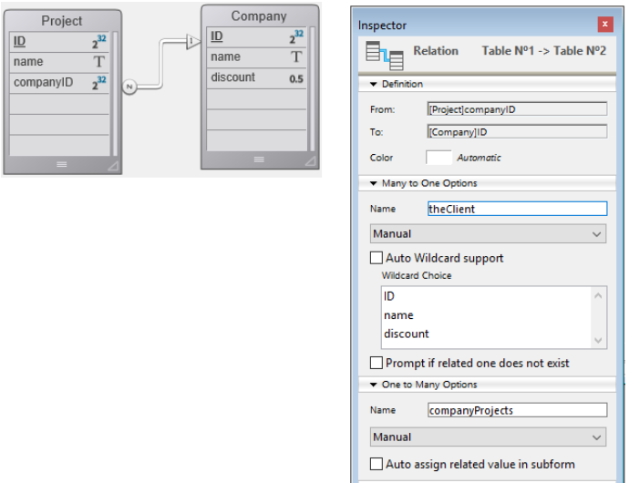
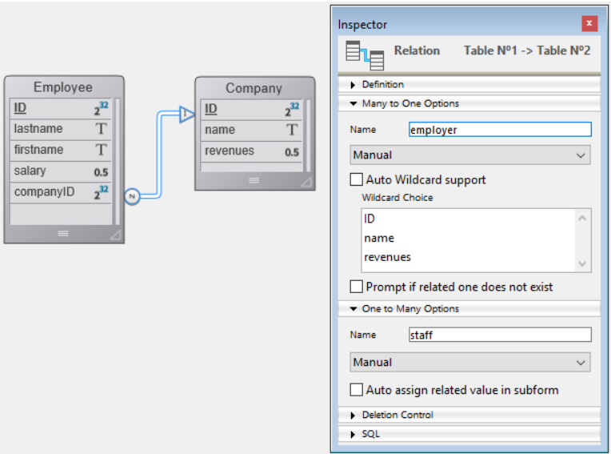

ORDA では、[エンティティ](dsMapping.md#entity) および [エンティティセレクション](dsMapping.md#エンティティセレクション) を介してデータにアクセスします。 これらのオブジェクトを使って、データストアのデータを作成・更新・クエリ・ソートすることができます。


## エンティティの作成

データクラス内に新しいエンティティを作成する方法は二つあります:

*   エンティティはデータベースレコードへの参照であるため、まず 4Dランゲージを使用してレコードを作成し、その後 [`entity.next()`](../API/EntityClass.md#next) や [`entitySelection.first()`](../API/EntitySelectionClass.md#first) といった ORDA関数を介して、それをエンティティとして参照できます。
*   また、[`dataClass.new( )`](../API/DataClassClass.md#new) 関数を使用してエンティティを作成することもできます。

エンティティはメモリ内にしか作成されないという点に注意してください。 データストアに追加したい場合、[`entity.save()`](../API/EntityClass.md#save) 関数を呼ぶ必要があります。

エンティティ属性は、エンティティオブジェクトのプロパティとして直接利用可能です。 詳細な情報については、[エンティティ属性の使用](#エンティティ属性の使用) を参照してください。

たとえば、カレントデータストア内の "Employee" データクラスに新しいエンティティを作成し、firstname と name 属性に "John" と "Dupont" を割り当てたい場合を考えます:

```4d
var $myEntity : cs.EmployeeEntity
$myEntity:=ds.Employee.new() // エンティティ型の新規オブジェクトを作成します
$myEntity.name:="Dupont" // 'Dupont' を 'name' 属性に代入します
$myEntity.firstname:="John" // 'John' を 'firstname' 属性に代入します
$myEntity.save() // エンティティを保存します
```
> エンティティは、それが作成されたプロセス内でのみ定義されます。 そのため、たとえばエンティティへの参照を、インタープロセス変数内に保存して他のプロセスで使用する、といったことはできません。

## エンティティと参照

エンティティには、4Dレコードへの参照が格納されています。 異なるエンティティが同じ 4Dレコードを参照することもあり得ます。 また、エンティティは 4Dオブジェクト変数に保存可能であることから、異なる変数が同じエンティティへの参照を格納していることもあり得ます。

以下のコードを実行した場合:

```4d
 var $e1; $e2 : cs.EmployeeEntity
 $e1:=ds.Employee.get(1) // ID 1をもつ社員にアクセスします
 $e2:=$e1
 $e1.name:="Hammer"
  //$e1 も $e2 も、どちらも同じエンティティへの参照を共有します
  //$e2.name の中身も "Hammer" です
```

これは以下のように図解することができます:


次に、以下のコードを実行した場合:

```4d
 var $e1; $e2 : cs.EmployeeEntity
 $e1:=ds.Employee.get(1)
 $e2:=ds.Employee.get(1)
 $e1.name:="Hammer"
  //変数 $e1 はエンティティへの参照を格納しています
  //変数 $e2 は別のエンティティへの参照を格納しています
  //$e2.name の中身は "smith" です
```

これは以下のように図解することができます:


しかし、両方のエンティティが同じレコードを参照していることに注意してください。 どちらの場合でも、`entity.save( )` メソッドを呼び出した場合、レコードは更新されます (衝突が発生した場合を除きます。[エンティティロッキング](#エンティティロッキング) 参照)。

実際には、`$e1` も `$e2` もエンティティそのものではなく、エンティティへの参照です。 これはつまり、どのような関数やメソッドにも直接受け渡すことができ、ポインターのように振る舞うということです。そしてこれは 4Dポインターよりもずっと高速です。 例:

```4d
 For each($entity;$selection)
    do_Capitalize($entity)
 End for each
```

そして do_Capitalize メソッドが以下のような形であった場合:

```4d
 $entity:=$1
 $name:=$entity.lastname
 If(Not($name=Null))
    $name:=Uppercase(Substring($name;1;1))+Lowercase(Substring($name;2))
 End if
 $entity.lastname:=$name
```

他の 4D のオブジェクトと同様にエンティティを扱うことができ、[引数](Concepts/parameters.md) としてその参照を渡すことができます。

:::info

エンティティでは、4Dランゲージのような "カレントレコード" という概念はありません。 エンティティは、いくつでも必要な数を同時に使用することができます。 また、エンティティには自動ロックの機構が備わっています ([エンティティロッキング](#エンティティロッキング) 参照)。 エンティティの読み込みには、[レイジーローディング](glossary.md#レイジーローディング) 機構が使用されます。これはつまり必要な分の情報だけが読み込まれるということです。 いずれにせよ、クライアント/サーバーでは必要であればエンティティを直接自動的に読み込むことも可能です。


:::

## エンティティ属性の使用

エンティティ属性はデータを保存し、対応するテーブルの対応するフィールドをマップします。

- kind が **storage** の属性は、エンティティオブジェクトの単純なプロパティとして設定または取得できます。
- kind が **relatedEntity** の属性はエンティティを返します。
- kind が **relatedEntities** の属性はエンティティセレクションを返します。
- kind が **computed** または **alias** の属性は、その定義次第であらゆるタイプのデータを返すことができます。

:::info

属性の型についての詳細な情報については、[ストレージ属性とリレーション属性](dsMapping.md#ストレージ属性とリレーション属性) の段落を参照してください。

:::

たとえば、文字列型のストレージ属性を取得・設定するためには:

```4d
 $entity:=ds.Employee.get(1) // ID1 の社員エンティティを取得します
 $name:=$entity.lastname // 社員のラストネームを取得します。例: "Smith"
 $entity.lastname:="Jones" // 社員のラストネームを変更します
 $entity.save() // 変更を保存します
```

> データベースの BLOBフィールド ([スカラーBLOB](Concepts/dt_blob.md)) は、ORDAで扱われるにあたって、BLOBオブジェクト属性 ([`4D.Blob`](Concepts/dt_blob.md)) に自動変換されます。 BLOBオブジェクト属性を保存する際には、(利用可能なメモリによってのみサイズ制限される BLOBオブジェクトとは異なり) BLOBフィールドのサイズが 2GB に制限されることに注意してください。


リレート属性にアクセスできるかどうかは、属性の型によります。 たとえば、以下のようなストラクチャーがあるとき:



リレートされたオブジェクトを通してデータにアクセスすることができます:

```4d
 $entity:=ds.Project.all().first().theClient // 先頭プロジェクトに関連する Company エンティティを取得します
 $EntitySel:=ds.Company.all().first().companyProjects // 先頭の会社に関連する Project エンティティセレクションを取得します
```

上記の例において、*theClient* と *companyProjects* はどちらもプライマリーリレーション属性であり、二つのデータクラス間の直接的なリレーションを表すことに注意してください。 しかしながら、複数のレベルのリレーションを通したパスに基づいてリレーション属性をビルドすることも可能です(循環参照含む)。 たとえば、以下のようなストラクチャーの場合を考えます:


社員はそれぞれマネージャーにもなりえますし、マネージャーを持つこともできます。 ある社員のマネージャーのマネージャーを取得したい場合、以下のように書くことができます:

```4d
 $myEmp:=ds.Employee.get(50)
 $manLev2:=$myEmp.manager.manager.lastname
```

### ピクチャーまたは Blob属性にファイルを代入する

ピクチャー属性には画像を格納することができます。同様に、任意のバイナリデータを Blob属性に格納することができます。

ORDA を使って属性に代入できるのは、データそのもの、つまり画像や Blobオブジェクト、またはデータを格納する **ファイルへの参照** のいずれかです。 この場合、エンティティにはファイルパスのみが保存されます。

この機能により、同じ画像を複製せずに複数のエンティティで利用できるほか、好きなようにファイルを整理したり、4D の外でファイルを使用したりできます。 また、データファイルのサイズを管理するのにも役立ちます。

ファイルの参照として使用できるのは以下のいずれかです:

- 4D.File オブジェクト
- POSIX 形式のパス

例:

```4d
Function createCompany($name : Text; $logo : 4D.File)

    var $company : cs.CompanyEntity
    $company:=ds.Company.new()

    $company.name:=$name 
        // ファイルオブジェクトを使った代入
    $company.logo:=$logo 
        // パスを使った代入
    $company.datablob:="/RESOURCES/"+$name+"/data.bin"
    $company.save() 
```

属性への代入がどのようにされたか (データそのもの、またはファイルの参照) にかかわらず、属性に対する読み取りアクセスはユーザーにとって透過的です。

代入時にファイルがディスク上に存在する必要はありません (この場合にエラーは返されません)。 属性の読み取り時に参照されたファイルが見つからない場合には、null値が返されます。

:::tip

4D は画像やデータをローカルキャッシュに読み込みます。 読み込み後に参照ファイルが変更された場合、アプリケーションで変更を反映するにはファイルを再代入する必要があります。

:::

:::note

ファイル参照の代入はローカルモード (4D Server または 4Dシングルユーザー) でのみサポートされています。 リモートで、または RESTリクエストを介して代入を行うと、エラーが生成されます。

:::


### リレーション属性への値の代入

ORDAアーキテクチャーでは、リレーション属性はエンティティにリレートされたデータを直接格納します:

*   N対1型リレーション属性 (**リレートエンティティ (relatedEntity)** 型) は一つのエンティティを格納します。
*   1対N型リレーション属性 (**リレートエンティティズ (relatedEntities)** 型) はエンティティセレクションを格納します。

以下の (単純化された) ストラクチャーを見てみましょう:



この例では、"Employee" データクラスに属するエンティティの "employer" 属性には、エンティティ型のオブジェクト (あるいは null値) が格納されます。 "Company" データクラスに属するエンティティの "staff" 属性には、エンティティセレクション型のオブジェクト (あるいは null値) が格納されます。
> ORDAでは、リレーションの自動あるいは手動プロパティは何の効力も持ちません。

"employer" 属性に直接値を代入したい場合には、"Company" データクラスの既存エンティティを渡す必要があります。 例:

```4d
 $emp:=ds.Employee.new() // 新規の社員エンティティを作成します
 $emp.lastname:="Smith" // 属性に値を代入します
 $emp.employer:=ds.Company.query("name =:1";"4D")[0]  // リレーション属性に会社エンティティを代入します
 $emp.save()
```

また、主キー値 (Number または Text) を通して "1"側のリレートエンティティを直接取得することもできます。 例:

```4d
 $emp:=ds.Employee.new()
 $emp.lastname:="Wesson"
 $emp.employer:=ds.Company.get(2)
  // 主キーの値が 2 の Company エンティティを取得し
  // employer 属性に代入します
 $emp.save()
```

これはとくに、リレーショナルデータベースから大量のデータを読み込むときに有用です。 このような読み込みでは通常 "ID" カラムが含まれており、これはリレーション属性に直接割り当て可能なプライマリーキーを参照しています。

"N" データクラス側のリレーション属性を通して、"1" リレートエンティティの属性値を、直接代入・変更することができます。 たとえば、Employee エンティティにリレートされている Company エンティティの name 属性を変更したい場合、以下のように書くことができます:

```code4d
 $emp:=ds.Employee.get(2) // プライマリーキーが 2 の Employee エンティティを読み込みます
 $emp.employer.name:="4D, Inc." // リレートされている Company の name 属性を変更します
 $emp.employer.save() // リレーション属性の変更を保存します
  // リレートされているエンティティも更新されます
```

## エンティティセレクションの作成

以下の方法で、[エンティティセレクション](dsMapping.md#エンティティセレクション) 型のオブジェクトを作成することができます:

*   [データクラス](API/DataClassClass.md#query) または [既存のエンティティセレクション](API/EntitySelectionClass.md#query) のエンティティに対してクエリを実行する;
*   [`.all( )`](API/DataClassClass.md#all) DataClassクラス関数を使用して、データクラス内の全エンティティを選択する;
*   Using the [`Create entity selection`](../API/EntitySelectionClass.md#create-entity-selection) command or the [`.newSelection()`](API/DataClassClass.md#newselection) dataclass function to create a blank entity selection;
*   [`.copy( )`](API/EntitySelectionClass.md#copy) EntitySelectionクラス関数を使用して、既存のエンティティセレクションを複製する;
*   [EntitySelectionクラス](API/EntitySelectionClass.md) の様々な関数の中から、[`.or( )`](API/EntitySelectionClass.md#or) のように新しいエンティティセレクションを返すものを使用する;
*   "リレートエンティティズ" 型のリレーション属性を使用する (以下参照)

データクラスに対して、異なるエンティティセレクションを好きなだけ同時に作成し、使用することができます。 エンティティセレクションは、エンティティへの参照を格納しているに過ぎないという点に注意してください。 異なるエンティティセレクションが同じエンティティへの参照を格納することも可能です。

:::note

You can filter which entities must be included in entity selections for a dataclass depending on any business rules, thanks to the [restricted entity selection](#restricting-entity-selections) feature.

:::


### 共有可能/追加可能なエンティティセレクション

エンティティセレクションには 2種類あります: **共有可能 (shareable)** (複数のプロセスで読み込み可能、ただし追加不可) のものと、**追加可能 (alterable)** ([`add()`](API/EntitySelectionClass.md#add) 関数が使用可能、ただしカレントプロセスでのみ利用可) のものです:

#### プロパティ

**共有可能** なエンティティセレクションは以下のような特徴を持ちます:

- 共有オブジェクトまたは共有コレクションに保存することが可能で、複数のプロセス間あるいはワーカー間で引数として受け渡しすることができます。
- 複数の共有オブジェクトまたは共有コレクションに保存することが可能です。また、グループに属している共有オブジェクトまたは共有コレクションに保存することも可能です (つまり、*ロック識別子* を持っていないということです)。
- 新たにエンティティを追加することはできません。 共有可能なエンティティセレクションに対してエンティティを追加しようとした場合、エラーがトリガーされます (エラー1637 - このエンティティセレクションは編集不可です)。 共有可能なエンティティセレクションに対してエンティティを追加したい場合、[`.add( )`](API/EntitySelectionClass.md#add) 関数を呼び出す前に、[`.copy( )`](API/EntitySelectionClass.md#copy) 関数を使用して共有不可のエンティティセレクションへと変換する必要があります。

> 大多数のエンティティセレクション関数 ([`.slice()`](API/EntitySelectionClass.md#slice), [`.and()`](API/EntitySelectionClass.md#and) 等) は、呼び出し対象のエンティティセレクションを変更せずに新規のエンティティセレクションを返すため、共有可能なエンティティセレクションに対して使用できます。

**追加可能** なエンティティセレクションは以下のような特徴を持ちます:

- プロセス間での共有はできません。また共有オブジェクト/コレクションへの保存もできません。 共有不可のエンティティセレクションを共有オブジェクト/コレクションに保存しようとした場合、エラーがトリガーされます (エラー -10721 - 共有オブジェクトまたはコレクションにおいてサポートされる値の型ではありません)。
- 新規エンティティを受け取ることができます (つまり、[`.add()`](API/EntitySelectionClass.md#add) 関数を使用できます)。


#### 共有可能/追加可能エンティティセレクションの定義

エンティティセレクションが **共有可能** または **追加可能** のいずれの特性を持つかは、そのエンティティセレクションの作成時に定義され、あとから変更することはできません。 エンティティセレクションの特性は、[.isAlterable()](API/EntitySelectionClass.md#isalterable) 関数または `OB Is shared` コマンドを使って確認することができます。


新規のエンティティセレクションは次の場合に **共有可能** です:

- データクラスに対して呼び出された ORDAクラス関数によって生成された場合: [dataClass.all()](API/DataClassClass.md#all), [dataClass.fromCollection()](API/DataClassClass.md#fromcollection), [dataClass.query()](API/DataClassClass.md#query) 等。
- リレーション属性をもとに生成され、[entity.*attributeName*](API/EntityClass.md#attributename) (例: "company.employees") の *attributeName* が 1対Nリレーション属性で、かつ entity 自身がエンティティセレクションに属していない場合。
- `ck shared` オプションを指定したうえで、[`entitySelection.copy()`](API/EntitySelectionClass.md#copy) または `OB Copy` を使用し、明示的に共有可能としてコピーされた場合。

例:

```4d
var $myComp : cs.CompanyEntity
var $employees : cs.EmployeeSelection
$myComp:=ds.Company.get(2) //$myComp does not belong to an entity selection
$employees:=$myComp.employees //$employees is shareable
```

新規のエンティティセレクションは次の場合に **追加可能** です:

- [`dataClass.newSelection()`](API/DataClassClass.md#newselection) 関数または `Create entity selection` コマンドを使用して新規作成された空のエンティティセレクションの場合。
- `ck shared` オプションを指定せずに、[`entitySelection.copy()`](API/EntitySelectionClass.md#copy) または `OB Copy` を使用し、明示的に追加可能としてコピーされた場合。

例:
```4d
var $toModify : cs.CompanySelection
$toModify:=ds.Company.all().copy() //$toModify is alterable
```


新規のエンティティセレクションは次の場合に、元となるエンティティセレクションの特性を **継承** します:

- 既存のエンティティセレクションに対して呼び出された ORDAクラス関数 ([.query()](API/EntitySelectionClass.md#query), [.slice()](API/EntitySelectionClass.md#slice), 等) によって生成された場合 。
- リレーションに基づいて生成された場合:
    - [entity.*attributeName*](API/EntityClass.md#attributename) (例: "company.employees") の *attributeName* が 1対Nリレーション属性で、かつ entity 自身がエンティティセレクションに属している場合 ([entity.getSelection()](API/EntityClass.md#getselection) エンティティセレクションと同じ特性になります)。
    - [entitySelection.*attributeName*](API/EntitySelectionClass.md#attributename) (例: "employees.employer") の *attributeName* がリレーション属性の場合 (エンティティセレクションと同じ特性になります)。
    - [entitySelection.extract()](API/EntitySelectionClass.md#extract) から返されるコレクションがエンティティセレクションを含む場合 (エンティティセレクションと同じ特性になります)。

例:

```4d
var $highSal; $lowSal : cs.EmployeeSelection
var $comp; $comp2 : cs.Company

$highSal:=ds.Employee.query("salary >= :1"; 1000000)   

    //$highSal is shareable because of the query on dataClass
$comp:=$highSal.employer //$comp is shareable because $highSal is shareable

$lowSal:=ds.Employee.query("salary <= :1"; 10000).copy() 
    //$lowSal is alterable because of the copy()
$comp2:=$lowSal.employer //$comp2 is alterable because $lowSal is alterable
```

:::note サーバーから返されるエンティティセレクション

クライアント/サーバーのアーキテクチャーにおいては、サーバー上で [`copy()`](API/EntitySelectionClass.md#copy) が呼び出されたとしても、サーバーから返されるエンティティセレクションは、クライアント上では常に共有可能です。 このエンティティセレクションをクライアント側で追加可能にするには、クライアント側で [`copy()`](API/EntitySelectionClass.md#copy) を実行する必要があります。 例:

```4d
    // 関数は常にサーバー上で実行されます
exposed Function getSome() : cs.MembersSelection
    return This.query("ID >= :1"; 15).orderBy("ID ASC")

    // クライアント側で実行されるメソッド
var $result : cs.MembersSelection
var $alterable : Boolean
$result:=ds.Members.getSome() // $result は共有可能
$alterable:=$result.isAlterable() // False

$result:=ds.Members.getSome().copy() // $result が追加可能になります
$alterable:=$result.isAlterable() // True
```

:::


#### プロセス間のエンティティセレクションの共有 (例題)

二つのエンティティセレクションを使用し、それらをワーカープロセスに渡して適切な相手にメールを送信したい場合を考えます:

```4d

var $paid; $unpaid : cs.InvoicesSelection
// 支払済および未払いの請求書のエンティティセレクションをそれぞれ取得します
$paid:=ds.Invoices.query("status=:1"; "支払済")
$unpaid:=ds.Invoices.query("status=:1"; "未払い")

// これらのエンティティセレクションの参照をワーカーに引数として渡します
CALL WORKER("mailing"; "sendMails"; $paid; $unpaid)

```

`sendMails` メソッドのコードです:

```4d 

 #DECLARE ($paid : cs.InvoicesSelection; $unpaid : cs.InvoicesSelection)
 var $invoice : cs.InvoicesEntity

 var $server; $transporter; $email; $status : Object

  // メールの準備
 $server:=New object()
 $server.host:="exchange.company.com"
 $server.user:="myName@company.com"
 $server.password:="my!!password"
 $transporter:=SMTP New transporter($server)
 $email:=New object()
 $email.from:="myName@company.com"

  // エンティティセレクションをループします
 For each($invoice;$paid)
    $email.to:=$invoice.customer.address // 顧客のメールアドレス
    $email.subject:="請求書 # "+String($invoice.number) + "のお支払いを確認いたしました。"

    $status:=$transporter.send($email)
 End for each

 For each($invoice;$unpaid)
    $email.to:=$invoice.customer.address // 顧客のメールアドレス
    $email.subject:="請求書 # "+String($invoice.number) + "のお支払いが確認できていません。"
    $status:=$transporter.send($email)
 End for each
```


### エンティティセレクションとストレージ属性

すべてのストレージ属性 (テキスト、数値、ブール、日付) はエンティティセレクションの、あるいはエンティティのプロパティとして利用可能です。 エンティティセレクションと組み合わせて使用した場合、スカラー属性はスカラー値のコレクションを返します。 例:

```4d
var $locals : cs.PersonSelection
var $localEmails : Collection
$locals:=ds.Person.query("city = :1";"San Jose") //entity selection of people
$localEmails:=$locals.emailAddress //collection of email addresses (strings)
```

このコードは *$localEmails* 内に文字列としてのメールアドレスのコレクションを返します。

### エンティティセレクションとリレーション属性

様々なクエリの方法に加えて、リレーション属性をエンティティセレクションのプロパティとして使用することで新しいエンティティセレクションを得ることもできます。 たとえば、以下のようなストラクチャーの場合を考えます:


```4d
var $myParts : cs.PartSelection
var $myInvoices : cs.InvoiceSelection
$myParts:=ds.Part.query("ID < 100") //Return parts with ID less than 100
$myInvoices:=$myParts.invoiceItems.invoice
  //All invoices with at least one line item related to a part in $myParts
```

The last line will return in *$myInvoices* an entity selection of all invoices that have at least one invoice item related to a part in the entity selection myParts. エンティティセレクションのプロパティとしてリレーション属性が使用されると、返される結果は、たとえ返されるエンティティが一つだけだとしても、常に新しいエンティティセレクションとなります。 エンティティセレクションのプロパティとしてリレーション属性が使用された結果、エンティティが何も返ってこない場合には、返されるのは空のエンティティセレクションであり、null ではありません。


## Restricting entity selections

In ORDA, you can create filters to restrict access to entities of any of your dataclasses. Once implemented, a filter is automatically applied whenever the entities of the dataclass are accessed either by **ORDA class functions** such as [`all()`](../API/DataClassClass.md#all) or [`query()`](../API/EntitySelectionClass.md#query), or by the [**REST API**](../category/api-dataclass) (which involves the [Data Explorer](../Admin/dataExplorer.md) and [remote datastores](remoteDatastores.md)).

A filter creates a restricted view of the data, built upon any business rules such as current session user. For example, in an application used by salespersons to make deals with their customers, you can restrict the read customers to those managed by the authenticated salesperson.

:::info

Filters apply to **entities**. If you want restrict access to a **dataclass** itself or to one or more of its **attributes**, you might consider using [session privileges](../privileges.md) which are more appropriate in this case.

:::


### How to define a restrict filter

You create a filter for a dataclass by defining an `event restrict` function in the [**dataclass class**](dsMapping.md#dataclass-class) of the dataclass. The filter is then automatically enabled.


### `Function event restrict`

#### シンタックス

```4d
Function event restrict() -> $result : cs.*DataClassName*Selection
// code
```

This function is called whenever an entity selection or an entity of the dataclass is requested. The filter is run once, when the entity selection is created.

The filter must return an entity selection of the dataclass. It can be an entity selection built upon a query, stored in the [`Storage`], etc.

:::note

For performance reasons, we recommend to use **indexed attributes** in the definition of the filter.

:::

The function must return a valid entity selection of the dataclass. No filter is applied (all entities corresponding of the initial request are returned) if:

- the function returns **null**,
- the function returns **undefined**,
- the function does not return a valid entity selection.


#### 例題

When accessed from a web or REST request, we want the Customers dataclass to only expose customers belonging to the identified sales person. During the authentication phase, the sales person is stored in the `Session` object. Other types of requests are also handled.

```4d
Class extends DataClass


Function event restrict() : cs.CustomersSelection


        //We work in a web or REST context
    If (Session#Null)

        Case of 
                // Only return the customers of the authenticated sales person stored in the session
            : (Session.storage.salesInfo#Null)
                return This.query("sales.internalId = :1"; Session.storage.salesInfo.internalId)

                //Data explorer - No filter is applied
            : (Session.hasPrivilege("WebAdmin"))
                return Null
            Else 
                //No customers can be read
                return This.newSelection()

        End case 

    Else // We work in client server
        return This.query("sales.userName = :1"; Current user)
    End if 
```


### Filter activation details

Filters apply to all ORDA or REST requests executed in your 4D projects (standalone and client/server architectures). A filter is activated as soon as the project is opened, i.e. it can be triggered in the `On Startup` database method.


:::info

Filters do not apply to legacy selections of records handled through the 4D interface or the 4D language (for example when calling `ALL RECORDS`).

:::


| 関数                                                                                | 説明                                                                                                                                        |
| --------------------------------------------------------------------------------- | ----------------------------------------------------------------------------------------------------------------------------------------- |
| [dataclass.get()](../API/DataClassClass.md#get)                                   | If the entity does not match the filter, `null` is returned                                                                               |
| [entity.reload()](../API/EntityClass.md#reload)                                   | Only in client/server and remote datastores                                                                                               |
| [dataclass.all()](../API/DataClassClass.md#all)                                   |                                                                                                                                           |
| [dataclass.fromCollection()](../API/DataClassClass.md#fromcollection)             | <li>In case of update, only entities matching the filter can be updated. If the collection refers to entities not matching the filter, they are created as new entities (if no duplicate PK error)</li><li>In case of creation, entities not matching the filter are created but will not be read after creation</li>                                                                                        |
| [entitySelection.and()](../API/EntitySelectionClass.md#and)                       | Only entities matching the filter are returned                                                                                            |
| [entitySelection.or()](../API/EntitySelectionClass.md#or)                         | Only entities matching the filter are returned                                                                                            |
| [entitySelection.minus()](../API/EntitySelectionClass.md#minus)                   | Only entities matching the filter are returned                                                                                            |
| [dataclass.query()](../API/DataClassClass.md#query)                               |                                                                                                                                           |
| [entitySelection.query()](../API/EntitySelectionClass.md#query)                   |                                                                                                                                           |
| [entitySelection.attributeName](../API/EntitySelectionClass.md#attributename)     | Filter applied if *attributeName* is a related entity or related entities of a filtered dataclass (including alias or computed attribute) |
| [entity.attributeName](../API/EntityClass.md#attributename)                       | Filter applied if *attributeName* corresponds to related entities of a filtered dataclass (including alias or computed attribute)         |
| [Create entity selection](../API/EntitySelectionClass.md#create-entity-selection) |                                                                                                                                           |


Other ORDA functions accessing data do not directly trigger the filter, but they nevertheless benefit from it. For example, the [`entity.next()`](../API/EntityClass.md#next) function will return the next entity in the already-filtered entity selection. On the other hand, if the entity selection is not filtered, [`entity.next()`](../API/EntityClass.md#next) will work on non-filtered entities.

:::note

If there is an error in the filter at runtime, it is thrown as if the error came from the ORDA function itself.

:::


## エンティティロッキング

一般的に、複数のユーザーあるいはプロセスが同じエンティティを同時に読み込んで変更しようとした際にコンフリクトが発生する可能性を管理する必要があります。 レコードロックは、リレーショナルデータベースにおいてデータに矛盾した更新がなされないようにするための手段です。 読み込み時にレコードをロックして他のプロセスが更新できないようにする、あるいは逆に保存時に読み込んでからの間に他のプロセスがレコードを変更していないかどうかを検証する、というのが基本的な概念です。 前者は **ペシミスティック・レコードロック** と呼ばれ、他のユーザーに対してレコードをロックすることで、変更したいレコードを書き込むことができるようにするものです。 後者は **オプティミスティック・レコードロック** と呼ばれ、レコードが更新される必要がある場合にのみ書き込み権限を与えるという柔軟性があります。 ペシミスティック・レコードロックでは、更新される必要がないときでもレコードはロックされたままです。 オプティミスティック・レコードロックではレコードの書き込みの可能/不可能は更新時に判断されます。

ORDA では、以下の二つのロックモードを提供しています:

- 自動的な "オプティミスティック" モード。多くのアプリケーションに適しています。
- "ペシミスティック" モード。エンティティをアクセスする前にロックすることができます。

### 自動オプティミスティック・ロック

この自動機構は、"オプティミスティック・ロック" に基づいたもので、これは Webアプリケーションの場合にとくに適しています。 この概念は以下のような動作原理に基づいています:

*   すべてのエンティティは必ず読み書き可能な状態でロードされます。エンティティの *事前* ロックというのはありません。
*   各エンティティには保存されるたびにインクリメントされる内部的なロックスタンプを持っています。
*   プロセスあるいはユーザーが `entity.save( )` メソッドでエンティティを保存しようとした場合、4D は保存しようとしているエンティティのスタンプの値とデータ内にあるエンティティのスタンプの値を比較します (データ編集の場合):
    *   値が合致している場合、エンティティは保存され、内部スタンプの値はインクリメントされます。

    *   値が合致しない場合、読み込みから保存までの間に他のユーザーがエンティティを編集したことになります。 保存は実行されず、エラーが返されます。

オプティミスティック・ロックの動作は以下ように図解することができます:

1. 二つのプロセスが同じエンティティを読み込んだとします。<br/><br/>

2. 最初のプロセスがエンティティを編集し、それを保存しようとします。 すると `entity.save( )` メソッドが呼び出されます。 4Dエンジンは、編集されたエンティティの内部スタンプ値とデータに保存されているエンティティの内部スタンプ値を自動的に比較します。 これは合致しますので、エンティティは保存され、その内部スタンプ値はインクリメントされます。<br/><br/>

3. 二つ目のプロセスも読み込んだエンティティを編集し、それを保存しようとします。 すると `entity.save( )` メソッドが呼び出されます。 編集されたエンティティの内部スタンプ値はデータに保存されているエンティティの内部スタンプ値と合致しないので、保存は実行されず、エラーが返されます。<br/><br/>


この流れは以下のコードのように分解することもできます:

```4d
 $person1:=ds.Person.get(1) // エンティティを参照
 $person2:=ds.Person.get(1) // 同じエンティティへの別の参照
 $person1.name:="Bill"
 $result:=$person1.save() // $result.success=true, 変更は保存されます
 $person2.name:="William"
 $result:=$person2.save() // $result.success=false, 変更は保存されません
```

この例では、$person1 に Person の、キーが 1 のエンティティを代入します。 次に、同じエンティティの別の参照を変数 $person2 に代入します。 $person1 を用いて、人物の名前を変更してエンティティを保存します。 同じことを $person2 を使用して実行しようとすると、4D はディスク上のエンティティをチェックし、変数 $person2 に代入されたものと同じかどうかを調べます。 結果としてこれは同じものでは無いので、success プロパティには false が返され、二つ目の変更は保存されません。

こういった状況が発生した場合には、たとえば `entity.reload()` メソッドを使用してディスクからエンティティを再読込し、変更をもう一度おこなうことができます。 また `entity.save()` メソッドは、異なるプロセスがそれぞれ異なる属性を変更していた場合には保存を実行する "automerge" オプションも提供しています。

> **トランザクション** 内においては、特定レコードのコピーがコンタキスト内に一つしか存在しないため、レコードスタンプは使用されません。 レコードを参照するエンティティが複数あっても、同じコピーが検収されるため `entity.save()` による処理がスタンプエラーを生成することはありません。

### ペシミスティック・ロック

エンティティは、データアクセス時に任意にロックおよびアンロックすることができます。 エンティティがプロセスからロックされている場合、そのエンティティはプロセスに読み書き可能モードで読み込まれていますが、他のすべてのプロセスに対してロックされています。 ロックされたエンティティは、他のプロセスからは読み込みモードでのみ読み込むことができます。つまり、その値を編集・保存することはできません。

この機能は `Entity` クラスの 2つの関数に基づいています:

*   [`entity.lock()`](../API/EntityClass.md#lock)
*   [`entity.unlock()`](../API/EntityClass.md#unlock)

詳細な情報については、これらの関数の説明を参照してください。

> ペシミスティック・ロックは [REST API](../REST/$lock.md) によって扱うことも可能です。


### 4Dクラシック・ロックとORDAのペシミスティック・ロックの組み合わせ

クラシックコマンドと ORDA コマンドの両方を使用してレコードをロックする場合、以下の原則に注意する必要があります:

*   クラシック4Dコマンドを使用してレコードをロックした場合、そのレコードに相当するエンティティを ORDA でロックすることはできません。
*   ORDA を使用してエンティティをロックした場合、そのエンティティに相当するレコードをクラシック4Dコマンドでロックすることはできません。

これらの原理は以下のような図に表すことができます:


**トランザクションロック** はクラシックコマンドと ORDAコマンドの両方に適用されます。 マルチプロセスあるいはマルチユーザーアプリケーションにおいては、トランザクション内でクラシックコマンドを使用してレコードをロックした場合、そのトランザクションが OK あるいはキャンセルされるまで、他のプロセスからそのレコードに相当するエンティティをロックすることはできません (逆もまた然りです)。

*   クラシックコマンドを使用してロックした場合:<br/><br/>
*   ORDA関数を使用してロックした場合:<br/><br/>
