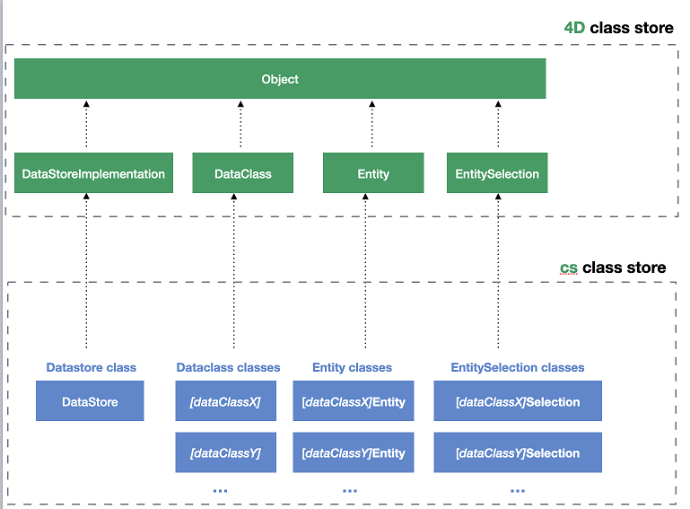
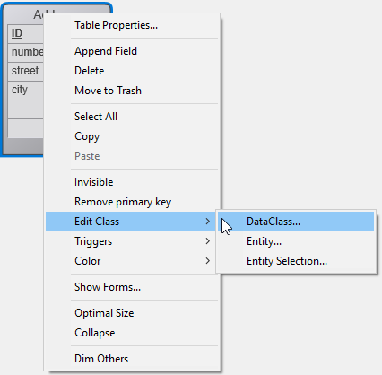

ORDA を使用して、データモデル上に高レベルクラス関数を作成することができます。 これによってビジネス指向のコードを書き、APIのように "公開" することができます。 データストア、データクラス、エンティティ、およびエンティティセレクションはそれぞれ、関数を持つことのできるクラスオブジェクトとして提供されています。

For example, you could create a `getNextWithHigherSalary()` function in the `EmployeeEntity` class to return employees with a salary higher than the selected one. この関数は簡単に呼び出すことができます:

```4d
$nextHigh:=ds.Employee.get(1).getNextWithHigherSalary()
```

これらの関数はローカルデータストアだけでなく、クライアント/サーバーやリモートアーキテクチャーでも使用することができます:

```4d
 //$cityManager はリモートデータストアへの参照です
Form.comp.city:=$cityManager.City.getCityName(Form.comp.zipcode)
```

この機能により、4D アプルケーションのビジネスロジックをまるごと独立したレイヤーに保存し、高レベルのセキュリティで簡単に管理・利用することができます:

- わかりやすく使いやすい関数のみを公開し、その裏にある構造の複雑性を "隠す" ことができます。

- 構造が発展した場合には影響を受ける関数を適応させるだけで、クライアントアプリケーションは引き続き透過的にそれらを呼び出すことができます。

- By default, all of your data model class functions (including [computed attribute functions](#computed-attributes-1)) and [alias attributes](#alias-attributes-1) are **not exposed** to remote applications and cannot be called from REST requests. You must explicitly declare each public function and alias with the [`exposed`](#exposed-vs-non-exposed-functions) keyword.


In addition, 4D [automatically pre-creates](#creating-classes) the classes for each available data model object.

## アーキテクチャー

ORDA provides **generic classes** exposed through the **`4D`** [class store](Concepts/classes.md#class-stores), as well as **user classes** (extending generic classes) exposed in the **`cs`** [class store](Concepts/classes.md#class-stores):



All ORDA data model classes are exposed as properties of the **`cs`** class store. 次の ORDA クラスが提供されています:

| Class                                       | 例                                    | 次によってインスタンス化されます                                                                                                                                                                                                                                                                                                                                                                                                                                                                                                                                                                                                                                                                                                                                                                                                                                                       |
| ------------------------------------------- | ------------------------------------ | ---------------------------------------------------------------------------------------------------------------------------------------------------------------------------------------------------------------------------------------------------------------------------------------------------------------------------------------------------------------------------------------------------------------------------------------------------------------------------------------------------------------------------------------------------------------------------------------------------------------------------------------------------------------------------------------------------------------------------------------------------------------------------------------------------------------------------------------------------------------------- |
| cs.DataStore                | cs.DataStore         | [`ds`](API/DataStoreClass.md#ds) command                                                                                                                                                                                                                                                                                                                                                                                                                                                                                                                                                                                                                                                                                                                                                                                                                               |
| cs._DataClassName_          | cs.Employee          | [`dataStore.DataClassName`](API/DataStoreClass.md#dataclassname), `dataStore["DataClassName"]`                                                                                                                                                                                                                                                                                                                                                                                                                                                                                                                                                                                                                                                                                                                                                                         |
| cs._DataClassName_Entity    | cs.EmployeeEntity    | [`dataClass.get()`](API/DataClassClass.md#get), [`dataClass.new()`](API/DataClassClass.md#new), [`entitySelection.first()`](API/EntitySelectionClass.md#first), [`entitySelection.last()`](API/EntitySelectionClass.md#last), [`entity.previous()`](API/EntityClass.md#previous), [`entity.next()`](API/EntityClass.md#next), [`entity.first()`](API/EntityClass.md#first), [`entity.last()`](API/EntityClass.md#last), [`entity.clone()`](API/EntityClass.md#clone)                                                                                                                                                                                                                                                                                                                                                                                                   |
| cs._DataClassName_Selection | cs.EmployeeSelection | [`dataClass.query()`](API/DataClassClass.md#query), [`entitySelection.query()`](API/EntitySelectionClass.md#query), [`dataClass.all()`](API/DataClassClass.md#all), [`dataClass.fromCollection()`](API/DataClassClass.md#fromcollection), [`dataClass.newSelection()`](API/DataClassClass.md#newselection), [`entitySelection.drop()`](API/EntitySelectionClass.md#drop), [`entity.getSelection()`](API/EntityClass.md#getselection), [`entitySelection.and()`](API/EntitySelectionClass.md#and), [`entitySelection.minus()`](API/EntitySelectionClass.md#minus), [`entitySelection.or()`](API/EntitySelectionClass.md#or), [`entitySelection.orderBy()`](API/EntitySelectionClass.md#or), [`entitySelection.orderByFormula()`](API/EntitySelectionClass.md#orderbyformula), [`entitySelection.slice()`](API/EntitySelectionClass.md#slice), `Create entity selection` |

> ORDA user classes are stored as regular class files (.4dm) in the Classes subfolder of the project [(see below)](#class-files).

ORDA データモデルユーザークラスのオブジェクトインスタンスは、それらの親クラスのプロパティや関数を使うことができます:

- a Datastore class object can call functions from the [ORDA Datastore generic class](API/DataStoreClass.md).
- a Dataclass class object can call functions from the [ORDA Dataclass generic class](API/DataClassClass.md).
- an Entity selection class object can call functions from the [ORDA Entity selection generic class](API/EntitySelectionClass.md).
- an Entity class object can call functions from the [ORDA Entity generic class](API/EntityClass.md).

## クラスの説明

<details><summary>履歴</summary>

| リリース  | 内容                                                                                      |
| ----- | --------------------------------------------------------------------------------------- |
| 19 R4 | Entity クラスのエイリアス属性                                                                      |
| 19 R3 | Entity クラスの計算属性                                                                         |
| 18 R5 | データモデルクラス関数は、デフォルトでは REST に公開されません。 New `exposed` and `local` keywords. |

</details>

### DataStore クラス

A 4D database exposes its own DataStore class in the `cs` class store.

- **Extends**: 4D.DataStoreImplementation
- **Class name**: cs.DataStore

You can create functions in the DataStore class that will be available through the `ds` object.

#### 例題

```4d
// cs.DataStore class

Class extends DataStoreImplementation

Function getDesc
  $0:="社員と会社を公開するデータベース"
```

この関数は次のように使えます:

```4d
$desc:=ds.getDesc() //"社員と会社を..."
```

### DataClass クラス

Each table exposed with ORDA offers a DataClass class in the `cs` class store.

- **Extends**: 4D.DataClass
- **Class name**: cs._DataClassName_ (where _DataClassName_ is the table name)
- **Example name**: cs.Employee

#### 例題

```4D
// cs.Company class


Class extends DataClass

// Returns companies whose revenue is over the average
// Returns an entity selection related to the Company DataClass

Function GetBestOnes()
	$sel:=This.query("revenues >= :1";This.all().average("revenues"));
	$0:=$sel
```

全会社データから平均以上の会社データをエンティティセレクションに抽出するには次を実行します:

```4d
	var $best : cs.CompanySelection
	$best:=ds.Company.GetBestOnes()
```

:::info

[Computed attributes](#computed-attributes) are defined in the [Entity Class](#entity-class).

:::

#### リモートデータストアの例

The following _City_ catalog is exposed in a remote datastore (partial view):


The `City Class` provides an API:

```4d
// cs.City class

Class extends DataClass

Function getCityName()
	var $1; $zipcode : Integer
	var $zip : 4D.Entity
	var $0 : Text

	$zipcode:=$1
	$zip:=ds.ZipCode.get($zipcode)
	$0:="" 

	If ($zip#Null)
		$0:=$zip.city.name
	End if
```

クライアントはまず、リモートデータストアのセッションを開始します:

```4d
$cityManager:=Open datastore(New object("hostname";"127.0.0.1:8111");"CityManager")
```

クライアントアプリケーションは API を使い、たとえばフォームに入力された郵便番号 (zipcode) に合致する都市を取得することができます:

```4d
Form.comp.city:=$cityManager.City.getCityName(Form.comp.zipcode)

```

### EntitySelection クラス

Each table exposed with ORDA offers an EntitySelection class in the `cs` class store.

- **Extends**: 4D.EntitySelection
- **Class name**: _DataClassName_Selection (where _DataClassName_ is the table name)
- **Example name**: cs.EmployeeSelection

#### 例題

```4d
// cs.EmployeeSelection class


Class extends EntitySelection

//Extract the employees with a salary greater than the average from this entity selection 

Function withSalaryGreaterThanAverage() : cs.EmployeeSelection
	return This.query("salary > :1";This.average("salary")).orderBy("salary")

```

任意の社員エンティティセレクションより、給与が平均以上の社員を取得するには:

```4d
$moreThanAvg:=ds.Company.all().employees.withSalaryGreaterThanAverage()
```

:::info

[Restricted entity selection filters](entities.md#restricting-entity-selections) are defined in the [Dataclass Class](#dataclass-class).

:::

### Entity クラス

Each table exposed with ORDA offers an Entity class in the `cs` class store.

- **Extends**: 4D.Entity
- **Class name**: _DataClassName_Entity (where _DataClassName_ is the table name)
- **Example name**: cs.CityEntity

#### 計算属性

Entity classes allow you to define **computed attributes** using specific keywords:

- `Function get` _attributeName_
- `Function set` _attributeName_
- `Function query` _attributeName_
- `Function orderBy` _attributeName_

For information, please refer to the [Computed attributes](#computed-attributes-1) section.

#### エイリアス属性

Entity classes allow you to define **alias attributes**, usually over related attributes, using the `Alias` keyword:

`Alias` _attributeName_ _targetPath_

For information, please refer to the [Alias attributes](#alias-attributes-1) section.

#### 例題

```4d
// cs.CityEntity class

Class extends Entity

Function getPopulation() : Integer
    return This.zips.sum("population")


Function isBigCity(): Boolean
// The getPopulation() function is usable inside the class
	return This.getPopulation()>50000
```

次のように関数を呼び出すことができます:

```4d
var $cityManager; $city : Object

$cityManager:=Open datastore(New object("hostname";"127.0.0.1:8111");"CityManager")
$city:=$cityManager.City.getCity("Caguas")

If ($city.isBigCity())
	ALERT($city.name + " is a big city")
End if
```

### 定義規則

データモデルクラスを作成・編集する際には次のルールに留意しなくてはなりません:

- Since they are used to define automatic DataClass class names in the **cs** [class store](Concepts/classes.md#class-stores), 4D tables must be named in order to avoid any conflict in the **cs** namespace. 特に:
  - Do not give the same name to a 4D table and to a [user class name](Concepts/classes.md#class-names). 衝突が起きた場合には、ユーザークラスのコンストラクターは使用不可となります (コンパイラーにより警告が返されます)。
  - 4D テーブルに予約語を使用してはいけません (例: "DataClass")。

- When defining a class, make sure the [`Class extends`](Concepts/classes.md#class-extends-classnameclass) statement exactly matches the parent class name (remember that they're case sensitive). For example, `Class extends EntitySelection` for an entity selection class.

- You cannot instantiate a data model class object with the `new()` keyword (an error is returned). You must use a regular method as listed in the [`Instantiated by` column of the ORDA class table](#architecture).

- You cannot override a native ORDA class function from the **`4D`** [class store](Concepts/classes.md#class-stores) with a data model user class function.

### プリエンプティブ実行

コンパイル済みの状態では、データモデルクラス関数は次のように実行されます:

- in **preemptive or cooperative processes** (depending on the calling process) in single-user applications,
- in **preemptive processes** in client/server applications (except if the [`local`](#local-functions) keyword is used, in which case it depends on the calling process like in single-user).

クライアント/サーバーで動作するように設計されているプロジェクトでは、データモデルクラス関数のコードがスレッドセーフであることを確認してください。 スレッドセーフでないコードが呼び出された場合、実行時にエラーが発生します (シングルユーザーアプリケーションではコオペラティブ実行がサポートされているため、コンパイル時にはエラーが発生しません)。

## 計算属性

### 概要

計算属性は、計算をマスクするデータ型を持つデータクラス属性です。 [Standard 4D classes](Concepts/classes.md) implement the concept of computed properties with `get` (_getter_) and `set` (_setter_) [accessor functions](Concepts/classes.md#function-get-and-function-set). ORDA dataclass attributes benefit from this feature and extend it with two additional functions: `query` and `orderBy`.

At the very minimum, a computed attribute requires a `get` function that describes how its value will be calculated. When a _getter_ function is supplied for an attribute, 4D does not create the underlying storage space in the datastore but instead substitutes the function's code each time the attribute is accessed. 属性がアクセスされなければ、コードも実行されません。

A computed attribute can also implement a `set` function, which executes whenever a value is assigned to the attribute. The _setter_ function describes what to do with the assigned value, usually redirecting it to one or more storage attributes or in some cases other entities.

Just like storage attributes, computed attributes may be included in **queries**. デフォルトでは、ORDA のクエリで計算属性が使用された場合、その属性はエンティティ毎に一度計算されます。 場合によっては、これで十分です。 However for better performance, especially in client/server, computed attributes can implement a `query` function that relies on actual dataclass attributes and benefits from their indexes.

Similarly, computed attributes can be included in **sorts**. デフォルトでは、ORDA の並べ替えで計算属性が使用された場合、その属性はエンティティ毎に一度計算されます。 Just like in queries, computed attributes can implement an `orderBy` function that substitutes other attributes during the sort, thus increasing performance.

### 計算属性の定義

You create a computed attribute by defining a `get` accessor in the [**entity class**](#entity-class) of the dataclass. 計算属性は、データクラス属性およびエンティティ属性として自動的に利用可能になります。

Other computed attribute functions (`set`, `query`, and `orderBy`) can also be defined in the entity class. これらの関数の定義は任意です。

Within computed attribute functions, [`This`](Concepts/classes.md#this) designates the entity. Computed attributes can be used and handled as any dataclass attribute, i.e. they will be processed by [entity class](API/EntityClass.md) or [entity selection class](API/EntitySelectionClass.md) functions.

> ORDA computed attributes are not [**exposed**](#exposed-vs-non-exposed-functions) by default. You expose a computed attribute by adding the `exposed` keyword to the **get function** definition.

> **get and set functions** can have the [**local**](#local-functions) property to optimize client/server processing.

### `Function get <attributeName>`

#### シンタックス

```4d
{local} {exposed} Function get <attributeName>({$event : Object}) -> $result : type
// code
```

The _getter_ function is mandatory to declare the _attributeName_ computed attribute. Whenever the _attributeName_ is accessed, 4D evaluates the `Function get` code and returns the _$result_ value.

> 計算属性は、他の計算属性の値を使用することができます。 再帰的な呼び出しはエラーになります。

The _getter_ function defines the data type of the computed attribute thanks to the _$result_ parameter. 以下の結果の型が可能です:

- スカラー (テキスト、ブール、日付、時間、数値)
- Object
- ピクチャー
- BLOB
- エンティティ (例: cs.EmployeeEntity)
- エンティティセレクション (例: cs.EmployeeSelection)

The _$event_ parameter contains the following properties:

| プロパティ         | タイプ     | 説明                                                |
| ------------- | ------- | ------------------------------------------------- |
| attributeName | Text    | 計算属性の名称                                           |
| dataClassName | Text    | データクラスの名称                                         |
| kind          | Text    | "get"                                             |
| result        | Variant | 任意。 スカラー属性が Null を返すようにするには、このプロパティを Null値で追加します。 |

#### 例題

- _fullName_ computed attribute:

```4d
Function get fullName($event : Object)-> $fullName : Text

  Case of 	
	: (This.firstName=Null) & (This.lastName=Null)
		$event.result:=Null //use result to return Null
	: (This.firstName=Null)
		$fullName:=This.lastName
	: (This.lastName=Null)
		$fullName:=This.firstName
	Else 
		$fullName:=This.firstName+" "+This.lastName
	End case 
```

- 計算属性は、エンティティにリレートされた属性に基づいて定義することができます。

```4d
Function get bigBoss($event : Object)-> $result: cs.EmployeeEntity
	$result:=This.manager.manager
    
```

- 計算属性は、エンティティセレクションにリレートされた属性に基づいて定義することができます。

```4d
Function get coWorkers($event : Object)-> $result: cs.EmployeeSelection
    If (This.manager.manager=Null)
        $result:=ds.Employee.newSelection()
    Else 
        $result:=This.manager.directReports.minus(this)
    End if
```

### `Function set <attributeName>`

#### シンタックス

```4d

{local} Function set <attributeName>($value : type {; $event : Object})
// code
```

The _setter_ function executes whenever a value is assigned to the attribute. この関数は通常、入力値を処理し、その結果を 1つ以上の他の属性に転送します。

The _$value_ parameter receives the value assigned to the attribute.

The _$event_ parameter contains the following properties:

| プロパティ         | タイプ     | 説明               |
| ------------- | ------- | ---------------- |
| attributeName | Text    | 計算属性の名称          |
| dataClassName | Text    | データクラスの名称        |
| kind          | Text    | "set"            |
| value         | Variant | 計算属性によって処理されるべき値 |

#### 例題

```4d
Function set fullName($value : Text; $event : Object)
	var $p : Integer
    $p:=Position(" "; $value) 		
	This.firstname:=Substring($value; 1; $p-1)  // "" if $p<0
	This.lastname:=Substring($value; $p+1)
```

### `Function query <attributeName>`

#### シンタックス

```4d
Function query <attributeName>($event : Object)
Function query <attributeName>($event : Object) -> $result : Text
Function query <attributeName>($event : Object) -> $result : Object
// code
```

このメソッドは 3種類のシンタックスを受け入れます:

- With the first syntax, you handle the whole query through the `$event.result` object property.
- With the second and third syntaxes, the function returns a value in _$result_:
  - If _$result_ is a Text, it must be a valid query string
  - If _$result_ is an Object, it must contain two properties:
  | プロパティ                              | タイプ        | 説明                                                                                     |
  | ---------------------------------- | ---------- | -------------------------------------------------------------------------------------- |
  | $result.query      | Text       | プレースホルダー (:1, :2, など) を使った有効なクエリ文字列 |
  | $result.parameters | Collection | プレースホルダーに渡す値                                                                           |

The `query` function executes whenever a query using the computed attribute is launched. インデックス付きの属性を利用することで、クエリをカスタマイズしたり最適化したりすることができます。 When the `query` function is not implemented for a computed attribute, the search is always sequential (based upon the evaluation of all values using the `get <AttributeName>` function).

> The following features are not supported:
>
> - calling a `query` function on computed attributes of type Entity or Entity selection,
> - using the `order by` keyword in the resulting query string.

The _$event_ parameter contains the following properties:

| プロパティ         | タイプ     | 説明                                                                                                                                                                                                                                                                                                                                                                                                                                                                                                                                                                                                                                                                                                                                                             |
| ------------- | ------- | -------------------------------------------------------------------------------------------------------------------------------------------------------------------------------------------------------------------------------------------------------------------------------------------------------------------------------------------------------------------------------------------------------------------------------------------------------------------------------------------------------------------------------------------------------------------------------------------------------------------------------------------------------------------------------------------------------------------------------------------------------------- |
| attributeName | Text    | 計算属性の名称                                                                                                                                                                                                                                                                                                                                                                                                                                                                                                                                                                                                                                                                                                                                                        |
| dataClassName | Text    | データクラスの名称                                                                                                                                                                                                                                                                                                                                                                                                                                                                                                                                                                                                                                                                                                                                                      |
| kind          | Text    | "query"                                                                                                                                                                                                                                                                                                                                                                                                                                                                                                                                                                                                                                                                                                                                                        |
| value         | Variant | 計算属性によって処理されるべき値                                                                                                                                                                                                                                                                                                                                                                                                                                                                                                                                                                                                                                                                                                                                               |
| operator      | Text    | Query operator (see also the [`query` class function](API/DataClassClass.md#query)). Possible values:<li>== (equal to, @ is wildcard)</li><li>=== (equal to, @ is not wildcard)</li><li>!= (not equal to, @ is wildcard)</li><li>!== (not equal to, @ is not wildcard)</li><li>< (less than)</li><li><= (less than or equal to)</li><li>> (greater than)</li><li>>= (greater than or equal to)</li><li>IN (included in)</li><li>% (contains keyword)</li> |
| result        | Variant | 計算属性によって処理されるべき値。 Pass `Null` in this property if you want to let 4D execute the default query (always sequential for computed attributes).                                                                                                                                                                                                                                                                                                                                                                                                                                                                                                                                                                                 |

> If the function returns a value in _$result_ and another value is assigned to the `$event.result` property, the priority is given to `$event.result`.

#### 例題

- Query on the _fullName_ computed attribute.

```4d
Function query fullName($event : Object)->$result : Object

	var $fullname; $firstname; $lastname; $query : Text
	var $operator : Text
	var $p : Integer
	var $parameters : Collection

	$operator:=$event.operator
	$fullname:=$event.value

	$p:=Position(" "; $fullname) 
	If ($p>0)
		$firstname:=Substring($fullname; 1; $p-1)+"@"
		$lastname:=Substring($fullname; $p+1)+"@"
		$parameters:=New collection($firstname; $lastname) // two items collection
	Else 
		$fullname:=$fullname+"@"
		$parameters:=New collection($fullname) // single item collection
	End if 

	Case of 
	: ($operator="==") | ($operator="===")
		If ($p>0)
			$query:="(firstName = :1 and lastName = :2) or (firstName = :2 and lastName = :1)"
		Else 
			$query:="firstName = :1 or lastName = :1"
		End if 
	: ($operator="!=")
		If ($p>0)
			$query:="firstName != :1 and lastName != :2 and firstName != :2 and lastName != :1"
		Else 
			$query:="firstName != :1 and lastName != :1"
		End if 
	End case 

	$result:=New object("query"; $query; "parameters"; $parameters)
```

> Keep in mind that using placeholders in queries based upon user text input is recommended for security reasons (see [`query()` description](API/DataClassClass.md#query)).

呼び出しコードの例:

```4d
$emps:=ds.Employee.query("fullName = :1"; "Flora Pionsin")
```

- This function handles queries on the _age_ computed attribute and returns an object with parameters:

```4d
Function query age($event : Object)->$result : Object
	
	var $operator : Text
	var $age : Integer
	var $_ages : Collection
	
	$operator:=$event.operator
			
	$age:=Num($event.value)  // integer
	$d1:=Add to date(Current date; -$age-1; 0; 0)
	$d2:=Add to date($d1; 1; 0; 0)
	$parameters:=New collection($d1; $d2)
	
	Case of 
			
		: ($operator="==")
			$query:="birthday > :1 and birthday <= :2"  // after d1 and before or egal d2
			
		: ($operator="===") 

			$query:="birthday = :2"  // d2 = second calculated date (= birthday date)

		: ($operator=">=")
			$query:="birthday <= :2"
			
			//... other operators			
			
			
	End case 
	
	
	If (Undefined($event.result))
		$result:=New object
		$result.query:=$query
		$result.parameters:=$parameters
	End if

```

呼び出しコードの例:

```4d
// people aged between 20 and 21 years (-1 day)
$twenty:=people.query("age = 20")  // calls the "==" case

// people aged 20 years today
$twentyToday:=people.query("age === 20") // equivalent to people.query("age is 20") 

```

### `Function orderBy <attributeName>`

#### シンタックス

```4d
Function orderBy <attributeName>($event : Object)
Function orderBy <attributeName>($event : Object)-> $result : Text

// code
```

The `orderBy` function executes whenever the computed attribute needs to be ordered. これにより、計算属性で並べ替えることができます。 For example, you can sort _fullName_ on first names then last names, or conversely.
When the `orderBy` function is not implemented for a computed attribute, the sort is always sequential (based upon the evaluation of all values using the `get <AttributeName>` function).

> Calling an `orderBy` function on computed attributes of type Entity class or Entity selection class **is not supported**.

The _$event_ parameter contains the following properties:

| プロパティ         | タイプ     | 説明                                                                                            |
| ------------- | ------- | --------------------------------------------------------------------------------------------- |
| attributeName | Text    | 計算属性の名称                                                                                       |
| dataClassName | Text    | データクラスの名称                                                                                     |
| kind          | Text    | "orderBy"                                                                                     |
| value         | Variant | 計算属性によって処理されるべき値                                                                              |
| operator      | Text    | "desc" または "asc" (デフォルト)                                                   |
| descending    | Boolean | `true` for descending order, `false` for ascending order                                      |
| result        | Variant | 計算属性によって処理されるべき値。 Pass `Null` if you want to let 4D execute the default sort. |

> You can use either the `operator` or the `descending` property. これは、基本的にプログラミングのスタイルの問題です (例題参照)。

You can return the `orderBy` string either in the `$event.result` object property or in the _$result_ function result. If the function returns a value in _$result_ and another value is assigned to the `$event.result` property, the priority is given to `$event.result`.

#### 例題

次のような条件分岐のコードを書くことができます:

```4d
Function orderBy fullName($event : Object)-> $result : Text
    If ($event.descending=True)
        $result:="firstName desc, lastName desc" 
    Else 
        $result:="firstName, lastName" 
    End if
```

また、次のような短縮コードを書くこともできます:

```4d
Function orderBy fullName($event : Object)-> $result : Text
	$result:="firstName "+$event.operator+", "lastName "+$event.operator

```

場合によっては条件分岐のコードが必要です:

```4d
Function orderBy age($event : Object)-> $result : Text

    If ($event.descending=True)
        $result:="birthday asc" 
    Else 
        $result:="birthday desc" 
    End if

```

## エイリアス属性

### 概要

An **alias** attribute is built above another attribute of the data model, named **target** attribute. ターゲット属性には、リレートデータクラス (リレートレベルは無制限) または同じデータクラスのものを使用できます。 エイリアス属性はデータではなく、ターゲット属性へのパスを格納します。 データクラスには、必要な数だけエイリアス属性を定義することができます。

エイリアス属性は、N対Nリレーションを扱うのに便利です。 実装の詳細ではなくビジネスの概念を扱ってコードやクエリを作成できるため、これらの可読性が向上します。

### エイリアス属性の定義

You create an alias attribute in a dataclass by using the `Alias` keyword in the [**entity class**](#entity-class) of the dataclass.

### `Alias <attributeName> <targetPath>`

#### シンタックス

```
{exposed} Alias <attributeName> <targetPath>
```

_attributeName_ must comply with [standard rules for property names](../Concepts/identifiers.md#object-properties).

_targetPath_ is an attribute path containing one or more levels, such as "employee.company.name". If the target attribute belongs to the same dataclass, _targetPath_ is the attribute name.

エイリアスは、他のエイリアスのパスに使用することができます。

A [computed attribute](#computed-attributes-1) can be used in an alias path, but only as the last level of the path, otherwise, an error is returned. たとえば、"fullName" 計算属性がある場合、"employee.fullName" というエイリアスパスは有効です。

> ORDA alias attributes are **not exposed** by default. You must add the [`exposed`](#exposed-vs-non-exposed-functions) keyword before the `Alias` keyword if you want the alias to be available to remote requests.

### エイリアス属性の使用

エイリアス属性は読み取り専用です (同じデータクラスのスカラー属性に基づく場合は例外です; 最後の例題参照)。 エイリアス属性は、次のようなクラス関数において、ターゲット属性パスの代わりに使用することができます:

| Function                                       |
| ---------------------------------------------- |
| `dataClass.query()`, `entitySelection.query()` |
| `entity.toObject()`                            |
| `entitySelection.toCollection()`               |
| `entitySelection.extract()`                    |
| `entitySelection.orderBy()`                    |
| `entitySelection.orderByFormula()`             |
| `entitySelection.average()`                    |
| `entitySelection.count()`                      |
| `entitySelection.distinct()`                   |
| `entitySelection.sum()`                        |
| `entitySelection.min()`                        |
| `entitySelection.max()`                        |
| `entity.diff()`                                |
| `entity.touchedAttributes()`                   |

> エイリアス属性はサーバー上で計算されることに留意してください。 リモート環境において、エンティティのエイリアス属性を更新するには、エンティティをサーバーから再ロードする必要があります。

### エイリアスのプロパティ

Alias attribute [`kind`](../API/DataClassClass.md#attributename) is "alias".

An alias attribute inherits its data [`type`](../API/DataClassClass.md#attributename) property from the target attribute:

- if the target attribute [`kind`](../API/DataClassClass.md#attributename) is "storage", the alias data type is of the same type,
- if the target attribute [`kind`](../API/DataClassClass.md#attributename) is "relatedEntity" or "relatedEntities", the alias data type is of the `4D.Entity` or `4D.EntitySelection` type ("_classname_Entity" or "_classname_Selection").

Alias attributes based upon relations have a specific [`path`](../API/DataClassClass.md#attributename) property, containing the path of their target attributes. Alias attributes based upon attributes of the same dataclass have the same properties as their target attributes (and no `path` property).

### 例題

以下のモデルがあるとき:


Teacher データクラスに、教師の生徒をすべて返すエイリアス属性を定義します:

```4d
// cs.TeacherEntity class

Class extends Entity

Alias students courses.student //relatedEntities 
```

Student データクラスには、生徒の教師をすべて返すエイリアス属性を定義します:

```4d
// cs.StudentEntity class

Class extends Entity

Alias teachers courses.teacher //relatedEntities 
```

Course データクラスには次を定義します:

- "name" 属性を別名で参照するためのエイリアス属性
- 教師の名前を返すエイリアス属性
- 生徒の名前を返すエイリアス属性

```4d
// cs.CourseEntity class

Class extends Entity

Exposed Alias courseName name //scalar 
Exposed Alias teacherName teacher.name //scalar value
Exposed Alias studentName student.name //scalar value

```

すると、以下のクエリを実行することができます:

```4d
// "Archaeology" の授業を検索します
ds.Course.query("courseName = :1";"Archaeology")

// Smith 教師が教えている授業を検索します
ds.Course.query("teacherName = :1";"Smith")

// 生徒 "Martin" が参加している授業を検索します
ds.Course.query("studentName = :1";"Martin")

// M. Smith 教師の生徒を検索します
ds.Student.query("teachers.name = :1";"Smith")

// M. Martin を生徒に持つ教師を検索します
ds.Teacher.query("students.name = :1";"Martin")
// シンプルなクエリ文字列で複雑なクエリを実行していることに注目してください
// queryPlan は次のとおりです:   
// "Join on Table : Course  :  Teacher.ID = Course.teacherID,    
//  subquery:[ Join on Table : Student  :  Course.studentID = Student.ID,
//  subquery:[ Student.name === Martin]]"
```

You can also edit the value of the _courseName_ alias:

```4d
// エイリアス属性を使って、授業の名称を変更します
$arch:=ds.Course.query("courseName = :1";"Archaeology")
$arch.courseName:="Archaeology II"
$arch.save() //courseName と name は "Archaeology II" に変更されます
```

## 公開vs非公開関数

For security reasons, all of your data model class functions and alias attributes are **not exposed** (i.e., private) by default to remote requests.

リモートリクエストには次のものが含まれます:

- Requests sent by remote 4D applications connected through `Open datastore`
- RESTリクエスト

> 通常の 4Dクライアント/サーバーリクエストは影響されません。 このアーキテクチャーにおいては、データモデルクラス関数は常に利用可能です。

公開されていない関数はリモートアプリケーションで利用することができず、RESTリクエストによるオブジェクトインスタンスに対して呼び出すこともできません。 リモートアプリケーションが非公開関数をアクセスしようとすると、"-10729 (未知のメンバー機能です)" エラーが返されます。

To allow a data model class function to be called by a remote request, you must explicitly declare it using the `exposed` keyword. シンタックスは次の通りです:

```4d
// declare an exposed function
exposed Function <functionName>   
```

> The `exposed` keyword can only be used with Data model class functions. If used with a [regular user class](Concepts/classes.md) function, it is ignored and an error is returned by the compiler.

### 例題

公開された関数によって、DataClass クラスのプライベート関数を呼び出します:

```4d
Class extends DataClass

//Public function
exposed Function registerNewStudent($student : Object) -> $status : Object

var $entity : cs.StudentsEntity

$entity:=ds.Students.new()
$entity.fromObject($student)
$entity.school:=This.query("name=:1"; $student.schoolName).first()
$entity.serialNumber:=This.computeSerialNumber()
$status:=$entity.save()

//Not exposed (private) function
Function computeIDNumber()-> $id : Integer
//compute a new ID number
$id:=...

```

呼び出し元のコードは次の通りです:

```4d
var $remoteDS; $student; $status : Object
var $id : Integer

$remoteDS:=Open datastore(New object("hostname"; "127.0.0.1:8044"); "students")
$student:=New object("firstname"; "Mary"; "lastname"; "Smith"; "schoolName"; "Math school")

$status:=$remoteDS.Schools.registerNewStudent($student) // OK
$id:=$remoteDS.Schools.computeIDNumber() // Error "Unknown member method" 
```

## ローカル関数

By default in client/server architecture, ORDA data model functions are executed **on the server**. 関数リクエストとその結果だけが通信されるため、通常はベストパフォーマンスが提供されます。

しかしながら、状況によってはその関数はクライアント側で完結するものかもしれません (たとえば、すでにローカルキャッシュにあるデータを処理する場合など)。 In this case, you can save requests to the server and thus, enhance the application performance by inserting the `local` keyword. シンタックスは次の通りです:

```4d
// declare a function to execute locally in client/server
local Function <functionName>   
```

このキーワードを使うと、関数は常にクライアントサイドで実行されます。

> The `local` keyword can only be used with data model class functions. If used with a [regular user class](Concepts/classes.md) function, it is ignored and an error is returned by the compiler.

最終的にサーバーへのアクセスが必要になっても (ORDAキャッシュが有効期限切れになった場合など) 関数は動作します。 もっとも、それではローカル実行によるパフォーマンスの向上は見込めないため、ローカル関数がサーバー上のデータにアクセスしないことを確認しておくことが推奨されます。 サーバーに対して複数のリクエストをおこなうローカル関数は、サーバー上で実行されて結果だけを返す関数よりも非効率的です。 たとえば、Schools Entityクラスの次の関数を考えます:

```4d
// Get the youngest students  
// Inappropriate use of local keyword
local Function getYoungest
	var $0 : Object
    $0:=This.students.query("birthDate >= :1"; !2000-01-01!).orderBy("birthDate desc").slice(0; 5)
```

- **without** the `local` keyword, the result is given using a single request
- **with** the `local` keyword, 4 requests are necessary: one to get the Schools entity students, one for the `query()`, one for the `orderBy()`, and one for the `slice()`. In this example, using the `local` keyword is inappropriate.

### 例題

#### 年齢の計算

Given an entity with a _birthDate_ attribute, we want to define an `age()` function that would be called in a list box. この関数をクライアントサイドで実行することで、リストボックスの各行がサーバーへのリクエストを生成するのを防ぎます。

On the _StudentsEntity_ class:

```4d
Class extends Entity

local Function age() -> $age: Variant

If (This.birthDate#!00-00-00!)
    $age:=Year of(Current date)-Year of(This.birthDate)
Else 
    $age:=Null
End if
```

#### 属性のチェック

クライアントにロードされ、ユーザーによって更新されたエンティティの属性について、サーバーへ保存リクエストを出すまえに、それらの一貫性を検査します。

On the _StudentsEntity_ class, the local `checkData()` function checks the Student's age:

```4d
Class extends Entity

local Function checkData() -> $status : Object

$status:=New object("success"; True)
Case of
    : (This.age()=Null)
        $status.success:=False
        $status.statusText:="The birthdate is missing" 

    :((This.age() <15) | (This.age()>30) )
        $status.success:=False
        $status.statusText:="The student must be between 15 and 30 - This one is "+String(This.age())
End case
```

呼び出し元のコード:

```4d
var $status : Object

// Form.student は全属性とともにロードされており、フォーム上で更新されました
$status:=Form.student.checkData()
If ($status.success)
    $status:=Form.student.save() // サーバーを呼び出します
End if
```

## 4D IDE (統合開発環境) におけるサポート

### クラスファイル

An ORDA data model user class is defined by adding, at the [same location as regular class files](Concepts/classes.md#class-files) (_i.e._ in the `/Sources/Classes` folder of the project folder), a .4dm file with the name of the class. For example, an entity class for the `Utilities` dataclass will be defined through a `UtilitiesEntity.4dm` file.

### クラスの作成

各データモデルオブジェクトに関わるクラスは、4D によってあらかじめ自動的にメモリ内に作成されます。


> 空の ORDA クラスは、デフォルトではエクスプローラーに表示されません。 To show them you need to select **Show all data classes** from the Explorer's options menu:
> 

ORDA ユーザークラスは通常のクラスとは異なるアイコンで表されます。 空のクラスは薄く表示されます:


ORDA クラスファイルを作成するには、エクスプローラーで任意のクラスをダブルクリックします。 4D creates the class file and add the `extends` code. たとえば、Entity クラスを継承するクラスの場合は:

```
Class extends Entity
```

定義されたクラスはエクスプローラー内で濃く表示されます。

### クラスの編集

To open a defined ORDA class in the 4D Code Editor, select or double-click on an ORDA class name and use **Edit...** from the contextual menu/options menu of the Explorer window:


For ORDA classes based upon the local datastore (`ds`), you can directly access the class code from the 4D Structure window:



### コードエディター

4Dコードエディターにおいて、ORDA クラス型として定義された変数は、自動補完機能の対象となります。 Entity クラス変数の例です:


