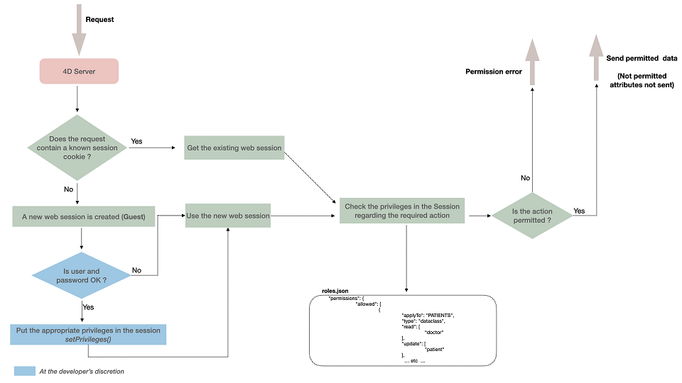

データ保護と、承認ユーザーによる迅速かつ容易なデータアクセスを両立することは、Webアプリケーションにとって大きな課題です。 ORDA のセキュリティアーキテクチャーはデータストアの中心に実装されており、プロジェクト内のさまざまなリソース (データストア、データクラス、関数など) に対して、すべての Web または REST ユーザーセッションに特定の権限を定義することができます。

## 概要

ORDA のセキュリティアーキテクチャーは、権限、許諾アクション (read、create など)、およびリソースの概念に基づいています。

Webユーザーまたは RESTユーザーがログインすると、そのセッションには自動的に関連する権限がロードされます。  権限は、[`session.setPrivileges()`](../API/SessionClass.md#setprivileges) 関数によって、セッションに割り当てられます。 Webユーザーまたは RESTユーザーがログインすると、そのセッションには自動的に関連する権限がロードされます。  権限は、[`session.setPrivileges()`](../API/SessionClass.md#setprivileges) 関数によって、セッションに割り当てられます。 権限は、[`session.setPrivileges()`](../API/SessionClass.md#setprivileges) 関数によって、セッションに割り当てられます。

セッション内で送信されるユーザーリクエストは、プロジェクトの `roles.json` ファイルで定義された権限に対して評価されます。

権限外のアクションをユーザーが実行しようとすると、権限エラーが生成されるか、あるいは読み取り権限がない属性の場合にはそのデータは送信されません。



:::tip 関連したBlog 記事

[**Filter access to your data with a complete system of permissions**](https://blog.4d.com/filter-access-to-your-data-with-a-complete-system-of-permissions/)

:::

## Resources

プロジェクト内の以下のリソースに対して、許諾アクションと権限名を割り当てることができます (この設定をパーミッションと呼びます):

- [データストア](../ORDA/dsMapping.md#データストア)
- [データクラス](../ORDA/dsMapping.md#データクラス)
- [属性](../ORDA/dsMapping.md#属性) ([計算属性](./ordaClasses.md#計算属性-1) および [エイリアス属性](./ordaClasses.md#エイリアス属性-1)を含む)
- [データモデルクラス](../ORDA/ordaClasses.md) の関数
- [シングルトン](../REST/$singleton.md) 関数

セッションがリソースにアクセスするたびに (アクセス形式に関係なく)、4D はセッションの権限を確認し、許可されていない場合にはアクセスを拒否します。

## パーミッション

パーミッションとは、リソースに対してアクションを実行できる能力のことです。 例えば、 *ds.myTable.myFunction() を実行できる* というのは、**パーミッション** を表します。 権限は、プロジェクトに対して [`roles.json`](#rolesjson-file) ファイル内にて定義されます。 各パーミッションには一つまたは複数の [権限](#privileges-and-roles) を与えることができます。

リソースに対して **特定のパーミッションが定義されていない** 場合には、リソースに対してのアクセスは、[プロジェクトで定義されているデフォルトのモード](#制限モード)によって自動的に **無制限** か **制限付き** に設定されます。

### 許諾アクション

利用可能なアクションは対象となるリソースによります。

| アクション       | データストア                                                                        | dataclass                                                             | 属性                                                                        | データモデル関数またはシングルトン関数                                                                             |
| ----------- | ----------------------------------------------------------------------------- | --------------------------------------------------------------------- | ------------------------------------------------------------------------- | ----------------------------------------------------------------------------------------------- |
| **create**  | 任意のデータクラスにおいてエンティティを作成                                                        | 当該データクラスにおいてエンティティを作成                                                 | 当該属性に許可されたデフォルト値とは異なる値を持つエンティティを作成 (エイリアス属性の場合は無視されます) | n/a                                                                                             |
| **read**    | 任意のデータクラスにおいて属性を読み取り                                                          | 当該データクラスにおいて属性を読み取り                                                   | 当該属性を読み取り                                                                 | n/a                                                                                             |
| **update**  | 任意のデータクラスにおいて属性を更新                                                            | 当該データクラスにおいて属性を更新                                                     | 当該属性を更新 (エイリアス属性の場合は無視されます)                            | n/a                                                                                             |
| **drop**    | 任意のデータクラスにおいてデータを削除                                                           | 当該データクラスにおいてデータを削除                                                    | 当該属性の null でない値を削除 (エイリアス属性と計算属性を除く)                   | n/a                                                                                             |
| **execute** | プロジェクトの任意の関数を実行 (データストア、データクラス、エンティティセレクション、エンティティ、シングルトン) | データクラスの任意の関数を実行。 データクラス関数、エンティティ関数、エンティティセレクション関数は、データクラスの関数として扱われます。 | n/a                                                                       | 当該関数を実行                                                                                         |
| **promote** | n/a                                                                           | n/a                                                                   | n/a                                                                       | 関数の実行に指定の権限を関連付けます。 権限は一時的に追加され、関数の実行終了時に削除されます。 セキュリティ上、セッション全体ではなく、当該関数を実行するプロセスのみに権限が追加されます。 |

:::note 注記

- エイリアス属性の元である属性に対するアクセス権をセッションが持っていない場合でも、[エイリアス属性](./ordaClasses.md#エイリアス属性-1) へのアクセス権があれば、これを読み取ることができます。
- 計算属性を構成する属性に対するアクセス権をセッションが持っていない場合でも、[計算属性](./ordaClasses.md#計算属性-1) へのアクセス権があれば、これを読み取ることができます。
- シングルトンクラス (`singleton` 型) には許諾アクションを割り当てることができます。その場合、そのシングルトンクラスの公開関数すべて、および、シングルトン関数 (`singletonMethod` 型）に適用されます。
- [`promote()`](../API/SessionClass.md#promote) および [`demote()`](../API/SessionClass.md#demote) 関数を使用することで、Web プロセスに対して動的に **promote** アクションを設定/削除することができます。
- デフォルト値: 現在の実装では、*Null* のみデフォルト値として利用可能です。
- REST の [強制ログインモード](../REST/authUsers.md#強制ログインモード) では、[`authentify()`関数](../REST/authUsers.md#function-authentify) は、権限の設定に関係なく常にゲストユーザーによって実行可能です。

:::

権限の設定には一貫性が必要です。特に、**update** および **drop** 権限は**read** 権限も必要とします(ただし**create** はそれを必要としません)。

### 継承されたパーミッション

あるレベルにおいて定義されたパーミッションは基本的に下位レベルに継承されますが、パーミッションは複数のレベルで設定することもできます:

- データストアレベルで定義されたパーミッションは、自動的にすべてのデータクラスに割り当てられます。 データストアレベルで定義されたパーミッションは、自動的にすべてのデータクラスに割り当てられます。 データストアレベルで定義されたパーミッションは、自動的にすべてのデータクラスに割り当てられます。 データストアレベルで定義された*execute* 権限アクションは、[シングルトン](../REST/$singleton.md) 関数を含めてプロジェクトの全ての関数に対して適用されます。
- データクラスレベルで定義されたパーミッションは、データストアの設定をオーバーライドします (あれば)。 デフォルトでは、データクラスのすべての属性が、データクラスのパーミッションを継承します。
- データクラスとは異なり、属性レベルで定義されたパーミッションは、親のデータクラスの設定をオーバーライドするのではなく、それに追加されます。 たとえば、同じ許諾アクションに対し、データクラスのレベルでは "general" という権限名を、データクラスの属性のレベルでは "detail" という権限名を割り当てた場合、その属性にアクセスするには、セッションに "general" と "detail" の両方の権限が設定されている必要があります。

:::info

パーミッションは、データストアオブジェクトや関数へのアクセスを制御します。 パーミッションは、データストアオブジェクトや関数へのアクセスを制御します。 特定の条件に基づいて読み取りデータをフィルタリングしたい場合は、[制限付エンティティセレクション](entities.md#制限付エンティティセレクション) の利用がより適切かもしれません。

:::

### ORDA クラス関数の権限の設定

パーミッションを設定する際、ORDA クラス関数の権限は、以下の形式で `applyTo` 要素に記述します:

```json
<DataclassName>.<functionName>
```

例えば、以下の関数にパーミッションを適用したい場合を考えます:

```4d
// cs.CityEntity class
Class extends Entity
  Function getPopulation() : Integer
   ...
```

... 以下のように記述します:

```json
"applyTo":"City.getPopulation"
```

これはつまり、関数に対して権限を割り当てたい場合には、異なるORDA クラス(エンティティ、エンティティセレクション、データクラス)間で同じ関数名を使用することができないということです。 この場合には、異なる関数名を使用する必要があります。 これはつまり、関数に対して権限を割り当てたい場合には、異なるORDA クラス(エンティティ、エンティティセレクション、データクラス)間で同じ関数名を使用することができないということです。 この場合には、異なる関数名を使用する必要があります。 たとえば、`cs.CityEntity` および `cs.CitySelection` クラスの両方に "drop" 関数を作成するのであれば、`dropEntity()`、`dropSelection()` といった具合に別々の関数名を設定する必要があります。 その後で、 "roles.json" ファイルに以下のように記述することができます: その後で、 "roles.json" ファイルに以下のように記述することができます:

```json
	"permissions": {
		"allowed": [
			{
				"applyTo": "City.dropEntity",
				"type": "method",
				"promote": [
					"name"
				]
			},
			{
				"applyTo": "City.dropSelection",
				"type": "method",
				"promote": [
					"name"
				]
			}
    ]
```

## 権限とロール

**権限** とは、**リソース** に対して **アクション** を実行する技術的な能力であり、**ロール** は、管理者が使用するために公開された権限のことです。 基本的にロールとは、ビジネスユーザーのプロフィールを定義するためにいくつかの権限を集めたものです。 たとえば、"manageInvoices" (請求書管理) は権限の例で、"secretary" (秘書) は ("manageInvoices" および他の権限を持つ) ロールの例です。 基本的にロールとは、ビジネスユーザーのプロフィールを定義するためにいくつかの権限を集めたものです。 たとえば、"manageInvoices" (請求書管理) は権限の例で、"secretary" (秘書) は ("manageInvoices" および他の権限を持つ) ロールの例です。

権限は、複数の "リソース+アクション" の組み合わせと関連付けることができます。 また、一つのアクションに複数の権限を関連付けることができます。 権限は、他の権限を含むことができます。

- 権限やロールの **作成** は `roles.json` ファイル内にておこないます (後述参照)。 アクセス権の範囲を **設定** するには、リソースに適用される許諾アクションに権限名を割り当てます。 アクセス権の範囲を **設定** するには、リソースに適用される許諾アクションに権限名を割り当てます。

- 各ユーザーセッションに権限やロールを **許可** するには、`Session` クラスの [`.setPrivileges()`](../API/SessionClass.md#setprivileges) 関数を使用します。

### 例題

セッションにおいて特定のロールを許可します:

```4d

exposed Function authenticate($identifier : Text; $password : Text)->$result : Text

    var $user : cs.UsersEntity

    Session.clearPrivileges()

    $result:="ゲストとしてログインしています"

    $user:=ds.Users.query("identifier = :1"; $identifier).first()

    If ($user#Null)
        If (Verify password hash($password; $user.password))
            Session.setPrivileges(New object("roles"; $user.role))
            $result:=$user.role+"としてログインしています"
        End if
    End if


```

## `roles.json` ファイル

`roles.json` ファイルは、プロジェクトのWeb セキュリティ設定の全体を記述します。 `roles.json` ファイルの構文は次のとおりです: `roles.json` ファイルの構文は次のとおりです:

| プロパティ名              |                                                                                     |                                                                                  | 型                               | 必須 | 説明                                                                                                                 |
| ------------------- | ----------------------------------------------------------------------------------- | -------------------------------------------------------------------------------- | ------------------------------- | -- | ------------------------------------------------------------------------------------------------------------------ |
| privileges          |                                                                                     |                                                                                  | `privilege` オブジェクトの Collection  | X  | 定義された権限のリスト                                                                                                        |
|                     | \[].privilege  |                                                                                  | Text                            |    | アクセス権の名称                                                                                                           |
|                     | \[].includes   |                                                                                  | String の Collection             |    | 内包する権限名のリスト                                                                                                        |
| roles               |                                                                                     |                                                                                  | `role` オブジェクトの Collection       |    | 定義されたロールのリスト                                                                                                       |
|                     | \[].role       |                                                                                  | Text                            |    | ロール名                                                                                                               |
|                     | \[].privileges |                                                                                  | String の Collection             |    | 内包する権限名のリスト                                                                                                        |
| permissions         |                                                                                     |                                                                                  | Object                          | X  | 設定されたパーミッションのリスト                                                                                                   |
|                     | allowed                                                                             |                                                                                  | `permission` オブジェクトの Collection |    | 許可されたパーミッションのリスト                                                                                                   |
|                     |                                                                                     | \[].applyTo | Text                            | X  | 対象の [リソース](#リソース) 名                                                                                                |
|                     |                                                                                     | \[].type    | Text                            | X  | [リソース](#リソース) タイプ: "datastore", "dataclass", "attribute", "method", "singletonMethod", "singleton" |
|                     |                                                                                     | \[].read    | String の Collection             |    | 権限名のリスト                                                                                                            |
|                     |                                                                                     | \[].create  | String の Collection             |    | 権限名のリスト                                                                                                            |
|                     |                                                                                     | \[].update  | String の Collection             |    | 権限名のリスト                                                                                                            |
|                     |                                                                                     | \[].drop    | String の Collection             |    | 権限名のリスト                                                                                                            |
|                     |                                                                                     | \[].execute | String の Collection             |    | 権限名のリスト                                                                                                            |
|                     |                                                                                     | \[].promote | String の Collection             |    | 権限名のリスト                                                                                                            |
| restrictedByDefault |                                                                                     |                                                                                  | Boolean                         |    | True 時、明示的なパーミッションがないリソースへのアクセスは拒否されます。                                                                            |
| forceLogin          |                                                                                     |                                                                                  | Boolean                         |    | True 時、["forceLogin" モード(強制ログインモード)](../REST/authUsers.md#強制ログインモード)が有効化されます。                   |

:::caution 注記

- "WebAdmin" 権限名は、アプリケーションによって予約されています。 この名前をカスタムの権限名に使用することは推奨されません。
- `privileges` および `roles` の名称においては文字の大小が区別されます。

:::

### デフォルトのファイルの場所と内容

新規プロジェクト作成時、デフォルトの `roles.json` ファイルは、以下の場所に生成されます:

```
<project folder>/Project/Sources/ 
```

[アーキテクチャー](../Project/architecture.md#sources) を参照ください。

デフォルトの内容:

```json title="/Project/Sources/roles.json"

{
  "privileges": [
  ],
  "roles": [
  ],
  "permissions": {
    "allowed": [
      {
        "applyTo": "ds",
        "type": "datastore",
        "read": [],
        "create": [],
        "update": [],
        "drop": [],
        "execute": [],
        "promote": []
      }
    ]
  },
  "restrictedByDefault": false,
  "forceLogin": false
}
```

:::note 互換性

以前のリリースでは、`roles.json` ファイルはデフォルトで作成されませんでした。 以前のリリースでは、`roles.json` ファイルはデフォルトで作成されませんでした。 4D 20 R6 以降、`roles.json`ファイルを含まない、または `"forceLogin": true` の設定が含まれていない既存のプロジェクトを開く場合、[設定ダイアログボックスの **Web機能** ページ](../settings/web.md#アクセス権) で **ds.authentify() 関数を通しての REST認証を有効化** ボタンが利用可能になります。 このボタンはセキュリティ設定を自動的にアップグレードします (コードを修正する必要があるかもしれません。[このブログ記事を参照ください](https://blog.4d.com/ja/force-login-becomes-default-for-all-rest-auth))。 このボタンはセキュリティ設定を自動的にアップグレードします (コードを修正する必要があるかもしれません。[このブログ記事を参照ください](https://blog.4d.com/ja/force-login-becomes-default-for-all-rest-auth))。

:::

:::note Qodly Studio

Qodly Studio for 4D においては、ログインモードはRoles and Privileges パネルの [**Force login** オプション](https://developer.4d.com/qodly/4DQodlyPro/force-login) を使用することで設定することが可能です。

:::

## 制限モード

`restrictedByDefault` プロパティは、[リソース](#resources) に対して[特定のパーミッションが定義されていない時](#パーミッション) にどのようにしてそれにアクセスできるかを設定します:

- **無制限モード** (`restrictedByDefault`: **false**): リソースに対して定義されたパーミッションがなくても、全てのリクエストがそれにアクセス可能です。 このモードは例えば、アクセスを徐々に制限していけばいいような開発環境に適しています。 このモードは例えば、アクセスを徐々に制限していけばいいような開発環境に適しています。
- **制限モード** (`restrictedByDefault`: **true**): 定義されたパーミッションがないリソースは、デフォルトでブロックされます。 このモードは例えば、アクセス権が明示的に与えられなければならないような、プロダクション環境に対して推奨されます。 このモードは例えば、アクセス権が明示的に与えられなければならないような、プロダクション環境に対して推奨されます。

:::note 互換性

- **新規プロジェクト作成時**、この `restrictedByDefault` プロパティは*roles.json* ファイルの中で**false** に設定されています(以下参照)。 この設定は、すぐに、かつスムーズに開発を始められるようにすることが目的であることに注意して下さい。 プロダクション環境においては、[`restrictedByDefault` および `forceLogin` プロパティを **true** に設定することが推奨されます](#recommended-configuration)。 この設定は、すぐに、かつスムーズに開発を始められるようにすることが目的であることに注意して下さい。 プロダクション環境においては、[`restrictedByDefault` および `forceLogin` プロパティを **true** に設定することが推奨されます](#recommended-configuration)。
- **以前のリリースから変換されたプロジェクトの場合**、 Qodly Studio へのアクセスを[ワンクリック設定ダイアログ](https://developer.4d.com/qodly/4DQodlyPro/gettingStarted#one-click-configuration) を使用して有効化した場合、 `restrictedByDefault` プロパティは、 *roles.json* ファイル内に値が **true** の状態で追加されます。

:::

### 推奨される設定{#recommended-configuration}

環境によって、推奨される設定は以下のようになります:

- **プロダクション環境**: `restrictedByDefault` および [`forceLogin`](../REST/authUsers.md#force-login-mode) を両方とも **true** に設定する。 この設定によりリソースへのアクセスにはユーザー認証と明示的に定義されたパーミッションが必要になり、最大限のセキュリティを保証します。 この設定によりリソースへのアクセスにはユーザー認証と明示的に定義されたパーミッションが必要になり、最大限のセキュリティを保証します。
- **開発環境**: `restrictedByDefault` および [`forceLogin`](../REST/authUsers.md#force-login-mode) を両方とも **false** に設定する。 この設定により、開発およびデバッグ中は簡単にアクセスすることができ、それでいて後から徐々に制限を厳しくしていくという方法が可能になります。 この設定により、開発およびデバッグ中は簡単にアクセスすることができ、それでいて後から徐々に制限を厳しくしていくという方法が可能になります。

### `Roles_Errors.json` ファイル

`roles.json` ファイルは、4D 起動時に解析されます。  このファイルへの変更を反映させるには、アプリケーションを再起動する必要があります。 このファイルへの変更を反映させるには、アプリケーションを再起動する必要があります。

`roles.json` ファイルを解析する際にエラーが発生した場合、4D はプロジェクトを読み込みますが、グローバルアクセス保護は無効になります。これにより、開発者はエラー修正のためファイルにアクセスすることができます。  また、`Roles_Errors.json` という名前のエラーファイルが [プロジェクトの `Logs` フォルダー](../Project/architecture.md#logs) に生成され、エラー行が記述されています。 このファイルは、`roles.json` ファイルのエラーがすべて修正されると、自動的に削除されます。 また、`Roles_Errors.json` という名前のエラーファイルが [プロジェクトの `Logs` フォルダー](../Project/architecture.md#logs) に生成され、エラー行が記述されています。 このファイルは、`roles.json` ファイルのエラーがすべて修正されると、自動的に削除されます。

`Roles_Errors.json` ファイルが [Logs フォルダー](../Project/architecture.md#logs) に存在するかどうか、起動時に確認することをお勧めします。存在する場合、解析エラーが発生し、アクセスが制限されないことを意味します。  たとえば、次のように書くことができます: たとえば、次のように書くことができます:

```4d title="/Sources/DatabaseMethods/onStartup.4dm"
If (Not(File("/LOGS/"+"Roles_Errors.json").exists))
…
Else // プロジェクトが開かれるのを防ぐことができます
 ALERT("roles.json ファイルが不正なため、アプリケーションを終了します。")
 QUIT 4D
End if

```

## 権限設定の例

```json title="/Project/Sources/roles.json"

{
	"forceLogin": true,
	"restrictedByDefault": true,
	"permissions": {
		"allowed": [
						{
				"applyTo": "People",
				"type": "dataclass",
				"read": [
					"viewPeople"
				]
			}
		]
	},
	"privileges": [
		{
			"privilege": "viewPeople",
			"includes": []
		}
	],
	"roles": []
}
```
