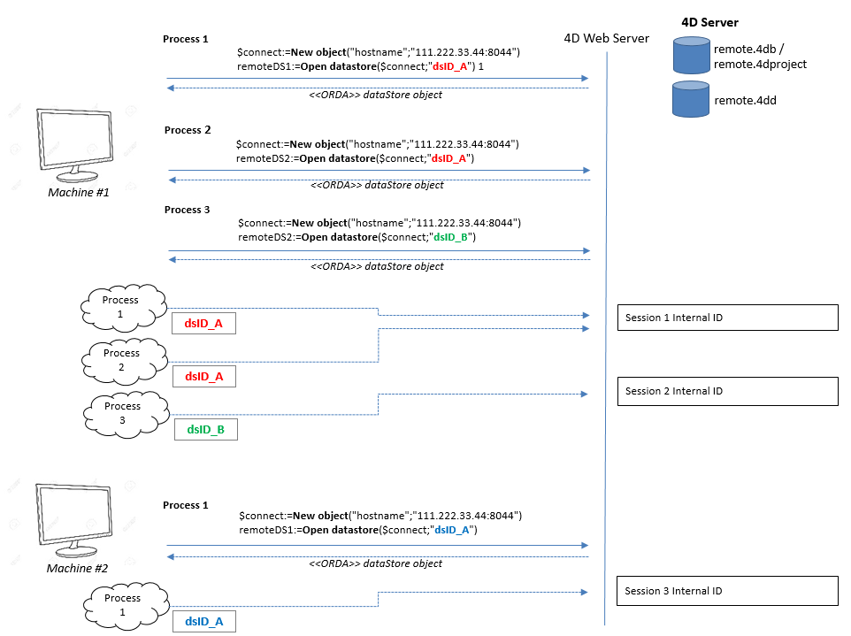

**リモートデータストア** とは、ローカルの 4Dアプリケーション (4D または4D Server) 上で使用される、別の 4Dアプリケーションの [データストア](dsMapping.md#データストア) への参照です。

ローカルの 4Dアプリケーションは、[`Open datastore`](../commands/open-datastore) コマンドを呼び出すことで、リモートデータストアに接続し参照します。

リモートマシン上で、4D は [セッション](../WebServer/sessions.md) を開いて、`Open datastore` を呼び出したアプリケーションからのリクエストを処理します。 Requests internally use the [REST API](../REST/gettingStarted.md), which means that they require [**authentication** and **available licenses**](../REST/authUsers.md).

## Webセッションの使用

[`Open datastore`](../commands/open-datastore) コマンドによって参照されるリモートデータストアの場合、リクエスト元プロセスとの接続はリモートマシン上では [Webセッション](../WebServer/sessions.md) により管理されます。

リモートデータストア上で作成される Webセッションは内部的にセッションID によって識別され、4Dアプリケーション上では `localID` と紐づいています。 データ、エンティティセレクション、エンティティへのアクセスはこのセッションによって自動的に管理されます。

`localID` はリモートデータストアに接続しているマシンにおけるローカルな識別IDです:

- 同じアプリケーションの別プロセスが同じリモートデータストアに接続する場合、`localID` とセッションは共有することができます。
- 同じアプリケーションの別プロセスが別の `localID` を使って同じデータストアに接続した場合、リモートデータストアでは新しいセッションが開始されます。
- 他のマシンが同じ `localID` を使って同じデータストアに接続した場合、新しいセッションが新しい cookie で開始されます。

これらの原則を下図に示します:

### セッションの監視

Sessions for datastore access are shown in the 4D Server administration window as [**REST sessions**](../ServerWindow/sessions.md#rest-web-and-soap-sessions) with **4D** as user agent.

## セッションの終了

[セッションの有効期限](../WebServer/sessions.md#セッションの有効期限) の段落で説明されているように、アクティビティなしにタイムアウト時間が経過すると、4D は自動的にセッションを終了します。 The default timeout is 60 mn, but this value can be modified using the *connectionInfo* parameter of the [`Open datastore`](../commands/open-datastore) command.

セッション終了後にリクエストがリモートデータストアに送信された場合、セッションは可能な限り (ライセンスがあり、サーバーが停止していない、など) 再開されます。 ただしセッションが再開しても、ロックやトランザクションに関わるコンテキストは失われていることに留意が必要です (後述参照)。

## ロッキングとトランザクション

エンティティロッキングやトランザクションに関連した ORDA 機能は、ORDA のクライアント / サーバーモードと同様に、リモートデータストアにおいてもプロセスレベルで管理されます:

- あるプロセスがリモートデータストアのエンティティをロックした場合、セッションの共有如何に関わらず、他のすべてのプロセスに対してそのエンティティはロックされた状態です ([エンティティロッキング](entities.md#エンティティロッキング) 参照)。 同一のレコードに対応する複数のエンティティが 1つのプロセスによってロックされている場合、同プロセス内でそれらがすべてアンロックされないと、ロックは解除されません。 なお、ロックされたエンティティに対する参照がメモリ上に存在しなくなった場合にも、ロックは解除されます。
- Transactions can be started, validated or cancelled separately on each remote datastore using the [`dataStore.startTransaction()`](../API/DataStoreClass.md#starttransaction), [`dataStore.cancelTransaction()`](../API/DataStoreClass.md#canceltransaction), and [`dataStore.validateTransaction()`](../API/DataStoreClass.md#starttransaction) functions. これらの操作は他のデータストアには影響しません。
- クラシックな4D ランゲージコマンド([`START TRANSACTION`](../commands/start-transaction)、 [`VALIDATE TRANSACTION`](../commands/validate-transaction)、 [`CANCEL TRANSACTION`](../commands/cancel-transaction)) は(`ds` から返される)メインのデータストアに対してのみ適用されます。
  リモートデータストアのエンティティがあるプロセスのトランザクションで使われている場合、セッションの共有如何に関わらず、他のすべてのプロセスはそのエンティティを更新できません。
- 次の場合にエンティティのロックは解除され、トランザクションはキャンセルされます:
  - プロセスが強制終了された
  - サーバー上でセッションが閉じられた
  - サーバー管理ウィンドウからセッションが強制終了された

