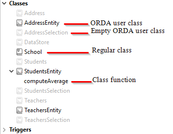
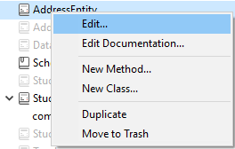
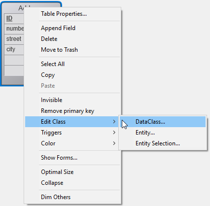

プロジェクトで使用される 4D コードは、 [メソッド](../Concepts/methods.md) および [クラス](../Concepts/classes.md) に記述されます。

4D IDE には、コードを作成・編集・エクスポート・削除するためのさまざまな機能があります。 通常は、4D付属 の [コードエディター](../code-editor/write-class-method.md) を使用して、コードを管理します。 他にも**VS Code** などのエディターを使用することもでき、VS Code に対しては[4D-Analyzer 拡張機能](https://github.com/4d/4D-Analyzer-VSCode) がご利用いただけます。

## メソッドの作成

4D のメソッドは、[`/Project/Sources/`](../Project/architecture.md#sources) フォルダーの適切なフォルダー内の **.4dm** ファイルに格納されます。

[いくつかの種類のメソッド](../Concepts/methods.md#method-types) を作成することができます:

- すべてのメソッドは、**エクスプローラー** ウィンドウから作成または開くことができます ([フォームエディター](../FormEditor/formEditor.md) から管理されるオブジェクトメソッドを除く)。
- プロジェクトメソッドは、**ファイル** メニューやツールバー (**新規/メソッド...** または **開く/メソッド...**)、[コードエディターウィンドウ](../code-editor/write-class-method.md#ショートカット) のショートカットを使っても作成したり開いたりできます。
- **トリガ** は[ストラクチャーエディター](../Develop-legacy/triggers.md#トリガの有効化と作成) からも作成したり開いたりできます。
- フォームメソッドは、[フォームエディター](../FormEditor/formEditor.md) からも作成したり開いたりできます。

## クラスの作成

### ユーザークラス

4D においてユーザークラスとは、[`/Project/Sources/Classes/`](../Project/architecture.md#sources) フォルダーに保存された専用のメソッドファイル (**.4dm**) によって定義されます。 ファイル名がクラス名になります。 例えば、"Polygon" という名前のクラスは、以下のようなファイル内に保存されます:

```
Project フォルダー
 Project
  Sources
   Classes
    Polygon.4dm
```

クラスファイルは、**ファイル** メニューやツールバー (**新規 > クラス...**)、あるいは **エクスプローラー** ウィンドウの **メソッド** ページにて作成可能です。 **Ctrl+Shift+Alt+k** ショートカットも使用できます。

エクスプローラーの **メソッド** ページにおいて、クラスは **クラス** カテゴリに分類されています。

クラスを新規作成するには次の方法があります:

- **クラス** カテゴリを選択し、 ボタンをクリックします。
- エクスプローラーウィンドウの下部にあるアクションメニュー、またはクラスグループのコンテキストメニューから **新規クラス...** を選択します。
  
- エクスプローラーのホームページのコンテキストメニューより **新規** > **クラス...** を選択します。

クラスを命名する際には、次のルールに留意してください:

- [クラス名](../Concepts/identifiers.md#クラス) は [プロパティ名の命名規則](../Concepts/identifiers.md#オブジェクトプロパティ) に準拠している必要があります。
- クラス名の大文字・小文字は区別されます。
- 競合防止のため、データベースのテーブルと同じ名前のクラスを作成するのは推奨されないこと

### ORDAクラス

[ORDA データモデルユーザークラス](../ORDA/ordaClasses.md) は、データモデル上に作成される高レベルのクラス関数です。

ORDA データモデルユーザークラスは、クラスと同じ名称の .4dm ファイルを通常のクラスファイルと同じ場所 (*つまり*、Project フォルダー内の `/Sources/Classes` フォルダ) に追加することで定義されます。 たとえば、`Utilities` データクラスのエンティティクラスは、`UtilitiesEntity.4dm` ファイルによって定義されます。

各データモデルオブジェクトに関わるクラスは、4D によってあらかじめ自動的にメモリ内に作成されます。


空の ORDA クラスは、デフォルトではエクスプローラーに表示されません。 表示するにはエクスプローラーのオプションメニューより **データクラスを全て表示** を選択します: 

ORDA ユーザークラスは通常のクラスとは異なるアイコンで表されます。 空のクラスは薄く表示されます:



ORDA クラスファイルを作成するには、エクスプローラーで任意のクラスをダブルクリックします。 4D はクラスファイルを作成し、[`extends`](../Concepts/classes.md#class-extends-classname) コードを追加します。 たとえば、Entity クラスを継承するクラスの場合は:

```
Class extends Entity
```

定義されたクラスはエクスプローラー内で濃く表示されます。

定義された ORDA クラスファイルを 4Dコードエディターで開くには、ORDA クラス名を選択してエクスプローラーのオブションメニュー、またはコンテキストメニューの **編集...** を使用するか、ORDA クラス名をダブルクリックします:



ローカルデータストア (`ds`) に基づいた ORDA クラスの場合には、4D ストラクチャーウィンドウからも直接クラスコードにアクセスできます:



### 4D IDE (統合開発環境) におけるサポート

各種 4Dウィンドウ (コードエディター、コンパイラー、デバッガー、ランタイムエクスプローラー) において、クラスコードは "特殊なプロジェクトメソッド" のように扱われます:

- コードエディター:
  - クラスは実行できません
  - クラスメソッドはコードのブロックです
  - オブジェクトメンバーに対する **定義に移動** 操作はクラスの Function 宣言を探します。例: "$o.f()" の場合、"Function f" を見つけます。
  - クラスのメソッド宣言に対する **参照箇所を検索** 操作は、そのメソッドがオブジェクトメンバーとして使われている箇所を探します。例: "Function f" の場合 "$o.f()" を見つけます。
  - ユーザークラスまたはORDA クラスとして定義された変数は、自動補完機能の対象となります。 Entity クラス変数の例です:


- ランタイムエクスプローラーおよびデバッガーにおいて、クラスメソッドは `<ClassName>` コンストラクターまたは `<ClassName>.<FunctionName>` 形式で表示されます。

## メソッドやクラスの削除

既存のメソッドやクラスを削除するには:

- ディスク上で "Sources" フォルダーより *.4dm* ファイルを削除します。
- 4D エクスプローラーでは、メソッドやクラスを選択した状態で  をクリックするか、コンテキストメニューより **移動 ＞ ゴミ箱** を選択します。

> オブジェクトメソッドを削除するには、[フォームエディター](../FormEditor/formEditor.md) で、**オブジェクト** メニューから **オブジェクトメソッド消去** を選択します。

## デザインオブジェクトアクセスコマンド

[**"デザインオブジェクトアクセス" コマンドテーマ**](../commands/theme/Design_Object_Access.md) を使用することで、アプリケーション内のすべてのメソッドのコンテンツとそのパスにプログラミングでアクセスすることができます。 このソースツールキットを使用することでコード管理ツール、具体的にはバージョン管理システム(VCS)を統合することが容易になります。 またこれを使用することで[コードドキュメンテーション](../Project/documentation.md) のための高度なシステムを実装することが可能になり、これによってカスタムのエクスプローラーや、ディスクファイルとして保存されたコードのスケジュールバックアップの構築ができるようになります。

以下のような原則が実装されています:

- 4D アプリケーション内のメソッドとフォームは、それぞれアドレスをパス名という形で持っています。 例えば、table_1 のトリガメソッドは "[trigger]/table_1" にあります。 それぞれのオブジェクトパス名はアプリケーション内で固有です。
- **デザインオブジェクトアクセス"** コマンドテーマのコマンド、例えば[`METHOD GET NAMES`](../commands/method-get-names) あるいは [`METHOD GET PATHS`](../commands/method-get-paths) などを使用することによって、4D アプリケーション内のオブジェクトにアクセスすることができます。
- このテーマ内のほとんどのコマンドは、[インタープリタモードとコンパイルモード](../Concepts/interpreted.md) の両方で動作します。 ただし、プロパティを変更するコマンド、またはメソッドから実行可能なコンテンツにアクセスするコマンドはインタープリターモードでのみ使用可能です(以下の表参照)。
- このテーマのコマンドはすべてローカルモードまたはリモートモードの4D で使用することができます。 しかしながら、コンパイルモードでは一部のコマンドを使用することはできないという点に注意してください: このテーマの目的はカスタム開発支援ツールを作成することです。 これらのコマンドを、実行中のデータベースの機能を動的に変更するために使用してはいけません。 例えば、カレントユーザーのステータスに応じてメソッドの属性を変更するために[`METHOD SET ATTRIBUTE`](../commands/method-set-attribute) を使用することはできません。
- このテーマのコマンドが[コンポーネント](../Project/components.md) から呼び出された場合、デフォルトではそのコマンドはコンポーネントのオブジェクトにアクセスします。 このような場合、ホストのオブジェクトにアクセスするためには、最後の引数として `*` を渡します。

### コンパイルモードでの使用

コンパイルプロセスの原則に関連した理由から、コンパイルモードにおいてはこのテーマ内の一部のコマンドのみ使用することができます。 以下の表は、コンパイルモードでのコマンドの利用可能状況を表したものです:

| コマンド                                                                     | コンパイルモードで使用可能 |
| ------------------------------------------------------------------------ | ------------- |
| [Current method path](../commands/current-method-path)                   | ◯             |
| [FORM GET NAMES](../commands/form-get-names)                             | ◯             |
| [METHOD Get attribute](../commands/method-get-attribute)                 | ◯             |
| [METHOD GET ATTRIBUTES](../commands/method-get-attributes)               | ◯             |
| [METHOD GET CODE](../commands/method-get-code)                           | ×             |
| [METHOD GET COMMENTS](../commands/method-get-comments)                   | ◯             |
| [METHOD GET FOLDERS](../commands/method-get-folders)                     | ◯             |
| [METHOD GET MODIFICATION DATE](../commands/method-get-modification-date) | ◯             |
| [METHOD GET NAMES](../commands/method-get-names)                         | ◯             |
| [METHOD Get path](../commands/method-get-path)                           | ◯             |
| [METHOD GET PATHS](../commands/method-get-paths)                         | ◯             |
| [METHOD GET PATHS FORM](../commands/method-get-paths-form)               | ◯             |
| [METHOD OPEN PATH](../commands/method-open-path)                         | ×             |
| [METHOD RESOLVE PATH](../commands/method-resolve-path)                   | ◯             |
| [METHOD SET ACCESS MODE](../commands/method-set-access-mode)             | ◯             |
| [METHOD SET ATTRIBUTE](../commands/method-set-attribute)                 | ×             |
| [METHOD SET ATTRIBUTES](../commands/method-set-attributes)               | ×             |
| [METHOD SET CODE](../commands/method-set-code)                           | ×             |
| [METHOD SET COMMENTS](../commands/method-set-comments)                   | ×             |

:::note

コマンドがコンパイルモードで実行された場合にはエラー -9762 "このコマンドはコンパイル済みデータベースでは実行できません。" が生成されます。

:::

### パス名の作成

4D オブジェクトに対して生成されるパス名はオペレーティングシステムのファイル管理と互換性がなければなりません。 ":" など、OS レベルで禁止されている文字はメソッド名内で自動的にエンコードされるため、生成されたファイルはバージョン管理システムに自動的に統合されます。

エンコードされる文字は以下の通りです:

| 文字                           | エンコード |
| ---------------------------- | ----- |
| "                            | %22   |
| \*                           | %2A   |
| /                            | %2F   |
| :            | %3A   |
| \< | %3C   |
| \>                          | %3E   |
| ?                            | %3F   |
| \|                           | %7C   |
| \\                         | %5C   |
| %                            | %25   |

#### 例題

`Form?1` は `Form%3F1` にエンコードされます  
`Button/1` は `Button%2F1` にエンコードされます