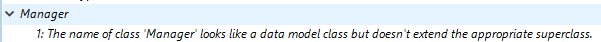

プロジェクトはコンパイルすることができます。 コンパイルとは、すべてのメソッドをマシン言語に翻訳することです。 プロジェクトをコンパイルすると、コードの整合性を調べたり、実行速度を向上させることができます。さらに、コード全体を難読化することにより保護することも可能です。 4D でプロジェクト開発をおこない、それをスタンドアロンアプリケーションとして配布するまでの間の手順として、コンパイルは不可欠です。

## コンパイル

コンパイル処理はすべて 4Dアプリケーションにより自動的でおこなわれます。

> On macOS, the compilation requires that you install `Xcode`. See [this section](#silicon-compiler) for more information about this requirement.

1. Open the compiler window by selecting the **Compiler...** command in the **Design** menu or the **Compiler** toolbar button.

   

   

> You can also launch directly the compilation by selecting the **Start Compilation** menu item from the **Design** menu.

2. Click the **Compile** button to launch the compilation using the current [compilation settings](#compiler-settings).

エラーが検出されなければ、実際のコンパイル処理が開始します。コンパイル処理が完了すると、"コンパイルに成功しました" というメッセージがウィンドウの下部に表示されます:


You can immediately [run your application in compiled mode](#run-compiled) and see how faster it is.

エラーが検出されると処理が中止され、"コンパイルに失敗しました" というメッセージが表示されます。 ウィンドウの情報エリアに、問題となるメソッド名と行番号が階層リスト形式で表示されます:


関係するメソッドを直接 4D のコードエディターで開くには、検出された各エラーをダブルクリックします。 エラーを含む行がハイライト表示され、エラーの種類がウィンドウのシンタックスエリアに表示されます。

Use the **Previous Error** / **Next Error** commands of the **Method** menu to navigate from one error to the next.

初めてのコンパイルで検出されるエラーの数に辟易するかもしれませんが、気にすることはありません。 ほどなく、これらのエラーが同じ原因によるものであることに気づくでしょう。たとえば、特定のプロジェクト規約に対する違反などです。 The compiler always provides a [precise diagnosis](#error-file) of the errors in order to help you correct them.

> コンパイルには、適切なライセンスが必要です。 ライセンスがない場合、コンパイルを実行することはできません (ボタンが無効になります)。 その場合でも、シンタックスチェックと変数定義メソッドの生成はおこなうことができます。

## コンパイル済み実行

Once a project is compiled, it is possible to switch from [interpreted mode to compiled mode](Concepts/interpreted.md), and vice versa, at any time and without having to quit the 4D application (except when the interpreted code has been removed). To do this, use the **Restart Interpreted** and **Restart Compiled** commands of the **Run** menu. The [Open project dialog box](GettingStarted/creating.md#options) also offers a choice between interpreted or compiled mode for database startup.

モードを変更すると、4D は現在のモードを閉じ、新しいモードを開きます。 つまり、アプリケーションが閉じられ、再び開かれます。 Each time you change from one mode to another, 4D executes the two following database methods (if specified) in this order: `On Exit` -> `On Startup`.

インタープリターモードでプロジェクトを編集したら、それをコンパイルコードに反映させるには再コンパイルしなければなりません。

## コンパイラーウィンドウ

In addition to the [**Compile** button](#compile), the Compiler window provides additional features that are useful during the project development phase.

### シンタックスチェック

The **Check Syntax** button starts the execution of the syntax-checking phase. チェックが終了すると、検出されたエラーがすべて情報エリアに表示されます。 エラー行をダブルクリックすると、対応するメソッドを表示することができます。

Syntax checking can also be launched directly using the **Check Syntax** command associated with the **Compiler** toolbar button. アプリケーションをコンパイルするための適切なライセンスを持たない場合は、このオプションしか使用できません。

### 型宣言を生成する

The **Generate Typing** button creates or updates typing compiler methods. Compiler methods are project methods that group together all the variable and array typing declarations (process and interprocess), as well as the [method parameters declared outside prototypes](../Concepts/parameters.md#method-parameters-declared-outside-prototypes). これらのメソッドが存在する場合には、これらが直接コンパイラーによってコンパイル中に利用されるため、コンパイル速度が向上します。

The name of these methods must begin with `Compiler_`. You can set the default name for each of the 5 compiler methods in the [compiler settings window](#compiler-methods-for). The compiler methods that are generated and maintained by 4D automatically have the `Invisible` attribute:


コンパイラーメソッドは、必要な (つまり、プロジェクト内に存在する項目の分) だけが作成されます。

情報エリアには、メソッドの作成・更新時に検出されたエラーが示されます。 エラー行をダブルクリックすると、対応するメソッドと行がコードエディター上に表示されます。

### コンパイルコードを削除

The **Clear compiled code** button deletes the compiled code of the project. When you click on it, all of the [code generated during compilation](#classic-compiler) is deleted, the **Restart Compiled** command of the **Run** menu is disabled and the "Compiled Project" option is not available at startup.

### 警告を表示/隠す

警告は、コンパイラーがシンタックスチェックをおこなう際に生成するとメッセージです。 これらのメッセージの目的は、実行時エラーを引き起こす可能性のあるステートメントに注意を向けることです。 警告によりコンパイルが中断されることはありません。

状況や使用されるプログラミングスタイルによって、これらのメッセージの重要性は変化します。 You can toggle the warnings on or off by clicking the **Show/Hide Warnings** button:


このオプションを有効にすると、ウィンドウには他のエラータイプの後に警告 (あれば) が表示されます。 実際の表示は次のとおりです:



警告をダブルクリックすると、対応するメソッドが開かれます。

#### コンパイル時に警告を無効にする

コンパイル時に特定の警告を選択的に無効にすることができます。これをおこなうには、4Dメソッドのコード内に次を挿入します:

```4d
  //%W-<warning number>
```

無効化できるのは、番号の付いた警告に限られます。 警告番号は、コンパイルエラーリストの各メッセージの最後に示されています。 たとえば、次の警告を無効にしたいものとします:

_1: 配列定義コマンド内にポインタが存在します (518.5)_

... you just need to write the following comment in a 4D method, preferably a `COMPILER_xxx` method (method compiled first):

```4d
  //%W-518.5
```

## コンパイラー設定

ストラクチャー設定ダイアログボックスの "コンパイラー" ページでは、プロジェクトのコンパイルに関連するパラメーターを設定できます。 You can directly open this page from the [compiler window](#compiler-window) by clicking on the **Compiler Settings** button:


### コンパイルオプション

このエリアには、コンパイル処理中に使用される一般的なオプションがまとめられています。

#### Symbolファイルを生成

Used to generate the symbol file (see [symbol file](#symbol-file)). The symbol file is created in the in the [Logs folder](Project/architecture.md#logs) of the project with the name `ProjectName_symbols.txt`.

#### エラーファイルを生成

Used to generate the error file (see [error file](#error-file)) at the time of syntax checking. The error file is created in the [Logs folder](Project/architecture.md#logs) of the project with the name `ProjectName_errors.xml`.

#### コンパイルパス

コンパイラーによって実施されるコード解析の実行周期数を設定するために使用します。これは、コンパイルの所要時間に影響します。

- **Type the variables**: Check this option if you want the compiler to infer the type of variables and parameters in your code. このオプションは、コンパイルを可能にするために必要なすべてのステップをコンパイラーに実行させるため、コンパイルの時間が増加します。
- **Process and interprocess variables are typed**: The pass for typing process and interprocess variables as well as method parameters declared outside prototypes is not carried out. このオプションを選択する場合、すべてのプロセス変数とインタープロセス変数は開発者自身が宣言するか、コンパイラーメソッドを自動生成する機能を使用しなければなりません。
- **All variables are typed**: The pass for typing local, process and interprocess variables as well as method parameters declared outside prototypes is not carried out. このオプションを選択する場合、すべての変数およびメソッド引数が明示的に宣言されていなければなりません。

:::tip

You can use the [Generate Typing](#generate-typing) button then compile with one of the two last options.

:::

#### コンパイル対象CPU

<details><summary>履歴</summary>

| リリース | 内容 |
| ---- | -- |
| 19   | 追加 |

</details>

この設定で、4Dプロジェクトをネイティブコンパイルする対象となるプロセッサー・ファミリーを選択します。 4D のコンパイラーは 2つのプロセッサー・ファミリーに向けてネイティブコードをビルドできます:

- **Intel/AMD** processors (all machines),
- **Apple Silicon** processors.

対象CPUの選択肢は 2つ提示されます。 結果は、4D を実行しているマシンのプロセッサーに依存します。

| _オプション_                                                       | _Windows Intel/AMD_                                                                  | _macOS Intel_                                                                          | _macOS Silicon_                                                                        |
| ------------------------------------------------------------- | ------------------------------------------------------------------------------------ | -------------------------------------------------------------------------------------- | -------------------------------------------------------------------------------------- |
| **全てのプロセッサ (Intel/AMD および Apple Silicon)** | Code for Intel/AMD<br/>_It is not possible to produce Apple Silicon code on Windows_ | Code for Apple Silicon + Code for Intel/AMD<br/>_Two compiled codes will be available_ | Code for Apple Silicon + Code for Intel/AMD<br/>_Two compiled codes will be available_ |
| **自分のプロセッサ (プロセッサー名)**                     | Intel/AMD 用コード                                                                       | Intel/AMD 用コード                                                                         | Apple Silicon 用コード                                                                     |

> Apple Silicon compiler target requires that the **Clang** application be installed on your machine. Clang は最新バージョンの Xcode に含まれています。 See the [Silicon compiler requirements](#requirements) for more information.

### デフォルトの型指定

このエリアでは、曖昧なデータベースオブジェクトのデフォルト型を設定します。

- **Numeric**: Used to force numeric typing in an unambiguous manner, either in real or longint. プロジェクトにて型指定ディレクティブが書かれている場合、そちらが優先されます。 倍長整数を指定することでデータベースを最適化できます。
- **Button**: Used to force button typing in an unambiguous manner, either in real or longint. プロジェクトにて型指定ディレクティブが書かれている場合、そちらが優先されます。 この型指定はボタンのほか、チェックボックス、ピクチャーボタン、ボタングリッド、ラジオボタン、ピクチャーポップアップメニューおよびドロップダウンリストが対象となります。

### コンパイラーメソッド...

This area lets you rename the Compiler methods that are generated automatically by the compiler when you click [Generate Typing](#generate-typing).

最大 5つのコンパイラーメソッドが生成されます。プロジェクトに対応する要素が存在する場合のみ、コンパイラーメソッドは作成されます:

- **Variables**: Groups together process variable declarations;
- **Interprocess Variables**: Groups together interprocess variable declarations;
- **Arrays**: Groups together process array declarations;
- **Interprocess Arrays**: Groups together interprocess array declarations;
- **Methods**: Groups together method parameter declarations (e.g `C_LONGINT(mymethod;$1;$2)`) for [method parameters declared outside prototypes](../Concepts/parameters.md#method-parameters-declared-outside-prototypes). For more information, see [`Compiler_Methods` method](../Concepts/parameters.md#compiler_methods-method).

You can rename each of these methods in the corresponding areas, but they will always be preceded by the label `Compiler_` (non-modifiable). 各メソッド名は、接頭辞を含めて 31文字以下でなければなりません。 It must also be unique and comply with [4D rules for naming methods](Concepts/identifiers.md#project-methods).

## コンパイルツール

### Symbolファイル

If you check the [**Generate the symbol file**](#generate-the-symbol-file) option in the compiler settings, a symbol file called `ProjectName_symbols.txt` is created in the [Logs folder](Project/architecture.md#logs) of the project during compilation. このドキュメントはいくつかの部分に分かれています:

#### プロセスおよびインタープロセス変数のリスト

これら 2つのリストは、4つのカラムに分かれています:

- プロジェクト内で使用されているプロセス変数、インタープロセス変数、および配列の名前。 変数は ABC順に表示されます。
- 変数の型。 変数の型は、コンパイラー命令コマンドにより設定されるか、変数の使われ方に基づいてコンパイラーが判断します。 変数の型が特定できない場合、このカラムは空欄になります。
- 変数が配列の場合に、その次元数が表示されます。
- コンパイラーが変数の型を決定したコンテキストへの参照。 変数が複数のコンテキストで使用されている場合は、コンパイラーが変数の型を決定する際に使用したコンテキストが表示されます。
  - 変数がデータベースメソッド内で検出された場合、(M)\* に続けて 4D で定義されたデータベースメソッド名が表示されます。
  - 変数がプロジェクトメソッド内で検出された場合、(M) に続けて 4D で定義されたメソッド名が表示されます。
  - 変数がトリガー (テーブルメソッド) 内で検出された場合、(TM) に続けてテーブル名が表示されます。
  - 変数がフォームメソッド内で検出された場合、テーブル名と (FM) に続けてフォーム名が表示されます。
  - 変数がオブジェクトメソッド内で検出された場合、フォーム名、テーブル名、(OM) に続けてオブジェクトメソッド名が表示されます。
  - 変数がフォーム上のオブジェクトであり、プロジェクトメソッド、フォームメソッド、オブジェクトメソッド、トリガーのいずれでも使用されていない場合は、(F) に続けてそのオブジェクトが使用されるフォーム名が表示されます。
    各リストの最後には、プロセス変数とインタープロセス変数のサイズがバイト単位で表示されます。

> コンパイル時に、コンパイラーは特定のプロセス変数が使用されているプロセスを判別できません。 プロセス変数には、プロセスごとに異なる値が格納されている可能性があります。 そのため、新規プロセスが開始されるたびに、すべてのプロセス変数が意図的に複製されます。したがって、メモリ上でこれらのプロセス変数が占める容量に注意することが推奨されます。 また、プロセス変数に使われる容量は、プロセスのスタックサイズとは関連しないことに留意が必要です。

#### ローカル変数のリスト

ローカル変数のリストは、データベースメソッド、プロジェクトメソッド、トリガー、フォームメソッド、オブジェクトメソッドごとに、4D内と同じ順番で並べられています。

このリストは、3つのカラムに分かれています:

- メソッドで使用されるローカル変数のリスト
- 変数の型
- 変数が配列の場合に、その次元数

#### メソッドの全リスト

ファイルの最後には、データベースメソッドとプロジェクトメソッドの全リストが、それぞれ次の情報とともに納められます:

- 戻り値の型 (戻り値のあるプロシージャーまたは関数)
- パラメーターの型 (受け渡される引数および戻される値)
- コール数
- スレッドセーフまたはスレッドアンセーフ・プロパティ

この情報は、次の形式で示されます:

```
Procedure or Function <Method name>(parameter data types):
result data type, number of calls, Thread Safe or Thread Unsafe
```

### エラーファイル

You can choose whether or not to generate an error file during compilation using the [**Generate error file**](#generate-error-file) option in the compiler settings. The error file is automatically named `projectName_errors.xml` and is placed in the [Logs folder](Project/architecture.md#logs) of the project.

Although the errors can be accessed directly via the [compiler window](#compile), it can be useful to have an error file that can be transmitted from one machine to another. エラーファイルは、その内容を自動的に解析しやすいように XMLフォーマットで生成されます。 これを利用して、エラー表示用に独自のインターフェースを作成することもできます。

エラーファイルの長さは、コンパイラーにより生成されるエラーと警告の数により変わります。

エラーファイルの構造は次のとおりです:

- ファイルの一番上にはエラーと警告のリストがあり、メソッドごと、そして 4D で作成された順序で並べられます。
- In the _**General errors**_ section, all the typing impossibilities and identity ambiguities are grouped together. これらのエラーと警告は、次の形式で表示されます:
  - メソッドにおける行番号 (0 は全般的なエラー)
  - warning属性は、検出された異常が警告であるのか (warning="true")、あるいはエラーであるのか (warning="false") を表わします
  - エラーを解説する診断の表示

If your project does not have any general errors, the file will not have a _General errors_ section.

エラーファイルには、次の 3つのタイプのメッセージが含まれます:

- **Errors linked to a specific line**: these errors are displayed in context — the line in which they were found — with an explanation. コンパイラーは、データ型やシンタックスに関する矛盾を含む式で見つけると、このタイプのエラーをレポートします。 コンパイラーウィンドウでは、検出された各エラーをダブルクリックすると、該当するメソッドが直接 4Dのコードエディターで開かれ、エラーを含む行が反転表示されます。

- **General errors**: These are errors that make it impossible to compile the project. コンパイラーが全般的なエラーを生成するケースは、次の 2つです:
  - プロセス変数のデータ型が決定できなかった。
  - 異なる 2つのオブジェクトが同じ名称である。

全般的なエラーは特定のメソッドに関連していないため、このような名前が付けられています。 最初のケースは、コンパイラーがプロジェクトのいずれの箇所でも、指定された型定義を実行できなかった場合です。 2番目のケースでは、いずれのオブジェクトに特定の名前を割り当てるべきかを決定できません。

- **Warnings**: Warnings are not errors. 警告により、プロジェクトがコンパイルできなくなることはありません。これは、エラーになる可能性のあるコードを示すだけです。 コンパイラーウィンドウにおいて、警告はイタリック体で表示されます。 それぞれの警告をダブルクリックすると、該当するメソッドが直接 4Dのコードエディターで開かれ、その警告に関係する行が反転表示されます。

### 範囲チェック

4Dコンパイラーによって生成されたコードでは、配列要素へのアクセスや文字参照が実際に配列や文字列の範囲内でおこなわれているかが自動的に確認されます。 範囲外へのアクセスは、ランタイム実行エラーを誘発します。

コード内で間違いがないと思われる箇所に対して範囲チェックを適用したくないときもあります。 具体的には、かなりの回数繰り返されるループに関し、旧式のマシン上でコンパイル済みデータベースを実行すると、範囲チェックにより処理速度が著しく低下するおそれがあります。 関連するコードに誤りがなく、システムエラーを引き起こさないことが確実であれば、範囲チェックをローカル上で無効にすることができます。

To do this, you must surround the code to be excluded from range checking with the special comments `//%R-` and `//%R+`. The `//%R-` comment disables range checking and `//%R+` enables it again:

```4d
  // %R-   to disable range checking
 
 ... //Place the code to be excluded from range checking here
 
  // %R+   to enable range checking again for the rest
```

## コンパイラーについて

4D には 2種類のコンパイラーがあります:

- "クラシック" コンパイラーは Intel/AMDプロセッサー向けのネイティブコードをコンパイルします
- "Apple Silicon用コンパイラー" は Apple Silicon プロセッサー向けのネイティブコードをコンパイルします

クラシックコンパイラーは Windows および macOS のどちらでも使用できますが、Apple SIlicon用コンパイラーは macOS マシンでのみ使用できます:

|             |        Windows用コンパイル        |       Intel Mac用コンパイル       |      Silicon Mac用コンパイル      |
| ----------- | :-------------------------: | :-------------------------: | :-------------------------: |
| Windows     | &#10003 | &#10003 | &#10007 |
| Intel Mac   | &#10003 | &#10003 | &#10003 |
| Silicon Mac | &#10003 | &#10003 | &#10003 |

どちらのコンパイラーも 4D に統合されています。 The appropriate compiler is automatically selected depending on the [compilation target](#compilation-target) option.

### クラシックコンパイラー

マシンの OS に関わらず、クラシックコンパイラーは Intel/AMDプロセッサー向けのネイティブコンパイルコードを生成します。 特別な設定は必要ありません。

Resulting compiled code is stored in the [DerivedData](architecture.md#deriveddata) folder of the project.

### Apple Silicon用コンパイラー

The Silicon compiler generates native compiled code for Apple Silicon processors, such as _Apple M1_.

Resulting compiled code is stored in the [Libraries](architecture.md#libraries) folder of the project.

#### 要件

- **Apple machine**: The Silicon compiler can only be run from an Apple machine.
- **4D Project architecture**: The Silicon compiler is only available for 4D developments using [project architecture](architecture.md).
- **Xcode or Developer Tools**: The Silicon compiler calls the **Clang** open-source macOS compiler to compile the project from C++ code at the [second step](#incremental-compiler) of compilation. _clang_ requires Apple native libraries, which are provided by either the **Xcode** or **Developer Tools** package.
  - **If you already have** Xcode or Developer Tools installed on your computer, you only need to make sure that its version is compliant with 4D requirements.
  - **If you do not have** any of these tools installed on your computer, you will need to download one of them from the Apple Developer web site.

> We recommend to install **Xcode**, which is quite simple to install. You can decide to install **Developer Tools** which is more compact, however its installation is a little more complex.

いずれにせよ、要件が満たされていない場合には、4D の Apple Silicon用コンパイラーが警告を発します。

#### インクリメンタルコンパイラー

Apple Silicon用コンパイラーはインクリメンタルコンパイラーです:

- During the very first compilation, **all 4D methods** are compiled. これには時間がかかる可能性がありますが、 一度きりです。
- During all subsequent compilations, only **new or modified methods** are processed, thus reducing drastically the compilation time.
