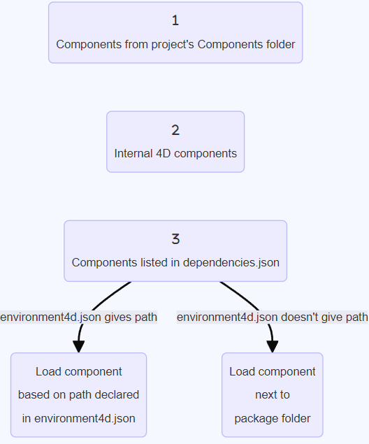
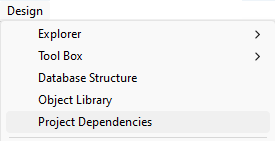
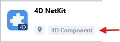
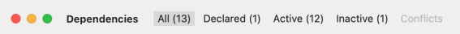

4D のコンポーネントとは、プロジェクトに追加可能な、1つ以上の機能を持つ 4Dコードや 4Dフォームの一式です。 たとえば、[4D SVG](https://github.com/4d/4D-SVG)コンポーネント は、SVGファイルの表示するための高度なコマンドと統合されたレンダリングエンジンを追加します。

独自の 4Dコンポーネントを [開発](../Extensions/develop-components.md) し、[ビルド](../Desktop/building.md) することもできますし、4Dコミュニティによって共有されているパブリックコンポーネントを [GitHubで見つけて](https://github.com/search?q=4d-component\&type=Repositories) ダウンロードすることもできます。

## インタープリターとコンパイル済みコンポーネント

コンポーネントは、インタープリターまたは [コンパイル済み](../Desktop/building.md) のものが使えます。 コンポーネントのパッケージフォルダーには以下のいずれかが含まれます:

- プロジェクトフォルダー (インタープリターのコンポーネント)
- または .4DZ ファイル (コンパイル済みコンポーネント)

インタープリターモードで動作する 4Dプロジェクトは、インタープリターまたはコンパイル済みどちらのコンポーネントも使用できます。 コンパイルモードで実行される 4Dプロジェクトでは、インタープリターのコンポーネントを使用できません。 この場合、コンパイル済みコンポーネントのみが利用可能です。

## コンポーネントの読み込み

### 基本

4Dプロジェクトにコンポーネントを読み込むには、以下の方法があります:

- **dependencies.json**ファイル (および任意で **environment4d.json** ファイル) でコンポーネントを参照します。
- または、[プロジェクトの **Components** フォルダー](architecture.md#components) にコンポーネントファイルをコピーします。

同じコンポーネントが異なる場所にインストールされている場合、[優先順位](#優先順位) が適用されます。

### dependencies.json

1. 4Dプロジェクトの **dependencies.json** ファイルで、コンポーネント名を参照します。 このマニフェストファイルは、4Dプロジェクトフォルダの **Sources** フォルダーに保存する必要があります。例:
   ```
   /MyProjectRoot/Project/Sources/dependencies.json
   ```
2. デフォルトの場合、コンポーネントのパッケージフォルダー (コンポーネントプロジェクトのルートフォルダー) を 4Dプロジェクトのパッケージフォルダーと同じ階層にコピーします。例:
   ```
   /MyProjectRoot/
   /MyProjectComponentRoot/
   ```

このアーキテクチャーにより、プロジェクトと同じレベルにすべてのコンポーネントを簡単にコピーし、必要であれば **dependencies.json** ファイルで参照することができます。 さらに、コンポーネントのパスをカスタマイズすることもできます (後述参照)。

**/Sources/dependencies.json** ファイルの内容は次の構造で記述する必要があります:

```json
{
	"dependencies": {
		"myComponent1" : {},
		"myComponent2" : {}
	}
}
```

... ここでの "myComponent1" と "myComponent2" は、プロジェクトパッケージフォルダーと同じレベルにあるコンポーネントの名前であり、プロジェクトに読み込まれるコンポーネントです。

### environment4d.json

[**dependencies.json** ファイル](#dependenciesjson) で宣言されたコンポーネントの場所をカスタマイズしたい場合は、**environment4d.json** ファイルを使用できます。 このファイルは、プロジェクトフォルダーと同じレベルに格納されていない依存関係のパスを宣言するためのものです。

パスには、[POSIXシンタックス](../Concepts/paths#posix-シンタックス) で表現された、絶対パスまたは相対パスを使用できます。 相対パスは、environment4d.json ファイルを基準として相対パスです。

例:

```json
{
	"dependencies": {
		"myComponent1" : "MyComponent1",
		"myComponent2" : "../MyComponent2",
        "myComponent3" : "file:///Users/jean/MyComponent3"
    }
}
```

**environment4d.json** ファイルは、プロジェクトパッケージフォルダーまたはその親フォルダーのいずれかに保存することができます (ルートまでの任意のレベル)。 このアーキテクチャーの利点は、この環境ファイルをプロジェクトの親フォルダーに保存することで、コミットしないように選択できることです。これにより、ローカルでのコンポーネントの管理が可能になります。

:::note

**environment4d.json** ファイルで宣言されたコンポーネントのパスが、プロジェクトの開始時に見つからない場合、コンポーネントは読み込まれず、_Not found_ [ステータス](#依存関係のステータス) が表示されます。

:::

### 優先順位

コンポーネントはさまざまな方法でインストールできるため、同じコンポーネントが複数の場所で参照される場合、優先順位が適用されます:

**優先度高**

1. [プロジェクトの **Components** フォルダー](architecture.md#components) に置かれているコンポーネント
2. **dependencies.json** ファイルで宣言されているコンポーネント
3. 内部のユーザー4Dコンポーネント (4D NetKit、4D SVG など)

**優先度低**



同じコンポーネントの別のインスタンスがより高い優先度レベルにあるためにコンポーネントを読み込めない場合、そのコンポーネントには _Overloaded_ [ステータス](#依存関係のステータス) が与えられます。 この場合、読み込まれている方のコンポーネントには _Overloading_ [ステータス](#依存関係のステータス) が与えられます。

## プロジェクトの依存関係の監視

開かれているプロジェクトでは、**依存関係** パネルで依存関係と現在の読み込み状態に関する情報を取得することができます。

依存関係パネルを表示するには:

- 4D では、**デザイン/プロジェクト依存関係** メニューアイテムを選択します (開発環境)。<br/>
  

- 4D Server では、**ウインドウ/プロジェクト依存関係** メニューアイテムを選択します。<br/>
  

依存関係パネルが表示されます。 依存関係は ABC順にソートされます。


### 依存関係のオリジン

依存関係パネルには、各依存関係のオリジン (由来) にかかわらず、プロジェクトの依存関係すべてがリストされます。 依存関係のオリジンは、名前の下に表示されるタグによって判断することができます:



以下のオリジンがサポートされています:

| オリジンタグ        | 説明                                                              |
| ------------- | --------------------------------------------------------------- |
| 4Dコンポーネント     | 4Dアプリケーションの `Components` フォルダーに保存されているビルトインの 4Dコンポーネント          |
| ソース           | [`dependencies.json`](#dependenciesjson) ファイルで宣言されているコンポーネント    |
| 環境            | [`environment4d.json`](#environment4djson) ファイルで宣言されているコンポーネント  |
| プロジェクトコンポーネント | [`Components`](architecture.md#components) フォルダー内に置かれているコンポーネント |

依存関係の行で **右クリック** し、**ディスク上に表示** を選択すると、依存関係の保管場所が表示されます:


:::note

依存関係が非アクティブの場合は、ファイルが見つからないためこの項目は表示されません。

:::

### 依存関係のフィルタリング

デフォルトでは、依存関係マネージャーによって識別されたすべての依存関係は、それらの [ステータス](#依存関係のステータス) に関係なくリストされます。 依存関係パネル上部のタブを選択することで、依存関係のステータスに応じてリストの表示をフィルタリングできます:



- **アクティブ**: プロジェクトに読み込まれ、使用できる依存関係。 実際にロードされた _Overloading_ な依存関係が含まれます。 _Overloaded_ である方の依存関係は、その他の競合している依存関係とともに **コンフリクト** パネルに表示されます。
- **非アクティブ**: プロジェクトに読み込まれておらず、利用できない依存関係。 このステータスには様々な理由が考えられます: ファイルの欠落、バージョンの非互換性など…
- **コンフリクト**: プロジェクトに読み込まれてはいるものの、先に読み込まれた [優先度](#優先順位) の高い依存関係と競合している依存関係。 _Overloaded_ な依存関係も表示されるため、競合の原因を確認し、適切に対処することができます。

### 依存関係のステータス

デベロッパーの注意を必要とする依存関係は、行の右側の **ステータスラベル** と背景色で示されます。


使用されるステータスラベルは次のとおりです:

- **Overloaded**: 依存関係は読み込まれていません。より上位の [優先順位](#優先順位) において、同じ名前の依存関係がすでに読み込まれています。
- **Overloading**: 依存関係は読み込まれていますが、下位の [優先順位](#優先順位) において読み込まれなかった同じ名前の依存関係が存在します。
- **Not found**: dependencies.jsonファイルで依存関係が宣言されていますが、見つかりません。
- **Inactive**: プロジェクトと互換性がないため、依存関係は読み込まれていません (例: 現在のプラットフォーム用にコンポーネントがコンパイルされていない、など)。
- **Duplicated**: 依存関係は読み込まれていません。同じ名前を持つ別の依存関係が同じ場所に存在し、すでに読み込まれています。

依存関係の行にマウスオーバーするとツールチップが表示され、ステータスに関する追加の情報を提供します:


