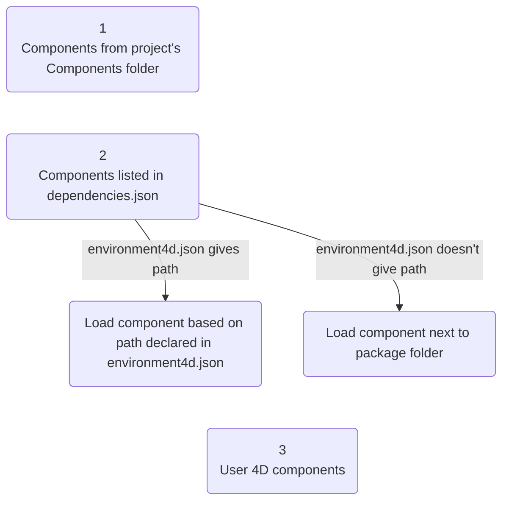
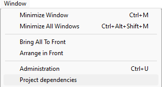
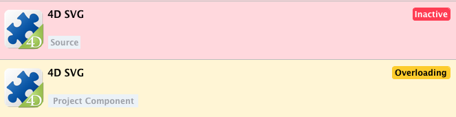
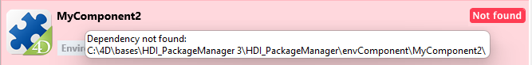
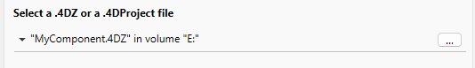
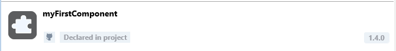
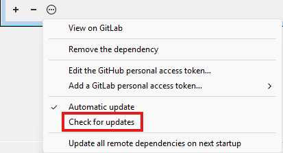
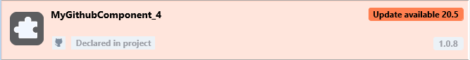
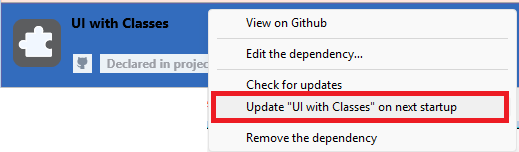

4D [プロジェクトアーキテクチャー](../Project/architecture.md) はモジュール式です。 [**コンポーネント**](../Concepts/components.md) や [**プラグイン**](../Concepts/plug-ins.md) をインストールすることで、4Dプロジェクトに追加機能を持たせることができます。 コンポーネントは4D コードで書かれていますが、プラグインは[あらゆる言語を使用してビルドすることができます](../Extensions/develop-plug-ins.md)。

You can [develop](../Extensions/develop-components.md) and [build](../Desktop/building.md) your own 4D components, or download public components shared by the 4D community that [can be found for example on GitHub](https://github.com/topics/4d-component).

4D 環境にインストールされると、拡張機能は特別なプロパティを持つ**依存関係** として扱われます。

## インタープリターとコンパイル済みコンポーネント

コンポーネントは、インタープリターまたは [コンパイル済み](../Desktop/building.md) のものが使えます。

- インタープリターモードで動作する 4Dプロジェクトは、インタープリターまたはコンパイル済みどちらのコンポーネントも使用できます。
- コンパイルモードで実行される 4Dプロジェクトでは、インタープリターのコンポーネントを使用できません。 この場合、コンパイル済みコンポーネントのみが利用可能です。 この場合、コンパイル済みコンポーネントのみが利用可能です。

### パッケージフォルダ

コンポーネントのパッケージフォルダ(*MyComponent.4dbase* フォルダ) には以下のものを含めることができます:

- **インタープリタ版コンポーネント**の場合: 標準の[Project フォルダ](../Project/architecture.md)。 **インタープリタ版コンポーネント**の場合: 標準の[Project フォルダ](../Project/architecture.md)。 [プロジェクトの**Components** フォルダ](architecture.md#コンポーネント)にインストールする場合には、パッケージフォルダ名の末尾を **.4dbase** にする必要があります。
- **コンパイル版コンポーネント**の場合:
  - .4DZ ファイル、*Resources* フォルダ、*Info.plist* ファイルを格納している"Contents" フォルダ(推奨されるアーキテクチャ)
  - *Resources* などの他のフォルダを格納している.4DZ ファイル。

:::note

アプリケーションをmacOS 上で[公証](../Desktop/building.md#公証について) したい場合には、"Contents" フォルダアーキテクチャーが推奨されます。

:::

## コンポーネントの場所

When developing in 4D, the component files can be transparently stored in your computer or located on an external GitHub or GitLab repository.

:::note

This section describes how to work with components in the **4D** and **4D Server** environments. 他の環境では、コンポーネントの管理は異なります:

- [リモートモードの 4D](../Desktop/clientServer.md) では、サーバーがコンポーネントを読み込み、リモートアプリケーションに送信します。
- 統合されたアプリケーションでは、コンポーネントは [ビルドする際に組み込まれます](../Desktop/building.md#プラグインコンポーネントページ)。

:::

### 概要

4Dプロジェクトにコンポーネントを読み込むには、以下の方法があります:

- コンポーネントファイルを[プロジェクトの**Components**フォルダ](architecture.md#components)内にコピーする(インタープリタ版コンポーネントパッケージフォルダはフォルダ名の末尾が".4dbase" になっている必要があります、上記参照)。
- または、プロジェクトの **dependencies.json** ファイルでコンポーネントを宣言します。これは、[**依存関係インターフェースを使用して依存関係を追加**](#github依存関係の追加) するときに、ローカルファイルに対して自動的におこなわれます。

**dependencies.json** ファイルで宣言されているコンポーネントは、異なる場所に保存できます:

- 4Dプロジェクトのパッケージフォルダーと同じ階層 (デフォルトの場所です)
- マシン上の任意の場所 (コンポーネントパスは **environment4d.json** ファイル内で宣言する必要があります)
- on a GitHub or [GitLab](https://blog.4d.com/integrate-4d-components-directly-from-gitlab) repository: the component path can be declared in the **dependencies.json** file or in the **environment4d.json** file, or in both files (a [local cache](#local-cache-for-dependencies) is then handled automatically).

同じコンポーネントが異なる場所にインストールされている場合、[優先順位](#優先順位) が適用されます。

### dependencies.json と environment4d.json

#### dependencies.json

**dependencies.json** ファイルは、4Dプロジェクトに必要なすべてのコンポーネントを宣言します。 このファイルは、4Dプロジェクトフォルダーの **Sources** フォルダーに置く必要があります。例: このファイルは、4Dプロジェクトフォルダーの **Sources** フォルダーに置く必要があります。例:

```
	/MyProjectRoot/Project/Sources/dependencies.json
```

このファイルには次の内容を含めることができます:

- [ローカル保存されている](#ローカルコンポーネント) コンポーネントの名前(デフォルトパス、または **environment4d.json** ファイルで定義されたパス)。
- names of components [stored on GitHub or GitLab repositories](#components-stored-on-git-hosting-platforms) (their path can be defined in this file or in an **environment4d.json** file).

#### environment4d.json

**environment4d.json** ファイルは必須ではありません。 このファイルは、**dependencies.json** ファイル内で宣言された一部またはすべてのコンポーネントのついて、**カスタムパス** を定義するのに使用します。 このファイルは、プロジェクトパッケージフォルダーまたはその親フォルダーのいずれかに保存することができます (ルートまでの任意のレベル)。 このファイルは、**dependencies.json** ファイル内で宣言された一部またはすべてのコンポーネントのついて、**カスタムパス** を定義するのに使用します。 このファイルは、プロジェクトパッケージフォルダーまたはその親フォルダーのいずれかに保存することができます (ルートまでの任意のレベル)。

このアーキテクチャーの主な利点は次のとおりです:

- **environment4d.json** ファイルをプロジェクトの親フォルダーに保存することで、コミットしないように選択できることです。これにより、ローカルでのコンポーネントの管理が可能になります。
- if you want to use the same GitHub or GitLab repository for several of your projects, you can reference it in the **environment4d.json** file and declare it in the **dependencies.json** file.

### 優先順位

コンポーネントはさまざまな方法でインストールできるため、同じコンポーネントが複数の場所で参照される場合、優先順位が適用されます:

**優先度高**

1. [プロジェクトの **Components** フォルダー](architecture.md#components) に置かれているコンポーネント
2. dependencies.json\*\*ファイルで宣言されたコンポーネント (ローカル環境を構成するために **environment4d.json** で指定されたパスは **dependencies.json** のパスをオーバーライドします)。
3. 内部のユーザー4Dコンポーネント (4D NetKit、4D SVG など)

**優先度低**


```mermaid
flowchart TB
    id1("1<br/>Components from project's Components folder")
	~~~
    id2("2<br/>Components listed in dependencies.json")
	~~~
    id2 -- environment4d.json gives path --> id4("Load component based on path declared in environment4d.json")
    ~~~
    id3("3<br/>User 4D components")
    id2 -- environment4d.json doesn't give path --> id5("Load component next to package folder")
    ~~~
    id3("3<br/>User 4D components")
```

同じコンポーネントの別のインスタンス (A) がより高い優先度レベルにあるためにコンポーネント (B) を読み込めない場合、AとBのコンポーネントにはそれぞれ専用の [ステータス](#依存関係のステータス) が付与されます: 読み込まれなかったコンポーネント (B) には *Overloaded* ステータス、読み込まれたコンポーネント (A) には *Overloading* ステータスが与えられます。

### ローカルコンポーネント

ローカルコンポーネントは [**dependencies.json**ファイル](#dependenciesjson) にて次のように宣言します:

```json
{
    "dependencies": {
        "myComponent1" : {},
        "myComponent2" : {}
    }
}
```

... 上記の "myComponent1" と "myComponent2" は読み込むコンポーネントの名前です。

デフォルトの (つまり、"myComponent1" と "myComponent2" が [**environment4d.json**](#environment4djson) ファイルで宣言されていない) 場合、4D はコンポーネントのパッケージフォルダー (コンポーネントのプロジェクトルートフォルダーのこと) を 4Dプロジェクトのパッケージフォルダーと同じ階層に探します。例:

```
	/MyProjectRoot/
	/MyProjectComponentRoot/
```

このアーキテクチャーにより、プロジェクトと同じレベルにすべてのコンポーネントにコピーし、**dependencies.json** ファイルで参照することができます。

:::note

**dependencies.json** のアーキテクチャーを利用したくない場合は、[プロジェクトの **Components** フォルダー](architecture.md#components) にコンポーネントをコピーすることで、ローカルコンポーネントをインストールすることもできます。

:::

#### コンポーネントパスのカスタマイズ

ローカルコンポーネントの場所をカスタマイズしたい場合は、プロジェクトフォルダーと同じ階層に保存されていない依存関係のパスを、[**environment4d.json**](#environment4djson) ファイルに定義します。

**相対パス** または **絶対パス** を使用できます (下記参照)。

例:

```json
{
	"dependencies": {
		"myComponent1" : "MyComponent1",  
		"myComponent2" : "../MyComponent2",  
 		"myComponent3" : "file:///Users/jean/MyComponent3"  
    }
}
```

:::note

**environment4d.json** ファイルで定義されたコンポーネントのパスが、プロジェクトの開始時に見つからない場合、コンポーネントは読み込まれず、*Not found* [ステータス](#依存関係のステータス) が表示されます。

:::

#### 相対パス vs 絶対パス

パスは、POSIXシンタックスで表します ([POSIXシンタックス](../Concepts/paths#posix-シンタックス) 参照)。

相対パスは、[`environment4d.json`](#environment4djson) ファイルを基準とした相対パスです。 絶対パスは、ユーザーのマシンにリンクされています。 絶対パスは、ユーザーのマシンにリンクされています。

コンポーネントアーキテクチャーの柔軟性と移植性のため、ほとんどの場合、相対パスを使用することが **推奨** されます (特に、プロジェクトがソース管理ツールにホストされている場合)。 絶対パスは、1台のマシンと 1人のユーザーに特化したコンポーネントの場合にのみ使用すべきです。 絶対パスは、1台のマシンと 1人のユーザーに特化したコンポーネントの場合にのみ使用すべきです。

### Components stored on Git hosting platforms {#components-stored-on-git-hosting-platforms}

4D components available as **releases** on GitHub and GitLab platforms can be referenced and automatically loaded and updated in your 4D projects.

:::note

Regarding components stored on GitHub or GitLab, both [**dependencies.json**](#dependenciesjson) and [**environment4d.json**](#environment4djson) files support the same contents.

:::

To be able to directly reference and use a 4D component stored on GitHub or GitLab, you need to configure the component's repository.

#### Configuring a GitHub repository

1. ZIP形式でコンポーネントファイルを圧縮します。
2. GitHubリポジトリと同じ名前をこのアーカイブに付けます。 GitHubリポジトリと同じ名前をこのアーカイブに付けます。 For example, for a "my-4D-Component" repository, the archive must be named "my-4D-Component.zip".

- このリポジトリの [GitHubリリース](https://docs.github.com/ja/repositories/releasing-projects-on-github/managing-releases-in-a-repository) にアーカイブを統合します。

これらのステップは、4Dコードや GitHubアクションを使用することで簡単に自動化できます。

#### Configuring a GitLab repository

GitLab releases only store the name and URL of assets, they do not contain uploaded files. You need to provide your component's zip file as a link.

1. Upload the component's ZIP file somewhere, i.e. either on an external server, or [using GitLab Package Registry](#using-the-gitlab-package-registry) (generic package).
2. Create a [GitLab release](https://docs.gitlab.com/user/project/releases/) for your component, including the link to your component's file as release asset.

The asset name is typically an artifact link name (\<my-component\>.zip).

#### Using the GitLab Package Registry

The [GitLab Package Registry](https://docs.gitlab.com/user/packages/package_registry/) allows you to host your files in GitLab itself. Its main advantages include an authenticated access, stable and versioned urls, and the ability to associate binairies with release tags. To use the Package Registry:

1. Build your component file (for example: *MyComponent.zip*)
2. Upload it to the [generic packages repository](https://docs.gitlab.com/user/packages/generic_packages/) using a script (see [examples in the GitLab documentation](https://docs.gitlab.com/user/packages/generic_packages/#publish-a-single-file)).
3. **Deploy** \> **Package Registry** to see the result.
4. Use the package URL as a release asset link.
5. Associate it with the same Git tag.

#### パスの宣言

You declare components stored on GitHub and GitLab in the [**dependencies.json** file](#dependenciesjson) in the following way:

```json title="dependencies.json"
{
	"dependencies": {
		"myGitHubComponent1": {
			"github" : "JohnSmith/myGitHubComponent1"
		},
		"myGitLabComponent": {
			"gitlab" : "JohnSmith/myGitLabComponent"
		},
		"myPrivateGitLabComponent": {
			"gitlab" : "JohnSmith/myPrivateGitLabComponent",
			"host" : "https://myprivate-gitlab.com"
		},
		"myGitHubComponent2": {}
	}
}
```

- (GitLab dependencies only) Use the "host" property to declare a private GitLab self-hosted instance. Using only the "gitlab" property indicates a GitLab repository hosted on https://gitlab.com.
- "myGitHubComponent1" is referenced and declared for the project, although "myGitHubComponent2" is only referenced. **environment4d.json** ファイルは必須ではありません。 このファイルは、**dependencies.json** ファイル内で宣言された一部またはすべてのコンポーネントのついて、**カスタムパス** を定義するのに使用します。 このファイルは、プロジェクトパッケージフォルダーまたはその親フォルダーのいずれかに保存することができます (ルートまでの任意のレベル)。

```json title="environment4d.json"
{
	"dependencies": {
		"myGitHubComponent2": {
			"github" : "JohnSmith/myGitHubComponent2"
		}
	}
}
```

"myGitHubComponent2" は複数のプロジェクトで使用できます。

#### タグとバージョン

When a release is created in GitHub or GitLab, it is associated to a **tag** and a **version**. 依存関係マネージャーはこれらの情報を使用してコンポーネントの自動利用可能性を管理します。

:::note

[**4Dのバージョンに追随する**](#defining-a-github-dependency-version-range) 依存関係ルールを選択した場合、[タグには特定の命名規則](#4dバージョンタグの命名規則) を使用する必要があります。

:::

- **タグ** はリリースを一意に参照するテキストです。 **タグ** はリリースを一意に参照するテキストです。 In the [**dependencies.json**](#dependenciesjson) and [**environment4d.json**](#environment4djson) files, you can indicate the release tag you want to use in your project. たとえば:

```json title="dependencies.json"
{
	"dependencies": {
		"myFirstGitHubComponent": {
			"github": "JohnSmith/myFirstGitHubComponent",
			"tag": "beta2"
		}
	}
}
```

- リリースは **バージョン** によっても識別されます。 使用されるバージョニングシステムは一般的に使用されている [*セマンティックバージョニング*](https://regex101.com/r/Ly7O1x/3/) コンセプトに基づいています。 各バージョン番号は次のように識別されます: `majorNumber.minorNumber.pathNumber`。 タグと同様に、プロジェクトで使用したいコンポーネントのバージョンを指定することができます。例:

```json title="dependencies.json"
{
	"dependencies": {
		"myFirstGitHubComponent": {
			"github": "JohnSmith/myFirstGitHubComponent",
			"version": "2.1.3"
		}
	}
}
```

範囲は、最小値と最大値を示す 2つのセマンティックバージョンと演算子 ('`< | > | >= | <= | =`') で定義します。 `*` はすべてのバージョンのプレースホルダーとして使用できます。 ~ および ^ の接頭辞は、数字で始まるバージョンを定義し、それぞれ次のメジャーバージョンおよびマイナーバージョンまでの範囲を示します。 `*` はすべてのバージョンのプレースホルダーとして使用できます。 ~ および ^ の接頭辞は、数字で始まるバージョンを定義し、それぞれ次のメジャーバージョンおよびマイナーバージョンまでの範囲を示します。

以下にいくつかの例を示します:

- "latest" (GitHub only): the GitHub release with the "latest" badge (to be selected by the developer).
- "highest" (GitLab only): the GitLab release with the highest semantic value.
- "`*`": リリースされている最新バージョン。
- "`1.*`": メジャーバージョン 1 の全バージョン。
- "`1.2.*`": マイナーバージョン 1.2 のすべてのパッチ。
- "`>=1.2.3`": 1.2.3 を含む、以降の最新バージョン。
- "`>1.2.3`": 1.2.3 を含まない、以降の最新バージョン。
- "`^1.2.3`": バージョン 1.2.3 を含む、以降の最新のバージョン1 (バージョン2未満であること)。
- "`~1.2.3`": バージョン 1.2.3 を含む、以降の最新のバージョン 1.2 (バージョン1.3未満であること)。
- "`<=1.2.3`": 1.2.3 までの最新バージョン。
- "`1.0.0 – 1.2.3`" または ">=1.0.0 <=1.2.3": 1.0.0 から 1.2.3 までのバージョン。
- "`<1.2.3 ||>=2`": 1.2.3 から 2.0.0 未満までを除いたバージョン。

タグやバージョンを指定しない場合、4D は自動的に "latest" バージョンを取得します。

The Dependency manager checks periodically if component updates are available on the Git hosting platform. If a new version is available for a component, an update indicator is then displayed for the component in the dependency list, [depending on your settings](#defining-a-dependency-version-range).

#### 4Dバージョンタグの命名規則

If you want to use the [**Follow 4D Version**](#defining-a-github-dependency-version-range) dependency rule, the tags for component releases must comply with specific conventions.

- **LTS バージョン**: `x.y.p` パターン。ここでの`x.y` は追随したいメインの4D バージョンを表し、`p` (オプション) はパッチバージョンや他の追加のアップデートなどのために使用することができます。 **LTS バージョン**: `x.y.p` パターン。ここでの`x.y` は追随したいメインの4D バージョンを表し、`p` (オプション) はパッチバージョンや他の追加のアップデートなどのために使用することができます。 プロジェクトが4D バージョンの *x.y* のLTS バージョンを追随すると指定した場合、依存関係マネージャーはそれを"x.\* の最新バージョン"(利用可能であれば)、あるいは"x 未満のバージョン"と解釈します。 もしそのようなバージョンが存在しない場合、その旨がユーザーに通知されます。 たとえば、 "20.4" という指定は依存関係マネージャーによって"バージョン 20.\* の最新コンポーネント、または20 未満のバージョン"として解決されます。 もしそのようなバージョンが存在しない場合、その旨がユーザーに通知されます。 たとえば、 "20.4" という指定は依存関係マネージャーによって"バージョン 20.\* の最新コンポーネント、または20 未満のバージョン"として解決されます。

- **R-リリースバージョン**: `xRy.p` パターン。ここでの`x` と `y` は追随したいメインの4D Rリリースを表し、`p` (オプション) はパッチバージョンや他の追加のアップデートなどのために使用することができます。 **R-リリースバージョン**: `xRy.p` パターン。ここでの`x` と `y` は追随したいメインの4D Rリリースを表し、`p` (オプション) はパッチバージョンや他の追加のアップデートなどのために使用することができます。 プロジェクトが4D バージョンの*xRy* バージョンを追随すると指定した場合、依存関係マネージャーはそれを"xR(y+1) 未満の最新バージョン"(利用可能であれば) と解釈します。 もしそのようなバージョンが存在しない場合、その旨がユーザーに通知されます。 たとえば、"20R9" という指定は依存関係マネージャーによって"20R10 未満の最新コンポーネントバージョン"として解決されます。 もしそのようなバージョンが存在しない場合、その旨がユーザーに通知されます。 たとえば、"20R9" という指定は依存関係マネージャーによって"20R10 未満の最新コンポーネントバージョン"として解決されます。

:::note

コンポーネントデベロッパーは、コンポーネントの[`info.plist`](../Extensions/develop-components.md#infoplist) ファイル内で最小限の4D バージョンを定義することができます。

:::

#### Authentication and tokens

プライベートリポジトリにあるコンポーネントを統合したい場合は、アクセストークンを使用して接続するよう 4D に指示する必要があります。

- for GitHub: in your [GitHub token interface](https://github.com/settings/tokens), create a token with the recommended following properties:
  - type: **classic**
  - access rights: **repo**

- for GitLab: in your GitLab account, create a token with the following properties:
  - type: **Personal Access token**
  - scopes: **read_api** and **read_repository**

You then need to [provide your connection token](#providing-your-access-token) to the Dependency manager.

#### 依存関係のローカルキャッシュ

ローカルキャッシュフォルダーは以下の場所に保存されます: Referenced GitHub and GitLab components are downloaded in a local cache folder then loaded in your environment.

- on macOS: `$HOME/Library/Caches/<app name>/Dependencies`
- Windows: `C:\Users\<username>\AppData\Local\<app name>\Dependencies`

... 上記で `<app name>` は "4D"、"4D Server"、または "tool4D" となります。

### 依存関係の自動解決

When you add or update a component (whether [local](#local-components) or [from a Git hosting platform](#components-stored-on-git-hosting-platforms)), 4D automatically resolves and installs all dependencies required by that component. 構成には次の内容が含まれます:

- **一次依存関係**: `dependencies.json` ファイル内で明示的に宣言したコンポーネント
- **二次依存関係**: 一次依存関係または他の二次依存関係が必要とするコンポーネントで、自動的に解決され、インストールされます。

依存関係マネージャは、それぞれのコンポーネントが持つ `dependencies.json` ファイルを読み込み、可能な限り指定されたバージョンを遵守しつつ全ての必要な依存関係を回帰的にインストールします。 これによって、ネストされた依存関係を手動で特定し、一つずつ追加しなくても済むようになります。 これによって、ネストされた依存関係を手動で特定し、一つずつ追加しなくても済むようになります。

- **コンフリクトの解決**: 複数の依存関係が同じコンポーネントの[異なるバージョン](#defining-a-dependency-version-range) を必要とする場合、依存関係マネージャは全ての重なったバージョン範囲を満たすバージョンを探し出すことでコンフリクトを自動的に解決しようとします。 一次依存関係が二次依存関係とコンフリクトを起こした場合には、一次依存関係が優先されます。 一次依存関係が二次依存関係とコンフリクトを起こした場合には、一次依存関係が優先されます。

:::note

[**Components** フォルダ](architecture.md#components) からロードされたコンポーネントに関しては`dependencies.json` は無視されます。

:::

### dependency-lock.json

プロジェクトの [`userPreferences` フォルダー](architecture.md#userpreferencesusername) に `dependency-lock.json` ファイルが作成されます。

このファイルは、依存関係・パス・url・読み込みエラー・その他の情報などをログに記録します。 これは、コンポーネントの読み込み管理やトラブルシューティングに役立ちます。

## プロジェクトの依存関係をモニタリング {#monitoring-project-dependencies}

開かれているプロジェクトでは、**依存関係** パネルで依存関係の追加・削除・更新ができるほか、現在の読み込み状態に関する情報を取得することができます。

依存関係パネルを表示するには:

- 4D では、**デザイン/プロジェクト依存関係** メニューアイテムを選択します (開発環境)。<br/>
  

- 4D Server では、**ウインドウ/プロジェクト依存関係** メニューアイテムを選択します。<br/>
  

依存関係パネルが表示されます。 依存関係は ABC順にソートされます。


依存関係パネルインターフェースを使用すると(シングルユーザー版4D と4D Serverにおいて)依存関係を管理することができます。

### 依存関係のフィルタリング

デフォルトでは、依存関係マネージャーによって識別されたすべての依存関係は、それらの [ステータス](#依存関係のステータス) に関係なくリストされます。 依存関係パネル上部のタブを選択することで、依存関係のステータスに応じてリストの表示をフィルタリングできます:


- **全て**: 一次依存関係(宣言されたもの)と二次依存関係(自動的に解決されたもの)を含めた全ての依存関係がフラットな一覧ビューで表示します。
- **宣言済み**: `dependencies.json` ファイルで明示的に宣言された一次依存関係。 このタブを使用することで、あなたが直接追加した依存関係と[自動的に解決された](#自動依存関係解決)を区別するのに役立ちます。 このタブを使用することで、あなたが直接追加した依存関係と[自動的に解決された](#自動依存関係解決)を区別するのに役立ちます。
- **アクティブ**: プロジェクトに読み込まれ、使用できる依存関係。 実際にロードされた *Overloading* な依存関係が含まれます。 *Overloaded* である方の依存関係は、その他の競合している依存関係とともに **コンフリクト** パネルに表示されます。
- **非アクティブ**: プロジェクトに読み込まれておらず、利用できない依存関係。 このステータスには様々な理由が考えられます: ファイルの欠落、バージョンの非互換性など…
- **コンフリクト**: ロードはされたものの、より低い[優先レベル](#優先順位) にある依存関係を少なくとも一つはオーバーロードする依存関係。 *Overloaded* な依存関係も表示されるため、競合の原因を確認し、適切に対処することができます。 *Overloaded* な依存関係も表示されるため、競合の原因を確認し、適切に対処することができます。

### 二次依存関係

依存関係パネルは[**二次依存関係**](#自動依存関係解決) を、`Component dependency` の[オリジン](#dependency-origin) とともに表示します:


二次依存関係の上をホバーすると、それを必要とする親依存関係を示すツールTip が表示されます。 二次依存関係は直接 [削除する](#依存関係の削除) ことはできません。それを必要とする一次依存関係を削除するか編集する必要があります。

### 依存関係のステータス

デベロッパーの注意を必要とする依存関係は、行の右側の **ステータスラベル** と背景色で示されます。



使用されるステータスラベルは次のとおりです:

- **Overloaded**: 依存関係は読み込まれていません。より上位の [優先順位](#優先順位) において、同じ名前の依存関係がすでに読み込まれています。
- **Overloading**: 依存関係は読み込まれていますが、下位の [優先順位](#優先順位) において読み込まれなかった同じ名前の依存関係が存在します。
- **Not found**: dependencies.jsonファイルで依存関係が宣言されていますが、見つかりません。
- **Inactive**: プロジェクトと互換性がないため、依存関係は読み込まれていません (例: 現在のプラットフォーム用にコンポーネントがコンパイルされていない、など)。
- **Duplicated**: 依存関係は読み込まれていません。同じ名前を持つ別の依存関係が同じ場所に存在し、すでに読み込まれています。
- **Available after restart**: [インターフェースによって](#プロジェクトの依存関係の監視) 依存関係の参照が追加・更新されました。この依存関係は、アプリケーションの再起動後に読み込まれます。
- **Unloaded after restart**: [インターフェースによって](#プロジェクトの依存関係の監視) 依存関係の参照が削除されました。この依存関係は、アプリケーションの再起動時にアンロードされます。
- **Update available \<version\>**: A new version of the dependency matching your [component version configuration](#defining-a-github-dependency-version-range) has been detected.
- **Refreshed after restart**: The [component version configuration](#defining-a-dependency-version-range) of the dependency has been modified, it will be adjusted at the next startup.
- **Recent update**: A new version of the dependency has been loaded at startup.

:::tip

When you click on the **Available after restart** label, a dialog box is displayed and allows you to restart immediately.

:::

依存関係の行にマウスオーバーするとツールチップが表示され、ステータスに関する追加の情報を提供します:



### 依存関係のオリジン

依存関係パネルには、各依存関係のオリジン (由来) にかかわらず、プロジェクトの依存関係すべてがリストされます。 依存関係のオリジンは、名前の下に表示されるタグによって判断することができます: 依存関係のオリジンは、名前の下に表示されるタグによって判断することができます:


以下のオリジンがありえます:

| オリジンタグ           | 説明                                                                                                                   |
| ---------------- | -------------------------------------------------------------------------------------------------------------------- |
| 4Dビルトイン          | 4Dアプリケーションの `Components` フォルダーに保存されているビルトインの 4Dコンポーネント                                                               |
| プロジェクトで宣言        | [`dependencies.json`](#dependenciesjson) ファイルで宣言されているコンポーネント                                                         |
| environment で宣言  | [`dependencies.json`](#dependenciesjson) ファイルで宣言されて[`environment4d.json`](#environment4djson) ファイルでオーバーライドされたコンポーネント |
| Components フォルダー | [`Components`](architecture.md#components) フォルダー内に置かれているコンポーネント                                                      |
| コンポーネント依存関係      | ([他のコンポーネントから必要とされた](#自動依存関係解決)) 二次依存関係                                                           |

依存関係の行で **右クリック** し、**ディスク上に表示** を選択すると、依存関係の保管場所が表示されます:


:::note

依存関係が非アクティブの場合は、ファイルが見つからないためこの項目は表示されません。

:::

コンポーネントアイコンとロケーションロゴが追加情報を提供します:

- コンポーネントロゴは、それが 4D またはサードパーティーによる提供かを示します。
- Local components can be differentiated from GitHub and GitLab components by a small icon.


### ローカルな依存関係の追加

To add a local dependency, click on the **[+]** button in the footer area of the panel. 次のようなダイアログボックスが表示されます:


**ローカル** タブが選択されていることを確認し、**...** ボタンをクリックします。 標準の "ファイルを開く" ダイアログボックスが表示され、追加するコンポーネントを選択できます。 **ローカル** タブが選択されていることを確認し、**...** ボタンをクリックします。 標準の "ファイルを開く" ダイアログボックスが表示され、追加するコンポーネントを選択できます。 [**.4DZ**](../Desktop/building.md#コンポーネントをビルド) または [**.4DProject**](architecture.md#applicationname4dproject-ファイル) ファイルを選択できます。

選択した項目が有効であれば、その名前と場所がダイアログボックスに表示されます。



選択された項目が有効でない場合は、エラーメッセージが表示されます。

プロジェクトに依存関係を追加するには、**追加** をクリックします。

- プロジェクトパッケージフォルダーの隣 (デフォルトの場所) にあるコンポーネントを選択すると、[**dependencies.json**](#dependenciesjson)ファイル内で宣言されます。
- プロジェクトのパッケージフォルダーの隣にないコンポーネントを選択した場合、そのコンポーネントは [**dependencies.json**](#dependenciesjson) ファイルで宣言され、そのパスも [**environment4d.json**](#environment4djson) ファイルで宣言されます (注記参照)。 依存関係パネルでは、[相対パスまたは絶対パス](#相対パス-vs-絶対パス) のどちらを保存するか尋ねられます。 依存関係パネルでは、[相対パスまたは絶対パス](#相対パス-vs-絶対パス) のどちらを保存するか尋ねられます。

:::note

この段階で [**environment4d.json**](#environment4djson) ファイルがまだプロジェクトに定義されていない場合、プロジェクトのパッケージフォルダー内 (デフォルトの場所) に自動的に作成されます。

:::

この依存関係は、[非アクティブな依存関係のリスト](#依存関係のステータス) に **Available after restart** (再起動後に利用可能) というステータスで追加されます。 このコンポーネントはアプリケーションの再起動後にロードされます。 このコンポーネントはアプリケーションの再起動後にロードされます。

### Adding a GitHub or GitLab dependency

To add a [GitHub or GitLab dependency](#components-stored-on-git-hosting-platforms):

1. Click on the **[+]** button in the footer area of the panel and select the tab corresponding to your platform: **GitHub** or **GitLab**.


:::note

By default, [components developed by 4D](../Extensions/overview.md#components-developed-by-4d) are listed in the GitHub combo box, so that you can easily select and install these features in your environment:


既にインストールされているコンポーネントは表示されません。

:::

2. Enter the path of the GitHub or GitLab repository of the dependency. It could be:

- a **repository URL** (e.g. "https://github.com/vdelachaux/UI-with-Classes")
- (GitLab only) a self-hosted instance private server URL (e.g. "https://git-my-server.com/4d/components/mycomponent")
- a **user-account/repository-name string**, for example:


Once the connection is established, an icon  is displayed on the right side of the entry area. このアイコンをクリックすると、既定のブラウザーでリポジトリを開くことができます。

:::note

If the component is stored on a [private repository](#private-repositories) and your personal token is missing, an error message is displayed and a **Add a personal access token...** button is displayed (see [Providing your access token](#providing-your-access-token)).

:::

3. このプロジェクトで使用する[依存関係のバージョン範囲](#タグとバージョン) を定義します。 このプロジェクトで使用する[依存関係のバージョン範囲](#タグとバージョン) を定義します。 By defaut, "Latest" (GitHub) or "Highest" (GitLab) is selected, which means that the most recent version will be automatically used.

4. プロジェクトに依存関係を追加するには、**追加** ボタンをクリックします。

The dependency is declared in the [**dependencies.json**](#dependenciesjson) file and added to the [inactive dependency list](#dependency-status) with the **Available at restart** status. このコンポーネントはアプリケーションの再起動後にロードされます。

#### Defining a dependency version range

依存関係の [タグとバージョン](#タグとバージョン) オプションを定義することができます:


- **4D のバージョンに追随する** (デフォルト、推奨されるオプション): 実行中の4D バージョンと互換性のある最新のコンポーネントリリースをダウンロードします。 この依存関係ルールは、コンポーネントのリリースタグが適切な[命名規則](#4dバージョンタグの命名規則) に従っていた場合にのみ使用できます。 このオプションは、特に[4D によって開発されたコンポーネント](../Extensions/overview.md#4d-によって開発されたコンポーネント) に対して推奨されます。 この依存関係ルールは、コンポーネントのリリースタグが適切な[命名規則](#4dバージョンタグの命名規則) に従っていた場合にのみ使用できます。 このオプションは、特に[4D によって開発されたコンポーネント](../Extensions/overview.md#4d-によって開発されたコンポーネント) に対して推奨されます。
- **メジャー更新の手前まで**: [セマンティックバージョニングの範囲](#タグとバージョン)を定義して、更新を次のメジャーバージョンの手前までに制限します。
- **マイナー更新の手前まで**: 上と同様に、更新を次のマイナーバージョンの手前までに制限します。
- **自動更新しない(タグ指定)**: 利用可能なリストから [特定のタグ](#セマンティックバージョン範囲]) を選択するか、手動で入力します。
- **Latest** (GitHub) or **Highest** (GitLab): Allows to download the release with the corresponding tag, usually the most recent release. **警告:** このオプションを使用するのは開発の初期段階では便利かもしれませんが、ベータリリースを含め新しいリリースを自動的に取り込むため、予期せぬアップデートや変更を引き起こす可能性があります。そのため、製品環境や共有プロジェクトでは避けた方が賢明です。

The current dependency version is displayed on the right side of the dependency item:



#### Modifying the dependency version range

In the "依存関係を編集" ダイアログボックス内にて、依存関係のルールメニューを編集し、**適用** をクリックします。 You can modify the [version setting](#defining-a-dependency-version-range) for a listed dependency: select the dependency to modify and select **Edit the dependency...** from the contextual menu.

バージョン範囲の変更は、自動アップデート機能を使用しているときに依存関係を特定のバージョン番号にロックしておきたいときに有用です。

### 依存関係の更新

依存関係マネージャはGitHub 上の更新を統合的に管理する方法を提供します。 以下の機能がサポートされています: 以下の機能がサポートされています:

- 利用可能なバージョンの自動および手動でのチェック
- コンポーネントの自動および手動での更新

手動での操作は、**依存関係ごと** あるいは**全ての依存関係** に対して行うことができます。

#### 新バージョンをチェック

依存関係は、GitHub 上での更新を定期的にチェックされています。 このチェックはバックグラウンドで透過的に行われています。 このチェックはバックグラウンドで透過的に行われています。

:::note

[アクセストークン](#自分のgithub-アクセストークンの提供) を提供した場合、このチェックはより頻繁に実行されます。GitHub はリポジトリへのより高頻度のリクエストを許可するからです。

:::

これに加えて、単一の依存関係あるいは全ての依存関係に対して、いつでも更新をチェックすることができます:

- 単一の依存関係に対して更新をチェクするためには、依存関係を右クリックしてコンテキストメニューから**更新をチェックする** を選択します。


- 全ての依存関係に対して更新をチェックするためには、依存関係マネージャウィンドウの下部から**オプション**をクリックし、**更新をチェックする** を選択します。



[コンポーネントバージョン設定](#github-依存関係のバージョン範囲を定義) に合致する新しいコンポーネントのバージョンがGitHub 上で検知された場合、特殊な依存関係ステータスが表示されます:



そこで[コンポーネントを更新する](#依存関係の更新) かどうかを決めることができます。

コンポーネントの更新を使用したくない場合(例えば特定のバージョンにとどまっていたいなど)、現在のステータスをそのままにして下さい([**自動アップデート**](#自動アップデート) 機能がチェックされていないことを確認して下さい)。

#### 依存関係の更新

**Updating a dependency** means downloading a new version of the dependency from GitHub or GitLab and keeping it ready to be loaded the next time the project is started.

依存関係はいつでも更新することができ、また単一の依存関係に対してでも、依存関係全てに対してでも更新することが可能です:

- 単一の依存関係を更新するためには、依存関係を右クリックし、コンテキストメニュー内から、あるいは依存関係マネージャウィンドウの下部の**オプション**メニューから、**次回起動時に\<component name\> を更新** を選択します:



- 全ての依存関係を一度に更新するためには、依存関係マネージャウィンドウの下部から**オプション** メニューをクリックし、**次回起動時に全ての依存関係を更新する** を選択します:


どちらの場合においても、現在の依存関係ステータスに関わらず、依存関係が更新される前にGitHub 上で自動チェックが実行されます。これによって[コンポーネントバージョン設定基づいた](#github-依存関係のバージョン範囲を定義) 最新のバージョンが取得されるようにします。

更新コマンドを選択すると:

- ダイアログボックスが表示され**プロジェクトを再起動する**ことが提示されます。再起動することによって更新された依存関係が直ちに利用可能になります。 通常、更新された依存関係を直ちに有効化するためにプロジェクトを再起動することが推奨されます。 通常、更新された依存関係を直ちに有効化するためにプロジェクトを再起動することが推奨されます。
- if you click **Later**, the update command is no longer available in the menu, meaning the action has been planned for the next startup.

#### 自動アップデート

依存関係マネージャウィンドウの下部の**オプション**メニューから、**自動アップデート** オプションを選択することができます。

このオプションがチェックされていない場合、[コンポーネントバージョン設定](#github依存関係バージョン範囲の定義) に合致している新しいコンポーネントバージョンは、利用可能であることが表示されるに止まり、[手動での更新](#依存関係の更新) を必要とします。 依存関係の更新を正確に監視したい場合には、**自動アップデート** オプションの選択を外します。 このオプションは手動で更新を洗濯する必要性を排除することで、日々の依存関係アップデートの管理を容易にします。

When this option is checked (default), new GitHub or GitLab component versions matching your [component versioning configuration](#defining-a-github-dependency-version-range) are automatically updated for the next project startup. このオプションは手動で更新を洗濯する必要性を排除することで、日々の依存関係アップデートの管理を容易にします。

### Providing your access token

Registering your [personal access token](#authentication-and-tokens) in the Dependency manager is:

- mandatory if the component is stored on a private repository,
- recommended for a more frequent [checking of dependency updates](#updating-dependencies).

#### Adding a token

To provide your GitHub or GitLab access token, you can either:

- click on **Add a personal access token...** button that is displayed in the "Add a dependency" dialog box after you entered a private repository path.


- or, select **Add a GitHub personal access token...** or **Add a GitLab personal access token...** in the Dependency manager menu at any moment. For GitLab access tokens, you can select the host:


すると、パーソナルアクセストークンを入力することができます:


#### Editing a token

You can only enter one personal access token per host. Once a token has been entered, you can **edit** it.

提供されたトークンは、[アクティブな4Dフォルダー](../commands/get-4d-folder#active-4d-folder) 内の**github.json** ファイルに保存されます。

### 依存関係の削除

依存関係パネルから依存関係を削除するには、対象の依存関係を選択し、パネルの **-** ボタンをクリックするか、コンテキストメニューから **依存関係の削除...** を選択します。 依存関係は複数選択することができ、その場合、操作は選択したすべての依存関係に適用されます。 依存関係は複数選択することができ、その場合、操作は選択したすべての依存関係に適用されます。

:::note

依存関係パネルを使用して削除できるのは、[**dependencies.json**](#dependenciesjson) ファイルで宣言されている一次依存関係に限られます。 二次依存関係は直接削除することはできません。二次依存関係を削除するには、それを必要とする一次依存関係を削除する必要があります。 選択した依存関係を削除できない場合、**-** ボタンは無効化され、**依存関係の削除...** メニュー項目は非表示になります。 二次依存関係は直接削除することはできません。二次依存関係を削除するには、それを必要とする一次依存関係を削除する必要があります。 選択した依存関係を削除できない場合、**-** ボタンは無効化され、**依存関係の削除...** メニュー項目は非表示になります。

:::

確認用のダイアログボックスが表示されます。 **OK** をクリックします。 確認用のダイアログボックスが表示されます。 依存関係が **environment4d.json** ファイルで宣言されている場合、以下のオプションでそれを削除することができます:


ダイアログボックスを確定すると、削除された依存関係の [ステータス](#依存関係のステータス) には "Unloaded after restart" (再起動時にアンロード) フラグが自動的に付きます。 このコンポーネントはアプリケーションの再起動時にアンロードされます。 このコンポーネントはアプリケーションの再起動時にアンロードされます。

#### 依存関係の使用に関する警告

プロジェクト内の他の依存関係が必要とする一次依存関係を削除しようとした場合、その依存関係が使用されているという警告が表示されます。 そのまま削除した場合にはそれを必要としている依存関係コンポーネントが正常に動作しなくなる可能性があるため、システムはどの依存関係がそれを必要としているかを表示した上で、削除するかどうかの確認を求めます。 そのまま削除した場合にはそれを必要としている依存関係コンポーネントが正常に動作しなくなる可能性があるため、システムはどの依存関係がそれを必要としているかを表示した上で、削除するかどうかの確認を求めます。


