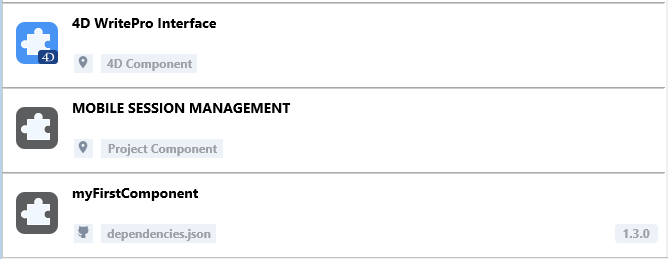

4D のコンポーネントとは、プロジェクトに追加可能な、1つ以上の機能を持つ 4Dコードや 4Dフォームの一式です。 たとえば、[4D SVG](https://github.com/4d/4D-SVG)コンポーネント は、SVGファイルの表示するための高度なコマンドと統合されたレンダリングエンジンを追加します。

独自の 4Dコンポーネントを [開発](../Extensions/develop-components.md) し、[ビルド](../Desktop/building.md) することもできますし、4Dコミュニティによって共有されているパブリックコンポーネントを [GitHubで見つけて](https://github.com/search?q=4d-component\&type=Repositories) ダウンロードすることもできます。

4D で開発する際、コンポーネントファイルはコンピューター上または Githubリポジトリ上に、透過的に保存することができます。

## インタープリターとコンパイル済みコンポーネント

コンポーネントは、インタープリターまたは [コンパイル済み](../Desktop/building.md) のものが使えます。 コンポーネントのパッケージフォルダーには以下のいずれかが含まれます:

- プロジェクトフォルダー (インタープリターのコンポーネント)
- または .4DZ ファイル (コンパイル済みコンポーネント)

インタープリターモードで動作する 4Dプロジェクトは、インタープリターまたはコンパイル済みどちらのコンポーネントも使用できます。 コンパイルモードで実行される 4Dプロジェクトでは、インタープリターのコンポーネントを使用できません。 この場合、コンパイル済みコンポーネントのみが利用可能です。

## コンポーネントの読み込み

:::note

This page describes how to work with components in the **4D** and **4D Server** environments. In other environments, components are managed differently:

- in [4D in remote mode](../Desktop/clientServer.md), components are loaded by the server and sent to the remote application.
- in merged applications, components are [included at the build step](../Desktop/building.md#plugins--components-page).

:::

### 概要

4Dプロジェクトにコンポーネントを読み込むには、以下の方法があります:

- copy the component files in the [**Components** folder of your project](architecture.md#components),
- or, declare the component in the **dependencies.json** file.

Components declared in the **dependencies.json** file can be stored at different locations:

- at the same level as your 4D project's package folder: this is the default location,
- anywhere on your machine: the component path must be declared in the **environment4d.json** file
- on a GitHub repository: the component path can be declared in the **dependencies.json** file or in the **environment4d.json** file, or in both files.

If the same component is installed at different locations, a [priority order](#priority) is applied.

### dependencies.json vs environment4d.json

#### dependencies.json

The **dependencies.json** file references all components required in your 4D project. This file must be located in the **Sources** folder of the 4D project folder, e.g.:

```
	/MyProjectRoot/Project/Sources/dependencies.json
```

It can contain:

- names of components [stored locally](#declaring-local-components) (default path or path defined in an **environment4d.json** file),
- names of components [stored on GitHub repositories](#declaring-components-stored-on-github) (their path can be defined in this file or in an **environment4d.json** file).

#### environment4d.json

The **environment4d.json** file is optional. It allows you to define **custom paths** for some or all components declared in the **dependencies.json** file. This file can be stored in your project package folder or in one of its parent folders, at any level (up to the root).

The main benefits of this architecture are the following:

- you can store the **environment4d.json** file in a parent folder of your projects and decide not to commit it, allowing you to have your local component organization.
- if you want to use the same GitHub repository for several of your projects, you can reference it in the **environment4d.json** file and declare it in the **dependencies.json** file.

### 優先順位

コンポーネントはさまざまな方法でインストールできるため、同じコンポーネントが複数の場所で参照される場合、優先順位が適用されます:

**優先度高**

1. [プロジェクトの **Components** フォルダー](architecture.md#components) に置かれているコンポーネント
2. **dependencies.json** ファイルで宣言されているコンポーネント
3. 内部のユーザー4Dコンポーネント (4D NetKit、4D SVG など)

**優先度低**


同じコンポーネントの別のインスタンスがより高い優先度レベルにあるためにコンポーネントを読み込めない場合、そのコンポーネントには _Overloaded_ [ステータス](#依存関係のステータス) が与えられます。 この場合、読み込まれている方のコンポーネントには _Overloading_ [ステータス](#依存関係のステータス) が与えられます。

(the **environment4d.json** declared path overrides the **dependencies.json** path to configure a local environment).

### Declaring local components

You declare a local component in the [**dependencies.json** file](#dependencyjson) in the following way:

```json
{
    "dependencies": {
        "myComponent1" : {},
        "myComponent2" : {}
    }
}
```

... where "myComponent1" and "myComponent2" are the name of the components to be loaded.

By default, if "myComponent1" and "myComponent2" are not declared in an [environment4d.json file](#environment4djson), 4D will look for the component's package folder (_i.e._ the project root folder of the component) at the same level as your 4D project's package folder, e.g.:

```
	/MyProjectRoot/
	/MyProjectComponentRoot/
```

Thanks to this architecture, you can simply copy all your components at the same level as your projects and reference them in your **dependencies.json** files.

:::note

If you do not want to benefit from the **dependencies.json** architecture, you can install local components by copying their files in the [**Components** folder of your project](architecture.md#components).

:::

#### Customizing component paths

If you want to customize the location of local components, you declare the paths for the dependencies that are not stored at the same level as the project folder in the [**environment4d.json**](#environment4djson) file.

パスには、[POSIXシンタックス](../Concepts/paths#posix-シンタックス) で表現された、絶対パスまたは相対パスを使用できます。 相対パスは、environment4d.json ファイルを基準として相対パスです。

例:

```json
{
	"dependencies": {
		"myComponent1" : "MyComponent1",
		"myComponent2" : "../MyComponent2",
        "myComponent3" : "file:///Users/jean/MyComponent3"
    }
}
```

:::note

**environment4d.json** ファイルで宣言されたコンポーネントのパスが、プロジェクトの開始時に見つからない場合、コンポーネントは読み込まれず、_Not found_ [ステータス](#依存関係のステータス) が表示されます。

:::

### Declaring components stored on GitHub

4D components available as GitHub releases can be referenced and automatically loaded in your 4D projects.

:::note

Regarding components stored on GitHub, both [**dependencies.json**](#dependenciesjson) and [**environment4d.json**](#environment4djson) files support the same contents.

:::

#### Configuring the GitHub repository

To be able to directly reference and use a 4D component stored on GitHub, you need to configure the GitHub component's repository:

- Compress the component files in ZIP format.
- Name this archive with the same name as the GitHub repository.
- Integrate the archive into a [GitHub release](https://docs.github.com/en/repositories/releasing-projects-on-github/managing-releases-in-a-repository) of the repository.

These steps can easily be automated, with 4D code or using GitHub Actions, for example.

#### Declaring paths

You declare a component stored on GitHub in the [**dependencies.json** file](#dependencyjson) in the following way:

```json
{
	"dependencies": {
		"myGitHubComponent1": {
			"github" : "JohnSmith/myGitHubComponent1"
		},
		"myGitHubComponent2": {}
	}
}
```

... where "myGitHubComponent1" is referenced and declared for the project, although "myGitHubComponent2" is only referenced. You need to declare it in the [**environment4d.json**](#environment4djson) file:

```json
{
	"dependencies": {
		"myGitHubComponent2": {
			"github" : "JohnSmith/myGitHubComponent2"
		}
	}
}
```

"myGitHubComponent2" can be used by several projects.

#### Tags and versions

When you create a release in GitHub, you specify a **tag** and a **version**.

- **Tags** are texts that uniquely reference a release. In the [**dependencies.json** file](#dependencyjson) and [**environment4d.json**](#environment4djson) files, you can indicate the release tag you want to use in your project. For example :

```json
{
	"dependencies": {
		"myFirstGitHubComponent": {
			"github": "JohnSmith/myFirstGitHubComponent",
			"tag": "beta2"
		}
	}
}
```

- A release is also identified by a **version**. The versioning system used is based on the _Semantic Versioning_ concept, which is the most commonly used. Each version number is identified as follows: `majorNumber.minorNumber.pathNumber`. In the same way as for tags, you can indicate the version of the component you wish to use in your project, as in this example:

```json
{
	"dependencies": {
		"myFirstGitHubComponent": {
			"github": "JohnSmith/myFirstGitHubComponent",
			"version": "2.1.3"
		}
	}
}
```

The version is used to define which versions can be used. A [standard semantic version](https://regex101.com/r/Ly7O1x/3/) is used. A range is defined by two semantic versions, a min and a max, with operators '\< | > | >= | <= | ='. The `*` can be used as a placeholder for all versions. ~ and ^ prefixes define versions starting at a number, and up to respectively the next major and minor version.

Here are a few examples:

- "latest": the version having the “latest” badge in GitHub releases.
- "\*": the latest version released.
- "1.\*": all version of major version 1.
- "1.2.\*": all patches of minor version 1.2.
- "^1.2.3" or ">=1.2.3": the latest version 1, starting with the 1.2.3 version.
- "~1.2.3" or ">1.2.3": the latest major version 1, starting with the version just after the 1.2.3.
- "<=1.2.3": the latest version until the 1.2.3 one.
- "1.0.0 – 1.2.3" or ">=1.0.0 <=1.2.3": version between 1.0.0 and 1.2.3.
- "`<1.2.3 || >=2`": version that is not between 1.2.3 and 2.0.0.

If you do not specify a tag or a version, 4D automatically retrieves the "latest" version.

#### Private repositories

If you want to integrate a component located in a private repository, you need to tell 4D to use a connection token to access it.

To do this, in your GitHub account, create a **classic** token with access rights to **repo**.

:::note

For more information, please refer to the [GitHub token interface](https://github.com/settings/tokens).

:::

Then insert the "github" key in your [**environment4d.json**](#environment4djson) file:

```json
{
	"github": {
		"token": "ghpXXXXXXXXXXXXUvW8x9yZ"
	},
	"dependencies": {

		"mySecondGitHubComponent": {
			"github": "JohnSmith/mySecondGitHubComponent"
		}
	}
}
```

#### Local cache for dependencies

Referenced GitHub components are downloaded in a local cache folder then loaded in your environment. The local cache folder is stored at the following location:

- on macOs: `$HOME/Library/Caches/<app name>/Dependencies`
- on Windows: `C:\Users\<username>\AppData\Local\<app name>\Dependencies`

...where `<app name>` can be "4D", "4D Server", or "tool4D".

#### dependency-lock.json

A `dependency-lock.json` file is created in the [`userPreferences` folder](architecture.md#userpreferencesusername) of your project.

This file logs information such as the state of dependencies, paths, urls, loading errors, as well as other information. It could be useful for component loading management or troubleshooting.

## プロジェクトの依存関係の監視

開かれているプロジェクトでは、**依存関係** パネルで依存関係と現在の読み込み状態に関する情報を取得することができます。

依存関係パネルを表示するには:

- 4D では、**デザイン/プロジェクト依存関係** メニューアイテムを選択します (開発環境)。<br/>
  

- 4D Server では、**ウインドウ/プロジェクト依存関係** メニューアイテムを選択します。<br/>
  

依存関係パネルが表示されます。 依存関係は ABC順にソートされます。


### 依存関係のオリジン

依存関係パネルには、各依存関係のオリジン (由来) にかかわらず、プロジェクトの依存関係すべてがリストされます。 依存関係のオリジンは、名前の下に表示されるタグによって判断することができます:


The following origins are possible:

| オリジンタグ                            | 説明                                                              |
| --------------------------------- | --------------------------------------------------------------- |
| 4Dコンポーネント                         | 4Dアプリケーションの `Components` フォルダーに保存されているビルトインの 4Dコンポーネント          |
| dependencies.json | [`dependencies.json`](#dependenciesjson) ファイルで宣言されているコンポーネント    |
| 環境                                | [`environment4d.json`](#environment4djson) ファイルで宣言されているコンポーネント  |
| プロジェクトコンポーネント                     | [`Components`](architecture.md#components) フォルダー内に置かれているコンポーネント |

依存関係の行で **右クリック** し、**ディスク上に表示** を選択すると、依存関係の保管場所が表示されます:


:::note

依存関係が非アクティブの場合は、ファイルが見つからないためこの項目は表示されません。

:::

Component icon and location logo provide additional information:

- The component logo indicates if it is provided by 4D or a third-party developer.
- Local components can be differentiated from GitHub components by a small icon.



### 依存関係のフィルタリング

デフォルトでは、依存関係マネージャーによって識別されたすべての依存関係は、それらの [ステータス](#依存関係のステータス) に関係なくリストされます。 依存関係パネル上部のタブを選択することで、依存関係のステータスに応じてリストの表示をフィルタリングできます:


- **アクティブ**: プロジェクトに読み込まれ、使用できる依存関係。 実際にロードされた _Overloading_ な依存関係が含まれます。 _Overloaded_ である方の依存関係は、その他の競合している依存関係とともに **コンフリクト** パネルに表示されます。
- **非アクティブ**: プロジェクトに読み込まれておらず、利用できない依存関係。 このステータスには様々な理由が考えられます: ファイルの欠落、バージョンの非互換性など…
- **コンフリクト**: プロジェクトに読み込まれてはいるものの、先に読み込まれた [優先度](#優先順位) の高い依存関係と競合している依存関係。 _Overloaded_ な依存関係も表示されるため、競合の原因を確認し、適切に対処することができます。

### 依存関係のステータス

デベロッパーの注意を必要とする依存関係は、行の右側の **ステータスラベル** と背景色で示されます。


使用されるステータスラベルは次のとおりです:

- **Overloaded**: 依存関係は読み込まれていません。より上位の [優先順位](#優先順位) において、同じ名前の依存関係がすでに読み込まれています。
- **Overloading**: 依存関係は読み込まれていますが、下位の [優先順位](#優先順位) において読み込まれなかった同じ名前の依存関係が存在します。
- **Not found**: dependencies.jsonファイルで依存関係が宣言されていますが、見つかりません。
- **Inactive**: プロジェクトと互換性がないため、依存関係は読み込まれていません (例: 現在のプラットフォーム用にコンポーネントがコンパイルされていない、など)。
- **Duplicated**: 依存関係は読み込まれていません。同じ名前を持つ別の依存関係が同じ場所に存在し、すでに読み込まれています。

依存関係の行にマウスオーバーするとツールチップが表示され、ステータスに関する追加の情報を提供します:


