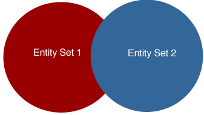

`$method=entityset` を使って [エンティティセットを作成]($method.md#methodentityset) すると、それを後で再利用することができます。

## 使用可能なシンタックス

| シンタックス                                                                                                                                                                                   | 例題                                                                           | 説明                                |
| ---------------------------------------------------------------------------------------------------------------------------------------------------------------------------------------- | ---------------------------------------------------------------------------- | --------------------------------- |
| [**$entityset/{entitySetID}**](#entitysetentitySetID)                                                                                                                                    | `/People/$entityset/0ANUMBER`                                                | 既存のエンティティセットを取得します                |
| [**$entityset/{entitySetID}?$logicOperator...&$otherCollection**](#entitysetentitysetidlogicoperatorothercollection) | `/Employee/$entityset/0ANUMBER?$logicOperator=AND&$otherCollection=0ANUMBER` | 既存エンティティセットの比較から新規エンティティセットを作成します |

## $entityset/{entitySetID}

既存のエンティティセットを取得します(_例_: `People/$entityset/0AF4679A5C394746BFEB68D2162A19FF`)

### 説明

このシンタックスを使って、定義されたエンティティセットに対してあらゆる操作を実行できます。

エンティティセットには (デフォルトの、または `$timeout` で指定した) タイムリミットが設定されるため、`$savedfilter` や `$savedorderby` を使って、エンティティセットを作成する際に使用したフィルターや並べ替えの詳細を保存しておくこともできます。

When you retrieve an existing entity set stored in 4D Server's cache, you can also apply any of the following to the entity set: [`$clean`]($clean.md), [`$expand`]($expand.md), [`$filter`]($filter.md), [`$orderby`]($orderby.md), [`$skip`]($skip.md), or [`$top/$limit`]($top_$limit.md).

### 例題

エンティティセットを作成すると、データとともにエンティティセットIDが返されます。 このIDは次のように使います:

`GET  /rest/Employee/$entityset/9718A30BF61343C796345F3BE5B01CE7`

## $entityset/{entitySetID}?$logicOperator...&$otherCollection

複数の既存エンティティセットに基づいて新たなエンティティセットを作成します。

| 引数               | タイプ    | 説明                        |
| ---------------- | ------ | ------------------------- |
| $logicOperator   | String | 既存のエンティティセットに対して使用する論理演算子 |
| $otherCollection | String | エンティティセットID               |

### 説明

After creating an entity set (entity set #1) by using `$method=entityset`, you can then create another entity set by using the `$entityset/{entitySetID}?$logicOperator... &$otherCollection` syntax, the `$logicOperator` property (whose values are shown below), and another entity set (entity set #2) defined by the `$otherCollection` property. 2つのエンティティセットは同じデータクラスに属していなければなりません。

このリクエストの結果を格納するエンティティセットを作成する場合は、RESTリクエストの最後に `$method=entityset` を追加します。

下記は、論理演算子の一覧です:

| 演算子       | 説明                                                     |
| --------- | ------------------------------------------------------ |
| AND       | 両方のエンティティセットに共通して含まれるエンティティのみを返します。                    |
| OR        | 両エンティティセットのいずれか、あるいは両方に含まれているエンティティを返します。              |
| EXCEPT    | エンティティセット#1 から、エンティティセット#2にも含まれているエンティティを除外した残りを返します。  |
| INTERSECT | 両方のエンティティセットに共通して含まれるエンティティがあれば true、なければ false を返します。 |

> 論理演算子の文字の大小は区別されないため、"AND" とも "and" とも書けます。

2つのエンティティセットを対象に論理演算子を使用した場合のベン図は下のとおりです。 赤く塗られた部分が返されるものです。

**AND**

**OR**

**EXCEPT**

シンタックスは次のとおりです:

`GET  /rest/dataClass/$entityset/entitySetID?$logicOperator=AND&$otherCollection=entitySetID`

### 例題

次の例では AND論理演算子を使用するため、両方のエンティティセットに共通して含まれるエンティティが返されます:

`GET  /rest/Employee/$entityset/9718A30BF61343C796345F3BE5B01CE7?$logicOperator=AND&$otherCollection=C05A0D887C664D4DA1B38366DD21629B`

2つのエンティティセットが交差するかどうかを確認するには、次のように書きます:

`GET  /rest/Employee/$entityset/9718A30BF61343C796345F3BE5B01CE7?$logicOperator=intersect&$otherCollection=C05A0D887C664D4DA1B38366DD21629B`

共通のエンティティが存在する場合、このクエリは true を返します。 それ以外の場合は false を返します。

次の例では、2つのエンティティセットのいずれかあるいは両方に含まれているエンティティすべてを格納した新しいエンティティセットを作成します:

` GET  /rest/Employee/$entityset/9718A30BF61343C796345F3BE5B01CE7?$logicOperator=OR&$otherCollection=C05A0D887C664D4DA1B38366DD21629B&$method=entityset`
