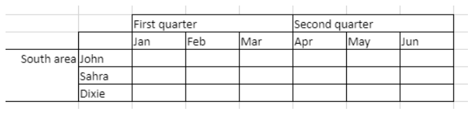

<!-- REF #_method_.VP ADD SPAN.Syntax -->

**VP ADD SPAN** ( *rangeObj* : Object )<!-- END REF -->

<!-- REF #_method_.VP ADD SPAN.Params -->

| 引数       | 型      |    | 説明        |                  |
| -------- | ------ | -- | --------- | ---------------- |
| rangeObj | オブジェクト | -> | レンジオブジェクト | <!-- END REF --> |

#### 説明

`VP ADD SPAN` コマンドは、*rangeObj* に渡したセルを単一のセルに結合します。

*rangeObj* には、セルのレンジオブジェクトを渡します。 レンジ内のセルは結合され、複数のカラム/行にまたがる大きなセルが作成されます。 複数のセルレンジを渡すことで、一度に複数の結合セルを作成することもできます。 ただし、セルレンジが重なった場合、最初のセルレンジのみが使用されます。

> - 結合セルでは、左上端セルのデータのみが表示されます。 他のセルのデータは結合が解除されるまで非表示になります。
> - 結合セル内の非表示データは、フォーミュラを使用することでアクセス可能です (フォーミュラは左上端セルから始まります)。

#### 例題

"First quarter" セルと "Second quarter" セルを、それぞれ右 2つのセルと結合し、"South area" セルは下 2つのセルと結合します:


```4d
 // "First quarter" レンジ
 $q1:=VP Cells("ViewProArea";2;3;3;1)

  // "Second quarter" レンジ
 $q2:=VP Cells("ViewProArea";5;3;3;1)

  // "South area" レンジ
 $south:=VP Cells("ViewProArea";0;5;1;3)

 VP ADD SPAN(VP Combine ranges($q1;$q2;$south))
```



#### 参照

[4D View Pro レンジオブジェクトプロパティ](../getting-started.md#レンジオブジェクトの使い方)<br/>
[VP Get spans](vp-get-spans.md)<br/>
[VP REMOVE SPAN](vp-remove-span.md)
