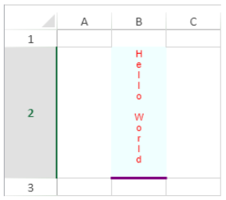

<!-- REF #_method_.VP Get cell style.Syntax -->

**VP Get cell style** (  *rangeObj* : Object ) : Object<!-- END REF -->

<!-- REF #_method_.VP Get cell style.Params -->

| 引数       | 型      |    | 説明         |                  |
| -------- | ------ | -- | ---------- | ---------------- |
| rangeObj | オブジェクト | -> | レンジオブジェクト  |                  |
| 戻り値      | オブジェクト | <- | スタイルオブジェクト | <!-- END REF --> |

#### 説明

`VP Get cell style` コマンドは、<!-- REF #_method_.VP Get cell style.Summary -->*rangeObj* 引数で指定したレンジの最初のセルの [スタイルオブジェクト](../configuring.md#スタイルオブジェクト) を返します<!-- END REF -->。

*rangeObj* 引数で、スタイルを取得するレンジを指定します。

- *rangeObj* 引数としてセルレンジを渡した場合、セルのスタイルが返されます。
- *rangeObj* 引数として、セルレンジではないレンジを渡した場合、そのレンジ内の最初のセルのスタイルが返されます。
- *rangeObj* 引数に複数のレンジが含まれている場合、最初のレンジの最初のセルのスタイルのみが返されます。

#### 例題

選択されたセル (B2) のスタイルの詳細を取得します:



以下のコードを実行すると:

```4d
$cellStyle:=VP Get cell style(VP Get selection("myDoc"))
```

... 以下のオブジェクトが返されます:

```4d
{
  "backColor":"Azure",
  "borderBottom":
   {
     "color":#800080,
     "style":5
   }
  "font":"8pt Arial",
  "foreColor":"red",
  "hAlign":1,
  "isVerticalText":"true",
  "vAlign":0
}
```

#### 参照

[VP GET DEFAULT STYLE](vp-get-default-style.md)<br/>
[VP SET CELL STYLE](vp-set-cell-style.md)
