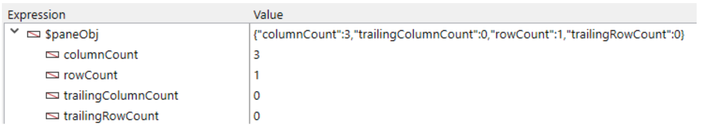

<!-- REF #_method_.VP Get frozen panes.Syntax -->

**VP Get frozen panes** ( vpAreaName : Text { ; sheet : Integer } ) : Object<!-- END REF -->

<!-- REF #_method_.VP Get frozen panes.Params -->

| 引数         | 型      |    | 説明                                             |                  |
| ---------- | ------ | -- | ---------------------------------------------- | ---------------- |
| vpAreaName | テキスト   | -> | 4D View Pro フォームオブジェクト名                        |                  |
| sheet      | 整数     | -> | シートのインデックス (省略した場合はカレントシート) |                  |
| 戻り値        | オブジェクト | <- | 固定化されたカラムと行についての情報を格納したオブジェクト                  | <!-- END REF --> |

#### 説明

`VP Get frozen panes` コマンドは、<!-- REF #_method_.VP Get frozen panes.Summary -->*vpAreaName* 引数で指定した View Pro エリア内の、固定化されたカラムと行についての情報を格納したオブジェクトを返します<!-- END REF -->。

*vpAreaName* には、4D View Pro エリアの名前を渡します。 存在しない名前を渡した場合、エラーが返されます。

任意の *sheet* 引数として、シートのインデックス (0 起点) を渡すことで、定義されるレンジが属するスプレッドシートを指定することができます。 省略された場合、または `vk current sheet` を渡した場合、カレントスプレッドシートが使用されます。

##### 返されるオブジェクト

このコマンドは固定化されたカラムと行についてのオブジェクトを返します。 このオブジェクトには、次のプロパティが格納されることがあります:

| プロパティ               | 型  | 説明                 |
| ------------------- | -- | ------------------ |
| columnCount         | 整数 | シートの左側にある固定化されたカラム |
| trailingColumnCount | 整数 | シートの右側にある固定化されたカラム |
| rowCount            | 整数 | シートの上側にある固定化された行   |
| trailingRowCount    | 整数 | シートの下側にある固定化された行   |

#### 例題

固定化されたカラムと行についての情報を取得します:

```4d
var $panesObj : Object

 
$panesObj:=VP Get frozen panes("ViewProArea")
```

戻り値のオブジェクトには、以下のようなものが格納されています:



#### 参照

[VP SET FROZEN PANES](vp-set-frozen-panes.md)
