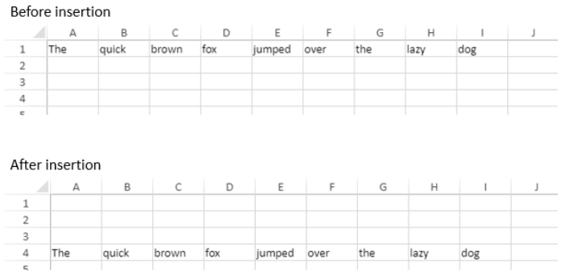

<!-- REF #_method_.VP INSERT ROWS.Syntax -->

**VP INSERT ROWS** ( *rangeObj* : Object ) <!-- END REF -->

<!-- REF #_method_.VP INSERT ROWS.Params -->

| 引数       | 型      |    | 説明        |                  |
| -------- | ------ | -- | --------- | ---------------- |
| rangeObj | オブジェクト | -> | レンジオブジェクト | <!-- END REF --> |

#### 説明

`VP INSERT ROWS` コマンドは、<!-- REF #_method_.VP INSERT ROWS.Summary -->*rangeObj* 引数で指定したレンジに行を挿入します<!-- END REF -->。

*rangeObj* には、開始行 (新しい行が挿入される場所を指定する行) と挿入する行数を格納したオブジェクトを渡します。 挿入する行数が省略された場合 (定義されていない場合) には、1行だけ挿入されます。

新しい行は、*rangeObj* 引数で指定した開始行の直前 (すぐ上) に挿入されます。

#### 例題

先頭行の前に 3行挿入します:

```4d
VP INSERT ROWS(VP Row("ViewProArea";0;3))
```

このようになります:



#### 参照

[VP DELETE COLUMNS](vp-delete-columns.md)<br/>
[VP DELETE ROWS](vp-delete-rows.md)<br/>
[VP INSERT COLUMNS](vp-insert-columns.md)
