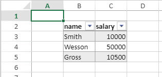

<details><summary>履歴</summary>

| リリース  | 内容 |
| ----- | -- |
| 19 R7 | 追加 |

</details>

<!-- REF #_method_.VP INSERT TABLE ROWS.Syntax -->

**VP INSERT TABLE ROWS** ( *vpAreaName* : Text ; *tableName* : Text ; *row* : Integer {; *count* : Integer {; *insertAfter* : Integer {; *sheet* : Integer }}} )<!-- END REF -->

<!-- REF #_method_.VP INSERT TABLE ROWS.Params -->

| 引数          | 型    |    | 説明                                                   |                  |
| ----------- | ---- | -- | ---------------------------------------------------- | ---------------- |
| vpAreaName  | テキスト | -> | 4D View Pro フォームオブジェクト名                              |                  |
| tableName   | テキスト | -> | Table name                                           |                  |
| row         | 整数   | -> | 行の挿入場所を指定する表組み内のインデックス                               |                  |
| count       | テキスト | -> | 挿入する行の数 (>0)                      |                  |
| insertAfter | 整数   | -> | `vk table insert before` または `vk table insert after` |                  |
| sheet       | 整数   | -> | シートのインデックス (省略した場合はカレントシート)       | <!-- END REF --> |

#### 説明

`VP INSERT TABLE ROWS` コマンドは、<!-- REF #_method_.VP INSERT TABLE ROWS.Summary -->*tableName* で指定した表組みの *row* で指定した行インデックスに、1つまたは *count* で指定した数の空の行を挿入します<!-- END REF -->。

*insertAfter* パラメーターに以下の定数のいずれかを渡すことで、*row* に指定した行インデックスの前または後に行を挿入するかを指定できます。

| 定数                       | 値 | 説明                                              |
| ------------------------ | - | ----------------------------------------------- |
| `vk table insert before` | 0 | *row* の前に行を挿入します (省略時のデフォルト) |
| `vk table insert after`  | 1 | *row* の後に行を挿入します                                |

このコマンドは、シート内ではなく、*tableName* の表組みに行を挿入します。 したがって、シートの総行数は、このコマンドの影響を受けません。 表組みより下側にデータがある場合は、挿入された行の数に応じて自動的に下に移動します。

*tableName* の表組みが [データコンテキスト](vp-set-data-context.md) にバインドされている場合、このコマンドはコレクションに新しい空の要素を挿入します。

*tableName* の表組みが存在しない場合、あるいはシートに十分なスペースがない場合は、何も起こりません。

#### 例題

データコンテキストを使用した表組みを作成します:

```4d
var $context : Object
$context:=New object()

$context.col:=New collection
$context.col.push(New object("name"; "Smith"; "salary"; 10000))
$context.col.push(New object("name"; "Wesson"; "salary"; 50000))
$context.col.push(New object("name"; "Gross"; "salary"; 10500))

VP SET DATA CONTEXT("ViewProArea"; $context)

VP CREATE TABLE(VP Cells("ViewProArea"; 1; 1; 3; 3); "PeopleTable"; "col")
```



表組みに 2行と 2列を挿入したい場合、次のように書きます:

```4d
VP INSERT TABLE ROWS("ViewProArea"; "PeopleTable"; 1; 2)
VP INSERT TABLE COLUMNS("ViewProArea"; "PeopleTable"; 1; 2)
```


#### 参照

[VP INSERT TABLE COLUMNS](vp-insert-table-columns.md)<br/>
[VP REMOVE TABLE ROWS](vp-remove-table-rows.md)
