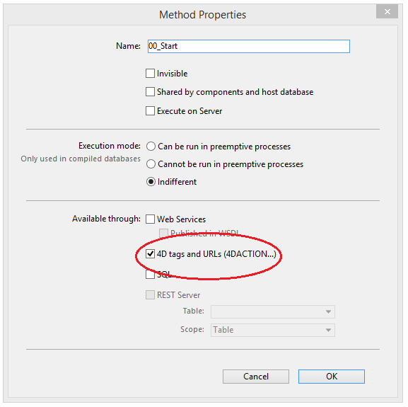

`4DEVAL`, `4DTEXT`, `4DHTML` などの 4Dタグや  [`/4DACTION URL`](httpRequests.md#/4daction) を使用すると、Webに公開された 4Dプロジェクトのあらゆるプロジェクトメソッドが実行できます。 たとえば、リクエスト _http://www.server.com/4DACTION/login_ は _**login**_ プロジェクトメソッドを (存在すれば) 実行します。

このメカニズムは具体的には、インターネット上のユーザーが故意に (あるいは予期せず) Web用でないメソッドを実行してしまうというような、アプリケーションのセキュリティを脅かすリスクをもたらします。 このリスクは以下の 3つの方法で回避できます:

- [`On Web Authentication`](authentication.md#on-web-authentication) データベースメソッドを使用して URL から呼び出されるメソッドをフィルターする。 欠点: データベースに多くのメソッドが定義されている場合、この方法は管理が困難になります。

- **公開オプション: 4DタグとURL (4DACTION...)** (メソッドプロパティ) を使用する:

このオプションを使用してプロジェクトメソッドごとに、特別な URL `4DACTION` や `4DTEXT`, `4DHTML`, `4DEVAL`, `4DSCRIPT`, `4DIF`, `4DELSEIF`, `4DLOOP` などの 4Dタグを使用した呼び出しを許可するかしないかを設定できます。 このオプションがチェックされていない場合、そのプロジェクトメソッドは HTTPリクエストから直接実行することはできません。 他方、他のタイプの呼び出し (フォーミュラや他のメソッドからの呼び出しなど) ではこれらのメソッドを実行することができます。

このオプションはデフォルトでチェックされていません。 `4DACTION` やタグなどを使用して呼び出すことのできるメソッドは、明示的に指定する必要があります。

このプロパティが指定されたプロジェクトメソッドは、エクスプローラーで以下のアイコンが表示されます:

