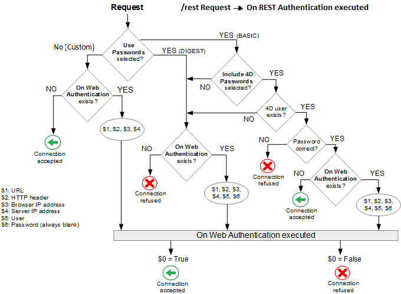

Webユーザーに特定のアクセス権を与えるには、ユーザーを認証することが必要です。 認証とは、ユーザーの資格情報 (通常は名前とパスワード) を取得・処理する方法のことです。

## 認証モード

4D Webサーバーでは、3つの認証モードが用意されており、ストラクチャー設定ダイアログボックスの **Web**/**オプション (I)** ページで選択することができます:


> **カスタムの認証** を使用することが推奨されています。

### 概要

4D Webサーバーのアクセスシステムの処理を以下に図示します:



> `rest/` で始まるリクエストは、[RESTサーバー](REST/configuration.md) が直接処理します。

### カスタムの認証 (デフォルト)

このモードでは基本的に、ユーザーを認証する方法は開発者に委ねられています。 4Dは、[認証を必要とする](#データベースメソッドの呼び出し) HTTPリクエストのみを評価します。

この認証モードは最も柔軟性が高く、以下のことが可能です:

- ユーザー認証をサードパーティ・アプリケーション (例: ソーシャルネットワーク、SSO) に委ねることができます。
- 顧客データベースにアカウントを作成できるよう、ユーザーにインターフェース (Webフォームなど) を提供することもできます。登録後は、任意のカスタムアルゴリズムでユーザーを認証することができます ("ユーザーセッション" の章の [例題](sessions.md#例題) を参照ください)。 重要なのは、以下のようなコードを使って、決してパスワードを平文で保存しないことです:

```4d
//... ユーザーアカウントの作成
ds.webUser.password:=Generate password hash($password)  
ds.webUser.save()
```

"はじめに" の章の [例題](gettingStarted.md#ユーザー認証) も参照ください。

カスタム認証が提供されていない場合、4D は [`On Web Authentication`](#on-web-authentication) データベースメソッドを呼び出します (あれば)。 $1 と $2 に加えて、ブラウザーとサーバーの IPアドレス ($3 と$ 4) のみが提供され、ユーザー名とパスワード ($5 と $6) は空です。 ユーザー認証が成功した場合、このメソッドは $0 に **True** を返さなければなりません。この場合、リクエストされたリソースが提供されます。認証が失敗した場合には、$0 に **False** を返します。

> **警告:** `On Web Authentication` データベースメソッドが存在しない場合、接続は自動的に受け入れられます (テストモード)。

### BASIC認証

ユーザーがサーバーに接続するとダイアログボックスがブラウザー上に表示され、ユーザー名とパスワードの入力を求められます。

> ユーザーが入力したユーザー名とパスワードは暗号化されずに、HTTPリクエストヘッダーに含められて送信されます。 このモードで機密性を確保するには通常、HTTPSを必要とします。

入力された値は次のように評価されます:

- **4Dパスワードを含む** オプションがチェックされている場合、ユーザーの認証情報はまず、[内部の 4Dユーザーテーブル](Users/overview.md) に対して評価されます。
  - ブラウザーから送信されたユーザー名が 4D のユーザーテーブルに存在し、パスワードが正しい場合、接続は受け入れられます。 パスワードが正しくなければ接続は拒否されます。
  - ユーザー名が 4D のユーザーテーブルに存在しない場合、[`On Web Authentication`](#on-web-authentication) データベースメソッドが呼び出されます。 `On Web Authentication` データベースメソッドが存在しない場合、接続は拒否されます。
- **4Dパスワードを含む** オプションがチェックされていない場合、ユーザーの認証情報は、その他の接続情報 (IPアドレス、ポート、URL など) とともに [`On Web Authentication`](#on-web-authentication) データベースメソッドに受け渡されます。 `On Web Authentication` データベースメソッドが存在しない場合、接続は拒否されます。

> 4Dクライアントの Webサーバーでは、すべての 4Dクライアントマシンが同じユーザーテーブルを共有することに留意が必要です。 ユーザー名/パスワードの検証は 4D Serverアプリケーションでおこなわれます。

### DIGEST認証

DIGESTモードはより高いセキュリティレベルを提供します。認証情報は復号が困難な一方向ハッシュを使用して処理されます。

BASICモードと同様に、ユーザーは接続時に自分の名前とパスワードを入力する必要があります。 その後、[`On Web Authentication`](#on-web-authentication) データベースメソッドが呼び出されます。 DIGESTモードが有効の時、$6引数 (パスワード) は常に空の文字列が渡されます。 実際このモードを使用するとき、この情報はネットワークからクリアテキスト (平文) では渡されません。 この場合、接続リクエストは `WEB Validate digest` コマンドを使用して検証しなければなりません。

> これらのパラメーターの変更を反映させるためには、Webサーバーを再起動する必要があります。

## On Web Authentication

`On Web Authentication` データベースメソッドは Webサーバーエンジンへのアクセス管理を担当します。 4D または 4D Server は、動的な HTTPリクエストを受け取ると、このデータベースメソッドを呼び出します。

### データベースメソッドの呼び出し

`On Web Authentication` データベースメソッドは、リクエストや処理が 4Dコードの実行を必要とするとき (REST呼び出しを除く) に自動で呼び出されます。 また、Webサーバーが無効な静的URLを受信した場合 (要求された静的ページが存在しない場合など) にも呼び出されます。

つまり、`On Web Authentication` データベースメソッドは次の場合に呼び出されます:

- Webサーバーが、存在しないリソースを要求する URL を受信した場合
- Webサーバーが `4DACTION/`, `4DCGI/` ... で始まる URL を受信した場合
- Webサーバーがルートアクセス URL を受信したが、ストラクチャー設定または `WEB SET HOME PAGE` コマンドでホームページが設定されていないとき
- Webサーバーが、セミダイナミックページ内でコードを実行するタグ (`4DSCRIPT`など) を処理した場合。

次の場合には、`On Web Authentication` データベースメソッドは呼び出されません:

- Webサーバーが有効な静的ページを要求する URL を受信したとき。
- Webサーバーが `rest/` で始まる URL を受信し、RESTサーバーが起動したとき (この場合、認証は [`On REST Authentication`データベースメソッド](REST/configuration.md#on-rest-authentication-データベースメソッドを使用する) または [ストラクチャー設定](REST/configuration.md#ストラクチャー設定を使用する) によって処理されます)。

### シンタックス

**On Web Authentication**( _$1_ : Text ; _$2_ : Text ; _$3_ : Text ; _$4_ : Text ; _$5_ : Text ; _$6_ : Text ) -> $0 : Boolean

| 引数 | 型    |     | 説明                                              |
| -- | ---- | :-: | ----------------------------------------------- |
| $1 | テキスト |  <- | URL                                             |
| $2 | テキスト |  <- | HTTPヘッダー + HTTPボディ (32 KBまで) |
| $3 | テキスト |  <- | Webクライアント (ブラウザー) の IPアドレス   |
| $4 | テキスト |  <- | サーバーの IPアドレス                                    |
| $5 | テキスト |  <- | ユーザー名                                           |
| $6 | テキスト |  <- | パスワード                                           |
| $0 | ブール  |  -> | True = リクエストは受け入れられました、False = リクエストが拒否されました    |

これらの引数を以下のように宣言しなければなりません:

```4d
// On Web Authentication データベースメソッド

 C_TEXT($1;$2;$3;$4;$5;$6)
 C_BOOLEAN($0)

// メソッドのコード

```

あるいは、[名前付き引数](Concepts/parameters.md#名前付き引数) シンタックスを利用することもできます:

```4d
// On Web Authentication データベースメソッド
#DECLARE ($url : Text; $header : Text; \
  $BrowserIP : Text; $ServerIP : Text; \
  $user : Text; $password : Text) \
  -> $RequestAccepted : Boolean


```

> `On Web Authentication` データベースメソッドのすべての引数が必ず値を受け取るわけではありません。 データベースメソッドが受け取る情報は、[認証モード](#authentication-mode)の設定により異なります。

#### $1 - URL

最初の引数 (`$1`) は、ユーザーが Webブラウザーのアドレスエリアに入力したURLからホストのアドレスを取り除いたものです。

イントラネット接続の場合をみてみましょう。 4D Webサーバーマシンの IPアドレスを 123.45.67.89 とします。 以下の表は Webブラウザーに入力された URL に対して、$1 が受け取る値を示しています:

| Webブラウザーに入力された値                                                                                                                                   | $1 の値                                                                                 |
| ------------------------------------------------------------------------------------------------------------------------------------------------- | ------------------------------------------------------------------------------------- |
| 123.45.67.89                                                                                      | /                                                                                     |
| http://123.45.67.89                                                               | /                                                                                     |
| 123.45.67.89/Customers                                                                            | /Customers                                                                            |
| http://123.45.67.89/Customers/Add                                                 | /Customers/Add                                                                        |
| 123.45.67.89/Do_This/If_OK/Do_That | /Do_This/If_OK/Do_That |

#### $2 - HTTPリクエストのヘッダーとボディ

二番目の引数 (`$2`) は、Webブラウザーから送信された HTTPリクエストのヘッダーとボディです。 この情報は `On Web Authentication` データベースメソッドに "そのまま" 渡されることに留意してください。 その内容は、接続を試みた Webブラウザーの仕様により異なります。

アプリケーションでこの情報を使用するには、開発者がヘッダーとボディを解析しなければなりません。 `WEB GET HTTP HEADER` や `WEB GET HTTP BODY` コマンドを使うことができます。

> パフォーマンス上の理由により、$2 を介して渡されるデータのサイズは 32KB 以下でなくてはなりません。 これを超過する分は、4D HTTPサーバーにより切り取られます。

#### $3 - Webクライアントの IPアドレス

`$3` 引数はブラウザーマシンの IPアドレスを受け取ります。 この情報を使用して、イントラネットアクセスとインターネットアクセスを区別できます。

> 4D は IPv4 アドレスを、96-bit の接頭辞付きのハイブリッド型 IPv6/IPv4 フォーマットで返します。たとえば、::ffff:192.168.2.34 は、192.168.2.34 という IPv4 アドレスを意味します。 詳細については、[IPv6 のサポートについて](webServerConfig.md#IPv6-のサポートについて) の章を参照ください。

#### $4 - サーバー IPアドレス

`$4` 引数は Webサーバーを呼び出すために使用された IPアドレスを受け取ります。 4D はマルチホーミングをサポートしており、複数の IPアドレスを持つマシンを使用できます。 詳細は [設定ページ](webServerConfig.md#リクエストを受け付ける-ipアドレス) を参照ください。

#### $5 と $6 - ユーザー名とパスワード

`$5` と `$6` 引数は、ブラウザーが表示する標準の認証ダイアログにユーザーが入力したユーザー名とパスワードを受け取ります。 [BASIC](#basic認証) または [DIGEST](#digest認証) 認証が選択されていると、接続のたびにこのダイアログが表示されます。

> ブラウザーから送信されたユーザー名が 4D に存在する場合、$6 引数 (ユーザーパスワード) はセキュリティのため渡されません。

#### $0 引数

`On Web Authentication` データベースメソッドはブール値を $0 に返します:

- $0=True: 接続を受け入れます。

- $0=False: 接続を受け入れません。

`On Web Connection` データベースメソッドは、`On Web Authentication` データベースメソッドにより接続が受け入れられた時にのみ実行されます。

> **警告**<br/>$0 に値が設定されないか、`On Web Authentication`データベースメソッド内で $0 が定義されていない場合、接続は受け入れられたものとされ、`On Web Connection` データベースメソッドが実行されます。

> - `On Web Authentication` データベースメソッド内でインターフェース要素を呼び出してはいけません (`ALERT`, `DIALOG` 等)。 メソッドの実行が中断され、接続が拒否されてしまいます。 処理中にエラーが発生した場合も同様です。

### 例題

[DIGEST認証モード](#digest認証) での `On Web Authentication` データベースメソッドの例題:

```4d
// On Web Authentication データベースメソッド
 #DECLARE ($url : Text; $header : Text; $ipB : Text; $ipS : Text; \
    $user : Text; $pw : Text) -> $valid : Boolean

 var $found : cs.WebUserSelection
 $valid:=False

 $found:=ds.WebUser.query("User === :1";$user)
 If($found.length=1) // ユーザーが見つかった場合
    $valid:=WEB Validate digest($user;[WebUser]password)
 Else
    $valid:=False // ユーザーは存在しません
 End if

```
