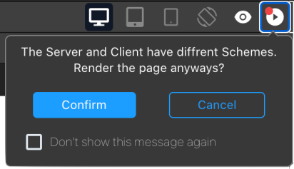

**Qodly Studio** は Webアプリケーション用のインターフェースビルダーです。 Webブラウザーやスマートフォンで動作するアプリケーションを設計するためのグラフィカルなページエディターをデベロッパーに提供します。 Qodly Studio は [ORDAオブジェクト](../ORDA/overview.md) をネイティブにサポートします。

**4D環境** から直接 Qodly Studio を使用して、モダンで洗練されたインターフェースをビルドし、既存の 4Dプロジェクトに簡単に統合して、**オンプレミス** で運用することができます。

Qodly Studioは、Webビジネスアプリケーションの開発に特化した [**Qodly Cloud Platform**](https://qodly.com) でも使用できます。

Qodly Studio はフル機能の Web UI を提供し、以下のことを可能にします:

- キャンバス上にコンポーネントを配置して Qodlyページを作成する
- コンポーネントを Qodly Sources にマッピングする
- イベントを設定して 4Dコードをトリガーする
- さらに沢山のことが可能です

## 設定

### 要件

#### ブラウザー

Qodly Studio は、以下の Webブラウザーをサポートしています:

- Chrome
- Edge
- FireFox

推奨解像度は 1920x1080 です。

#### 4Dアプリケーション

- 開発: 4D v20 R2 以上
- 運用: 4D Server v20 R2 以上
- Qodly Studio は 4Dプロジェクトでのみ動作します (バイナリデータベースはサポートされていません)。
- Web セッション (スケーラブルセッション) が [有効](sessions.md#webセッションの有効化) である必要があります。
- Qodlyフォームによって呼び出される 4Dコードは [スレッドセーフ](preemptiveWeb.md) でなければなりません。

### Qodly Studio へのアクセスを有効化する

デフォルトでは、Qodly Studio へのアクセスは許可されていません。

Qodly Studioは、[WebAdmin Webサーバー](../Admin/webAdmin.md) によって提供され、表示される 4Dプロジェクトのデータは [4D Webサーバー](webServer.md) によって処理されます。

Qodly Studio へのアクセスを有効化するには、2つのレベルで明示的に許可する必要があります:

- 4Dアプリケーションレベルで
- プロジェクトレベルで

2つのレベルのいずれか (または両方) が有効でない場合、Qodly Studio　へのアクセスは拒否されます (403ページが返されます)。

#### 4Dレベルで

最初のセキュリティレベルとして、[WebAdmin Webサーバーで Qodly Studio へのアクセスを許可](../Admin/webAdmin.md#qodly-studio-へのアクセスを有効化する) する必要があります。 この設定は、ホストマシンの 4Dアプリケーション (4D または 4D Server) が対象となります。 つまり、その 4Dアプリケーションで開くすべてのプロジェクトで、この設定が適用されます。

アプリケーション上で Qodly Studio へのアクセスを許可しない場合は、このオプションをオフにします。 このオプションにチェックを入れると、Qodly Studio にアクセスできるようになります。 さらに、各プロジェクトのレベルでも許可が必要です。

さらに、[WebAdmin Webサーバーの HTTP/HTTPS ポートを設定](../Admin/webAdmin.md#ローカルホストでhttp接続を受け入れる) することもできます。

:::note

これらの設定を変更した後、新しい設定を有効にするには、[WebAdmin Web サーバー](../Admin/webAdmin.md#開始と停止) を再起動する必要があります。

:::

#### プロジェクトレベルで

4Dレベルで Qodly Studio へのアクセスを有効にした後、アクセスできるプロジェクトをそれぞれ明示的に指定する必要があります。 **Qodly Studio へのアクセスを有効化する** オプションは、[プロジェクト設定の Web機能ページ](../settings/web.md#qodly-studio-へのアクセスを有効化する) で有効にする必要があります。

[ユーザー設定](../settings/overview.md) はいくつかのレベルで定義でき、優先順位が適用されることに留意してください。

### 認証を有効化する

WebAdmin Webサーバーでの認証には、アクセスキーを使用します。 詳しくは、[アクセスキー](../Admin/webAdmin.md#アクセスキー) を参照ください。

### 開発と運用

4Dプロジェクトの管理上、以下の使用法のみがサポートされます:

- Qodly Studio での開発は **4D** (シングルユーザー) でおこなう必要があります。
- Qodlyページを利用した 4Dアプリケーションの運用は、**4D Server** でおこなう必要があります。

:::warning

プロジェクトがインタープリターモードで実行されている場合、4D Serverマシン上で Qodly Studio を開いて、Qodlyページを [デバッグ](#4d-server-で-qodlyデバッガーを使用する) したり、直接編集したりすることができます。 この機能は、実際のデータやマルチユーザー環境でのアプリケーションのフローを評価するなど、テストとデバッグ目的でのみ提供されます。 この機能は同時アクセスを制御しないため、アプリケーション開発の通常の手段として使用するべきではありません。

:::

## Qodly Studio を開く

Qodly Studio ページは、[WebAdmin Webサーバーが起動されており](../Admin/webAdmin.md#開始と停止)、認証が有効化されている場合に使用できます (上述参照)。

Qodly Studio にアクセスするには 2つの方法があります:

- **デザイン** メニュー (4Dシングルユーザー) または **ウィンドウ** メニュー (4D Server) から **Qodly Studio...** メニューコマンドを選択します。
  WebAdmin Webサーバーがすでに起動されている場合は、その設定に応じて、デフォルトのブラウザーが `IPaddress:HTTPPort/studio` または `IPaddress:HTTPSPort/studio` を開きます。 それ以外の場合は、最初に WebAdmin Webサーバーを起動するかどうかを尋ねるメッセージが表示されます。

- 4D または 4D Server から WebAdmin Webサーバーが起動されている状態で、ブラウザーに次のアドレスを入力します:<br/>
  `IPaddress:HTTPPort/studio`

  または:

  `IPaddress:HTTPSPort/studio`

  たとえば、ポート7080 でローカルWebサーバーを起動した後、ブラウザーに次のアドレスを入力します:

  `localhost:7080/studio`

  すると、Qodly Studio にアクセスするための [アクセスキー](../Admin/webAdmin.md#アクセスキー) の入力を求められます。

## Qodly Studio を開発する

### ドキュメント

Qodly Studio ドキュメントは、[Qodly ドキュメント Webサイト](https://developer.qodly.com/docs/studio/overview) から入手できます。

Qodlyページを利用した Webアプリケーションを開発するには、このドキュメントとその関連リソースを参照ください。 ただし、実装の段階に応じて、4Dデベロッパーは Qodly Studio または 4D IDE を使用します ([機能の比較](#機能の比較) 参照)。

コードの例は [QodlyScript](https://developer.qodly.com/docs/category/qodlyscript) で提供されていますが、QodlyScript は 4Dランゲージから継承しているため、困ることはありません。 詳細については、[QodlyScript から 4Dランゲージへ](#qodlyscript-から-4dランゲージへ) を参照ください。

:::info

4D で実装されたアプリと Qodly で実装されたアプリの間に直接の互換性はありません。

:::

### 機能の比較

|                                                                               | 4D の Qodly Studio                                                                                                                                                                                                     | Qodly Cloud プラットフォームの Qodly Studio                                                              |
| ----------------------------------------------------------------------------- | --------------------------------------------------------------------------------------------------------------------------------------------------------------------------------------------------------------------- | ----------------------------------------------------------------------------------------------- |
| テーブル (データクラス)、フィールド (属性)、リレーションの表示および編集 | 4Dストラクチャーエディター(1)                                                                                                                                                                                  | Qodly Studio Model Editor                                                                       |
| Qodlyページ                                                                      | Qodly Studio ページエディター                                                                                                                                                                                                 | Qodly Studio ページエディター                                                                           |
| デスクトップフォーム                                                                    | 4D IDE                                                                                                                                                                                                                | _サポートされていません_                                                                                   |
| プログラミング言語                                                                     | 4Dランゲージ (ORDA を使用)                                                                                                                                                                                 | [QodlyScript](https://developer.qodly.com/docs/category/qodlyscript) (ORDA含) |
| コーディング IDE                                                                    | 4D IDE code editor _or_ VS Code with [4D-Analyzer extension](https://github.com/4d/4D-Analyzer-VSCode)<br/>_4D Server only_: Qodly Studio code editor (see (2)) | Qodly Studio コードエディター                                                                           |
| デバッガー                                                                         | 4D IDE デバッガー<br/>_4D Serverのみ_: Qodly Studio デバッガー ([この段落](#4d-server-で-qodlyデバッガーを使用する) を参照ください)                                                                                  | Qodly Studio デバッガー                                                                              |
| REST/Web ロールとアクセス権                                                            | roles.json の直接編集 / Qodly Studio ロールとアクセス権エディター                                                                                                                                                        | Qodly Studio ロールとアクセス権エディター                                                                     |

(1) The **Model** item is disabled in Qodly Studio.<br/>
(2) In 4D Server, opening 4D code with the Qodly Studio code editor is supported **for testing and debugging purposes** (see [this paragraph](#development-and-deployment)). 4Dシングルユーザーの場合、Qodly Studio で 4Dコードを開くと、シンタックスの配色がサポートされておらず、"Lsp not loaded" という警告が表示されます。

### ランゲージ

以下のコマンドとクラスは、Qodlyページのサーバーサイド管理に特化しています:

- [`Web Form`](../API/WebFormClass.md#web-form) コマンド: Qodlyページをオブジェクトとして返します。
- [`Web Event`](../API/WebFormClass.md#web-event) コマンド: Qodlyページのコンポーネント内でトリガーされたイベントを返します。
- [`WebForm`](../API/WebFormClass.md) クラス: レンダリングされた Qodlyページを管理する関数とプロパティを持ちます。
- [`WebFormItem`](../API/WebFormItemClass.md) クラス: Qodlyページのコンポーネントを管理する関数とプロパティを持ちます。

### プロジェクトメソッドを使用する

推奨される方法は、プロジェクトメソッドではなく、クラス関数を使用することです。 コンポーネントから呼び出すことが可能なのは、クラス関数のみです。 それでも、次の 2つの方法で、Qodly Studio でもプロジェクトメソッドを使用できます:

- クラス関数からメソッドを呼び出すことができます。
- Qodly Explorer から直接 [メソッドを実行](https://developer.qodly.com/docs/studio/coding#methods-and-classes) できます。

### オフラインでの使用

コンピュータがインターネットに接続されていない状態でも、Qodly Studio を使って開発することができます。 ただしこの場合、以下の機能は使用できません:

- [Templates](https://developer.qodly.com/docs/studio/pageLoaders/templates): the Template library is empty
- UI Tips: アイコンをクリックしても表示されません。

## 運用

### レンダリングを有効化する

Qodly Studio は Qodlyページを (含まれるレイアウト、データの紐付け、イベント駆動ロジック情報とともに) 構造化された JSONファイルにカプセル化します。 この JSONファイルは **Qodly レンダラー** によって即座に処理され、完全に機能する Webページを提供します。

:::info

Qodly で Qodlyページをレンダリングする方法の詳細については [このページ](https://developer.qodly.com/docs/studio/rendering) を参照ください。

:::

Qodlyページのレンダリングを有効にするには、以下のオプションを設定する必要があります。

- 4Dプロジェクトの **設定** > **Web** > **Web機能** > [**RESTサーバーとして公開**](../settings/web.md#restサーバーとして公開) オプションを有効にする必要があります。
- [4D Webサーバー](webServer.md) を起動しておく必要があります。

:::note

設定オプションが有効になっていない場合、[レンダラー ボタン](https://developer.qodly.com/docs/studio/rendering#how-to-render-a-webform) は使用できません。

:::

### Qodlyフォームのスコープ

Qodly Studio で Qodlyフォームをレンダリングする際、レンダラーは設定により、[4D WebAdmin Webサーバー](../Admin/webAdmin.md#ローカルホストでhttp接続を受け入れる) と同じ HTTP/HTTPS 接続パターンに従って、HTTP または HTTPS で 4D Webサーバーに接続します。 URLスキームとライセンスの使い方については、[この段落](#ライセンスの使用について) も参照ください。

Qodly Studio は、4D WebAdmin Webサーバーを通して動作することに留意してください。 デベロッパーとして Qodly Studio を使用する場合、Qodlyページをプレビューするには、4D WebAdmin Webサーバーを使用することになります。 これにより、たとえば RESTリソースとして公開されていないデータクラス、関数、属性を (グレーアウトされた状態で) 見ることができます。

しかし、実際のページのレンダリングは Qodly Studio の外でおこなわれ、標準の 4D Webサーバーによって処理されます。 このような状況では、Webアプリケーションは RESTリソースとして公開されていないデータにアクセスできません。 [公開vs非公開関数](../ORDA/ordaClasses.md#公開vs非公開関数) および [テーブルの公開](../REST/configuration.md#テーブルの公開) を参照ください。

### Qodlyページへのアクセス

運用には、WebAdminサーバーは必要ありません。 Qodly Studio で作成された Webアプリケーションへのエンドユーザーアクセスは、4D RESTプロトコルに基づいているため、従来の 4Dリモートアプリケーションと同様に動作します。

Qodlyページは以下の URL からダウンロードできます:

```
IP:port/$lib/renderer/?w=QodlyPageName
```

_IP:port_ は Webサーバーのアドレスを表し、_QodlyPageName_ は Qodlyページの名前です。

例:

```
https://www.myWebSite.com/$lib/renderer/?w=welcome
```

### Qodlyアプリケーションのプレビュー

Qodly アプリケーションをプレビューするには、**ウィンドウ** メニュー (4D Server) または **デザイン** メニュー (4D シングルユーザー) から **Qodly アプリケーションをプレビュー...** を選択することで、いつでもおこなうことができます。

このコマンドは、デフォルトブラウザーのローカルアドレスで Qodlyレンダラーを起動し、Qodly Studio の [アプリケーション設定で定義されている](https://developer.qodly.com/docs/studio/settings#start-page) **スタートページ** を表示します。

### 4D Server で Qodlyデバッガーを使用する

運用中の 4D Server アプリケーション (インタープリターモード) で Qodlyページを使用する場合、特定のユーザー設定が必要な場合など、サーバー上でページのデバッグが必要なケースに遭遇することがあります。 この場合、[Qodly Studio デバッガー](https://developer.qodly.com/docs/studio/debugging) を 4D Server 上で有効化することで、Qodlyページの実行時にその機能を利用することができます。

この場合、Qodly Studio デバッガーは、[4D Server の有効化済デバッガーのルール](../Debugging/debugging-remote.md#有効化済デバッガー) に従って、サーバー上で実行されたすべてのコードを表示することに注意してください。

Qodly Studio デバッガーを実行中の 4D Server アプリケーションで有効化するには:

1. 4Dサーバーから [Qodly Studio](#qodly-studio-を開く) を起動します。

:::note

**Qodly Studio** メニューが利用できるよう、プロジェクトはインタープリターモードで実行する必要があります。

:::

2. Qodly Studio のツールバーで、**Debug** ボタンをクリックします。<br/>
   

デバッグセッションが正常に開始されると、ボタンラベルに緑色の丸が表示され [qodly-debug](../assets/en/WebServer/debug2.png)、Qodly Studio デバッガーを使用できるようになります。

デバッガーがすでに別のマシンまたは別の Qodly Studio ページで有効化されている場合は、エラーが表示されます。 事前に、別の場所で有効化済みのデバッガーを無効化する必要があります。

実行中の 4D Server アプリケーションで Qodly Studio デバッガーを無効化するには:

1. デバッグセッションがアクティブな状態で Qodly Studio ツールバーの **Debug** ボタンをクリックします。
   警告ダイアログボックスが表示され、デバッガーを無効化するどうかを確認します。
2. デバッガーを無効化する前に現在のメソッドまたは関数の終わりまでコードの評価を続けるには **Keep in progress** を選択します。デバッガーをすぐに無効化するには **Stop** を選択します。

## 強制ログイン

Qodly Studio for 4D で ["強制ログイン" モード](../REST/authUsers.md#強制ログインモード) を使用することで、4Dクライアントライセンスを必要とする Webセッションが開かれる数を制御できます。 いつでもユーザーを [ログアウト](#ログアウト)して、消費ライセンス数を減らすこともできます。

### 設定

Make sure the ["force login" mode](../REST/authUsers.md#force-login-mode) is enabled for your 4D application in the [Roles and Privileges page](https://developer.qodly.com/docs/studio/roles/rolesPrivilegesOverview), using the **Force login** option:


このオプションは、[**roles.json** ファイル](../ORDA/privileges.md#rolesjson-ファイル) で直接設定することもできます。

あとは、データストアクラスに実装した [`authentify()`](../REST/authUsers.md#function-authentify) 関数をこの Qodlyページから呼び出すだけです。 この場合、ユーザーが実際にログインした場合にのみライセンスが消費されます。

:::note 互換性

When the legacy login mode ([deprecated as of 4D 20 R6](https://blog.4d.com/force-login-becomes-default-for-all-rest-auth)) is enabled, any REST request, including the rendering of an authentication Qodly page, creates a web session on the server and gets a 4D Client license, whatever the actual result of the authentication. 詳細については、[このブログ記事](https://blog.4d.com/ja/improved-4d-client-licenses-usage-with-qodly-studio-for-4d) を参照ください。

:::

#### 例題

ログイン/パスワード入力を含む単純な Qodlyページで、"Submit" ボタンは DataStore クラスに実装されている以下の `authentify()` 関数を呼び出します:

```4d

exposed Function authentify($credentials : Object) : Text

var $salesPersons : cs.SalesPersonsSelection
var $sp : cs.SalesPersonsEntity

$salesPersons:=ds.SalesPersons.query("identifier = :1"; $credentials.identifier)
$sp:=$salesPersons.first()

If ($sp#Null)
	If (Verify password hash($credentials.password; $sp.password))

		Session.clearPrivileges()
		Session.setPrivileges("") // ゲストセッション

		return "認証に成功しました"
	Else 
		return "パスワードに誤りがあります"
	End if
Else 
	return "ユーザーは登録されていません"
End if
```

この呼び出しは許可されており、そして認証が成功しない限り `Session.setPrivileges()` は実行されないため、ライセンスは消費されません。 `Session.setPrivileges()` が呼び出されると、4Dクライアントライセンスが消費され、その後はすべての RESTリクエストが受け入れられます。

### ログアウト

["強制ログイン" モードが有効](#強制ログインモードの設定) な場合、Qodly Studio for 4D を使って、アプリケーションにログアウト機能を実装できます。

ユーザーをログアウトするには、Qodlyページから **Logout** 標準アクションを実行するだけです。 Qodly Studio では、この標準アクションをボタンなどに関連付けることができます:


Webユーザーセッションからログアウトアクションをトリガーすると、次のような効果があります:

- カレントWebユーザーセッションは権限を失い、[記述的RESTリクエスト](../REST/authUsers.md#記述的restリクエスト) のみが許可されます。
- 関連する 4Dライセンスが解放されます。
- `Session.storage` は、Webセッションの非アクティブタイムアウトまで (少なくとも 1時間) 保持されます。 ログアウト後のこの期間にユーザーが再ログインすると、同じセッションが使用され、`Session.storage` 共有オブジェクトが現在の内容とともに利用可能になります。

## レンダリングのためのライセンス消費について

QodlyページのレンダリングはプロジェクトデータベースのメインWebサーバーを対象とするため、デフォルトモードではあらゆるページがレンダリングされるとき、また、"強制ログイン" モードではデータ処理や関数を実行するページがレンダリングされるときに、利用可能なライセンスが必要です。

### URLスキーム

Qodly Studio の URLスキーム設定 (HTTP および HTTPS) によって、Qodlyフォームのレンダリング時に使用されるライセンスの数が決まります。 適切な設定により、不要なライセンスの使用を回避できます。

[設定](#設定) セクションで説明したように、WebAdmin Webサーバーは Qodly Studio へのセキュアな Webアクセスを提供します。 一方、[レンダラー](#レンダリングを有効化する) は RESTリクエストを使用してデータベースの 4D Webサーバーと通信します。 そのため、従来の 4Dクライアントと同じように動作します。

Qodly Studio からレンダラーを実行する際、これら 2つの Webサーバーに同じ URLスキーム (HTTP または HTTPS) 経由でアクセスしていない場合には、ライセンスのカウントが正しくおこなわれない可能性があります。

:::info

異なるスキームを使用することは、[セッション](sessions.md) の問題 (ページ更新後の [権限](../ORDA/privileges.md) 喪失など) も引き起こす可能性があります。

:::

#### 例題

1. Qodly Studio を HTTPS URLスキームで実行します (例: `https://127.0.0.1:7443/studio/`)

2. データベースの Webサーバーは HTTPポート上でのみ起動します。


3. Qodly Studioで、**Preview** アイコンをクリックします。 2つの Webサーバーが異なるスキームで起動されていることを警告されますが、それにもかかわらず、**Confirm** ボタンをクリックします。



結果、2つのライセンスが使用されます。

:::note

Qodly Studio のユーザー設定で、レンダラーのポップオーバーについて表示/非表示を切り替えることができます。

:::

### SameSite 属性

先に説明したふるまいは、4D Webサーバーのセッションcookie によるものです。 このセッションcookie には、`SameSite` 属性があり、セッションcookie が Webサーバーに送信されるかどうかを決定します。

`SameSite` 属性の値が `Strict` (デフォルト) の場合、セッションcookie は Webサーバーに送信されないため、ページが表示されたり更新されたりするたびに新しいセッションが開かれます。

`SameSite` 属性の詳細については、[このブログ記事](https://blog.4d.com/ja/get-ready-for-the-new-SameSite-and-secure-attributes-for-cookies/) を参照ください。

### 推奨事項

必要以上のライセンスを使用しないため、次のいずれかをお勧めします:

- 別のブラウザータブでレンダラーを実行します (Qodlyページがレンダリングされた URL `IP:port/$lib/renderer/?w=QodlyPageName` を入力します)。
- Qodly Studio とデータベースが同じ URLスキームでアクセスされていることを確認します。
- プロジェクトデータベースの Webサーバーの [セッションcookie](webServerConfig.md#セッションcookie-samesite) には、`Lax` の値を使用してください。
