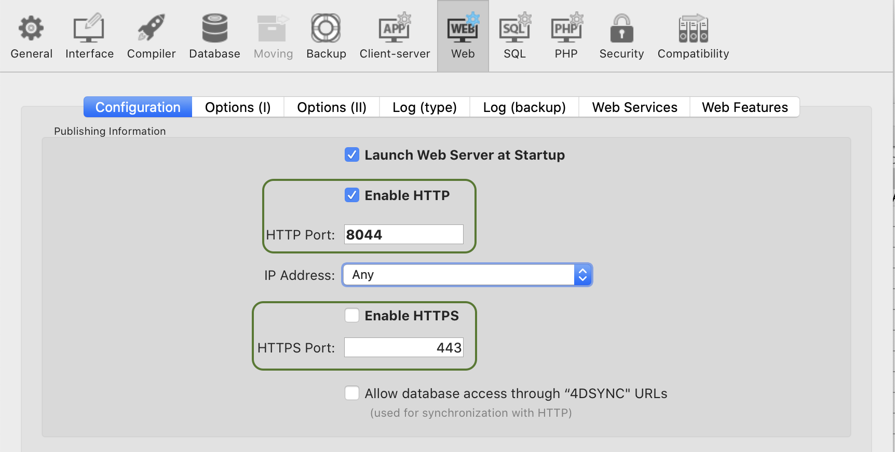

:::caution デベロッパー・プレビュー

4D の Qodly Studio は現在、**デベロッパー・プレビュー** の段階です。 本番環境で使用すべきではありません。

:::

**Qodly Studio** is an interface builder for web applications. It provides developers with a graphical form editor to design applications running in web browsers or smartphones. It supports natively the [ORDA objects](../ORDA/overview.md).

**4D環境** から直接 Qodly Studio を使用して、モダンで洗練されたインターフェースをビルドし、既存の 4Dプロジェクトに簡単に統合して、**オンプレミス** で運用することができます。

Qodly Studioは、Webビジネスアプリケーションの開発に特化した [**Qodly Cloud Platform**](qodly.com) でも使用できます。

Qodly Studio では、全く新しい WebUI を使い、データソースの概念に慣れ、次の操作を学ぶことができます:

- create Qodly forms by placing components on a page
- コンポーネントをデータにマッピングする
- イベントを設定して 4Dコードをトリガーする
- さらに沢山のことが可能です

:::info

The development with Qodly Studio in 4D requires at least a [4D Silver Partner license](https://us.4d.com/4d-partner-program). ライセンスが有効化されていない場合、Qodly Studio に関するオプションやメニュー項目は表示されません。

:::

## 設定

### 要件

#### ブラウザー

Qodly Studio は、以下の Webブラウザーをサポートしています:

- Chrome
- Edge
- FireFox

推奨解像度は 1920x1080 です。

#### 4Dアプリケーション

- 開発: 4D v20 R2 以上
- 運用: 4D Server v20 R2 以上
- Qodly Studio は 4Dプロジェクトでのみ動作します (バイナリデータベースはサポートされていません)。


### Qodly Studio へのアクセスを有効化する

デフォルトでは、Qodly Studio へのアクセスは許可されていません。

Qodly Studioは、[WebAdmin Webサーバー](../Admin/webAdmin.md) によって提供され、表示される 4Dプロジェクトのデータは [4D Webサーバー](webServer.md) によって処理されます。

Qodly Studio へのアクセスを有効化するには、2つのレベルで明示的に許可する必要があります:

* 4Dレベルで (4D または 4D Server)
* プロジェクトレベルで

2つのレベルのいずれか (または両方) が有効でない場合、Qodly Studio　へのアクセスは拒否されます (403ページが返されます)。

#### 4Dレベルで

最初のセキュリティレベルとして、[WebAdmin Webサーバーで Qodly Studio へのアクセスを許可](../Admin/webAdmin.md#qodly-studio-へのアクセスを有効化する) する必要があります。

この設定は、ホストマシンの 4Dアプリケーション (4D または 4D Server) が対象となります。 つまり、その 4Dアプリケーションで開くすべてのプロジェクトで、この設定が適用されます。

アプリケーション上で Qodly Studio へのアクセスを許可しない場合は、このオプションをオフにします。

このオプションにチェックを入れると、Qodly Studio にアクセスできるようになります。 さらに、各プロジェクトのレベルでも許可が必要です。

さらに、[WebAdmin Webサーバーの HTTP/HTTPS ポートを設定](../Admin/webAdmin.md#ローカルホストでhttp接続を受け入れる) することもできます。

:::note

これらの設定を変更した後、新しい設定を有効にするには、[WebAdmin Web サーバー](../Admin/webAdmin.md#開始と停止) を再起動する必要があります。

:::

#### プロジェクトレベルで

4Dレベルで Qodly Studio へのアクセスを有効にした後、アクセスできるプロジェクトをそれぞれ明示的に指定する必要があります。 **Qodly Studio へのアクセスを有効化する** オプションは、[プロジェクト設定の Web機能ページ](../settings/web.md#qodly-studio-へのアクセスを有効化する) で有効にする必要があります。

[ユーザー設定](../settings/overview.md) はいくつかのレベルで定義でき、優先順位が適用されることに留意してください。


### 認証を有効化する

WebAdmin Webサーバーでの認証には、アクセスキーを使用します。 詳しくは、[アクセスキー](../Admin/webAdmin.md#アクセスキー) を参照ください。

### レンダリングを有効化する

To enable the rendering of Qodly forms, the following options must be set.

* 4Dプロジェクトの **設定** > **Web** > **Web機能** > [**RESTサーバーとして公開**](../settings/web.md#restサーバーとして公開) オプションを有効にする必要があります。
* [4D Webサーバー](webServer.md) を起動しておく必要があります。

When rendering Qodly forms in the Qodly Studio, the renderer will connect to the 4D web server through HTTP or HTTPS, depending on the settings, following the same HTTP/HTTPS connection pattern as for the [WebAdmin web server](../Admin/webAdmin.md#accept-http-connections-on-localhost).

:::info

See [this page](https://developer.qodly.com/docs/studio/rendering) for information on how to render Qodly forms in Qodly.

:::

Note that when you click on the "Preview in a new tab" button, a tab will open at `IP:port/$lib/renderer/?w=QodlyFormName` on your machine.

Keep in mind that the Qodly Studio runs through the 4D WebAdmin web server. When you use Qodly Studio as a developer, even when you preview a Qodly form in the studio, you're using the 4D WebAdmin web server. これにより、たとえば RESTリソースとして公開されていないデータクラス、関数、属性を (グレーアウトされた状態で) 見ることができます。

However, form rendering happens outside 4D Web Studio, and is served by the standard 4D web server. このような状況では、Webアプリケーションは RESTリソースとして公開されていないデータにアクセスできません。 [公開vs非公開関数](../ORDA/ordaClasses.md#公開vs非公開関数) および [テーブルの公開](../REST/configuration.md#テーブルの公開) を参照ください。

:::note

設定オプションが有効になっていない場合、[レンダラー ボタン](https://developer.qodly.com/docs/studio/rendering#how-to-render-a-webform) は非表示です。

:::

### WebAdminサーバーと運用

運用には、WebAdminサーバーは必要ありません。 Qodly Studio で作成された Webアプリケーションへのエンドユーザーアクセスは、4D RESTプロトコルに基づいているため、従来の 4Dリモートアプリケーションと同様に動作します。


### プロジェクトメソッドを使用する

推奨される方法は、プロジェクトメソッドではなく、クラス関数を使用することです。 コンポーネントから呼び出すことが可能なのは、クラス関数のみです。 それでも、次の 2つの方法で、Qodly Studio でもプロジェクトメソッドを使用できます:

- クラス関数からメソッドを呼び出すことができます。
- Qodly Explorer から直接 [メソッドを実行](https://developer.qodly.com/docs/studio/coding#methods-and-classes) できます。

## Qodly Studio を開く

Qodly Studio ページは、[WebAdmin Webサーバーが起動されており](../Admin/webAdmin.md#開始と停止)、認証が有効化されている場合に使用できます (上述参照)。

Qodly Studio にアクセスするには 2つの方法があります:

* 4Dシングルユーザーアプリケーションから、**デザイン** > **Qodly Studio...** を選択します。 WebAdmin Webサーバーがすでに起動されている場合は、その設定に応じて、デフォルトのブラウザーが `IPaddress:HTTPPort/studio` または `IPaddress:HTTPSPort/studio` を開きます。 それ以外の場合は、最初に WebAdmin Webサーバーを起動するかどうかを尋ねるメッセージが表示されます。

* 4D または 4D Server から WebAdmin Webサーバーが起動されている状態で、ブラウザーに次のアドレスを入力します:

`IPaddress:HTTPPort/studio`

または:

`IPaddress:HTTPSPort/studio`

たとえば、ポート7080 でローカルWebサーバーを起動した後、ブラウザーに次のアドレスを入力します:

`localhost:7080/studio`

すると、Qodly Studio にアクセスするための [アクセスキー](../Admin/webAdmin.md#アクセスキー) の入力を求められます。


## Qodly Studio を使う

公式の Qodly Studio ドキュメントは、[Qodly ドキュメント Webサイト](https://developer.qodly.com/docs/studio/overview) から入手できます。

You can rely on this documentation and its associated resources for developing web applications powered by Qodly forms. ただし、実装の段階に応じて、4Dデベロッパーは Qodly Studio または 4D IDE を使用します。

:::info

4D で実装されたアプリと Qodly で実装されたアプリの間に直接の互換性はありません。

:::

### 機能の比較

|                                         | 4D IDE を使用する 4Dデベロッパー向けの Qodly Studio                                              | Qodlyデベロッパー向けの Qodly Studio |
| --------------------------------------- | ---------------------------------------------------------------------------------- | --------------------------- |
| テーブル (データクラス)、フィールド (属性)、リレーションの表示および編集 | 4Dストラクチャーエディター(1)                                                                  | Qodly Studio Model Editor   |
| Qodly form                              | Qodly Studio Webform Editor                                                        | Qodly Studio Webform Editor |
| デスクトップフォーム                              | 4D IDE                                                                             | *サポートされていません*               |
| プログラミング言語                               | 4Dランゲージ (ORDA を使用)                                                                 | QodlyScript (ORDA を使用)      |
| コーディング IDE                              | 4D IDE コードエディター / VS Code と [4D拡張機能](https://github.com/4d/4D-Analyzer-VSCode) (2) | Qodly Studio コードエディター       |
| デバッガー                                   | 4D IDE デバッガー                                                                       | Qodly Studio デバッガー          |
| REST/Web ロールとアクセス権                      | roles.json の直接編集 / Qodly Studio ロールとアクセス権エディター                                     | Qodly Studio ロールとアクセス権エディター |

(1) Qodly Studio で **Model** ボタンをクリックしても、何も起こりません。 (2) Qodly Studio で 4Dコードを開くと、シンタックスの配色がサポートされておらず、"Lsp not loaded" という警告が表示されます。


### プロジェクト管理

4Dプロジェクトの管理上、以下の使用法のみがサポートされます:

- Qodly Studio での開発は **4D** (シングルユーザー) でおこなう必要があります。
- deployment of 4D applications powered with Qodly forms must be done using **4D Server**.


### QodlyScript から 4Dランゲージへ

4D developers can use the [Qodly Studio documentation](developer.qodly.com/docs/studio) to learn how to design their Qodly forms in Qodly Studio. コードの例は QodlyScript で提供されていますが、QodlyScript は 4Dランゲージから継承しているため、困ることはありません。 QodlyScript コードを 4Dランゲージに変換するのは簡単で、いくつかの調整が必要なだけです:

#### 変数名

QodlyScript はローカル変数のみをサポートするため、QodlyScript の例題では、変数に `$` という接頭辞が付きません。 4Dコードでは、4D によってローカル変数として識別されるように、**変数名の前には必ず `$` を付けてください**。

#### 記号とキーワード

一部の基本的な記号、演算子、キーワードは QodlyScript では異なるため、4Dランゲージ用に変換する必要があります。 以下に一覧を示します:

| QodlyScript | 4Dランゲージ                                                     | 説明       |
| ----------- | ----------------------------------------------------------- | -------- |
| ,           | ;                                                           | 引数の区切り文字 |
| =           | :=                                                          | 代入演算子    |
| ==          | =                                                           | 比較演算子    |
| declare     | #Declare                                                    |          |
| switch      | Case of                                                     |          |
| constructor | Class constructor                                           |          |
| extends     | Class extends                                               |          |
| end         | End for, End For each, End if, End case, End use, End while |          |
| forEach     | For each                                                    |          |
| string      | Text                                                        | 変数の型     |
| number      | Real                                                        | 変数の型     |

他の一部の項目では文字の大小が異なりますが (例: `this` と `This`)、4Dコードに直接貼り付けることができます。


#### コマンド名

QodlyScript のコマンド名は、スペースを入れずにキャメルケースで記述されます。 これらのコマンドを 4Dランゲージに変換する必要がある場合があります。

- 通常は、単に名前を変換するだけで十分です。 たとえば、QodlyScript の `newCollection` は 4Dランゲージの `New collection` です。
- ただし、コンプライアンス向上のため、一部のコマンドでは名前が変更されました。 以下に一覧を示します:

| QodlyScript            | 4Dランゲージ          |
| ---------------------- | ---------------- |
| `atan`                 | `Arctan`         |
| `highestProcessNumber` | `Count tasks`    |
| `callChain`            | `Get call chain` |
| `objectClass`          | `OB Class`       |
| `objectCopy`           | `OB Copy`        |
| `objectEntries`        | `OB Entries`     |
| `instanceOf`           | `OB Instance of` |
| `objectIsDefined`      | `OB Is defined`  |
| `objectIsEmpty`        | `OB Is empty`    |
| `objectIsShared`       | `OB Is shared`   |
| `objectKeys`           | `OB Keys`        |
| `objectRemove`         | `OB REMOVE`      |
| `objectValues`         | `OB Values`      |
| `sqrt`                 | `Square root`    |


#### 例題

- QodlyScript コード:

```qs
 declare(entitySelection : 4D.EntitySelection)  
 var dataClass : 4D.DataClass
 var entity, duplicate : 4D.Entity
 var status : object
 dataClass=entitySelection.getDataClass()
 forEach(entity,entitySelection)
    duplicate=dataClass.new()
    duplicate.fromObject(entity.toObject())
    duplicate[dataClass.getInfo().primaryKey]=null
    status=duplicate.save()
 end
```


- 上に相当する 4Dランゲージのコード:

```4d
 #DECLARE ( $entitySelection : 4D.EntitySelection )  
 var $dataClass : 4D.DataClass
 var $entity; $duplicate : 4D.Entity
 var $status : Object
 $dataClass:=$entitySelection.getDataClass()
 For each($entity;$entitySelection)
    $duplicate:=$dataClass.new()
    $duplicate.fromObject($entity.toObject())
    $duplicate[$dataClass.getInfo().primaryKey]:=Null
    $status:=$duplicate.save()
 End for each

```

### オフラインでの使用

コンピュータがインターネットに接続されていない状態でも、Qodly Studio を使って開発することができます。 ただしこの場合、以下の機能は使用できません:

- [テンプレート](https://developer.qodly.com/docs/studio/design-webforms/templates): テンプレートライブラリは空です。
- UI Tips: アイコンをクリックしても表示されません。


## ライセンスの使用について

To render Qodly forms, you must have an available license, as rendering a Qodly form opens a session on the project database's main web server.

### URLスキーム

Qodly Studio's URL scheme configuration (HTTP and HTTPS) determines how many licenses are retained when rendering Qodly forms. 適切な設定により、不要なライセンスの使用を回避できます。

[設定](#設定) セクションで説明したように、WebAdmin Webサーバーは Qodly Studio へのセキュアな Webアクセスを提供します。 一方、[レンダラー](#レンダリングを有効化する) は RESTリクエストを使用してデータベースの 4D Webサーバーと通信します。 そのため、従来の 4Dクライアントと同じように動作します。

Qodly Studio からレンダラーを実行する際、これら 2つの Webサーバーに同じ URLスキーム (HTTP または HTTPS) 経由でアクセスしていない場合には、ライセンスのカウントが正しくおこなわれない可能性があります。

#### 例題

1. Qodly Studio を HTTPS URLスキームで実行します (例: `https://127.0.0.1:7443/studio/`)

2. データベースの Webサーバーは HTTPポート上でのみ起動します。



3. Qodly Studioで、**レンダリング** アイコンをクリックします。 2つの Webサーバーが異なるスキームで起動されていることを警告されますが、それにもかかわらず、**Confirm** ボタンをクリックします。


結果、2つのライセンスが使用されます。

:::note

Qodly Studio のユーザー設定で、レンダラーのポップオーバーについて表示/非表示を切り替えることができます。

:::

### SameSite 属性

先に説明したふるまいは、4D Webサーバーのセッションcookie によるものです。 このセッションcookie には、`SameSite` 属性があり、セッションcookie が Webサーバーに送信されるかどうかを決定します。

`SameSite` 属性の値が `Strict` (デフォルト) の場合、セッションcookie は Webサーバーに送信されないため、ページが表示されたり更新されたりするたびに新しいセッションが開かれます。

`SameSite` 属性の詳細については、[このブログ記事](https://blog.4d.com/ja/get-ready-for-the-new-SameSite-and-secure-attributes-for-cookies/) を参照ください。

### 推奨事項

必要以上のライセンスを使用しないため、次のいずれかをお勧めします:

- Run the renderer on another browser tab (by entering the rendered URL of your Web form: `IP:port/$lib/renderer/?w=QodlyFormName`).
- Qodly Studio とデータベースが同じ URLスキームでアクセスされていることを確認します。
- プロジェクトデータベースの Webサーバーの [セッションcookie](webServerConfig.md#セッションcookie-samesite) には、`Lax` の値を使用してください。


## Hello, World

この 5分間のビデオでは "Hello World" の例を説明します。まず、Qodly Studio へのアクセスを有効にし、基本的なインターフェースを作成して、ユーザー名を使って挨拶をするイベントを設定します。

<iframe width="560" height="315" src="https://www.youtube.com/embed/GwIdic4OhPQ" title="YouTubeビデオプレーヤー" frameborder="0" allow="accelerometer; clipboard-write; encrypted-media; gyroscope; picture-in-picture" allowfullscreen="true"></iframe>
