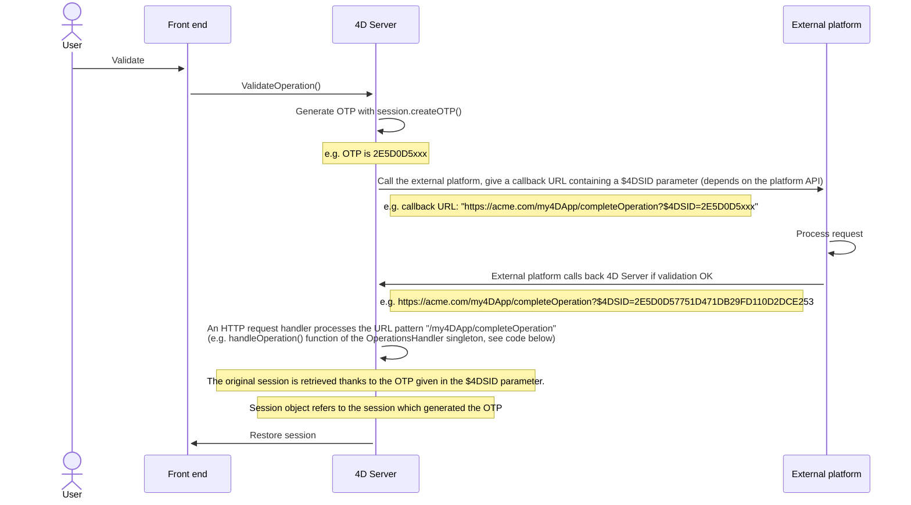
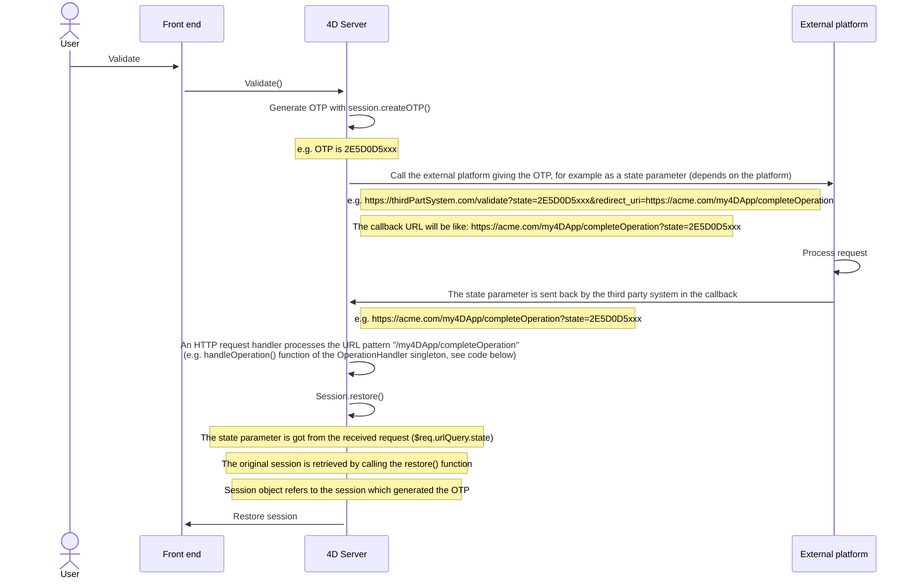

4D Webサーバーは、**Webセッション** を管理するビルトインの機能を提供します。  Webセッションを作成・維持することで、Webアプリケーション上のユーザーエクスペリエンスを管理・向上することができます。 Webセッションが有効かされていると、Webクライアントはリクエスト間で同じコンテキスト (セレクションや変数の値) を再利用できます。

Webセッションでは、以下のことが可能です:

- 同一のWebクライアントからの複数のリクエストを、無制限のプリエンプティブプロセスで同時に処理 (Webセッションは **スケーラブル**です)。
- `Session` オブジェクトと [Session API](API/SessionClass.md) を介したセッションの管理。
- セッションの [.storage](../API/SessionClass.md#storage) を使用して、Webクライアントのプロセス間でデータを保存および共有。
- セッションを実行しているユーザーに権限を関連付ける。

## 用途

Webセッションは次のものに使用されます:

- HTTPリクエストを送信する [Webアプリケーション](gettingStarted.md)
- [リモートデータストア](../ORDA/remoteDatastores.md) や [Qodlyフォーム](qodly-studio.md) が使用する [REST API](../REST/authUsers.md) への呼び出し

## Webセッションの有効化

セッション管理機能は、4D Webサーバー上で有効または無効にすることができます。 セッション管理を有効化する方法は複数あります:

- ストラクチャー設定の Web / オプション (I) ページの **スケーラブルセッション** を使用する (永続的な設定): 

このオプションは、新規プロジェクトではデフォルトで選択されています。 これは、**セッションなし** オプションを選択して無効にすることもできます。この場合、Webセッション機能は無効になります (`Session` オブジェクトは使用できません)。

- Webサーバーオブジェクトの [`.scalableSession`](API/WebServerClass.md#scalablesession) プロパティを使用する ([`.start()`](API/WebServerClass.md#start) 関数に *settings* 引数として渡します）。  この場合、ストラクチャー設定ダイアログボックスで定義されたオプションよりも、Webサーバーオブジェクトの設定が優先されます (ディスクには保存されません)。

> The [`WEB SET OTPION`](../commands-legacy/web-set-option.md) command can also set the session mode for the main Web server.

いずれの場合も、設定はマシンに対しローカルなものです。つまり、4D Server の Webサーバーと、リモートの 4Dマシンの Webサーバーで異なる設定が可能です。

> **互換性について**: 4D v18 R6 以前の 4Dバージョンで作成されたプロジェクトでは、**旧式セッション** オプションが使用できます (詳細については、[doc.4d.com](https://doc.4d.com) の Webサイトを参照ください)。

## セッションの実装

[セッションを有効にする](#セッションの有効化) と、4D自身が設定したプライベート cookie ("4DSID_*AppName*"、*AppName* はアプリケーションプロジェクトの名称) に基づいて、自動メカニズムが実装されます。  この cookie は、アプリケーションのカレントWebセッションを参照します。

:::info

この cookie の名前は、[`.sessionCookieName`](API/WebServerClass.md#sessioncookiename) プロパティを使用して取得できます。

:::

1. Webサーバーは、各Webクライアントリクエストにおいて、プライベートな "4DSID__AppName_" cookie の存在と値をチェックします。

2. cookie に値がある場合、4D は既存セッションの中からこのクッキーを作成したセッションを探し、見つかった場合には再利用します。

3. クライアントからのリクエストが、すでに開かれているセッションに対応していない場合:

- プライベートな "4DSID__AppName_" cookie を持つ新しいセッションが Webサーバー上に作成されます。
- 新しいゲスト `Session` オブジェクトが作成され、このスケーラブルWebセッション専用に使用されます。

:::note

RESTリクエストのための Webセッションを作成するには、利用可能なライセンスが必要な場合があります。詳細は [こちらのページ](../REST/authUsers.md) を参照ください。

:::

カレントセッションの `Session` オブジェクトは、あらゆる Webプロセスのコードにおいて [`Session`](commands/session.md) コマンドを介してアクセスできます。


:::info

Webプロセスは通常終了せず、効率化のためにプールされリサイクルされます。 プロセスがリクエストの実行を終えると、プールに戻され、次のリクエストに対応できるようになります。 Webプロセスはどのセッションでも再利用できるため、実行終了時には ([`CLEAR VARIABLE`](https://doc.4d.com/4dv20/help/command/ja/page89.html) などを使用し) コードによって [プロセス変数](Concepts/variables.md#プロセス変数) をクリアする必要があります 。  このクリア処理は、開かれたファイルへの参照など、プロセスに関連するすべての情報に対して必要です。 これが、セッション関連の情報を保持したい場合には、[Session](API/SessionClass.md) オブジェクトを使用することが **推奨** される理由です。

:::

## セッション情報の保存と共有

各 `Session` オブジェクトには、共有オブジェクトである [`.storage`](API/SessionClass.md#storage) プロパティが用意されています。  このプロパティにより、セッションで処理されるすべてのプロセス間で情報を共有することができます。

## セッションの有効期限

スケーラブルWebセッションは、以下の場合に閉じられます:

- Webサーバーが停止したとき。
- セッションcookie がタイムアウトしたとき。

非アクティブな cookie の有効期限は、デフォルトでは 60分です。つまり、Webサーバーは、非アクティブなセッションを 60分後に自動的に閉じます。

このタイムアウトは、`Session` オブジェクトの [`.idleTimeout`](API/SessionClass.md#idletimeout) プロパティで設定できます (タイムアウトは 60分未満にはできません)。また、[`Open datastore`](../commands/open-datastore.md)コマンドの *connectionInfo* パラメーターを使っても設定できます。

Webセッションが閉じられた後に [`Session`](commands/session.md) コマンドが呼び出されると:

- `Session` オブジェクトには権限が含まれていません (ゲストセッション)。
- [`.storage`](API/SessionClass.md#storage) プロパティは空です。
- 新しいセッションcookie がセッションに関連付けられています。

:::info

[**ログアウト**](qodly-studio.md#ログアウト) 機能を使用して、Qodly フォームからのセッションを閉じることができます。

:::

## 権限

Webユーザーセッションには、権限を関連付けることができます。  セッションの権限に応じて、特定のアクセスや機能を Webサーバー上で提供することができます。

権限を割り当てるには、[`.setPrivileges()`](API/SessionClass.md#setprivileges) 関数を使用します。  コード内では、[`.hasPrivilege()`](API/SessionClass.md#hasprivilege) 関数を使ってセッションの権限をチェックし、アクセスを許可または拒否することができます。  デフォルトでは、新しいセッションは権限を持たず、**ゲスト** セッションとなります ([`.isGuest()`](API/SessionClass.md#isguest) 関数は true を返します)。

例:

```4d
If (Session.hasPrivilege("WebAdmin"))
    // アクセス権が付与されているので、何もしません
Else
    // 認証ページを表示します
End if

```

:::info

権限は ORDAアーキテクチャーの中心に実装されており、データストアやデータクラス関数へのアクセスを制御するための強力な技術を開発者に提供します。  詳細については、ORDA の章の [**権限**](../ORDA/privileges.md) を参照ください。

:::

## 例題

CRMアプリケーションを使って、各営業担当者が自分の顧客ポートフォリオを管理します。 データストアには、少なくとも 2つのリンクされたデータクラス Customers と SalesPersons が含まれています (営業担当者は複数の顧客を持ちます)。


営業担当者がログインし、Webサーバー上でセッションを開き、上位3名の顧客をセッションに読み込ませたいとします。

1. セッションを開くために以下の URL を実行します:

```
http://localhost:8044/authenticate.shtml
```

> 本番環境では、暗号化されていない情報がネットワーク上を流れるのを防ぐために、[HTTPS接続](API/WebServerClass.md#httpsenabled) を使用する必要があります。

2. `authenticate.shtml` ページは、*userId* と *password* の入力フィールドを含むフォームで、4DACTION の POSTアクションを送信します:

```html
<!DOCTYPE html>
<html>
<body bgcolor="#ffffff">
<FORM ACTION="/4DACTION/authenticate" METHOD=POST>
    UserId: <INPUT TYPE=TEXT NAME=userId VALUE=""><br/>
    Password: <INPUT TYPE=TEXT NAME=password VALUE=""><br/>
<INPUT TYPE=SUBMIT NAME=OK VALUE="Log In">
</FORM>
</body>
</html>
```


3. authenticate project メソッドは、*userID* に合致する担当者を探し、*SalesPersons* テーブルに保存されているハッシュ値をパスワードと照合します。

```4d
var $indexUserId; $indexPassword; $userId : Integer
var $password : Text
var $userTop3; $sales; $info : Object


ARRAY TEXT($anames; 0)
ARRAY TEXT($avalues; 0)

WEB GET VARIABLES($anames; $avalues)

$indexUserId:=Find in array($anames; "userId")
$userId:=Num($avalues{$indexUserId})

$indexPassword:=Find in array($anames; "password")
$password:=$avalues{$indexPassword}

$sales:=ds.SalesPersons.query("userId = :1"; $userId).first()

If ($sales#Null)
    If (Verify password hash($password; $sales.password))
        $info:=New object()
        $info.userName:=$sales.firstname+" "+$sales.lastname
        Session.setPrivileges($info)
        Use (Session.storage)
            If (Session.storage.myTop3=Null)
                $userTop3:=$sales.customers.orderBy("totalPurchase desc").slice(0; 3)

                Session.storage.myTop3:=$userTop3
            End if
        End use
        WEB SEND HTTP REDIRECT("/authenticationOK.shtml")
    Else
        WEB SEND TEXT("パスワードに誤りがあります")
    End if
Else
    WEB SEND TEXT("この userId は登録されていません")
End if
```

:::note

[高度な Webアプリケーションに対応したスケーラブルセッション](https://blog.4d.com/ja/scalable-sessions-for-advanced-web-applications/)

:::

## セッショントークン(OTP)

4D web サーバーでは、OTP (One-Time Passcode/ワンタイムパスコード) セッショントークンを生成、共有、そして使用することができます。 OTP セッショントークンは、サードパーティのアプリケーションやWebサイトとの通信を保護するために使用されます。 OTP の詳細な情報については、Wikipedia の[ワンタイムパスワードのページ](https://ja.wikipedia.org/wiki/%E3%83%AF%E3%83%B3%E3%82%BF%E3%82%A4%E3%83%A0%E3%83%91%E3%82%B9%E3%83%AF%E3%83%BC%E3%83%89) を参照して下さい。

4D では、OTP セッショントークンは外部URL を呼び出して、それが他のブラウザや他のデバイス(モバイル/PC) でコールバックされる場合に特に有用です。 通常、こういったサードパーティアプリケーションはコールバックリンクが入った確認メールを送信してきて、ユーザーはこれをクリックする必要があります。 コールバックリンクにはOTP トークンが含まれており、そのコールバックをトリガーしたセッションは、そのデータと権限とともにロードされます。 この原理により、同じセッションを複数のデバイス間で共有することができます。 このアーキテクチャーのおかげで、[セッションクッキー](#session-implementation) はネットワークに公開されることはないため、中間者攻撃のリスクを排除することができます。

### 概要

4D Web アプリケーションにおけるOTP セッショントークンの利用の基本的なシーケンスは、以下の通りです:

1. Web ユーザーが、保護されたサードパーティ接続を必要とするアクションを開始します。例えば、特定のセッション内での認証などです。
2. 4D コード内において、[`Session.createOTP()`](../API/SessionClass.md#createotp) 関数を使用してそのセッションのための新しいOTP を作成します。
3. サードパーティアプリケーションに対して、コールバックURL 内にセッショントークンを含んだリクエストを送信します。 ここで、サードパーティアプリケーションにコールバックURL を提供する方法は、API によって異なるという点に注意して下さい(下記参照)。
4. サードパーティアプリケーションは、コールバックURL に提供したパターンを使用して4D へリクエストを送り返します。
5. その後、そのリクエストのコールバックをアプリケーション内で処理します。

その名前が示す通り、OTP (ワンタイムパスワード)トークンは一度しか使用することができません。 このシナリオにおいては、既に使用されたセッショントークンを引数として持つWeb リクエストが受信された場合、最初のセッションは復元されません。

### OTPをコールバックで処理する

サードパーティアプリケーションからのOTP トークンを含んだコールバックは、開発とサードパーティAPI に応じて、4D アプリケーション内で違う方法で処理することもできます。 基本的には、トークンを扱う方法には2つの方法があります: 自動処理をする **`$4DSID`** 引数を通して渡すか、自分で処理する必要があるカスタム引数を通して渡すかです。

#### `$4DSID`をURLの中で使用する

`$4DSID` 引数を使用するのが、サードパーティアプリケーションからのコールバックを処理するための最もシンプルな方法です:

- OTP トークンは直接コールバックURL 内で引数として、標準の`?$4DSID=XXXX123` シンタックスを使用して提供されます。
- 4D では[`IncomingMessage`](../API/IncomingMessageClass.md) および [`OutgoingMessage`](../API/OutgoingMessageClass.md) クラスを使用して、4D アプリケーション内に専用の[HTTP リクエストハンドラー](http-request-handler.md) を実装します。
- `$4DSID` トークンが有効であれば、関連したWeb ユーザーセッションはあらゆるWeb プロセスにおいて、そのストレージと権限を持って **自動的に復元されます**。

:::note

4D 側では[`4DACTION`](./httpRequests.md#4daction) URL を使用することもできます。

:::

#### カスタムの引数を使用する

OTP トークンは、セッションを復元するために特別に処理する必要があるカスタムの引数として渡すこともできます。 このソリューションは、以下のような場合に使用する必要があります:

- サードパーティアプリケーションが`$4DSID` のような引数をリダイレクトURI に挿入することを許可しておらず、専用のAPI を提供している(実装はサードパーティアプリケーションに依存します)。
- あるいは、コールバックを処理するのにREST 経由でORDA 関数を呼び出したい場合。この場合、OTP は[REST 引数シンタックス](../REST/ClassFunctions.md#parameters) (例: `?$params='["XXX123"]'`) に則って渡す必要があります。

どちらの場合においても、カスタムの引数からトークンを抽出し、そして[`Session.restore()`](../API/SessionClass.md#restore) 関数にトークンを引数として渡して呼び出す必要があります。

#### 無効なOTPを処理する

OTP トークンは以下の場合には無効と判断されます:

- セッショントークンが既に使用されていた場合
- セッショントークンが失効してしまっている場合
- セッショントークンが存在しない場合
- オリジナルのセッション自身が失効してしまっている場合

この場合、Web ユーザーセッションは復元されず、またカレントセッション(あれば)は変更されずにそのままにされます。 通常、ログインページを表示するか、あるいはゲストセッションを開くかを決めることができます。

受信したOTP トークンが有効化かどうかの検証するための方法は、その使用方法によって異なります:

- `$4DSID` を使用した場合、[session storage](../API/SessionClass.md#storage) にカスタムのステータスプロパティをトークン作成時に保存しておき、OTP トークンを受信したときにそれが同じ値であるかを見ることでステータスをチェックすることができます(例題参照)。
- [`Session.restore()`](../API/SessionClass.md#restore) 関数を使用した場合、セッションが正常に復元されていれば、この関数はTrue を返します。

### $4DSIDを使用したシナリオ

`$4DSID` キーを使用する場合のシナリオは、以下の図に表されています:



4D HTTP リクエストハンドラー定義は以下のようになります:

```json
[
  {
    "class": "OperationsHandler",
    "method": "handleOperation",
    "regexPattern": "/my4DApp/completeOperation",
    "verbs": "get"
  }
]
```

シングルトンクラス定義は以下のようになります:

```4d
// OperationsHandler クラス
shared singleton Class constructor()
    function handleOperation($request : 4D.IncomingMessage) 
    $session:=Session
```

### `restore`関数を使用するシナリオ

カスタムの引数を使用する場合のシナリオは、以下の図に表されています:



4D HTTP リクエストハンドラー定義は以下のようになります:

```json
[
  {
    "class": "OperationsHandler",
    "method": "handleOperation",
    "regexPattern": "/my4DApp/completeOperation",
    "verbs": "get"
  }
]
```

シングルトンクラス定義は以下のようになります:

```4d
// OperationsHandler クラス
shared singleton Class constructor()
    Function handleOperation($req : 4D.IncomingMessage) : 4D.OutgoingMessage
    Session.restore($req.urlQuery.state)
```

### $4DSIDを使用したメール検証の例

1. ユーザーアカウントが *Users* データクラス内で作成されるような場合を考えます。 まず、Eメールとパスワードを格納した *$info* オブジェクトが受信されます。 次に、カレントのセッションに対応したOTP が生成されます。 最後に、$4DSID 引数内に渡されたOTP を含んだURL が返されます。

```4d
//cs.Users class

Function create($info : Object) : Text
	
var $user : cs.UsersEntity
var $status : Object
var $token : Text
	
$user:=This.new() // 新規ユーザーを作成
$user.fromObject($info)
$status:=$user.save()
	
// ユーザー作成ステータスを含めた情報を、
// セッションに保存する
Use (Session.storage)
	Session.storage.status:=New shared object("step"; "Waiting for validation email"; /
    "email"; $user.email; "ID"; $user.ID)
End use 
	
// セッションに対応したOTP を生成
$token:=Session.createOTP()

// $4DSID 引数を持ったURL を返す
return "https://my.server.com/tools/validateEmail?$4DSID="+$token`

```

2. ユーザーにはこのURL をリンクとして格納したEメールが送信されます。 `/validateEmail` のURL 接頭辞は[カスタムのHTTP リクエストハンドラー](./http-request-handler.md) によって管理されます:

```json
[
  {
    "class": "RequestHandler",
    "method": "validateEmail",
    "regexPattern": "/validateEmail",
    "verbs": "get"
  }
]
```

RequestHandler シングルトンの、*validateEmail()* 関数は以下のようになります:

```4d
//validateEmail クラス

shared singleton Class constructor()

Function validateEmail() : 4D.OutgoingMessage
	
 var $result:=4D.OutgoingMessage.new()
    // OTP を生成したセッションは、
    // $4DID 内に渡されたURL のおかげで取得することができます。
 If (Session.storage.status.step="Waiting for validation email")
	
  $user:=ds.Users.get(Session.storage.status.ID)
  $user.emailValidated() //true に設定する
		
  $result.setBody("Congratulations <br>"\
  +"Your email "+Session.storage.status.email+" has been validated")
		
  $result.setHeader("Content-Type"; "text/html"	
  Use (Session.storage.status)
	Session.storage.status.step:="Email validated"
  End use
 Else
  $result.setBody("Invalid token")

 End if 
	
 return $result

```

`$4DSID` 引数にはオリジナルのセッションに対応した有効なOTP が格納されているため、`Session` オブジェクトはそのOTP を作成したセッションを参照することができます。

新規ユーザーが作成され、特にユーザーアカウント作成プロセスの現在のステップ(認証メールを待っている段階である)とユーザーIDなどのいくつかの情報がセッションに保存されます。

### サポートされるコンテキスト

- HTTP とHTTPS スキーマの両方がサポートされます。
- トークンで再使用ができるのは[スケーラブルセッション](#Webセッションの有効化) のみです。
- 再使用ができるのはホストデータベースのセッションのみです(コンポーネントのWeb サーバーで作成されたセッションは復元することができません)。
- トークンはクライアント/サーバーセッション、あるいはシングルユーザーセッションにおいてはサポートされていません。

### ライフスパン

セッショントークンにはライフスパン(有効期限)があり、またセッション自身にもライフスパンがあります。 セッショントークンのライフスパンは、[トークン作成時](../API/SessionClass.md#createotp) に設定することが可能です。 デフォルトで、トークンのライフスパンは[`.idleTimeout`](../API/SessionClass.md#idletimeout) の値と同じ値となっています。

セッショントークンのライフパンと、セッションのライフスパンの両方がどちらも失効していない場合に限り、トークンを使用してセッションを復元することができます。 それ以外の場合(セッショントークンが失効している、またはセッション自身が失効している)には、セッショントークンをもったWeb リクエストが受信されたときにゲストセッションが作成されます。

:::note

より詳細な情報に関しては、[Connect Your Web Apps to Third-Party Systems](https://blog.4d.com/connect-your-web-apps-to-third-party-systems/) のblog 記事を参照して下さい。

:::
