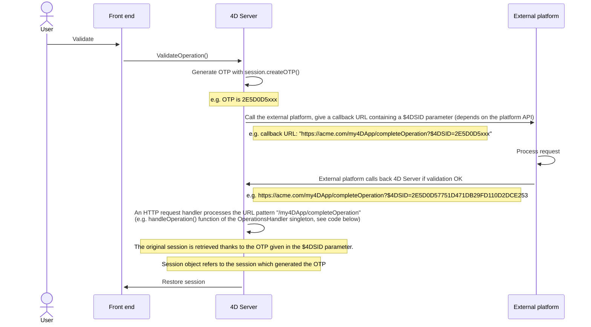
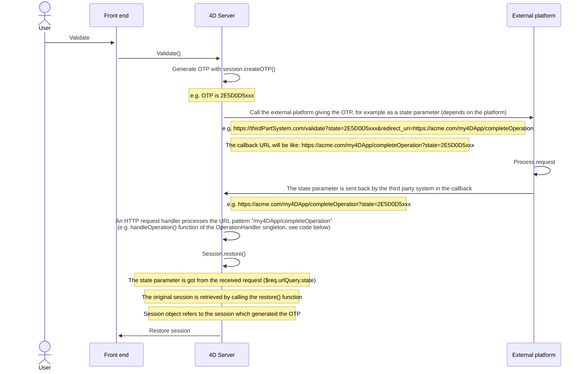

4D Webサーバーは、**Webセッション** を管理するビルトインの機能を提供します。 Webセッションを作成・維持することで、Webアプリケーション上のユーザーエクスペリエンスを管理・向上することができます。 Webセッションが有効かされていると、Webクライアントはリクエスト間で同じコンテキスト (セレクションや変数の値) を再利用できます。 Webセッションを作成・維持することで、Webアプリケーション上のユーザーエクスペリエンスを管理・向上することができます。 Webセッションが有効かされていると、Webクライアントはリクエスト間で同じコンテキスト (セレクションや変数の値) を再利用できます。 Webセッションを作成・維持することで、Webアプリケーション上のユーザーエクスペリエンスを管理・向上することができます。 Webセッションが有効かされていると、Webクライアントはリクエスト間で同じコンテキスト (セレクションや変数の値) を再利用できます。

Webセッションでは、以下のことが可能です:

- 同一のWebクライアントからの複数のリクエストを、無制限のプリエンプティブプロセスで同時に処理 (Webセッションは **スケーラブル**です)。
- `Session` オブジェクトと [Session API](API/SessionClass.md) を介したセッションの管理。
- セッションの [.storage](../API/SessionClass.md#storage) を使用して、Webクライアントのプロセス間でデータを保存および共有。
- セッションを実行しているユーザーに権限を関連付ける。

## 用途

Webセッションは次のものに使用されます:

- HTTPリクエストを送信する [Webアプリケーション](gettingStarted.md)
- [リモートデータストア](../ORDA/remoteDatastores.md) や [Qodlyフォーム](qodly-studio.md) が使用する [REST API](../REST/authUsers.md) への呼び出し

## Webセッションの有効化

セッション管理機能は、4D Webサーバー上で有効または無効にすることができます。 セッション管理を有効化する方法は複数あります:

- Using the **Scalable sessions** OTPion on the "Web/OTPions (I)" page of the Settings (permanent setting):
  

This OTPion is selected by default in new projects. It can however be disabled by selecting the **No sessions** OTPion, in which case the web session features are disabled (no `Session` object is available).

- Webサーバーオブジェクトの [`.scalableSession`](API/WebServerClass.md#scalablesession) プロパティを使用する ([`.start()`](API/WebServerClass.md#start) 関数に _settings_ 引数として渡します）。 この場合、ストラクチャー設定ダイアログボックスで定義されたオプションよりも、Webサーバーオブジェクトの設定が優先されます (ディスクには保存されません)。 この場合、ストラクチャー設定ダイアログボックスで定義されたオプションよりも、Webサーバーオブジェクトの設定が優先されます (ディスクには保存されません)。 In this case, this setting overrides the OTPion defined in the Settings dialog box for the Web Server object (it is not stored on disk).

> The [`WEB SET OTPION`](../commands-legacy/web-set-OTPion.md) command can also set the session mode for the main Web server.

いずれの場合も、設定はマシンに対しローカルなものです。つまり、4D Server の Webサーバーと、リモートの 4Dマシンの Webサーバーで異なる設定が可能です。

> **Compatibility**: A **Legacy sessions** OTPion is available in projects created with a 4D version prior to 4D v18 R6 (for more information, please refer to the [doc.4d.com](https://doc.4d.com) web site).

## セッションの実装

When [sessions are enabled](#enabling-web-sessions), automatic mechanisms are implemented, based upon a private cookie set by 4D itself: "4DSID__AppName_", where _AppName_ is the name of the application project. この cookie は、アプリケーションのカレントWebセッションを参照します。

:::info

この cookie の名前は、[`.sessionCookieName`](API/WebServerClass.md#sessioncookiename) プロパティを使用して取得できます。

:::

1. Webサーバーは、各Webクライアントリクエストにおいて、プライベートな "4DSID__AppName_" cookie の存在と値をチェックします。

2. cookie に値がある場合、4D は既存セッションの中からこのクッキーを作成したセッションを探し、見つかった場合には再利用します。

3. クライアントからのリクエストが、すでに開かれているセッションに対応していない場合:

- プライベートな "4DSID__AppName_" cookie を持つ新しいセッションが Webサーバー上に作成されます。
- 新しいゲスト `Session` オブジェクトが作成され、このスケーラブルWebセッション専用に使用されます。

:::note

RESTリクエストのための Webセッションを作成するには、利用可能なライセンスが必要な場合があります。詳細は [こちらのページ](../REST/authUsers.md) を参照ください。

:::

カレントセッションの `Session` オブジェクトは、あらゆる Webプロセスのコードにおいて [`Session`](commands/session.md) コマンドを介してアクセスできます。


:::info

Webプロセスは通常終了せず、効率化のためにプールされリサイクルされます。 プロセスがリクエストの実行を終えると、プールに戻され、次のリクエストに対応できるようになります。 Webプロセスは通常終了せず、効率化のためにプールされリサイクルされます。 プロセスがリクエストの実行を終えると、プールに戻され、次のリクエストに対応できるようになります。 Webプロセスは通常終了せず、効率化のためにプールされリサイクルされます。 プロセスがリクエストの実行を終えると、プールに戻され、次のリクエストに対応できるようになります。 Webプロセスはどのセッションでも再利用できるため、実行終了時には ([`CLEAR VARIABLE`](https://doc.4d.com/4dv20/help/command/ja/page89.html) などを使用し) コードによって [プロセス変数](Concepts/variables.md#プロセス変数) をクリアする必要があります 。 このクリア処理は、開かれたファイルへの参照など、プロセスに関連するすべての情報に対して必要です。 これが、セッション関連の情報を保持したい場合には、[Session](API/SessionClass.md) オブジェクトを使用することが **推奨** される理由です。 このクリア処理は、開かれたファイルへの参照など、プロセスに関連するすべての情報に対して必要です。 これが、セッション関連の情報を保持したい場合には、[Session](API/SessionClass.md) オブジェクトを使用することが **推奨** される理由です。 このクリア処理は、開かれたファイルへの参照など、プロセスに関連するすべての情報に対して必要です。 これが、セッション関連の情報を保持したい場合には、[Session](API/SessionClass.md) オブジェクトを使用することが **推奨** される理由です。

:::

## セッション情報の保存と共有

各 `Session` オブジェクトには、共有オブジェクトである [`.storage`](API/SessionClass.md#storage) プロパティが用意されています。 このプロパティにより、セッションで処理されるすべてのプロセス間で情報を共有することができます。 このプロパティにより、セッションで処理されるすべてのプロセス間で情報を共有することができます。 このプロパティにより、セッションで処理されるすべてのプロセス間で情報を共有することができます。

## セッションの有効期限

スケーラブルWebセッションは、以下の場合に閉じられます:

- Webサーバーが停止したとき。
- セッションcookie がタイムアウトしたとき。

非アクティブな cookie の有効期限は、デフォルトでは 60分です。つまり、Webサーバーは、非アクティブなセッションを 60分後に自動的に閉じます。

このタイムアウトは、`Session` オブジェクトの [`.idleTimeout`](API/SessionClass.md#idletimeout) プロパティで設定できます (タイムアウトは 60分未満にはできません)。また、[`Open datastore`](../commands/open-datastore.md)コマンドの _connectionInfo_ パラメーターを使っても設定できます。

Webセッションが閉じられた後に [`Session`](commands/session.md) コマンドが呼び出されると:

- `Session` オブジェクトには権限が含まれていません (ゲストセッション)。
- [`.storage`](API/SessionClass.md#storage) プロパティは空です。
- 新しいセッションcookie がセッションに関連付けられています。

:::info

[**ログアウト**](qodly-studio.md#ログアウト) 機能を使用して、Qodly フォームからのセッションを閉じることができます。

:::

## 権限

Webユーザーセッションには、権限を関連付けることができます。 セッションの権限に応じて、特定のアクセスや機能を Webサーバー上で提供することができます。 セッションの権限に応じて、特定のアクセスや機能を Webサーバー上で提供することができます。 セッションの権限に応じて、特定のアクセスや機能を Webサーバー上で提供することができます。

権限を割り当てるには、[`.setPrivileges()`](API/SessionClass.md#setprivileges) 関数を使用します。 権限を割り当てるには、[`.setPrivileges()`](API/SessionClass.md#setprivileges) 関数を使用します。 権限を割り当てるには、[`.setPrivileges()`](API/SessionClass.md#setprivileges) 関数を使用します。 コード内では、[`.hasPrivilege()`](API/SessionClass.md#hasprivilege) 関数を使ってセッションの権限をチェックし、アクセスを許可または拒否することができます。 デフォルトでは、新しいセッションは権限を持たず、**ゲスト** セッションとなります ([`.isGuest()`](API/SessionClass.md#isguest) 関数は true を返します)。 デフォルトでは、新しいセッションは権限を持たず、**ゲスト** セッションとなります ([`.isGuest()`](API/SessionClass.md#isguest) 関数は true を返します)。 デフォルトでは、新しいセッションは権限を持たず、**ゲスト** セッションとなります ([`.isGuest()`](API/SessionClass.md#isguest) 関数は true を返します)。

例:

```4d
If (Session.hasPrivilege("WebAdmin"))
    // アクセス権が付与されているので、何もしません
Else
    // 認証ページを表示します
End if

```

:::info

権限は ORDAアーキテクチャーの中心に実装されており、データストアやデータクラス関数へのアクセスを制御するための強力な技術を開発者に提供します。 詳細については、ORDA の章の [**権限**](../ORDA/privileges.md) を参照ください。 詳細については、ORDA の章の [**権限**](../ORDA/privileges.md) を参照ください。 詳細については、ORDA の章の [**権限**](../ORDA/privileges.md) を参照ください。

:::

## 例題

CRMアプリケーションを使って、各営業担当者が自分の顧客ポートフォリオを管理します。 データストアには、少なくとも 2つのリンクされたデータクラス Customers と SalesPersons が含まれています (営業担当者は複数の顧客を持ちます)。


営業担当者がログインし、Webサーバー上でセッションを開き、上位3名の顧客をセッションに読み込ませたいとします。

1. セッションを開くために以下の URL を実行します:

```
http://localhost:8044/authenticate.shtml
```

> 本番環境では、暗号化されていない情報がネットワーク上を流れるのを防ぐために、[HTTPS接続](API/WebServerClass.md#httpsenabled) を使用する必要があります。

2. `authenticate.shtml` ページは、_userId_ と _password_ の入力フィールドを含むフォームで、4DACTION の POSTアクションを送信します:

```html
<!DOCTYPE html>
<html>
<body bgcolor="#ffffff">
<FORM ACTION="/4DACTION/authenticate" METHOD=POST>
    UserId: <INPUT TYPE=TEXT NAME=userId VALUE=""><br/>
    Password: <INPUT TYPE=TEXT NAME=password VALUE=""><br/>
<INPUT TYPE=SUBMIT NAME=OK VALUE="Log In">
</FORM>
</body>
</html>
```


3. authenticate project メソッドは、_userID_ に合致する担当者を探し、_SalesPersons_ テーブルに保存されているハッシュ値をパスワードと照合します。

```4d
var $indexUserId; $indexPassword; $userId : Integer
var $password : Text
var $userTop3; $sales; $info : Object


ARRAY TEXT($anames; 0)
ARRAY TEXT($avalues; 0)

WEB GET VARIABLES($anames; $avalues)

$indexUserId:=Find in array($anames; "userId")
$userId:=Num($avalues{$indexUserId})

$indexPassword:=Find in array($anames; "password")
$password:=$avalues{$indexPassword}

$sales:=ds.SalesPersons.query("userId = :1"; $userId).first()

If ($sales#Null)
    If (Verify password hash($password; $sales.password))
        $info:=New object()
        $info.userName:=$sales.firstname+" "+$sales.lastname
        Session.setPrivileges($info)
        Use (Session.storage)
            If (Session.storage.myTop3=Null)
                $userTop3:=$sales.customers.orderBy("totalPurchase desc").slice(0; 3)

                Session.storage.myTop3:=$userTop3
            End if
        End use
        WEB SEND HTTP REDIRECT("/authenticationOK.shtml")
    Else
        WEB SEND TEXT("パスワードに誤りがあります")
    End if
Else
    WEB SEND TEXT("この userId は登録されていません")
End if
```

:::note

For more examples, please refer to the [Scalable sessions for advanced web applications](https://blog.4d.com/scalable-sessions-for-advanced-web-applications/) bog post.

:::

## Session Token (OTP)

The 4D web server allows you to generate, share, and use OTP (One-Time Passcode) session tokens. OTP session tokens are used to secure communications with third-party applications or websites. For information on OTP, please refer to the [One-time password page](https://en.wikipedia.org/wiki/One-time_password) on Wikipedia.

In 4D, OTP session tokens are useful when calling external URLs and being called back in another browser or device (mobile/computer). Typically, a third-party application sends a confirmation email containing a callback link on which the user has to click. The callback link includes the OTP token, so that the session which triggered the callback is loaded along with its data and privileges. This principle allows you to share the same session on multiple devices. Thanks to this architecture, the [session cookie](#session-implementation) is not exposed on the network, which eliminates the risk of man-in-the-middle attack.

### 概要

The basic sequence of an OTP session token use in a 4D web application is the following:

1. The web user initiates an action that requires a secured third-party connection, for example a validation, from within a specific session.
2. In your 4D code, you create a new OTP for the session using the [`Session.createOTP()`](../API/SessionClass.md#createotp) function.
3. You send a request to the third-party application with the session token included in the callback Uri. Note that the way to provide the callback Uri to a third-party application depends on its API (see below).
4. The third-party application sends back a request to 4D with the pattern you provided in the callback Uri.
5. The request callback is processed in your application.

By definition, an OTP token can only be used once. In this scenario, if a web request is received with a session token as parameter that has already been used, the initial session is not restored.

### Processing the OTP in the callback

Callbacks from third-party applications that include the OTP token can be processed in different ways in your 4D application, depending on your development and the third-party API. Basically, you have two possibilities to handle the token: through the **`$4DSID`** parameter for an automatic processing, or through a custom parameter that you need to process.

#### Using `$4DSID` in the URL

Using the `$4DSID` parameter is the most simple way to process a callback from the third-party application:

- The OTP token is provided as a parameter directly in the callback url using the standard `?$4DSID=XXXX123` syntax.
- In 4D, you implement a dedicated [HTTP Request handler](http-request-handler.md) in your 4D application using [`IncomingMessage`](../API/IncomingMessageClass.md) and [`OutgoingMessage`](../API/OutgoingMessageClass.md) classes.
- If the `$4DSID` token is valid, the related web user session is **automatically restored** in any web process with its storage and privileges.

:::note

A [`4DACTION`](./httpRequests.md#4daction) url can also be used on the 4D side.

:::

#### Using a custom parameter

The OTP token can also be provided as a custom parameter that you need to process specifically to restore the session. You must use this solution if:

- the third-party application does not allow to insert parameters such as a `$4DSID` directly in the redirect Uri, and provides a dedicated API (the implementation depends on the third-party application),
- or, you want to call an ORDA function through REST to process the callback, in which case you need to pass the OTP with the [REST parameter syntax](../REST/ClassFunctions.md#parameters) (e.g. `?$params='["XXX123"]'`).

In both cases, you need to extract the token from the custom parameter and to call the [`Session.restore()`](../API/SessionClass.md#restore) function with the token as parameter.

#### Processing a invalid OTP

The OTP token is considered invalid if:

- the session token has already been used,
- the session token has expired,
- the session token does not exist,
- the original session itself has expired.

In this case, no web user session is restored and the current session (if any) is left unchanged. Usually, you can decide to display a login page or to open a guest session.

Verifying if the received OTP token is valid depends on how it was handled:

- If you used a `$4DSID`, you can store a custom status property in the [session storage](../API/SessionClass.md#storage) at the moment of the token creation, and check this status once the OTP token was received to see if it is the same value (see example).
- If you used the [`Session.restore()`](../API/SessionClass.md#restore) function, it returns true if the session correctly restored.

### Scenario with $4DSID

The scenario using the `$4DSID` key is illustrated in the following diagram:



The 4D HTTP request handler definition:

```json
[
  {
    "class": "OperationsHandler",
    "method": "handleOperation",
    "regexPattern": "/my4DApp/completeOperation",
    "verbs": "get"
  }
]
```

The singleton class:

```4d
//Class OperationsHandler
shared singleton Class constructor()
    function handleOperation($request : 4D.IncomingMessage) 
    $session:=Session
```

### Scenario with `restore` function

The scenario using a custom parameter is illustrated in the following diagram:



The 4D HTTP request handler definition:

```json
[
  {
    "class": "OperationsHandler",
    "method": "handleOperation",
    "regexPattern": "/my4DApp/completeOperation",
    "verbs": "get"
  }
]
```

The singleton class:

```4d
//Class OperationsHandler
shared singleton Class constructor()
    Function handleOperation($req : 4D.IncomingMessage) : 4D.OutgoingMessage
    Session.restore($req.urlQuery.state)
```

### Example of email validation with $4DSID

1. A user account is created in a _Users_ dataclass. A _$info_ object is received with the email and password. An OTP corresponding to the current session is generated. An URL is then returned with this OTP given in the $4DSID parameter.

```4d
//cs.Users class

Function create($info : Object) : Text
	
var $user : cs.UsersEntity
var $status : Object
var $token : Text
	
$user:=This.new() //create a new user
$user.fromObject($info)
$status:=$user.save()
	
//Store information in the session
//including user creation status
Use (Session.storage)
	Session.storage.status:=New shared object("step"; "Waiting for validation email"; /
    "email"; $user.email; "ID"; $user.ID)
End use 
	
//Generate an OTP corresponding to the session
$token:=Session.createOTP()

// Return an URL with a $4DSID parameter
return "https://my.server.com/tools/validateEmail?$4DSID="+$token`

```

2. The user is sent this URL as a link in an email. The URL prefix `/validateEmail` is handled by a [custom HTTP request handler](./http-request-handler.md):

```json
[
  {
    "class": "RequestHandler",
    "method": "validateEmail",
    "regexPattern": "/validateEmail",
    "verbs": "get"
  }
]
```

The _validateEmail()_ function of the RequestHandler singleton:

```4d
//validateEmail class

shared singleton Class constructor()

Function validateEmail() : 4D.OutgoingMessage
	
 var $result:=4D.OutgoingMessage.new()
    //The session which generated the OTP is retrieved 
    //thanks to the $4DSID parameter given in the URL
 If (Session.storage.status.step="Waiting for validation email")
	
  $user:=ds.Users.get(Session.storage.status.ID)
  $user.emailValidated() //set to true
		
  $result.setBody("Congratulations <br>"\
  +"Your email "+Session.storage.status.email+" has been validated")
		
  $result.setHeader("Content-Type"; "text/html"	
  Use (Session.storage.status)
	Session.storage.status.step:="Email validated"
  End use
 Else
  $result.setBody("Invalid token")

 End if 
	
 return $result

```

Since the `$4DSID` parameter contains a valid OTP corresponding to the original session, the `Session` object refers to the session that created the OTP.

A new user is created, and some information is stored in the session, especially the current step of the user account creation process (Waiting for validation email) and the user ID.

### Supported contexts

- Both HTTP and HTTPS schemas are supported.
- Only [scalable sessions](#enabling-web-sessions) can be reused with tokens.
- Only sessions of the host database can be reused (sessions created in component web servers cannot be restored).
- Tokens are not supported with client/server sessions or single-user sessions.

### Lifespan

A session token has a lifespan, and the session itself has a lifespan. The session token lifespan can be set [at the token creation](../API/SessionClass.md#createotp). By default, the token lifespan is the same value as the [`.idleTimeout`](../API/SessionClass.md#idletimeout) value.

A session is only restored by a token if both the session token lifespan and the session lifespan have not expired. In other cases (the session token has expired and/or the session itself has expired), a guest session is created when a web request with a session token is received.

:::note

For more information, please refer to the [Connect Your Web Apps to Third-Party Systems](https://blog.4d.com/connect-your-web-apps-to-third-party-systems/) blog post.

:::
