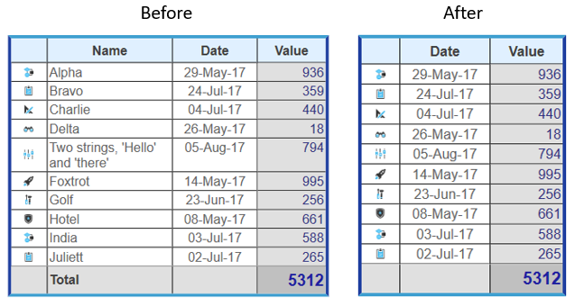

<!--REF #_command_.WP TABLE DELETE COLUMNS.Syntax-->**WP TABLE DELETE COLUMNS** ( *targetObj* ) | ( *tableRef* ; *colNumber* {; *numColumns*} )<!-- END REF-->
<!--REF #_command_.WP TABLE DELETE COLUMNS.Params-->
| 引数 | 型 |  | 説明 |
| --- | --- | --- | --- |
| targetObj | Object | &rarr; | レンジまたは要素または4D Write Pro ドキュメント |
| tableRef | Object | &rarr; | 表の参照 |
| colNumber | Integer | &rarr; | カラムの番号 |
| numColumns | Integer | &rarr; | 削除するカラムの数(デフォルト値=1) |

<!-- END REF-->

#### 説明 

<!--REF #_command_.WP TABLE DELETE COLUMNS.Summary-->**WP TABLE DELETE COLUMNS** コマンドは、4D Write Pro の表から一つまたは複数のカラムを削除します。<!-- END REF-->

このコマンドは二つのシンタックスをサポートします:

* 最初の引数としてtargetObj を渡した場合、コマンドはターゲットに含まれる全てのカラムを削除します。*targetObj* 引数に渡せるものは以下の通りです:  
   * レンジ  
   * 要素(行/段落/本文/ヘッダー/フッター/インラインピクチャー/セクション/サブセクション)  
   * 4D Write Pro ドキュメント  
   *targetObj* 引数のターゲットが複数の表と交差する場合、全てのテーブルに触れるカラムは削除されます。*targetObj* 引数のターゲットが表と交差しない場合、コマンドは何もしません(エラーは生成されません)。  
   このシンタックスでは、*numColumns* 引数は(渡された場合)無視されます。
* *tableRef* および *colNumber* 引数の両方を渡した場合、コマンドは指定されたテーブルの、指定されたカラムインデックスからカラムを削除します。  
このシンタックスでは、任意の*numColumns* 引数を渡すと*tableRef* 引数で指定した表から削除するカラムの数を定義することができます。この引数が省略された場合、デフォルトで1カラムが削除されます。

全てのカラムを表から削除した場合、表全体が削除されます。

#### 例題 

*Invoice* の表からカラムを一つ削除したい場合を考えます。以下のコードを実行すると:

```4d
 var $table : Object
 
 $table:=WP Get element by ID(WParea;"Invoice") // "Invoice" の表を取得
 
 WP TABLE DELETE COLUMNS($table;2;1) //2つめのカラムを削除
```

正しい位置のカラムが削除されます:



#### 参照 

[WP TABLE DELETE ROWS](wp-table-delete-rows.md)  