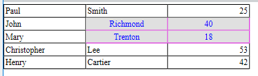

<!--REF #_command_.WP Table get cells.Syntax-->**WP Table get cells** ( *targetObj* ) | ( *tableRef* ; *startCol* ; *startRow* {; *numCols*{; *numRows*}} )  -> 戻り値<!-- END REF-->
<!--REF #_command_.WP Table get cells.Params-->
| 引数 | 型 |  | 説明 |
| --- | --- | --- | --- |
| targetObj | Object | &#8594;  | レンジまたは要素または4D Write Pro ドキュメント |
| tableRef | Object | &#8594;  | テーブル参照オブジェクト |
| startCol | Integer | &#8594;  | 先頭セルの位置 (カラム) |
| startRow | Integer | &#8594;  | 先頭セルの位置 (行) |
| numCols | Integer | &#8594;  | 取得するカラムの数 |
| numRows | Integer | &#8594;  | 取得する行の数 |
| 戻り値 | Object | &#8592; | 指定セルを含む新規レンジ |

<!-- END REF-->

#### 説明 

<!--REF #_command_.WP Table get cells.Summary-->**WP Table get cells** コマンドは、 *targetObj* または(*startCol*、*startRow*、*numCols*、および *numRows* 引数で定義された)*tableRef* で指定した表から、セルのセレクションを格納した新しいレンジオブジェクトを返します。<!-- END REF-->

以下のいづれかを渡します:

* *targetObj* 引数の場合、渡せるもの:  
   * レンジ  
   * 要素(行/段落/本文/ヘッダー/フッター/インラインピクチャー/セクション/サブセクション)  
   * 4D Write Pro ドキュメント

*targetObj* 引数が、表、またはセルのセレクションを取得可能なテキストレンジと交差しない場合、コマンドはNull を返します。

**または**

* *startCol* および *startRow* 引数 - 取得したい最初のセル範囲の左上端の座標を定義します。
* (オプション) *numCols* および *numRows* 引数 - それぞれセルレンジとして取得したいカラムと行の数を指定します。  
    
*numRows* 引数が省略された場合、単一の行が返されます。*numCols* および *numRows* 引数の両方が省略された場合、返されたレンジには単一のセルのみが格納されます。

*startCol* と *numCols* を足した数、もしくは*startRow* と *numRows* を足した数が*tableRef* 引数で指定した表のカラム数/行数より多い場合、または*startCol* or *startRow* 引数そのものが*tableRef* 引数で指定した表のカラム数/行数より多い場合、返されるレンジには取得可能なカラム/行が全て格納されます。

#### 例題 1 

特定のセル範囲の属性を変更します:

```4d
 var $wpTable;$wpRange;$wpRow1;$wpRow2;$wpRow3;$wpRow4;$wpRow5;$cells : Object
 $wpRange:=WP Create range(WParea;wk start text;wk end text)
 
 $wpTable:=WP Insert table($wpRange;wk append)
 $wpRow1:=WP Table append row($wpTable;"Paul";"Smith";25)
 $wpRow2:=WP Table append row($wpTable;"John";"Richmond";40)
 $wpRow3:=WP Table append row($wpTable;"Mary";"Trenton";18)
 $wpRow4:=WP Table append row($wpTable;"Christopher";"Lee";53)
 $wpRow5:=WP Table append row($wpTable;"Henry";"Cartier";42)
 
 $cells:=WP Table get cells($wpTable;2;2;2;2)
 WP SET ATTRIBUTES($cells;wk background color;0x00E0E0E0)
 WP SET ATTRIBUTES($cells;wk text color;"blue")
 WP SET ATTRIBUTES($cells;wk border color;0x00E000E0)
 WP SET ATTRIBUTES($cells;wk text align;wk center)
```

結果: 



#### 例題 2 

"5x7"のセルから行の最後までのセルのレンジを取得する場合を考えます:

```4d
 $cellRange:=WP Table get cells(tableRef;5;7;MAXLONG;1)
```

"5x7"のセルからカラムの最後までのセルのレンジを取得する場合を考えます:

```4d
 $cellRange:=WP Table get cells(tableRef;5;7;1;MAXLONG)
```

"5x7"のセルからテーブルの最後までのセルのレンジを取得する場合を考えます:

```4d
 $cellRange:=WP Table get cells(tableRef;5;7;MAXLONG;MAXLONG)
```

#### 例題 3 

ユーザーが選択したセルを取得したい場合を考えます:

```4d
 var $userSelection;$cells : Object
 
 $userSelection:=WP Selection range(myWPArea)
 
 $cells:=WP Table get cells($userSelection)
```

#### 参照 

[WP Table get columns](wp-table-get-columns.md)  
[WP Table get rows](wp-table-get-rows.md)  