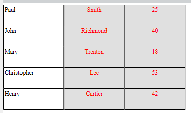

<!--REF #_command_.WP Table get columns.Syntax-->**WP Table get columns** ( *targetObj* ) | ( *tableRef* ; *startCol* {; *numCols*} )  -> 戻り値<!-- END REF-->
<!--REF #_command_.WP Table get columns.Params-->
| 引数 | 型 |  | 説明 |
| --- | --- | --- | --- |
| targetObj | オブジェクト | &#x1F852; | レンジまたは要素または4D Write Pro ドキュメント |
| tableRef | オブジェクト | &#x1F852; | テーブル参照オブジェクト |
| startCol | 倍長整数 | &#x1F852; | 最初のカラムの位置 |
| numCols | 倍長整数 | &#x1F852; | 取得するカラムの位置 |
| 戻り値 | オブジェクト | &#x1F850; | 選択されたカラムを含む新しいテーブルレンジ |

<!-- END REF-->

#### 説明 

<!--REF #_command_.WP Table get columns.Summary-->**WP Table get columns** コマンドは、*targetObj* または(*startCol* および *numCols* 引数で定義された)*tableRef* で指定した表から、カラムのセレクションを格納した新しいレンジオブジェクトを返します。<!-- END REF-->

以下のいづれかを渡します:

* *targetObj* 引数の場合、渡せるもの:  
   * レンジ  
   * 要素(行/段落/本文/ヘッダー/フッター/インラインピクチャー/セクション/サブセクション)  
   * 4D Write Pro ドキュメント

*targetObj* 引数が、表、またはカラムのセレクションを取得可能なテキストレンジと交差しない場合、コマンドはNull を返します。

**または**

* *tableRef* \- カラムのセレクションを取得した表の参照
* *startCol* \- 返す表の最初のカラムを指定
* (オプション) *numCols* \- 返すカラムの数を指定。*numCols* 引数が省略された場合、*startCol* 引数で指定したカラム1つだけが返されます。  
    
*startCol* 引数と *numCols* 引数を足した数が*tableRef* 引数で指定した表にあるカラムの数より多い場合、または*startCol* 引数そのものが*tableRef* 引数で指定した表にあるカラムの数より多い場合、返されるレンジには取得可能なカラム全てが格納されます。

#### 例題 1 

テーブルの、最後の2列の属性を変更したい場合を考えます:

```4d
 var $wpTable;$wpRange;$wpRow1;$wpRow2;$wpRow3;$wpRow4;$wpRow5;$cols : Object
 $wpRange:=WP Create range(WParea;wk start text;wk end text)
 $wpTable:=WP Insert table($wpRange;wk append)
 $wpRow1:=WP Table append row($wpTable;"Paul";"Smith";25)
 $wpRow2:=WP Table append row($wpTable;"John";"Richmond";40)
 $wpRow3:=WP Table append row($wpTable;"Mary";"Trenton";18)
 $wpRow4:=WP Table append row($wpTable;"Christopher";"Lee";53)
 $wpRow5:=WP Table append row($wpTable;"Henry";"Cartier";42)
 
 $cols:=WP Table get columns($wpTable;2;2)
 WP SET ATTRIBUTES($cols;wk background color;0x00E0E0E0;wk text color;"red";wk height;"36pt";wk text align;wk center)
```

結果:



#### 例題 2 

10列目のカラムから最後のカラムまでのレンジを取得したい場合を考えます:

```4d
 WP Table get columns(tableRef;10;MAXLONG)
```

#### 例題 3 

ユーザーが選択したカラムを取得したい場合を考えます:

```4d
 var $userSelection;$columns : Object
 
 $userSelection:=WP Selection range(myWPArea)
 
 $columns:=WP Table get columns($userSelection)
```

#### 参照 

[WP Table get cells](wp-table-get-cells.md)  
[WP Table get rows](wp-table-get-rows.md)  