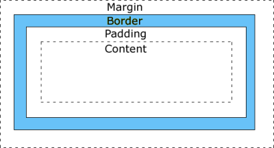

4D Write Pro属性を使用するとドキュメント内に保存されているテキストと画像の全てのグラフィックな要素を管理する事ができます。 これらの属性は以下のコマンドによって操作します:

- [WP SET ATTRIBUTES](../commands/wp-set-attributes.md)
- [WP GET ATTRIBUTES](../commands/wp-get-attributes.md)
- [WP RESET ATTRIBUTES](../commands/wp-reset-attributes.md)

:::note

4D Write Pro エリアの属性は、4D オブジェクト記法あるいは一般的なコマンドを使用しても管理する事が可能です:

- オブジェクト記法 - 例えば、以下の二つの宣言は非常に似ています:

```4d
 $bcol:=$range[wk background color]  
 $bcol:=$range.backgroundColor // 同じ結果を得る
```

- [OB SET](../../commands-legacy/ob-set.md) および [OB Get](../../commands-legacy/ob-get.md) コマンドを使用します。例:

```4d
 $bcol:=OB Get($range;wk background color) 
```

:::

### 背景

背景属性を使用すると、ドキュメント内の背景画像エフェクトを定義する事ができます。 これらは、以下の4D Write Pro ターゲットに対して適用可能です:

| ドキュメント | セクション | 段落 | ピクチャー | テーブル | 行 | カラム/セル | ヘッダー/フッター/ボディ | テキストボックス |
| ------ | ----- | -- | ----- | ---- | - | ------ | ------------- | -------- |
| X      | X     | X  | X     | X    | X | X      | X             | X        |

| 定数                                | 説明                                                                                                                                                                                                                                                                                                                                                                                                                                                                                                                                                                                                                                                                                                                                                                                                                                                                                                                                                                                                                                                                                                                          |
| --------------------------------- | --------------------------------------------------------------------------------------------------------------------------------------------------------------------------------------------------------------------------------------------------------------------------------------------------------------------------------------------------------------------------------------------------------------------------------------------------------------------------------------------------------------------------------------------------------------------------------------------------------------------------------------------------------------------------------------------------------------------------------------------------------------------------------------------------------------------------------------------------------------------------------------------------------------------------------------------------------------------------------------------------------------------------------------------------------------------------------------------------------------------------- |
| wk background clip                | 背景の塗りエリアを指定します。 取り得る値:<br/><ul><li>wk border box (デフォルト): 背景は境界線の外側の端まで塗られます。</li><li>wk content box: 背景はコンテンツボックスの内部まで塗られます。</li><li>wk padding box: 背景はパッディングの端の外側まで塗られます(もしくはあった場合には境界線の内側まで)。</li><li>wk paper box: 背景は端まで塗られます(ドキュメントあるいはセクションのみ)</li></ul>                                                                                                                                                                                                                                                                                                                                                                                                                                                                                                                                                                                                                                                                                                                   |
| wk background color               | 要素の背景色を指定します。 取り得る値: <ul> <li>CSS カラー("#010101" または "#FFFFFF" または "red")。</li> <li>4D カラーの倍長整数値([OBJECT SET RGB COLORS](../../commands-legacy/object-set-rgb-colors.md) コマンドを参照して下さい)</li> <li>R、G、Bコンポーネントそれぞれの要素(0-255)を格納した倍長整数配列</li> </ul> ドキュメントのデフォルトは"#FFFFFF" と wk transparentで、段落と画像に対しては"transparent"がデフォルトです。                                                                                                                                                                                                                                                                                                                                                                                                                                                                                                                                                                                                                                                                                                                          |
| wk background display mode        | 背景として使用される画像の表示モードを、以下の"実際の"属性値のプリセットに基づいて設定します: wk background origin、 wk background repeat、 wk background position horizontal、 wk background position vertical、 wk background width、 wk background height 取り得る値: <ul> <li>wk scaled to fit</li> <li>wk truncated</li> <li>wk truncated centered</li> <li>wk proportional</li> <li>wk proportional centered</li> <li>wk replicated (デフォルト)</li> <li>wk replicated centered</li> </ul> **注意**: 原点の長方形はパディングボックス(パディングエリアを含めるが境界線エリアを除外した画像の長方形)に設定されます。 When getting the value of this attribute, the returned value is either: <ul> <li>one of the possible display modes, for example wk replicated, if all the real attributes have the preset values for this mode</li> <li>"custom" if at least one real attribute's value differs from the preset ones for any mode. 例えば、wk background width のプリセット値がwk background display mode を適用した後に変更された場合、[WP GET ATTRIBUTES](../commands/wp-get-attributes.md) は、の値を取得しようとした場合には"custom" を返します。</li> </ul> |
| wk background height              | 背景画像の垂直方向のサイズを指定します。 取り得る値は以下の通りです:<br/><ul><li>wk auto (デフォルト): 背景画像はその高さを保ちます。</li><li>wk contain: 背景画像のアスペクト比を保ったまま、画像全体が表示される範囲で最大のサイズへと拡大/縮小します。 このオプションは他のサイズ属性の値も変更します。</li><li>wk cover: 背景画像のアスペクト比を保ったまま、背景全体を画像でカバーできる大きさまで拡大/縮小します。 このとき背景画像の一部は見切れる可能性があります。 このオプションは他のサイズ属性の値も変更します。</li><li>定義されたサイズ: 背景画像の垂直方向のサイズを実数値あるいは文字列値を使用して表現します:<br/>実数: サイズはwk layout unitで指定します。文字列: 連結された値と単位のCSS文字列。 (*例*:"12pt" は12ポイント、"1.5cm" は1.5センチを意味します。) 最小値: 0pt、最大値: 1000pt。 相対値(パーセンテージ、%)はサポートされています。</li></ul>                                                                                                                                                                                                                                                                                                                           |
| wk background image               | 背景画像参照を指定します。 4Dピクチャー変数あるいは式などの有効な画像であれば指定可能です。<br/><ul><li>返された値([WP GET ATTRIBUTES](../commands/wp-get-attributes.md)): 画像がネットワークURLを通して定義された場合には、その画像がすでに読み込まれている場合にはターゲット画像が返されます。そうでない場合には空の画像が返されます。 </li></ul>ピクチャーをURLあるいはローカルのURIを通して扱いたい場合にはwk background image url を使用してください。                                                                                                                                                                                                                                                                                                                                                                                                                                                                                                                                                                                                                                                                                                                                                                                                 |
| wk background image url           | URL(文字列)を通して定義された背景画像です。 ネットワークURL あるいはデータURI あるいはローカルファイルURLです(絶対パスあるいはストラクチャーからの相対パス)。<br/><ul><li>返された値([WP GET ATTRIBUTES](../commands/wp-get-attributes.md)): ネットワークURL あるいはデータURI。 ネットワークURLで参照されたものではない画像に関しては、最初のURLと同じではないことがあり得ます(ネットワークURL のみが保存されます)。 ローカルファイルのURLに関しては、画像ストリームそのものはドキュメント内に保管されていて、そのため返されたURLはデータURIと、base64にエンコードされた画像ストリームです。</li></ul>背景画像をピクチャー式として扱いたい場合には、wk background image を使用してください。                                                                                                                                                                                                                                                                                                                                                                                                                                                                                                                                                                                                    |
| wk background origin              | 背景画像どのような位置におかれるかを指定します。 取りうる値は以下の通りです:<br/><ul><li>wk padding box (デフォルト): 背景画像はパッディング(または内側の境界線の端)からスタートします。</li><li>wk border box: 背景画像は境界線(外側の境界線の端)の四角形からスタートします。</li><li>wk content box: 背景画像はコンテンツ四角形からスタートします。</li><li>wk paper box: 背景画像は端からスタートします(ドキュメントあるいはセクションのみ)</li></ul>                                                                                                                                                                                                                                                                                                                                                                                                                                                                                                                                                                                                                                                                       |
| wk background position horizontal | 背景画像の水平方向のスタート位置を指定します。 取り得る値は以下の通りです:<br/><ul><li>wk left (デフォルト): 背景画像は水平方向に対して要素の左側からスタートします。</li><li>wk center: 背景画像は水平方向に対して要素の中央からスタートします。</li><li>wk right: 背景画像は水平方向に対して要素の右側からスタートします。</li></ul>                                                                                                                                                                                                                                                                                                                                                                                                                                                                                                                                                                                                                                                                                                                                                                                                                                |
| wk background position vertical   | 背景画像の垂直方向のスタート位置を指定します。 取り得る値は以下の通りです:<br/><ul><li>wk top (デフォルト): 背景画像は垂直方向に対して要素の上側からスタートします。</li><li>wk middle: 背景画像は垂直方向に対して要素の中央からスタートします。</li><li>wk bottom: 背景画像は垂直方向に対して要素の下側からスタートします。</li></ul>                                                                                                                                                                                                                                                                                                                                                                                                                                                                                                                                                                                                                                                                                                                                                                                                                                |
| wk background repeat              | 背景画像をどのように繰り返すか(あるいは繰り返さないか)を指定します。 取り得る値は以下の通りです:<br/><ul><li>wk repeat (デフォルト): 背景画像は垂直方向にも水平方向にも繰り返されます。</li><li>wk no repeat: 背景画像は繰り返されません。</li><li>wk repeat x: 背景画像は水平方向にのみ繰り返されます。</li><li>wk repeat y: 背景画像は垂直方向にのみ繰り返されます。</li></ul>                                                                                                                                                                                                                                                                                                                                                                                                                                                                                                                                                                                                                                                                                                                                                        |
| wk background width               | 背景画像の水平方向のサイズを指定します。 取り得る値は以下の通りです:<br/><ul><li>wk auto (デフォルト): 背景画像はその幅を保ちます。</li><li>wk contain: 背景画像のアスペクト比を保ったまま、画像全体が表示される範囲で最大のサイズへと拡大/縮小します。 このオプションは他のサイズ属性の値も変更します。</li><li>wk cover: 背景画像のアスペクト比を保ったまま、背景全体を画像でカバーできる大きさまで拡大/縮小します。 このとき背景画像の一部は見切れる可能性があります。 このオプションは他のサイズ属性の値も変更します。</li><li>定義されたサイズ: 背景画像の水平方向のサイズを実数値あるいは文字列値を使用して表現します:<br/>実数: サイズはwk layout unitで指定します。文字列: 連結された値と単位のCSS文字列。 (*例*: "12pt" は12ポイント、"1.5cm" は1.5センチを意味します。) 最小値: 0pt、最大値: 10,000pt。 相対値(パーセンテージ、%)はサポートされています。</li></ul>                                                                                                                                                                                                                                                                                                                         |

### 境界線

境界線属性を使用すると、要素の境界線のスタイル、幅、カラーを指定できます。 これらは、以下の4D Write Pro ターゲットに対して適用可能です:

| ドキュメント | セクション | 段落 | ピクチャー | テーブル | 行 | カラム/セル | ヘッダー/フッター/ボディ | テキストボックス |
| ------ | ----- | -- | ----- | ---- | - | ------ | ------------- | -------- |
| X      | X     | X  | X     | X    | X | X      | X             | X        |

| 定数                     | 説明                                                                                                                                                                                                                                                                                                                                                                                                                                                                                                                                                                                                                                                                                                           |
| ---------------------- | ------------------------------------------------------------------------------------------------------------------------------------------------------------------------------------------------------------------------------------------------------------------------------------------------------------------------------------------------------------------------------------------------------------------------------------------------------------------------------------------------------------------------------------------------------------------------------------------------------------------------------------------------------------------------------------------------------------ |
| wk border color        | 境界線4つともにカラーを設定します。 取りうる値は以下の通りです:<br/><ul><li>CSS カラー("#010101" または"#FFFFFF" または"red" )。 </li><li>4Dカラーの倍長整数値([`OBJECT SET RGB COLOR`](../../commands-legacy/object-set-rgb-colors.md) コマンドを参照してください)</li><li>R、G、Bコンポーネントそれぞれの要素(0-255)を格納している倍長整数配列</li></ul>デフォルト値は"#000000" です(文字列値の場合)。 複数のカラーがある場合、[WP GET ATTRIBUTES](../commands/wp-get-attributes.md) は空の文字列を返します。                                                                                                                                                                                                                                      |
| wk border color bottom | 下の境界線のカラーを設定します。 取りうる値は以下の通りです:<br/><ul><li>CSS カラー("#010101" または"#FFFFFF" または"red" )。 デフォルトは"#000000"です。</li><li>4Dカラーの倍長整数値([`OBJECT SET RGB COLOR`](../../commands-legacy/object-set-rgb-colors.md) コマンドを参照してください)。</li><li>R、G、Bコンポーネントそれぞれの要素(0-255)を格納している倍長整数配列</li></ul>                                                                                                                                                                                                                                                                                                                                                    |
| wk border color left   | 左の境界線のカラーを設定します。 取りうる値は以下の通りです:<br/><ul><li>CSS カラー("#010101" または"#FFFFFF" または"red" )。 デフォルトは"#000000"です。</li><li>4Dカラーの倍長整数値([`OBJECT SET RGB COLOR`](../../commands-legacy/object-set-rgb-colors.md) コマンドを参照してください)。</li><li>R、G、Bコンポーネントそれぞれの要素(0-255)を格納している倍長整数配列</li></ul>                                                                                                                                                                                                                                                                                                                                                    |
| wk border color right  | 右の境界線のカラーを設定します。 取りうる値は以下の通りです:<br/><ul><li>CSS カラー("#010101" または"#FFFFFF" または"red" )。 デフォルトは"#000000"です。</li><li>4Dカラーの倍長整数値([`OBJECT SET RGB COLOR`](../../commands-legacy/object-set-rgb-colors.md) コマンドを参照してください)。</li><li>R、G、Bコンポーネントそれぞれの要素(0-255)を格納している倍長整数配列</li></ul>                                                                                                                                                                                                                                                                                                                                                    |
| wk border color top    | 上の境界線のカラーを設定します。 取りうる値は以下の通りです:<br/><ul><li>CSS カラー("#010101" または"#FFFFFF" または"red" )。 デフォルトは"#000000"です。</li><li>4Dカラーの倍長整数値([`OBJECT SET RGB COLOR`](../../commands-legacy/object-set-rgb-colors.md) コマンドを参照してください)。</li><li>R、G、Bコンポーネントそれぞれの要素(0-255)を格納している倍長整数配列</li></ul>                                                                                                                                                                                                                                                                                                                                                    |
| wk border radius       | 角の丸い境界線を指定します。 取り得る値は以下の通りです:<br/><ul><li>wk none (デフォルト): 境界線は丸い角を持ちません。</li><li>数値または文字列値を使用して表現された半径:<br/>数値: wk layout unitでの半径 文字列値: 値と単位が連結されたCSS文字列。例: 12ptは12ポイント、1.5cmは1.5センチを意味します。</li></ul>                                                                                                                                                                                                                                                                                                                                                   |
| wk border style        | 4辺全ての境界線のスタイルを指定します。 取り得る値は以下の通りです:<br/><ul><li>wk none (デフォルト): 境界線なし</li><li>wk hidden: wk noneと同様 (競合解決時を除く)</li><li>wk solid: 実線</li><li>wk dotted: 点線</li><li>wk dashed: 破線</li><li>wk double: 二重</li><li>wk groove: 3D くぼみ (実際の効果は境界線カラーによります)</li><li>wk ridge: 3D 隆起 (実際の効果は境界線カラーによります)</li><li>wk inset: 3D インセット (実際の効果は境界線カラーによります)</li><li>wk outset: 3D アウトセット (実際の効果は境界線カラーによります)</li></ul> |
| wk border style bottom | 下辺の境界線を指定します。 取り得る値は以下の通りです:<br/><ul><li>wk none (デフォルト): 境界線なし</li><li>wk hidden: wk noneと同様 (競合解決時を除く)</li><li>wk solid: 実線</li><li>wk dotted: 点線</li><li>wk dashed: 破線</li><li>wk double: 二重</li><li>wk groove: 3D くぼみ (実際の効果は境界線カラーによります)</li><li>wk ridge: 3D 隆起 (実際の効果は境界線カラーによります)</li><li>wk inset: 3D インセット (実際の効果は境界線カラーによります)</li><li>wk outset: 3D アウトセット (実際の効果は境界線カラーによります)</li></ul>        |
| wk border style left   | 左辺の境界線を指定します。 取り得る値は以下の通りです:<br/><ul><li>wk none (デフォルト): 境界線なし</li><li>wk hidden: wk noneと同様 (競合解決時を除く)</li><li>wk solid: 実線</li><li>wk dotted: 点線</li><li>wk dashed: 破線</li><li>wk double: 二重</li><li>wk groove: 3D くぼみ (実際の効果は境界線カラーによります)</li><li>wk ridge: 3D 隆起 (実際の効果は境界線カラーによります)</li><li>wk inset: 3D インセット (実際の効果は境界線カラーによります)</li><li>wk outset: 3D アウトセット (実際の効果は境界線カラーによります)</li></ul>        |
| wk border style right  | 右辺の境界線を指定します。 取り得る値は以下の通りです:<br/><ul><li>wk none (デフォルト): 境界線なし</li><li>wk hidden: wk noneと同様 (競合解決時を除く)</li><li>wk solid: 実線</li><li>wk dotted: 点線</li><li>wk dashed: 破線</li><li>wk double: 二重</li><li>wk groove: 3D くぼみ (実際の効果は境界線カラーによります)</li><li>wk ridge: 3D 隆起 (実際の効果は境界線カラーによります)</li><li>wk inset: 3D インセット (実際の効果は境界線カラーによります)</li><li>wk outset: 3D アウトセット (実際の効果は境界線カラーによります)</li></ul>        |
| wk border style top    | 上辺の境界線を指定します。 取り得る値は以下の通りです:<br/><ul><li>wk none (デフォルト): 境界線なし</li><li>wk hidden: wk noneと同様 (競合解決時を除く)</li><li>wk solid: 実線</li><li>wk dotted: 点線</li><li>wk dashed: 破線</li><li>wk double: 二重</li><li>wk groove: 3D くぼみ (実際の効果は境界線カラーによります)</li><li>wk ridge: 3D 隆起 (実際の効果は境界線カラーによります)</li><li>wk inset: 3D インセット (実際の効果は境界線カラーによります)</li><li>wk outset: 3D アウトセット (実際の効果は境界線カラーによります)</li></ul>        |
| wk border width        | 四辺全ての境界線の幅を指定します。 境界線幅を指定する前に境界線スタイルを指定する必要があります。 取り得る値は以下の通りです:<br/><ul><li>数値あるいは文字列値を使用して表現された幅:<br/>数値: wk layout unitでの幅。文字列値: 値と単位が結合されたCSS文字列。 (*例* : "12pt"は12 points、"1.5cm" は1.5センチを意味します)</li><li>デフォルト値: 2pt</li></ul>                                                                                                                                                                                                                                                                                                                        |
| wk border width bottom | 下辺の境界線の幅を指定します。 取り得る値は以下の通りです:<br/><ul><li>数値あるいは文字列値を使用して表現された幅:<br/>数値: wk layout unitでの幅。文字列値: 値と単位が結合されたCSS文字列。 (*例* : "12pt"は12 points、"1.5cm" は1.5センチを意味します)</li><li>デフォルト値: 2pt</li></ul>                                                                                                                                                                                                                                                                                                                                                          |
| wk border width left   | 左辺の境界線の幅を指定します。 取り得る値は以下の通りです:<br/><ul><li>数値あるいは文字列値を使用して表現された幅:<br/>数値: wk layout unitでの幅。文字列値: 値と単位が結合されたCSS文字列。 (*例* : "12pt"は12 points、"1.5cm" は1.5センチを意味します)</li><li>デフォルト値: 2pt</li></ul>                                                                                                                                                                                                                                                                                                                                                          |
| wk border width right  | 右辺の境界線の幅を指定します。 取り得る値は以下の通りです:<br/><ul><li>数値あるいは文字列値を使用して表現された幅:<br/>数値: wk layout unitでの幅。文字列値: 値と単位が結合されたCSS文字列。 (*例* : "12pt"は12 points、"1.5cm" は1.5センチを意味します)</li><li>デフォルト値: 2pt</li></ul>                                                                                                                                                                                                                                                                                                                                                          |
| wk border width top    | 上辺の境界線の幅を指定します。 取り得る値は以下の通りです:<br/><ul><li>数値あるいは文字列値を使用して表現された幅:<br/>数値: wk layout unitでの幅。文字列値: 値と単位が結合されたCSS文字列。 (*例* : "12pt"は12 points、"1.5cm" は1.5センチを意味します)</li><li>デフォルト値: 2pt</li></ul>                                                                                                                                                                                                                                                                                                                                                          |
| wk inside              | 選択されたエリアに複数の段落が含まれる場合、属性は、対応して被っている段落のプロパティに対してのみ適用することを指定します(範囲の外側は含まれません)。 境界線、パッディング、マージン属性に対してのみ適用可能で、指定された属性に追加されなければなりません。 [WP SET ATTRIBUTES](../commands/wp-set-attributes.md) コマンドの例2を参照して下さい。                                                                                                                                                                                                                                                                                                                                                                                                                                                                                   |
| wk outside             | 選択されたエリアが複数の段落を含むとき、ある属性が対応する段落の外側のプロパティにのみ適用されることを指定します(内側には適用されません)。 境界線、パッディング、マージン属性に対してのみ適用可能で、指定された属性に追加されなければなりません。 [WP SET ATTRIBUTES](../commands/wp-set-attributes.md) コマンドの例2を参照して下さい。                                                                                                                                                                                                                                                                                                                                                                                                                                                                                         |

### ドキュメント設定と情報

ドキュメント情報属性は、標準のドキュメント情報またはドキュメントレベルの設定を設定あるいは取得するのに使用されます。 これらは、以下の4D Write Pro ターゲットに対して適用可能です:

| ドキュメント | セクション | 段落 | ピクチャー | テーブル | 行 | カラム/セル | ヘッダー/フッター/ボディ | テキストボックス |
| ------ | ----- | -- | ----- | ---- | - | ------ | ------------- | -------- |
| X      |       |    |       |      |   |        |               |          |

**ドキュメント情報**

| 定数               | 説明                                                                                                                                                                                                                                                                                                                                                                                                                                                                                                                                                                                                                                                                                                                                                                                                                                                                                                                                                                                                                                                                                                                                                                                                                                                     |
| ---------------- | ------------------------------------------------------------------------------------------------------------------------------------------------------------------------------------------------------------------------------------------------------------------------------------------------------------------------------------------------------------------------------------------------------------------------------------------------------------------------------------------------------------------------------------------------------------------------------------------------------------------------------------------------------------------------------------------------------------------------------------------------------------------------------------------------------------------------------------------------------------------------------------------------------------------------------------------------------------------------------------------------------------------------------------------------------------------------------------------------------------------------------------------------------------------------------------------------------------------------------------------------------ |
| wk author        | ドキュメントの著者名を指定(文字列)                                                                                                                                                                                                                                                                                                                                                                                                                                                                                                                                                                                                                                                                                                                                                                                                                                                                                                                                                                                                                                                                                                                                                                                                                  |
| wk company       | ドキュメントに関連づけられる会社を指定します(文字列)                                                                                                                                                                                                                                                                                                                                                                                                                                                                                                                                                                                                                                                                                                                                                                                                                                                                                                                                                                                                                                                                                                                                                                                                         |
| wk date creation | ドキュメントの作成日(日付)を返します。 この値は読み込みのみで、設定する事はできません。                                                                                                                                                                                                                                                                                                                                                                                                                                                                                                                                                                                                                                                                                                                                                                                                                                                                                                                                                                                                                                                                                                                                                                                       |
| wk date modified | ドキュメントの最終更新日(日付)を返します。 この値は読み込みのみで、設定する事はできません。 この値はドキュメントのコンテンツが編集されるたびに動的に更新されますが、ドキュメントを開いたり保存したときには更新されないという点に注意してください。                                                                                                                                                                                                                                                                                                                                                                                                                                                                                                                                                                                                                                                                                                                                                                                                                                                                                                                                                                                                                                                                                                         |
| wk dpi           | 内部でのピクセル <-> ポイント変換に使用されるDPI(整数)。 常に96です(読み込みのみ)。 変更あるいは読み出し可能であるドキュメントのカレントのビューのDPI を変更あるいは読み出す"dpi" 標準アクションと、この内部属性を混同しないようにしてください。                                                                                                                                                                                                                                                                                                                                                                                                                                                                                                                                                                                                                                                                                                                                                                                                                                                                                                                                                                                                                                                   |
| wk modified      | ドキュメントが、それに割り当てられるオブジェクトが作成されてから変更されたかを表します(以下参照)。 取り得る値は以下の通りです: <ul> <li>**True** \- ドキュメントは変更されています</li> <li>**False** \- ドキュメントは変更されていません(このオブジェクト作成時のデフォルト)</li> </ul> このプロパティは、ドキュメントを格納しているオブジェクトが作成された時には必ず **false** に設定されています(例: [WP Import document](../commands/wp-import-document.md)、[WP New](../commands-legacy/wp-new.md) を使用した際、あるいはオブジェクトがコピーされたか、またはオブジェクトフィールド/属性がデータベースから読み出された時点 )。 It is automatically set to **true** by 4D Write Pro as soon as a modification is done to the contents of the document, whatever the origin of the modification (user action or programming). **Notes:**  <ul> <li>A new value evaluated from a formula or a new image loaded from a URL is not considered as a document modification (the source string is left untouched). </li> <li>4D Write Pro によって一度 **true** に設定されると、このプロパティは自動的に **false** に設定されることはありません。これはたとえ "undo" や "export" アクションが実行された時でも同様です。 しかしながら、これは読み書き可能なプロパティであるので、コードによって設定することは可能です。</li> <li>wk date modified とは異なり、wk modified は *揮発性* です。つまり、ドキュメント内には保存されないということです。</li> </ul> |
| wk notes         | ドキュメントについてのコメントを指定します(文字列)。                                                                                                                                                                                                                                                                                                                                                                                                                                                                                                                                                                                                                                                                                                                                                                                                                                                                                                                                                                                                                                                                                                                                                                                                         |
| wk subject       | ドキュメントの題名を指定します(文字列)                                                                                                                                                                                                                                                                                                                                                                                                                                                                                                                                                                                                                                                                                                                                                                                                                                                                                                                                                                                                                                                                                                                                                                                                                |
| wk title         | ドキュメントのタイトル(文字列)を指定します。 デフォルトは"New 4D Write Pro Document"です。                                                                                                                                                                                                                                                                                                                                                                                                                                                                                                                                                                                                                                                                                                                                                                                                                                                                                                                                                                                                                                                                                                                                                                        |
| wk version       | ドキュメントの内部4DWPバージョンを返します(実数)。 この数値は[WP GET ATTRIBUTES](../commands/wp-get-attributes.md) を使用してのみ読み込み可能です。設定することはできません。                                                                                                                                                                                                                                                                                                                                                                                                                                                                                                                                                                                                                                                                                                                                                                                                                                                                                                                                                                                                                                                                                                               |

**ドキュメント設定**

| 定数                              | 説明                                                                                                                                                                                                                                                                                                                                                                                                                                                                                                 |
| ------------------------------- | -------------------------------------------------------------------------------------------------------------------------------------------------------------------------------------------------------------------------------------------------------------------------------------------------------------------------------------------------------------------------------------------------------------------------------------------------------------------------------------------------- |
| wk break paragraphs in formulas | フォーミュラから返されるキャリッジリターン(CR) を段落区切りとして扱うかどうかを定義します。 取り得る値は以下の通りです: <ul> <li>wk true \- 段落区切りとして扱います</li> <li>wk false \- (デフォルト値) 改行として扱います </li> </ul> **注意:** フォーミュラが[This](commands/this.md)*.pageNumber* あるいは [This](commands/this.md)*.pageCount* を使用している場合、この属性は無視され、キャリッジリターンは常に改行として扱われます。                                                                                            |
| wk tab decimal separator        | 小数の表組みで使用される小数点の区切り文字(wk tabs を参照してください)。 取り得る値は以下の通りです: <ul> <li>wk point or comma: 右側から見て最初のドットまたはカンマを使用します(新規作成されたドキュメントにおけるデフォルト)</li> <li>wk point: ポイント文字を使用します</li> <li>wk comma: カンマ文字を使用します</li> <li>wk system: [GET SYSTEM FORMAT](../../commands-legacy/get-system-format.md) によって返される小数点区切りを使用します(旧式の4D Write ドキュメントを読み込んだ際のデフォルト)</li> </ul> |

### フォントとテキスト

これらの属性を使用するとテキストのフォントファミリー名、サイズ、スタイルを定義する事ができます。 これらは、以下の4D Write Pro ターゲットに対して適用可能です:

| ドキュメント | セクション | 段落  | ピクチャー | テーブル | 行   | カラム/セル | ヘッダー/フッター/ボディ | テキストボックス |
| ------ | ----- | --- | ----- | ---- | --- | ------ | ------------- | -------- |
| ◯\*    | ◯\*   | ◯\* | ◯\*   | ◯\*  | ◯\* | ◯\*    | ◯\*           |          |

\*Applied to paragraph characters within elements

| 定数                        | 説明                                                                                                                                                                                                                                                                                                                                                                                                                                                                                                                                                                                                                                                                                                                                                                                                                                                                                                                                                                                                                                                                                                                                                                                                                                                                                                                                                                                                                                                                                                                                                                                                                                                        |
| ------------------------- | --------------------------------------------------------------------------------------------------------------------------------------------------------------------------------------------------------------------------------------------------------------------------------------------------------------------------------------------------------------------------------------------------------------------------------------------------------------------------------------------------------------------------------------------------------------------------------------------------------------------------------------------------------------------------------------------------------------------------------------------------------------------------------------------------------------------------------------------------------------------------------------------------------------------------------------------------------------------------------------------------------------------------------------------------------------------------------------------------------------------------------------------------------------------------------------------------------------------------------------------------------------------------------------------------------------------------------------------------------------------------------------------------------------------------------------------------------------------------------------------------------------------------------------------------------------------------------------------------------------------------------------------------------- |
| wk font                   | Specifies complete font name with styles, as returned by the [FONT STYLE LIST](../../commands-legacy/font-style-list.md)  command. If you set an invalid font name, the command does nothing. Default value: "Times New Roman".                                                                                                                                                                                                                                                                                                                                                                                                                                                                                                                                                                                                                                                                                                                                                                                                                                                                                                                                                                                                                                                                                                                                                                                                                                                                                                                                                           |
| wk font bold              | Specifies thickness of text (depends on available font styles). Possible values:<br/><ul><li>wk true to set selected characters to bold font style; with the [WP GET ATTRIBUTES](../commands/wp-get-attributes.md) command, wk true is returned if at least one selected character supports a bold font style.</li><li>wk false (default) to remove the bold font style from selected characters if any; with the [WP GET ATTRIBUTES](../commands/wp-get-attributes.md) command, wk false is returned if none of the selected characters supports a bold font style.</li></ul>                                                                                                                                                                                                                                                                                                                                                                                                                                                                                                                                                                                                                                                                                                                                                                                                                                                                                                                                                                      |
| wk font default           | Object defining the default substitution font(s) for the document (i.e. fonts to be used instead of document fonts that are not available in the OS). It contains: <table><tbody><tr><td>**Property**</td><td>**Type**</td><td>**Description**</td></tr><tr><td>default</td><td>String \\| Collection</td><td>Font(s) to be used by default as replacement if a font is not supported by the OS, whatever the platform</td></tr><tr><td>windows</td><td>String  \\| Collection</td><td>Font(s) to be used by default on Windows platform (prior to "default" if defined)</td></tr><tr><td>mac</td><td>String  \\| Collection</td><td>Font(s) to be used by default on macOS platform (prior to "default" if defined)</td></tr></tbody></table> **Notes:** <ul> <li>Each property can contain a string (e.g. "Arial") or a collection of strings (e.g. \["Arial","sans-serif"\]). Font names must be family font names or "sans-serif", "serif", "monospace", "cursive" or "fantasy" to target generic font family like in html/css font-family. </li> <li>By default if the wk font default is not set, or if none of defined fonts are available on a platform, font substitution is delegated to the OS.</li> </ul> |
| wk font family            | Specifies font family name as defined by wk font. Default value is "Times New Roman".<br/>An empty string is returned by the [WP GET ATTRIBUTES](../commands/wp-get-attributes.md) command if the selected characters contain different font family properties.                                                                                                                                                                                                                                                                                                                                                                                                                                                                                                                                                                                                                                                                                                                                                                                                                                                                                                                                                                                                                                                                                                                                                                                                                                                                                                                                           |
| wk font italic            | Specifies italic style of text (depends on available font styles). Possible values:<br/><ul><li>wk true to set selected characters to italic or oblique font style; with the [WP GET ATTRIBUTES](../commands/wp-get-attributes.md) command, wk true is returned if at least one selected character supports an italic or oblique font style.</li><li>wk false (default) to remove the italic or oblique font style from selected characters if any; with the [WP GET ATTRIBUTES](../commands/wp-get-attributes.md) command, wk false is returned if none of the selected characters supports an italic or oblique font style.</li></ul>                                                                                                                                                                                                                                                                                                                                                                                                                                                                                                                                                                                                                                                                                                                                                                                                                                                                                                             |
| wk font size              | Specifies font size for text. Possible values (in points only):<br/><ul><li>Real value (default = 12)</li><li>CSS string with value and unit concatenated. (*e.g.*: "12pt" for 12 points)</li></ul>                                                                                                                                                                                                                                                                                                                                                                                                                                                                                                                                                                                                                                                                                                                                                                                                                                                                                                                                                                                                                                                                                                                                                                                                                                                                                              |
| wk text color             | Specifies color of text. 取りうる値は以下の通りです:<br/><ul><li>CSS カラー("#010101" または"#FFFFFF" または"red" )。 Default is "#000000" if string. </li><li>a 4D color longint value (see [`OBJECT SET RGB COLOR`](../../commands-legacy/object-set-rgb-colors.md) command)</li><li>a longint array containing an element for each R, G, B component (0-255)</li></ul>                                                                                                                                                                                                                                                                                                                                                                                                                                                                                                                                                                                                                                                                                                                                                                                                                                                                                                                                                                                                                                                                                                                                                                                               |
| wk text linethrough color | Specifies color of text linethrough. 取りうる値は以下の通りです:<br/><ul><li>CSS カラー("#010101" または"#FFFFFF" または"red" )。 </li><li>a 4D color longint value (see [`OBJECT SET RGB COLOR`](../../commands-legacy/object-set-rgb-colors.md) command)</li><li>a longint array containing an element for each R, G, B component (0-255)</li></ul>Default is "currentColor" if string, or wk default if longint.                                                                                                                                                                                                                                                                                                                                                                                                                                                                                                                                                                                                                                                                                                                                                                                                                                                                                                                                                                                                                                                                                                                                                     |
| wk text linethrough style | Specifies style of text linethrough (if any). Possible values:<br/><ul><li>wk none (default): no linethrough effect</li><li>wk solid: draw a solid line on the selected text</li><li>wk dotted: draw a dotted line on the selected text</li><li>wk dashed: draw a dashed line on the selected text</li><li>wk double: draw a double line on the selected text</li><li>wk semi transparent: dimmed line on the selected text. Can be combined with another line style.</li><li>wk word: draw a line on words only (exclude blank spaces). Can be combined with another line style.</li></ul>                                                                                                                                                                                                                                                                                                                                                                                                                                                                                                                                                                                                                                                                                                                                                                                      |
| wk text shadow color      | Specifies shadow color of the selected text. Possible values:<br/><ul><li>a CSS color ("#010101" or "#FFFFFF" or "red").</li><li>a 4D color longint value (see [`OBJECT SET RGB COLOR`](../../commands-legacy/object-set-rgb-colors.md) command)</li><li>a longint array containing an element for each R, G, B component (0-255) </li><li>wk transparent (default) </li></ul>                                                                                                                                                                                                                                                                                                                                                                                                                                                                                                                                                                                                                                                                                                                                                                                                                                                                                                                                                                                                                                                                                                                                                |
| wk text shadow offset     | Specifies offset for shadow effect. Possible values:<br/><ul><li>Size expressed in points. Default value: 1pt</li></ul>                                                                                                                                                                                                                                                                                                                                                                                                                                                                                                                                                                                                                                                                                                                                                                                                                                                                                                                                                                                                                                                                                                                                                                                                                                                                                                                                                                                                                                                                   |
| wk text transform         | Specifies uppercase and lowercase letters in the text. Possible values:<br/><ul><li>wk capitalize: first letters are set to uppercase</li><li>wk lowercase: letters are set to lowercase</li><li>wk uppercase: letters are set to uppercase</li><li>wk small uppercase: letters are set to small uppercase</li><li>wk none (default): no transformation</li></ul>                                                                                                                                                                                                                                                                                                                                                                                                                                                                                                                                                                                                                                                                                                                                                                                                                                                                                                                                                                                                                                                                                                                                                      |
| wk text underline color   | Specifies color of text underline. 取りうる値は以下の通りです:<br/><ul><li>CSS カラー("#010101" または"#FFFFFF" または"red" )。 </li><li>a 4D color longint value (see [`OBJECT SET RGB COLOR`](../../commands-legacy/object-set-rgb-colors.md) command)</li><li>a longint array containing an element for each R, G, B component (0-255)</li></ul>Default is "currentColor" if string, or wk default if longint.                                                                                                                                                                                                                                                                                                                                                                                                                                                                                                                                                                                                                                                                                                                                                                                                                                                                                                                                                                                                                                                                                                                                                       |
| wk text underline style   | Specifies style of text underline (if any). Possible values:<br/><ul><li>wk none (default): no underline</li><li>wk solid: draw a solid underline</li><li>wk dotted: draw a dotted underline</li><li>wk dashed: draw a dashed underline</li><li>wk double: draw a double underline</li><li>wk semi transparent: dimmed underline. Can be combined with another line style.</li><li>wk word: draw an underline for words only (exclude blank spaces). Can be combined with another line style.</li></ul>                                                                                                                                                                                                                                                                                                                                                                                                                                                                                                                                                                                                                                                                                                                                                                                                                                                                          |
| wk vertical align         | Sets vertical alignment of an element. Can be used with characters, paragraphs, and pictures. Possible values:<br/><ul><li>wk baseline (default): aligns baseline of element with baseline of parent element</li><li>wk top: aligns top of element with top of tallest element on the line </li><li>wk bottom: aligns bottom of element with lowest element on the line</li><li>wk middle: element is placed in middle of parent element</li><li>wk superscript: aligns element as if it were superscript</li><li>wk subscript: aligns element as if it were subscript</li></ul>For characters, wk top and wk bottom have the same effect as wk baseline. <br/> <br/>For paragraphs, wk baseline, wk superscript and wk subscript have the same effect as wk top.                                                                                                                                                                                                                                                                                                                                                                                                                                                                                                                                                                                                                                                                                      |

### Height/Width

Height/width attributes are used to set the height and width of elements. これらは、以下の4D Write Pro ターゲットに対して適用可能です:

| ドキュメント | セクション | 段落 | ピクチャー | テーブル | 行 | カラム/セル | ヘッダー/フッター/ボディ | テキストボックス |
| ------ | ----- | -- | ----- | ---- | - | ------ | ------------- | -------- |
| X      | X     | X  | ◯\*   | X    | X |        |               |          |

\*Applied to cells

| 定数            | 説明                                                                                                                                                                                                                                                                                                                                                                                                                                                                                                                                                                                                                                                                                                                                                                                                                                                                                                                                                                                                                                                   |
| ------------- | ---------------------------------------------------------------------------------------------------------------------------------------------------------------------------------------------------------------------------------------------------------------------------------------------------------------------------------------------------------------------------------------------------------------------------------------------------------------------------------------------------------------------------------------------------------------------------------------------------------------------------------------------------------------------------------------------------------------------------------------------------------------------------------------------------------------------------------------------------------------------------------------------------------------------------------------------------------------------------------------------------------------------------------------------------- |
| wk height     | Sets height of element. The height property does not include padding, borders, or margins; it sets the height of the area inside the padding, border, and margin of the element. Possible values:<br/><ul><li>wk auto (default): height is based upon the contents of the element</li><li>Defined size: size expressed using real or string value:<br/>Real: Size in wk layout unit.String: CSS string with value and unit concatenated. (*e.g*.: "12pt" for 12 points, or "1.5cm" for 1.5 centimeters) Minimum value: 0pt, maximum value: 10,000pt.</li></ul>The wk height attribute is overridden by wk min height (if defined).                                          |
| wk min height | Sets minimum height of the element. It prevents the value of the wk height property from becoming smaller than wk min height. Possible values:<br/><ul><li>wk auto (default): minimum height is based upon the contents of the element</li><li>Defined size: size expressed using real or string value:<br/>Real: Size in wk layout unit.String: CSS string with value and unit concatenated. (*e.g.*: "12pt" for 12 points, or "1.5cm" for 1.5 centimeters) Minimum value: 0pt, maximum value: 10,000pt.</li></ul>The wk min height value overrides the wk height attribute.<br/> <br/>**Note:** This attribute is not supported by rows, columns, and cells. |
| wk min width  | Sets minimum width of element. It prevents the value of the wk width property from becoming smaller than wk min width. Possible values:<br/><ul><li>wk auto (default): minimum width is based upon the contents of the element</li><li>Defined size: size expressed using real or string value:<br/>Real: Size in wk layout unit.String: CSS string with value and unit concatenated. (*e.g.*: "12pt" for 12 points, or "1.5cm" for 1.5 centimeters) Minimum value: 0pt, maximum value: 10,000pt.</li></ul>The wk min width value overrides the wk width attribute.                                                                                                                            |
| wk width      | Sets width of element. Possible values: <ul> <li>wk auto (default): width is based upon the contents of the element. Not available for text boxes (converted to 8 centimeters). </li> <li>Defined size: size expressed using a real or string value:<br/> Real: Size in wk layout unit. String: CSS string with value and unit concatenated. (*e.g.*: "12pt" for 12 points, or "1.5cm" for 1.5 centimeters) Minimum value: 0pt, maximum value: 10,000pt.  </li> </ul> The wk width attribute is overridden by wk min width if defined.<br/>                                                                                                                 |

### ピクチャー

Image attributes are used to handle pictures inserted or or added in the area. これらは、以下の4D Write Pro ターゲットに対して適用可能です:

| ドキュメント | セクション | 段落  | ピクチャー | テーブル | 行 | カラム/セル | ヘッダー/フッター/ボディ | テキストボックス |
| ------ | ----- | --- | ----- | ---- | - | ------ | ------------- | -------- |
| X      | ◯\*   | ◯\* | ◯\*   |      |   |        |               |          |

\*Applied to pictures in cells (inline pictures only)

**Reminder:** As detailed in the *Handling pictures* section, 4D Write Pro supports two kinds of pictures:

- Picture inserted inline using the [WP INSERT PICTURE](../commands/wp-insert-picture.md) or the [ST INSERT EXPRESSION](../../commands-legacy/st-insert-expression.md) command
- Picture anchored in the page using the [WP Add picture](../commands/wp-add-picture.md) command

The following attributes are avalaible for both inline and anchored pictures:

| 定数                      | 説明                                                                                                                                                                                                                                                                                                                                                                                                                                                                                                                                                                                                                                                                                                                                                                                                                                                                                                                                                                                                                                                                                                                                                                                                                                                                                                                                                                                                                                                                                                                                                                    |
| ----------------------- | --------------------------------------------------------------------------------------------------------------------------------------------------------------------------------------------------------------------------------------------------------------------------------------------------------------------------------------------------------------------------------------------------------------------------------------------------------------------------------------------------------------------------------------------------------------------------------------------------------------------------------------------------------------------------------------------------------------------------------------------------------------------------------------------------------------------------------------------------------------------------------------------------------------------------------------------------------------------------------------------------------------------------------------------------------------------------------------------------------------------------------------------------------------------------------------------------------------------------------------------------------------------------------------------------------------------------------------------------------------------------------------------------------------------------------------------------------------------------------------------------------------------------------------------------------------------- |
| wk image                | Specifies an image reference. 4Dピクチャー変数あるいは式などの有効な画像であれば指定可能です。<br/><ul><li>Value returned ([WP GET ATTRIBUTES](../commands/wp-get-attributes.md)): If the image was defined through a network URL, the target image is returned if it was already loaded, otherwise an empty image is returned.</li></ul>Use wk image url if you want to handle pictures through URLs or local URIs.                                                                                                                                                                                                                                                                                                                                                                                                                                                                                                                                                                                                                                                                                                                                                                                                                                                                                                                                                                                                                                                                                              |
| wk image alternate text | Specifies alternative text for image, if image cannot be displayed.                                                                                                                                                                                                                                                                                                                                                                                                                                                                                                                                                                                                                                                                                                                                                                                                                                                                                                                                                                                                                                                                                                                                                                                                                                                                                                                                                                                                                                                                                   |
| wk image display mode   | Sets the display mode of anchored and inline images. Possible values: <ul> <li>wk scaled to fit (default)</li> <li>wk truncated</li> <li>wk truncated centered</li> <li>wk proportional</li> <li>wk proportional centered</li> <li>wk replicated</li> <li>wk replicated centered</li> </ul> **Note:** The origin and clipping rectangles are always set to the content box (the image rectangle excluding the padding and border area). Use wk background display mode if you want to set the display mode of images used as background.                                                                                                                                                                                                                                                                                                                                                                                                                                                                                                                                                                                                                                                                                                                                                                                                                                                                                                        |
| wk image url            | Specifies an image defined through a URL (string). Can be a network URL or a data URI, absolute or relative to the structure file.<br/><ul><li>返された値([WP GET ATTRIBUTES](../commands/wp-get-attributes.md)): ネットワークURL あるいはデータURI。 ネットワークURLで参照されたものではない画像に関しては、最初のURLと同じではないことがあり得ます(ネットワークURL のみが保存されます)。 ローカルファイルのURLに関しては、画像ストリームそのものはドキュメント内に保管されていて、そのため返されたURLはデータURIと、base64にエンコードされた画像ストリームです。</li></ul>Use wk image if you want to handle images as picture expressions.                                                                                                                                                                                                                                                                                                                                                                                                                                                                                                                                                                                                                                                                                                                                                                                                                                                                                                                                                           |
| wk owner                | (Read-only attribute) Owner of the range/object/section/subsection (reference to the document for section/subsection). Value type: Object                                                                                                                                                                                                                                                                                                                                                                                                                                                                                                                                                                                                                                                                                                                                                                                                                                                                                                                                                                                                                                                                                                                                                                                                                                                                                                                                                       |
| wk type                 | Type of 4D Write Pro object. Possible values: <ul> <li>wk type default: Range or section with not defined type</li> <li>wk type character: Character type</li> <li>wk type paragraph: Paragraph type range</li> <li>wk type image: Image (anchored and inline)</li> <li>wk type container: Header or footer, for instance</li> <li>wk type table: Table reference</li> <li>wk type text box: Text box</li> </ul> For ranges of cells, columns and rows only: <ul> <li>wk type table row: Table row reference</li> <li>wk type table cell: Table cell reference</li> <li>wk type table column: Table column reference</li> </ul> For subsections only: <ul> <li>wk first page: First page subsection</li> <li>wk right page: Right page subsection</li> <li>wk left page: Left page subsection</li> </ul> For tabs only, value used in the object for wk tab default or the objects of the collection for wk tabs: <ul> <li>wk left: Aligns tab to the left</li> <li>wk right: Aligns tab to the right</li> <li>wk center: Aligns tab to the center</li> <li>wk decimal: Aligns tab on the decimal</li> <li>wk bar: Inserts vertical bar at tab position</li> </ul> |

The following attributes are avalaible for inline pictures only:

| 定数                | 説明                                                                                                                                                                                                                                                                                                                                                                                                                                                                                                                                                                                                                                                                                                                                                                                                                                                                                                                                                                   |
| ----------------- | -------------------------------------------------------------------------------------------------------------------------------------------------------------------------------------------------------------------------------------------------------------------------------------------------------------------------------------------------------------------------------------------------------------------------------------------------------------------------------------------------------------------------------------------------------------------------------------------------------------------------------------------------------------------------------------------------------------------------------------------------------------------------------------------------------------------------------------------------------------------------------------------------------------------------------------------------------------------- |
| wk end            | (Read-only attribute)<br/><ul><li>Range end offset, or</li><li>Section or subsection text end index in the document body (for subsection, text end index of the parent section).</li></ul>Value type: Longint                                                                                                                                                                                                                                                                                                                                                                                                                                                                                                                                                                                                                                                                                  |
| wk start          | (Read-only attribute)<br/><ul><li>Range start offset, or</li><li>Section or subsection text start index in the document body (for subsection, text start index of the parent section).</li></ul>Value type: Longint                                                                                                                                                                                                                                                                                                                                                                                                                                                                                                                                                                                                                                                                            |
| wk vertical align | Sets vertical alignment of an element. Can be used with characters, paragraphs, and pictures. Possible values:<br/><ul><li>wk baseline (default): aligns baseline of element with baseline of parent element</li><li>wk top: aligns top of element with top of tallest element on the line </li><li>wk bottom: aligns bottom of element with lowest element on the line</li><li>wk middle: element is placed in middle of parent element</li><li>wk superscript: aligns element as if it were superscript</li><li>wk subscript: aligns element as if it were subscript</li></ul>For characters, wk top and wk bottom have the same effect as wk baseline. <br/> <br/>For paragraphs, wk baseline, wk superscript and wk subscript have the same effect as wk top. |

The following attributes are avalaible for anchored pictures only:

| 定数                          | 説明                                                                                                                                                                                                                                                                                                                                                                                                                                                                                                                                                                                                                                                                                                                                                                                                                                                                                                                                                                                                                                                                                                                                                                                                                                                                                                                                                                            |
| --------------------------- | ----------------------------------------------------------------------------------------------------------------------------------------------------------------------------------------------------------------------------------------------------------------------------------------------------------------------------------------------------------------------------------------------------------------------------------------------------------------------------------------------------------------------------------------------------------------------------------------------------------------------------------------------------------------------------------------------------------------------------------------------------------------------------------------------------------------------------------------------------------------------------------------------------------------------------------------------------------------------------------------------------------------------------------------------------------------------------------------------------------------------------------------------------------------------------------------------------------------------------------------------------------------------------------------------------------------------------------------------------------------------------- |
| wk anchor horizontal align  | Defines the horizontal alignment of an image or a text box relative to the origin (see wk anchor origin). Possible values: <ul> <li>wk left \- left align</li> <li>wk center \- center align *(not compatible with HTML, images are not displayed on the web)*</li> <li>wk right \- right align</li> </ul>                                                                                                                                                                                                                                                                                                                                                                                                                                                                                                                                                                                                                                                                                                                                                                                                                                                                                                                                                                                           |
| wk anchor horizontal offset | Defines the horizontal offset of an image or a text box expressed in a CSS dimension string or longint (cm or pt or pixel) from wk layout unit. Possible values: <ul> <li>Left or right limit of the page relative to the wk anchor horizontal align</li> <li>Left or right limit of body in embedded mode (if wk anchor section \= wk anchor embedded)</li> </ul> Default value = 0.                                                                                                                                                                                                                                                                                                                                                                                                                                                                                                                                                                                                                                                                                                                                                                                                                                                                                                  |
| wk anchor layout            | Defines the layout position of an image or a text box relative to the text on a page. Possible values: <ul> <li>wk behind text \- image or text box is anchored, behind the text</li> <li>wk in front of text \- image or text box is anchored, in front of the text</li> <li>wk text wrap top bottom \- image or text box is anchored with text wrapped above and below the image or text box with empty sides to its left and right</li> <li>wk text wrap square \- image or text box is anchored with text wrapped all around the imagine or text box</li> <li>wk text wrap square left \- image or text box is anchored with text wrapped on the left of the image or text box</li> <li>wk text wrap square right \- image or text box is anchored with text wrapped on the right of the image or text box</li> <li>wk text wrap square largest \- image or text box is anchored with text wrapped on the largest side of the image or text box</li> <li>wk inline with text \- image is inline with text (default for images inserted with [WP INSERT PICTURE](../commands/wp-insert-picture.md)). Not available for text boxes. Read-only attribute (inline pictures cannot be converted to anchored pictures by programming).</li> </ul> |
| wk anchor origin            | Defines if image or text box is anchored to the page, header or footer. Possible values: <ul> <li>wk paper box (default) - image or text box is anchored to the edge of the page</li> <li>wk header box \- image or text box is anchored to the document header. If the header is not visible, image or text box is not displayed.</li> <li>wk footer box \- image or text box is anchored to the document footer. If the footer is not visible, image or text box is not displayed.</li> </ul> This selector is ignored in embedded mode.                                                                                                                                                                                                                                                                                                                                                                                                                                                                                                                                                                                                                                                                                               |
| wk anchor page              | Defines the page index or the type of page an image or a text box is anchored to. Possible values: <ul> <li>wk anchor all \- anchors an image or a text box to all pages of the section(s) defined by wk anchor section</li> <li>wk anchor first page \- anchors an image or a text box to the first page subsection of the section(s) defined by wk anchor section</li> <li>wk anchor left page \- anchors an image or a text box to the left pages subsection of the section(s) defined by wk anchor section</li> <li>wk anchor right page \- anchors an image or a text box to the right pages subsection of the section(s) defined by wk anchor section</li> <li>a number (Longint >= 0) indicating which page to anchor the image or text box to. In this case, wk anchor section \= wk anchor all. Section anchoring is ignored if an image or a text box is anchored to a single page.</li> </ul> **Note**: Images and Text boxes in Page mode are not displayed in browsers.                                                                                                                                                                      |
| wk anchor section           | Defines the section index or the type of section that an image or a text box is anchored to. Possible values: <ul> <li>wk anchor all (default) - anchors an image or a text box to all sections in a document (image or text box is only visible in page mode)</li> <li>wk anchor embedded \- anchors an image or a text box to the document body in embedded mode (image or text box is only visible in embedded mode)</li> <li>a number (Longint >= 1) indicating the section to anchor the image or text box to (image or text box is only visible in page mode).</li> </ul> **Note**: Images or text boxes in Page mode are not displayed in browsers.                                                                                                                                                                                                                                                                                                                                                                                                                                                                                                                                    |
| wk anchor vertical align    | Defines the vertical alignment of an image or a text box relative to the origin (see wk anchor origin). Possible values: <ul> <li>wk top \- top align</li> <li>wk center \- middle align *(not compatible with HTML, images are not displayed in browsers)*</li> <li>wk bottom \- bottom align</li> </ul>                                                                                                                                                                                                                                                                                                                                                                                                                                                                                                                                                                                                                                                                                                                                                                                                                                                                                                                                                                                            |
| wk anchor vertical offset   | Defines the vertical postion of an image or a text box expressed in a CSS dimension string or number (cm or pt or pixel). Possible values: <ul> <li>Top, center or bottom limit of the page (see wk anchor origin) or</li> <li>Top, center or bottom limit of body in embedded mode (if wk anchor section \= wk anchor embedded). </li> </ul> Default value = 0.                                                                                                                                                                                                                                                                                                                                                                                                                                                                                                                                                                                                                                                                                                                                                                                                                                                                                    |
| wk id                       | ID of the element (header, footer, body, paragraph, image, text box, table, or row). Value type: String Note: The ID cannot be empty for a text box.                                                                                                                                                                                                                                                                                                                                                                                                                                                                                                                                                                                                                                                                                                                                                                                                                                                                                                                                                                                                                                                                                                                                       |
| wk image expression         | Specifies an anchored image defined through a 4D expression.<br/><br/>**Note**: <br/><ul><li>If the expression can not be evaluated or does not return a valid 4D picture, an unloaded image graphic will be displayed (empty image with black border).</li><li>If attribute is set to " " or used with [WP RESET ATTRIBUTES](../commands/wp-reset-attributes.md), the expression will be removed and the image will no longer be defined by it. Doing this before the image has been computed will result in an empty image.</li></ul>                                                                                                                                                                                                                                                                                                                                                                                                                                                                                                                                                                                                                                                                                                                                    |
| wk image formula            | Specifies an anchored image defined through a 4D formula object.<br/><br/>**Note**: <ul> <li>If the formula can not be evaluated or does not return a valid 4D picture, an unloaded image graphic will be displayed (empty image with black border).</li> <li>If attribute is set to **Null** or used with [WP RESET ATTRIBUTES](../commands/wp-reset-attributes.md), the formula will be removed and the image will no longer be defined by it. Doing this before the image has been computed will result in an empty image.</li> </ul>                                                                                                                                                                                                                                                                                                                                                                                                                                                                                                                                                                                                                                                                                                                                   |

### レイアウト

Layout attributes define how columns, sections, subsections, or pages are formatted in the document. これらは、以下の4D Write Pro ターゲットに対して適用可能です:

| ドキュメント | セクション | 段落 | ピクチャー | テーブル | 行 | カラム/セル | ヘッダー/フッター/ボディ | テキストボックス |
| ------ | ----- | -- | ----- | ---- | - | ------ | ------------- | -------- |
| X      | X     |    |       |      |   |        |               |          |

**Note:** Documents in embedded mode use wk margin attributes (see **Margin** below). In page mode, document, sections and subsections use wk page margin attributes.

| 定数                           | 説明                                                                                                                                                                                                                                                                                                                                                                                                                                                                                                                                                                                                                                                                                                                                                                                                                                                                                                                                                                                                                                                                                                   |
| ---------------------------- | ---------------------------------------------------------------------------------------------------------------------------------------------------------------------------------------------------------------------------------------------------------------------------------------------------------------------------------------------------------------------------------------------------------------------------------------------------------------------------------------------------------------------------------------------------------------------------------------------------------------------------------------------------------------------------------------------------------------------------------------------------------------------------------------------------------------------------------------------------------------------------------------------------------------------------------------------------------------------------------------------------------------------------------------------------------------------------------------------------- |
| wk column count              | (Available for tables, documents and sections) Number of columns. Value type: Longint<ul><li>For a table: read-only attribute</li><li>For a document or a section: read-write attribute. Default value=1 (single column). Maximum value=20</li></ul>                                                                                                                                                                                                                                                                                                                                                                                                                                                                                                                                                                                                                                                                                                           |
| wk column rule color         | Vertical column rule color. 取りうる値は以下の通りです:<br/><ul><li>CSS カラー("#010101" または"#FFFFFF" または"red" )。 Default is "#000000" (black)</li><li>a 4D color longint value (see [`OBJECT SET RGB COLOR`](../../commands-legacy/object-set-rgb-colors.md) command)</li><li>a longint array containing an element for each R, G, B component (0-255) </li></ul>                                                                                                                                                                                                                                                                                                                                                                                                                                                                                                                                                                                                                                       |
| wk column rule style         | Vertical column rule style. Possible values: <br/><ul><li>wk none (default): no rule</li><li>wk hidden: same as wk none, except in rule conflict resolution</li><li>wk solid: solid rule</li><li>wk dotted: dotted rule</li><li>wk dashed: dashed rule</li><li>wk double: double rule</li><li>wk groove: 3D groove rule (actual effect depends on the rule color)</li><li>wk ridge: 3D ridged rule (actual effect depends on the rule color)</li><li>wk inset: 3D inset rule (actual effect depends on the rule color)</li></ul>                                                                                                                                                                                                                                                                                                         |
| wk column rule width         | Vertical column rule width. Possible values:<br/><ul><li>Real: width in wk layout unit.</li><li>String: width value and unit concatenated. *(e.g.*: "12pt" for 12 points, or "1.5cm" for 1.5 centimeters) <br/>Default value="2.5pt"</li></ul>                                                                                                                                                                                                                                                                                                                                                                                                                                                                                                                                                                                                                                    |
| wk column spacing            | (For documents or sections only) Spacing between two columns. Possible values:<br/><ul><li>Real: width in wk layout unit</li><li>String: width value and unit concatenated. *(e.g.*: "12pt" for 12 points, or "1.5cm" for 1.5 centimeters).<br/>Default value="12pt"</li></ul>                                                                                                                                                                                                                                                                                                                                                                                                                                                                                                                                                                                                 |
| wk column width              | (For documents or sections only) Read-only attribute. Current width for each column, i.e. computed width based upon actual page width, page margins, column count and column spacing.<br/> For the document, uses the default section column width, so can be different from the actual column width of section(s) if some attributes are overriden in a section. <br/>Possible values: <br/><ul><li>Real: width in wk layout unit.</li><li>String: width value and unit concatenated. *(e.g.*: "12pt" for 12 points, or "1.5cm" for 1.5 centimeters) </li></ul>                                                                                                                                                                                                                            |
| wk header and footer autofit | Specifies if the height of a 4D Write Pro document's headers and footers resize automatically to avoid truncating their contents. Possible values: <ul> <li>wk true (default for 4D Write Pro documents)</li> <li>wk false (default for converted 4D Write documents)</li> </ul>                                                                                                                                                                                                                                                                                                                                                                                                                                                                                                                                                                                                                                                                                                                                               |
| wk layout unit               | Specifies unit of dimension by default for the document when a value is set or get as a number. Designates unit for the ruler as well as for dimension attributes such as wk width, except for wk font size, wk border width (and its variations), wk border radius and wk text shadow offset for which the unit for number values is always the point. Possible values: <br/><ul><li>wk unit cm (default): centimeters</li><li>wk unit pt: points</li><li>wk unit px: pixels</li><li>wk unit percent (only for wk line height and wk background size h / wk background size v)</li><li>wk unit mm: millimeters</li><li>wk unit inch: inches</li></ul>**Note:** When a unit that is not supported by the ruler is selected through this attribute (i.e. wk unit px or wk unit percent), the ruler then uses the cm unit. |
| wk page first number         | Page number of the first page of the section or document (Read-only with subsections). Possible values: any integer value >=1                                                                                                                                                                                                                                                                                                                                                                                                                                                                                                                                                                                                                                                                                                                                                                                                                                                                                                                     |
| wk page first right          | The first page of the document is a right page (Read-only with section or subsection). Possible values:<br/><ul><li>[True](../../commands-legacy/true.md) (default): document starts on a right page</li><li>[False](../../commands-legacy/false.md): document starts on a left page</li></ul>                                                                                                                                                                                                                                                                                                                                                                                                                                                                                                                                                                                                                                                                                                 |
| wk page height               | Page height (in page mode) expressed using a real or string value (Read-only with section or subsection). Possible values:<br/><ul><li>Real: Height in wk layout unit.</li><li>String: CSS string with value and unit concatenated *(e.g.*: "12pt" for 12 points, or "1.5cm" for 1.5 centimeters). Supported units: pt,cm,mm, inches. </li></ul>                                                                                                                                                                                                                                                                                                                                                                                                                                                                            |
| wk page margin               | Size for all margins of the page (page mode). Default is 2.5cm. Possible values:<br/><ul><li>Real: Size in wk layout unit.</li><li>String: CSS string with value and unit concatenated *(e.g.*: "12pt" for 12 points, or "1.5cm" for 1.5 centimeters). Supported units: pt, cm, mm, px, inches. </li><li>wk none: no specific margin.</li></ul>                                                                                                                                                                                                                                                                                                                                                                                                                                |
| wk page margin bottom        | Size for bottom margin of the page (page mode). Possible values:<br/><ul><li>Real: Size in wk layout unit.</li><li>String: CSS string with value and unit concatenated *(e.g.*: "12pt" for 12 points, or "1.5cm" for 1.5 centimeters). Supported units: pt, cm, mm, px, inches. </li><li>wk none: no specific margin.</li></ul>                                                                                                                                                                                                                                                                                                                                                                                                                                                                                |
| wk page margin left          | Size for left margin of the page (page mode). Possible values:<br/><ul><li>Real: Size in wk layout unit.</li><li>String: CSS string with value and unit concatenated *(e.g.*: "12pt" for 12 points, or "1.5cm" for 1.5 centimeters). Supported units: pt, cm, mm, px, inches. </li><li>wk none: no specific margin.</li></ul>                                                                                                                                                                                                                                                                                                                                                                                                                                                                                  |
| wk page margin right         | Size for right margin of the page (page mode). Possible values:<br/><ul><li>Real: Size in wk layout unit.</li><li>String: CSS string with value and unit concatenated *(e.g.*: "12pt" for 12 points, or "1.5cm" for 1.5 centimeters). Supported units: pt, cm, mm, px, inches. </li><li>wk none: no specific margin.</li></ul>                                                                                                                                                                                                                                                                                                                                                                                                                                                                                 |
| wk page margin top           | Size for top margin of the page (page mode). Possible values:<br/><ul><li>Real: Size in wk layout unit.</li><li>String: CSS string with value and unit concatenated *(e.g.*: "12pt" for 12 points, or "1.5cm" for 1.5 centimeters). Supported units: pt, cm, mm, px, inches. </li><li>wk none: no specific margin.</li></ul>                                                                                                                                                                                                                                                                                                                                                                                                                                                                                   |
| wk page orientation          | Orientation of the page. Possible values:<br/><ul><li>wk portrait (0) (default)<br/></li><li>wk landscape (1)<br/></li></ul>                                                                                                                                                                                                                                                                                                                                                                                                                                                                                                                                                                                                                                                                                                                                                                                                                                                                                |
| wk page size                 | Defines the document's page size (modifies the attributes wk page height and wk page width). Possible values: <ul> <li>Printer paper size names.</li> <li>Standard ISO paper sizes (The ISO paper size supported values are: "A0" to "A10", "B0" to "B10" , "C0" to "C10", "DL" ,"Letter", "Junior Legal" , "Legal" and "Tabloid").</li> <li>Custom paper size names defined by the user.</li> </ul> Priority is given to current printer paper sizes over ISO sizes. Unknown formats trigger an error.                                                                                                                                                                                                                                                                                                                                                                                                                        |
| wk page width                | Page width (in page mode) expressed using a real or string value (Read-only with section or subsection). Possible values:<br/><ul><li>Real: Width in wk layout unit.</li><li>String: CSS string with value and unit concatenated *(e.g.*: "12pt" for 12 points, or "1.5cm" for 1.5 centimeters). Supported units: pt,cm,mm, inches. </li></ul>                                                                                                                                                                                                                                                                                                                                                                                                                                                                              |

### Links

Link attributes are used to set or get URLs added to ranges. これらは、以下の4D Write Pro ターゲットに対して適用可能です:

| ドキュメント | セクション | 段落 | ピクチャー | テーブル | 行 | カラム/セル | ヘッダー/フッター/ボディ | テキストボックス |
| ------ | ----- | -- | ----- | ---- | - | ------ | ------------- | -------- |
| X      | ◯\*   | X  | X     | X    |   |        |               |          |

\*Inline pictures only

| 定数          | 説明                                                                                                                                                                                                                                                                                                                                                                                                                                                                                                                                      |
| ----------- | --------------------------------------------------------------------------------------------------------------------------------------------------------------------------------------------------------------------------------------------------------------------------------------------------------------------------------------------------------------------------------------------------------------------------------------------------------------------------------------------------------------------------------------- |
| wk link url | Hyperlink assigned to the range. Possible values: <br/><ul><li>absolute url, for example "http://www.4d.com/"</li><li>relative link, for example "/test/page.html" (the link is relative to the database structure file)</li><li>bookmark link, for example "#Introduction"</li><li>4D method link, for example "method4D:myAlert?parameter='Hello%World!'"</li><li>empty string = no link</li></ul> |

### リスト

4D Write Pro supports two main [types of lists](../user-legacy/using-a-4d-write-pro-area.md#lists):

- unordered lists: where list items are marked with bullets
- ordered lists: where list items are marked with numbers or letters

List attributes are used to configure your lists and set different list item fonts or markers. これらは、以下の4D Write Pro ターゲットに対して適用可能です:

| ドキュメント | セクション | 段落  | ピクチャー | テーブル | 行 | カラム/セル | ヘッダー/フッター/ボディ | テキストボックス |
| ------ | ----- | --- | ----- | ---- | - | ------ | ------------- | -------- |
| X      | ◯\*   | ◯\* | ◯\*   |      |   |        |               |          |

\*Applied to paragraphs within cells

| 定数                         | 説明                                                                                                                                                                                                                                                                                                                                                                                                                                                                                                                                                                                                                                                                                                                                                                                                                                                                                                                                                                                                                                                                                                                   |
| -------------------------- | -------------------------------------------------------------------------------------------------------------------------------------------------------------------------------------------------------------------------------------------------------------------------------------------------------------------------------------------------------------------------------------------------------------------------------------------------------------------------------------------------------------------------------------------------------------------------------------------------------------------------------------------------------------------------------------------------------------------------------------------------------------------------------------------------------------------------------------------------------------------------------------------------------------------------------------------------------------------------------------------------------------------------------------------------------------------------------------------------------------------- |
| wk list font               | Specifies complete font name, as returned by the [FONT STYLE LIST](../../commands-legacy/font-style-list.md)  command, to display the list item marker (but not the paragraph text). If the system does not recognize the font name, it handles the substitution. If you set an invalid font name, the command does nothing. Default value: "Times".                                                                                                                                                                                                                                                                                                                                                                                                                                                                                                                                                                                                                                                              |
| wk list font family        | Specifies font family name as defined by wk list font used to display the list item marker (but not the paragraph text). Default value is "Times New Roman".                                                                                                                                                                                                                                                                                                                                                                                                                                                                                                                                                                                                                                                                                                                                                                                                                                                                                                      |
| wk list start number       | Sets starting value of an ordered list. Possible values:<br/><ul><li>wk auto (default): sets the starting value to 0\. </li><li>an integer value: starting value</li></ul>                                                                                                                                                                                                                                                                                                                                                                                                                                                                                                                                                                                                                                                                                                                                                                                                                                       |
| wk list string format LTR  | List item marker string format for left-to-right paragraph direction. If defined, it overrides default list item marker string format for the list.<br/><ul><li>For unordered lists: string used as list item marker (usually a single character string, *e.g.* "-")</li><li>For ordered lists: string containing the "#" character. "#" is a placeholder for the computed number or letter(s). Default is “#.”, so if current list item number is 15 and list style type is decimal, list item marker string will be "15."</li></ul>                                                                                                                                                                                                                                                                                                                                                                          |
| wk list string format RTL  | List item marker string format for right-to-left paragraph direction. If defined, it overrides default list item marker string format for the list.<br/><ul><li>For unordered lists: string used as list item marker (usually a single character string, *e.g.* "-")</li><li>For ordered lists: string containing the "#" character. "#" is a placeholder for the computed number or letter(s). Default is “#.”, so if current list item number is 15 and list style type is decimal, list item marker string will be "15."</li></ul>                                                                                                                                                                                                                                                                                                                                                                          |
| wk list style image        | Specifies an image reference as the list item marker in an unordered list. Possible values:<br/><ul><li>wk none (default): list item marker is not defined by an image</li><li>any valid image such as a 4D picture variable or expression</li></ul><ul><li>Value returned ([WP GET ATTRIBUTES](../commands/wp-get-attributes.md)): If the image was defined through a network URL, the target image is returned if it was already loaded, otherwise an empty image is returned. </li></ul>Use wk list style image url if you want to handle pictures through URLs or local URIs.                                                                                                                                                                                                                                                                                                                                                                                              |
| wk list style image height | Sets height of image used as list item marker. Possible values:<br/><ul><li>wk auto (default): height is based upon image size</li><li>Defined size: size expressed using real or string value:<br/>Real: Size in wk layout unit.String: CSS string with value and unit concatenated. (*e.g.*: "12pt" for 12 points, or "1.5cm" for 1.5 centimeters) Minimum value: 0pt, maximum value: 10,000pt.</li></ul>                                                                                                                                                                                                                                                                                                                                                                                    |
| wk list style image url    | Image as the list item marker in an unordered list, defined through a URL (string). Possible values:<br/><ul><li>wk none (default): list item marker is not defined by an image</li><li>a network URL or a data URI, absolute or relative to the structure file</li></ul><ul><li>Value returned ([WP GET ATTRIBUTES](../commands/wp-get-attributes.md)): Network URL or data URI. ネットワークURLで参照されたものではない画像に関しては、最初のURLと同じではないことがあり得ます(ネットワークURL のみが保存されます)。 ローカルファイルのURLに関しては、画像ストリームそのものはドキュメント内に保管されていて、そのため返されたURLはデータURIと、base64にエンコードされた画像ストリームです。</li></ul>Use wk list style image if you want to handle list item marker images as picture expressions.                                                                                                                                                                                                                                                                            |
| wk list style type         | Specifies type of ordered or unordered list item marker. Possible values are:<br/><ul><li>wk disc (default)</li><li>wk circle</li><li>wk square</li><li>wk decimal: 1 2 3</li><li>wk decimal leading zero: 01 02 03</li><li>wk lower latin: a b c</li><li>wk lower roman: i ii iii iv</li><li>wk upper latin: A B C</li><li>wk upper roman: I II III IV</li><li>wk lower greek: alpha, beta, gamma, etc.</li><li>wk armenian </li><li>wk georgian</li><li>wk hebrew</li><li>wk hiragana</li><li>wk katakana</li><li>wk cjk ideographic</li><li>wk hollow square</li><li>wk diamond</li><li>wk club</li><li>wk decimal greek</li><li>wk custom: unordered list with "-" as default list item marker; this is a convenience style used in order to customize a list item marker with wk list string format LTR or wk list string format RTL without modifying standard list item markers </li><li>wk none</li></ul> |

### マージン

Margins are the area that is outside the border of an element. They are transparent. The following picture illustrates the various elements that can be configured for a "box" element:



Margin attributes can be applied to the following 4D Write Pro targets:

| ドキュメント | セクション | 段落 | ピクチャー | テーブル | 行 | カラム/セル | ヘッダー/フッター/ボディ | テキストボックス |
| ------ | ----- | -- | ----- | ---- | - | ------ | ------------- | -------- |
| X      | X     | X  | X     | X    | X |        |               |          |

**Note:** Sections and subsections use wk page margin attributes; wk margin attributes are only used by documents in embedded mode (see **Layout** above).

| 定数               | 説明                                                                                                                                                                                                                                                                                                                                                                                                                                                                                                                                                                                                  |
| ---------------- | --------------------------------------------------------------------------------------------------------------------------------------------------------------------------------------------------------------------------------------------------------------------------------------------------------------------------------------------------------------------------------------------------------------------------------------------------------------------------------------------------------------------------------------------------------------------------------------------------- |
| wk inside        | 選択されたエリアに複数の段落が含まれる場合、属性は、対応して被っている段落のプロパティに対してのみ適用することを指定します(範囲の外側は含まれません)。 境界線、パッディング、マージン属性に対してのみ適用可能で、指定された属性に追加されなければなりません。 [WP SET ATTRIBUTES](../commands/wp-set-attributes.md) コマンドの例2を参照して下さい。                                                                                                                                                                                                                                                                                                                                                                          |
| wk margin        | Specifies size for all margins of the element. Possible values:<br/><ul><li>Size expressed using a number or a string value:<br/>Number: size in wk layout unit.String: CSS string with value and unit concatenated. (*e.g.*: "12pt" for 12 points, or "1.5cm" for 1.5 centimeters)</li><li>wk none (default): no specific margin</li></ul>   |
| wk margin bottom | Specifies size for bottom margin of the element. Possible values:<br/><ul><li>Size expressed using a number or a string value:<br/>Number: size in wk layout unit.String: CSS string with value and unit concatenated. (*e.g.*: "12pt" for 12 points, or "1.5cm" for 1.5 centimeters)</li><li>wk none (default): no specific margin</li></ul> |
| wk margin left   | Specifies size for left margin of the element. Possible values:<br/><ul><li>Size expressed using a number or a string value:<br/>Number: size in wk layout unit.String: CSS string with value and unit concatenated. (*e.g.*: "12pt" for 12 points, or "1.5cm" for 1.5 centimeters)</li><li>wk none (default): no specific margin</li></ul>   |
| wk margin right  | Specifies size for right margin of the element. Possible values:<br/><ul><li>Size expressed using a number or a string value:<br/>Number: size in wk layout unit.String: CSS string with value and unit concatenated. (*e.g.*: "12pt" for 12 points, or "1.5cm" for 1.5 centimeters)</li><li>wk none (default): no specific margin</li></ul>  |
| wk margin top    | Specifies size for top margin of the element. Possible values:<br/><ul><li>Size expressed using a number or a string value:<br/>Number: size in wk layout unit.String: CSS string with value and unit concatenated. (*e.g.*: "12pt" for 12 points, or "1.5cm" for 1.5 centimeters)</li><li>wk none (default): no specific margin</li></ul>    |
| wk outside       | 選択されたエリアが複数の段落を含むとき、ある属性が対応する段落の外側のプロパティにのみ適用されることを指定します(内側には適用されません)。 境界線、パッディング、マージン属性に対してのみ適用可能で、指定された属性に追加されなければなりません。 [WP SET ATTRIBUTES](../commands/wp-set-attributes.md) コマンドの例2を参照して下さい。                                                                                                                                                                                                                                                                                                                                                                                |

### Padding

Padding is the white space between the element content and the element border. Padding is affected by the background color of the element.

The following picture illustrates the various elements that can be configured for a "box" element:


Padding attributes can be applied to the following 4D Write Pro targets:

| ドキュメント | セクション | 段落 | ピクチャー | テーブル | 行   | カラム/セル | ヘッダー/フッター/ボディ | テキストボックス |
| ------ | ----- | -- | ----- | ---- | --- | ------ | ------------- | -------- |
| X      | X     | X  | X     | ◯\*  | ◯\* | X      | X             | X        |

\*Applied to cells

| 定数                | 説明                                                                                                                                                                                                                                                                                                                                                                                                                                                                                                                                                                                                           |
| ----------------- | ------------------------------------------------------------------------------------------------------------------------------------------------------------------------------------------------------------------------------------------------------------------------------------------------------------------------------------------------------------------------------------------------------------------------------------------------------------------------------------------------------------------------------------------------------------------------------------------------------------ |
| wk inside         | 選択されたエリアに複数の段落が含まれる場合、属性は、対応して被っている段落のプロパティに対してのみ適用することを指定します(範囲の外側は含まれません)。 境界線、パッディング、マージン属性に対してのみ適用可能で、指定された属性に追加されなければなりません。 [WP SET ATTRIBUTES](../commands/wp-set-attributes.md) コマンドの例2を参照して下さい。                                                                                                                                                                                                                                                                                                                                                                                   |
| wk outside        | 選択されたエリアが複数の段落を含むとき、ある属性が対応する段落の外側のプロパティにのみ適用されることを指定します(内側には適用されません)。 境界線、パッディング、マージン属性に対してのみ適用可能で、指定された属性に追加されなければなりません。 [WP SET ATTRIBUTES](../commands/wp-set-attributes.md) コマンドの例2を参照して下さい。                                                                                                                                                                                                                                                                                                                                                                                         |
| wk padding        | Specifies size of padding for all sides of the element. Possible values:<br/><ul><li>Size expressed using a number or a string value:<br/>Number: size in wk layout unit.String: CSS string with value and unit concatenated. (*e.g.*: "12pt" for 12 points, or "1.5cm" for 1.5 centimeters)</li><li>wk none (default): no specific padding</li></ul>  |
| wk padding bottom | Specifies size of padding for bottom of the element. Possible values:<br/><ul><li>Size expressed using a number or a string value:<br/>Number: size in wk layout unit.String: CSS string with value and unit concatenated. (*e.g.*: "12pt" for 12 points, or "1.5cm" for 1.5 centimeters)</li><li>wk none (default): no specific padding</li></ul>     |
| wk padding left   | Specifies size of padding for left side of the element. Possible values:<br/><ul><li>Size expressed using a number or a string value:<br/>Number: size in wk layout unit.String: CSS string with value and unit concatenated. (*e.g.*: "12pt" for 12 points, or "1.5cm" for 1.5 centimeters)</li><li>wk none (default): no specific padding</li></ul>  |
| wk padding right  | Specifies size of padding for right side of the element. Possible values:<br/><ul><li>Size expressed using a number or a string value:<br/>Number: size in wk layout unit.String: CSS string with value and unit concatenated. (*e.g.*: "12pt" for 12 points, or "1.5cm" for 1.5 centimeters)</li><li>wk none (default): no specific padding</li></ul> |
| wk padding top    | Specifies size of padding for top of the element. Possible values:<br/><ul><li>Size expressed using a number or a string value:<br/>Number: size in wk layout unit.String: CSS string with value and unit concatenated. (*e.g.*: "12pt" for 12 points, or "1.5cm" for 1.5 centimeters)</li><li>wk none (default): no specific padding</li></ul>        |

### 段落

Paragraph attributes are used to define properties for the text organization within a paragraph. これらは、以下の4D Write Pro ターゲットに対して適用可能です:

| ドキュメント | セクション | 段落  | ピクチャー | テーブル | 行   | カラム/セル | ヘッダー/フッター/ボディ | テキストボックス |
| ------ | ----- | --- | ----- | ---- | --- | ------ | ------------- | -------- |
| X      | ◯\*   | ◯\* | ◯\*   | ◯\*  | ◯\* |        |               |          |

\*Applied to paragraphs within elements

| 定数                             | 説明                                                                                                                                                                                                                                                                                                                                                                                                                                                                                                                                                                                                                                                                                                                                                                                                                                                                                                                                                                                                                                                                                                                                                                                                                                                                                                                                          |
| ------------------------------ | ------------------------------------------------------------------------------------------------------------------------------------------------------------------------------------------------------------------------------------------------------------------------------------------------------------------------------------------------------------------------------------------------------------------------------------------------------------------------------------------------------------------------------------------------------------------------------------------------------------------------------------------------------------------------------------------------------------------------------------------------------------------------------------------------------------------------------------------------------------------------------------------------------------------------------------------------------------------------------------------------------------------------------------------------------------------------------------------------------------------------------------------------------------------------------------------------------------------------------------------------------------------------------------------------------------------------------------------- |
| wk avoid widows and orphans    | Enables or disables the widow and orphan control. When enabled, 4D Write Pro does not allow widows (last line of a paragraph isolated at the top of a page) or orphans (first line of a paragraph isolated at the bottom of a page) in the document. Possible values:<br/><ul><li>wk true (default): widow and orphan control is enabled</li><li>wk false: widow and orphan control is disabled (isolated lines are allowed)</li><li>wk mixed when reading the attribute</li></ul>                                                                                                                                                                                                                                                                                                                                                                                                                                                                                                                                                                                                                                                                                              |
| wk direction                   | Specifies text direction of paragraph. Possible values:<br/><ul><li>wk left to right (default)</li><li>wk right to left</li></ul>                                                                                                                                                                                                                                                                                                                                                                                                                                                                                                                                                                                                                                                                                                                                                                                                                                                                                                                                                                                                                                                                                                                                                        |
| wk id                          | ID of the element (header, footer, body, paragraph, image, text box, table, or row). Value type: String Note: The ID cannot be empty for a text box.                                                                                                                                                                                                                                                                                                                                                                                                                                                                                                                                                                                                                                                                                                                                                                                                                                                                                                                                                                                                                                                                                                     |
| wk keep with next              | Links a paragraph with the next so that they cannot be separated by automatic page or column breaks. If applied to a target that is not a paragraph, this option is applied to the paragraphs inside the target. Possible values:  <ul> <li>true - Paragraph is linked with the next</li> <li>false - (default) Paragraph is not linked with the next</li> </ul> If a break is manually added between two linked paragraphs, this attribute is ignored. If this attribute is applied to the last paragraph of the last cell in a table, the last row of the table is linked to the following paragraph.                                                                                                                                                                                                                                                                                                                                                                                                                                                                                                                                                                                                                                  |
| wk line height                 | Specifies space between lines. Possible values:<br/><ul><li>wk normal (default): use value based upon text size </li><li>Height expressed using a number or a string value:<br/>Real: height in wk layout unit.String: CSS string with value and unit concatenated. (*e.g.*: "12pt" for 12 points, or "1.5cm" for 1.5 centimeters) A relative value (percentage %) is also supported. </li></ul>                                                                                                                                                                                                                                                                                                                                                                                                                                                                                                                                                                                                                                                   |
| wk page break inside paragraph | Controls the automatic page break feature inside paragraphs. It applies: <ul> <li>to all the paragraphs inside the target </li> <li>to the parent paragraph(s) when the target is a text range</li> </ul> Possible values: <ul> <li>wk auto (default): no constraints regarding page breaks inside the paragraph/table</li> <li>wk avoid: prevents paragraph from being broken into parts on two or more pages (when possible).</li> </ul>                                                                                                                                                                                                                                                                                                                                                                                                                                                                                                                                                                                                                                                                                                                                         |
| wk tab default                 | Object containing the attributes of the default tab within the target (*e.g.*, paragraph, body, etc.). Default tab attributes can include: <table><tbody><tr><td>**Property**</td><td>**Type**</td><td>**Description**</td></tr><tr><td>wk type</td><td>Longint</td><td>Tab alignment (wk left, wk right, wk center, wk decimal, wk bar).</td></tr><tr><td>wk offset</td><td>Longint</td><td>Tab position. Value must be greater than 0\. </td></tr><tr><td>wk leading</td><td>String</td><td>Tab leading character.</td></tr></tbody></table> **Note**: As a shortcut for defining the offset only, you can directly pass a numeric value in the current unit (e.g., 1.5) or a CSS text value (e.g., "3cm"). 4D will construct the tab object automatically.                                                                                                                                                                                                                  |
| wk tab stop leadings           | **COMPATIBILITY NOTE**: While this selector continues to work for compatibility purposes, it is recommended to use wk tab default or wk tabs instead. Specifies the leading characters for tabs in paragraph ranges.<br/>Possible values: <ul> <li>Text array</li> <li>Text</li> </ul> Synchronized with the wk tab stop offsets and wk tab stop types arrays.                                                                                                                                                                                                                                                                                                                                                                                                                                                                                                                                                                                                                                                                                                                                                                                                                                                                                              |
| wk tab stop offsets            | **COMPATIBILITY NOTE**: While this selector continues to work for compatibility purposes, it is recommended to use wk tab default or wk tabs instead. Specifies tab offsets for the target. Possible values: <ul> <li>Array of tab offset values<br/>**COMPATIBILITY NOTE**: Previously the last value of the array was the default tab offset value (not an absolute value). As of 4D v17 R5, the last value is an absolute value (not the default value). Use wk tab default to define the default tab value.</li> <li>Scalar value</li> </ul> Values are expressed using CSS strings (default) or Real values in wk layout unit. Maximum value is 10,000pt. Synchronized with the wk tab stop leadings and wk tab stop types arrays.                                                                                                                                                                                                                                                                                                                                                            |
| wk tab stop types              | **COMPATIBILITY NOTE**: While this selector continues to work for compatibility purposes, it is recommended to use wk tab default or wk tabs instead. Specifies tab stop type for the paragraph. Possible values: <ul> <li>array of tab stop type values (if tab stops have been defined through an array). </li> <li>wk left (default)</li> <li>wk right</li> <li>wk center</li> <li>wk decimal</li> <li>wk bar</li> </ul> Synchronized with the wk tab stop offsets and wk tab stop leadings arrays.                                                                                                                                                                                                                                                                                                                                                                                                                                                                                                                                                                                                                                                                                                |
| wk tabs                        | Collection of tab objects. Each tab object contains one or more of the following attributes: <table><tbody><tr><td>**Property**</td><td>**Type**</td><td>**Description**</td></tr><tr><td>wk type</td><td>Longint</td><td>Tab alignment (wk left, wk right, wk center, wk decimal, wk bar).</td></tr><tr><td>wk offset</td><td>Longint</td><td>Tab position. Value must be greater than 0\. </td></tr><tr><td>wk leading</td><td>String</td><td>Tab leading character.</td></tr></tbody></table> **Note**: As a shortcut for defining the offset only, when using [WP SET ATTRIBUTES](../commands/wp-set-attributes.md) you can pass a numeric value in the current unit (e.g., 1.5) or a CSS text value (e.g., "3cm") as a collection element. 4D will construct the tab object automatically. An empty collection is returned by the [WP GET ATTRIBUTES](../commands/wp-get-attributes.md) command if the target: <ul> <li>contains mixed tab values, or </li> <li>does not contain absolute values.</li> </ul> |
| wk text align                  | Specifies horizontal alignment of text in the paragraph. Possible values:<br/><ul><li>wk left (default)</li><li>wk right</li><li>wk justify</li><li>wk center</li></ul>                                                                                                                                                                                                                                                                                                                                                                                                                                                                                                                                                                                                                                                                                                                                                                                                                                                                                                                                                                                                                                                                                                                  |
| wk text indent                 | Specifies indentation of first line in the paragraph. Possible values:<br/><ul><li>Real: Size in wk layout unit. Default is 0.</li><li>String: CSS string with value and unit concatenated. (*e.g.*: "12pt" for 12 points, or "1.5cm" for 1.5 centimeters) Minimum value: 0pt, maximum value: 10,000pt.</li></ul>                                                                                                                                                                                                                                                                                                                                                                                                                                                                                                                                                                                                                                                                                                                                                        |
| wk vertical align              | Sets vertical alignment of an element. Can be used with characters, paragraphs, pictures, text boxes, tables, table rows, and table columns/cells. Cannot be used with sections or subsections. Possible values: <ul> <li>wk baseline: aligns baseline of element with baseline of parent element</li> <li>wk top: aligns top of element with top of tallest element on the line</li> <li>wk bottom: aligns bottom of element with lowest element on the line</li> <li>wk middle: element is placed in middle of parent element</li> <li>wk superscript: aligns element as if it were superscript</li> <li>wk subscript: aligns element as if it were subscript</li> </ul> For characters, wk top and wk bottom have the same effect as wk baseline. <br/> <br/>For paragraphs, wk baseline, wk superscript and wk subscript have the same effect as wk top. <br/> <br/>For tables, table rows, and table columns/cells, only wk top, wk bottom and wk middle values are supported.                                                                                                                                         |

### Protection

The read/write status of a 4D Write Pro target can be defined using the wk protected attribute. Defining a target as protected makes it uneditable once protection is enabled globally for the document (with the wk protection enabled attribute). Until global protection is enabled, targets with the wk protected attribute set to "true" can still be edited and modified.

The following attribute is used to control the global document protection. It can be applied to the following 4D Write Pro targets:

| ドキュメント | セクション | 段落 | ピクチャー | テーブル | 行 | カラム/セル | ヘッダー/フッター/ボディ | テキストボックス |
| ------ | ----- | -- | ----- | ---- | - | ------ | ------------- | -------- |
| X      |       |    |       |      |   |        |               |          |

| 定数                    | 説明                                                                                                                                                                                                                                                                                                                                                                                                                                                                 |
| --------------------- | ------------------------------------------------------------------------------------------------------------------------------------------------------------------------------------------------------------------------------------------------------------------------------------------------------------------------------------------------------------------------------------------------------------------------------------------------------------------ |
| wk protection enabled | Enables or disables the global protection (read/write) status of a 4D Write Pro document. Possible values: <ul> <li>wk true \- Protection is enabled. Protected targets in the document cannot be modified.</li> <li>wk false \- Protection is disabled. (default) All targets in the document can be modified.</li> </ul> |

The following attribute is used to control the protection status of specific content. It can be applied to the following 4D Write Pro targets:

| ドキュメント | セクション | 段落 | ピクチャー | テーブル | 行 | カラム/セル | ヘッダー/フッター/ボディ | テキストボックス |
| ------ | ----- | -- | ----- | ---- | - | ------ | ------------- | -------- |
| X      | X     | X  | X     | X    | X | X      | X             | X        |

| 定数           | 説明                                                                                                                                                                                                                                                                                                                                                                                                                                                                                                                                                                                                                                                                                                                                                                                                              |
| ------------ | --------------------------------------------------------------------------------------------------------------------------------------------------------------------------------------------------------------------------------------------------------------------------------------------------------------------------------------------------------------------------------------------------------------------------------------------------------------------------------------------------------------------------------------------------------------------------------------------------------------------------------------------------------------------------------------------------------------------------------------------------------------------------------------------------------------- |
| wk protected | Defines the read/write protection status for a 4D Write Pro target (excluding style sheets). Possible values: <ul> <li>wk true \- The target is defined as protected and cannot be modified when global protection is enabled. </li> <li>wk false \- The target is not protected. (default)</li> <li>wk mixed \- (Range targets only). Part of the target is defined as protected. The protected part cannot be modified when global protection is enabled.</li> </ul> **Note**:<br/>Changing the protection status of a parent target will also change the status of any of the target's children. |

Specific edit actions are handled in the following situations for protected targets:

- **Copy / Paste** **content** \- When protected content is copied, all of its attributes are copied with it. If pasted into a document with global protection:
  - *Enabled* \- Protection on the pasted content is disabled, allowing it to be modified.
  - *Disabled* \- Protection on the pasted content remains intact and uneditable.
- **Modify / Delete** **pictures**
  - *Anchored picture* \- If protection is enabled on an anchored picture, no deletions or modifications can be made.
  - *Inline picture* \- If a protected inline picture is embedded within an unprotected paragraph, it can be deleted but its attributes cannot be modified.
- **Add / Delete rows or columns** \- Rows and columns can only be added or deleted when protection is disabled for a table. When protection is enabled for a table, no changes are possible.
- **Delete paragraphs** \- When located between protected content, an unprotected paragraph can be cleared but not deleted.

### Ranges

Range attributes are read-only and provide information about range properties. Range attributes can only be applied to range objects.

| 定数            | 説明                                                                                                                                                                                                                                                                                                                                                                                                                                                                                                                                                                                                                                                                                                                                                                                                                                                                                                                                                                                                                                                                                                                                                                                                                                                                                                                                                                                                                                                                                                                                                                    |
| ------------- | --------------------------------------------------------------------------------------------------------------------------------------------------------------------------------------------------------------------------------------------------------------------------------------------------------------------------------------------------------------------------------------------------------------------------------------------------------------------------------------------------------------------------------------------------------------------------------------------------------------------------------------------------------------------------------------------------------------------------------------------------------------------------------------------------------------------------------------------------------------------------------------------------------------------------------------------------------------------------------------------------------------------------------------------------------------------------------------------------------------------------------------------------------------------------------------------------------------------------------------------------------------------------------------------------------------------------------------------------------------------------------------------------------------------------------------------------------------------------------------------------------------------------------------------------------------------- |
| wk break type | (Read-only attribute) Type of break within a break range object returned by [WP Get breaks](../commands-legacy/wp-get-breaks.md). Possible values: <ul> <li>wk line break,</li> <li>wk paragraph break,</li> <li>wk column break,</li> <li>wk page break,</li> <li>wk section break</li> </ul>                                                                                                                                                                                                                                                                                                                                                                                                                                                                                                                                                                                                                                                                                                                                                                                                                                                                                                                                                                                                                                                                                                                                                                                                                     |
| wk container  | (Read-only attribute) Text container of the range, i.e. a header, a footer, or a text box. Value type: Object (*undefined* if the range is in the body of the document)                                                                                                                                                                                                                                                                                                                                                                                                                                                                                                                                                                                                                                                                                                                                                                                                                                                                                                                                                                                                                                                                                                                                                                                                                                                                                         |
| wk end        | (Read-only attribute)<br/><ul><li>Range end offset, or</li><li>Section or subsection text end index in the document body (for subsection, text end index of the parent section).</li></ul>Value type: Longint                                                                                                                                                                                                                                                                                                                                                                                                                                                                                                                                                                                                                                                                                                                                                                                                                                                                                                                                                                                                                                                                                                                                                                                                                                                                                   |
| wk owner      | (Read-only attribute) Owner of the range/object/section/subsection (reference to the document for section/subsection). Value type: Object                                                                                                                                                                                                                                                                                                                                                                                                                                                                                                                                                                                                                                                                                                                                                                                                                                                                                                                                                                                                                                                                                                                                                                                                                                                                                                                                                       |
| wk start      | (Read-only attribute)<br/><ul><li>Range start offset, or</li><li>Section or subsection text start index in the document body (for subsection, text start index of the parent section).</li></ul>Value type: Longint                                                                                                                                                                                                                                                                                                                                                                                                                                                                                                                                                                                                                                                                                                                                                                                                                                                                                                                                                                                                                                                                                                                                                                                                                                                                             |
| wk type       | Type of 4D Write Pro object. Possible values: <ul> <li>wk type default: Range or section with not defined type</li> <li>wk type character: Character type</li> <li>wk type paragraph: Paragraph type range</li> <li>wk type image: Image (anchored and inline)</li> <li>wk type container: Header or footer, for instance</li> <li>wk type table: Table reference</li> <li>wk type text box: Text box</li> </ul> For ranges of cells, columns and rows only: <ul> <li>wk type table row: Table row reference</li> <li>wk type table cell: Table cell reference</li> <li>wk type table column: Table column reference</li> </ul> For subsections only: <ul> <li>wk first page: First page subsection</li> <li>wk right page: Right page subsection</li> <li>wk left page: Left page subsection</li> </ul> For tabs only, value used in the object for wk tab default or the objects of the collection for wk tabs: <ul> <li>wk left: Aligns tab to the left</li> <li>wk right: Aligns tab to the right</li> <li>wk center: Aligns tab to the center</li> <li>wk decimal: Aligns tab on the decimal</li> <li>wk bar: Inserts vertical bar at tab position</li> </ul> |

### Rows and columns

These attributes are specific to rows and/or columns. これらは、以下の4D Write Pro ターゲットに対して適用可能です:

| ドキュメント | セクション | 段落 | ピクチャー | テーブル | 行 | カラム/セル | ヘッダー/フッター/ボディ | テキストボックス |
| ------ | ----- | -- | ----- | ---- | - | ------ | ------------- | -------- |
| X      | X     |    |       |      |   |        |               |          |

| 定数                       | 説明                                                                                                                                                                                                                                                                                                                                                                                                                                                                                                                                                                                                                                                                                                                                                                                                                                                                                                                                                                                                                          |
| ------------------------ | --------------------------------------------------------------------------------------------------------------------------------------------------------------------------------------------------------------------------------------------------------------------------------------------------------------------------------------------------------------------------------------------------------------------------------------------------------------------------------------------------------------------------------------------------------------------------------------------------------------------------------------------------------------------------------------------------------------------------------------------------------------------------------------------------------------------------------------------------------------------------------------------------------------------------------------------------------------------------------------------------------------------------- |
| wk column count          | (Available for tables, documents and sections) Number of columns. Value type: Longint<ul><li>For a table: read-only attribute</li><li>For a document or a section: read-write attribute. Default value=1 (single column). Maximum value=20</li></ul>                                                                                                                                                                                                                                                                                                                                                                                                                                                                                                                                                                                                                                  |
| wk first column          | (Read-only attribute) Number of the first table column included in the range. Value type: Longint                                                                                                                                                                                                                                                                                                                                                                                                                                                                                                                                                                                                                                                                                                                                                                                                                                                                        |
| wk first row             | (Read-only attribute) Number of the first table row included in the range. Value type: Longint                                                                                                                                                                                                                                                                                                                                                                                                                                                                                                                                                                                                                                                                                                                                                                                                                                                                           |
| wk header                | Specifies if the row is a header row for the table. The header attribute can be either a boolean (default) or an integer. Possible values:  <ul> <li>Boolean: True if the row is a header row. False otherwise.</li> <li>Integer: wk true wk false wk mixed  </li> </ul> Only one of the first five rows of a table can be set to True (see *Repeated headers*). If the value is set to True for a row, the attribute is set to True for all the preceding rows. If the value is set to False for a row, it is also set to False for all the following rows.                                                                                                                                                                                                                                                          |
| wk page break inside row | Controls the automatic page break feature inside table rows. It applies: <ul> <li>to all the rows inside the target </li> <li>to the parent rows when the target is a text range or a cell range</li> </ul> If this option is applied to a table, it is actually applied to the rows of the table, not the table itself. This option is not taken into account if wk page break inside table is set to wk avoid. Possible values:  <ul> <li>wk auto (default): a row *may* be split in two parts when the content of any cell (of the row) does not fit in the page when a physical page break occurs</li> <li>wk avoid: table rows are never split</li> <li>wk mixed when reading the attribute</li> </ul> **Compatibility note**: for documents created with versions lower than v19 R4, the value for each row is set to wk avoid. |
| wk row count             | (Read-only attribute) Total number of rows. Value type: Longint                                                                                                                                                                                                                                                                                                                                                                                                                                                                                                                                                                                                                                                                                                                                                                                                                                                                                                          |
| wk table                 | (Read-only attribute) The parent table. Value type: Object                                                                                                                                                                                                                                                                                                                                                                                                                                                                                                                                                                                                                                                                                                                                                                                                                                                                                                               |
| wk table ID              | (Read-only attribute) ID of the parent table. Value type: String                                                                                                                                                                                                                                                                                                                                                                                                                                                                                                                                                                                                                                                                                                                                                                                                                                                                                                         |

### Sections and subsections

Section and subsection attributes handle specific section parameters (generic layout parameters also apply to sections and subsections, see **Layout** above). これらは、以下の4D Write Pro ターゲットに対して適用可能です:

| ドキュメント | セクション | 段落 | ピクチャー | テーブル | 行 | カラム/セル | ヘッダー/フッター/ボディ | テキストボックス |
| ------ | ----- | -- | ----- | ---- | - | ------ | ------------- | -------- |
| X      |       |    |       |      |   |        |               |          |

**Note:** Default values for column, padding, border and background attributes are inherited from the parent object:

- for sections, they are based upon document values;
- for subsections, they are based upon parent section values if attributes are overridden for the parent section, otherwise document values.

| 定数               | 説明                                                                                                                                                                                                                                                                                                                                                                                                                                                                                                                                                                                                                                                                                                                                                                                                                                                                                                                                                                                                                                    |
| ---------------- | ------------------------------------------------------------------------------------------------------------------------------------------------------------------------------------------------------------------------------------------------------------------------------------------------------------------------------------------------------------------------------------------------------------------------------------------------------------------------------------------------------------------------------------------------------------------------------------------------------------------------------------------------------------------------------------------------------------------------------------------------------------------------------------------------------------------------------------------------------------------------------------------------------------------------------------------------------------------------------------------------------------------------------------- |
| wk end           | (Read-only attribute)<br/><ul><li>Range end offset, or</li><li>Section or subsection text end index in the document body (for subsection, text end index of the parent section).</li></ul>Value type: Longint                                                                                                                                                                                                                                                                                                                                                                                                                                                                                                                                                                                                                                                                                                                                                   |
| wk owner         | (Read-only attribute) Owner of the range/object/section/subsection (reference to the document for section/subsection). Value type: Object                                                                                                                                                                                                                                                                                                                                                                                                                                                                                                                                                                                                                                                                                                                                                                                                                       |
| wk parent        | (Read-only subsection attribute) Parent section of the subsection. Value type: object (section reference).                                                                                                                                                                                                                                                                                                                                                                                                                                                                                                                                                                                                                                                                                                                                                                                                                                      |
| wk section index | (Read-only section or subsection attribute) Index of the section. Possible values: any integer value >=1                                                                                                                                                                                                                                                                                                                                                                                                                                                                                                                                                                                                                                                                                                                                                                                                                                                                           |
| wk section name  | Section user name, used to display section name in menus or in the document view (Read-only with subsections).<br/>Possible values: String (default is '', which means default display name will be used).                                                                                                                                                                                                                                                                                                                                                                                                                                                                                                                                                                                                                                                                                                                                      |
| wk start         | (Read-only attribute)<br/><ul><li>Range start offset, or</li><li>Section or subsection text start index in the document body (for subsection, text start index of the parent section).</li></ul>Value type: Longint                                                                                                                                                                                                                                                                                                                                                                                                                                                                                                                                                                                                                                                                                                                                             |
| wk type          | (Read-only attribute) Type of 4D Write Pro object. Possible values: <ul> <li>wk type default: Range or section with not defined type</li> <li>wk type paragraph: Paragraph type range</li> <li>wk type image: Image (anchored and inline)</li> <li>wk type container: Header or footer, for instance</li> <li>wk type table: Table reference</li> </ul> For ranges of cells, columns and rows only: <ul> <li>wk type table row: Table row reference</li> <li>wk type table cell: Table cell reference</li> <li>wk type table column: Table column reference</li> </ul> For subsections only: <ul> <li>wk first page: First page subsection</li> <li>wk right page: Right page subsection</li> <li>wk left page: Left page subsection</li> </ul> |

### スタイルシート

Style sheet attributes are used to apply existing style sheet objects to the following 4D Write Pro targets:

| ドキュメント | セクション | 段落    | ピクチャー | テーブル | 行 | カラム/セル | ヘッダー/フッター/ボディ | テキストボックス |
| ------ | ----- | ----- | ----- | ---- | - | ------ | ------------- | -------- |
| X      | X     | X\*\* | ◯\*   | ◯\*  |   |        |               |          |

\*Read-only for text boxes, headers and footers, they are managed by 4D Write Pro (there is one style sheet by section header or footer).  
\*\*Inline pictures only.

| 定数                           | 説明                                                                                                                                                                                                                                                                                                                                                                                                                                                                                                                                                                                                                   |
| ---------------------------- | -------------------------------------------------------------------------------------------------------------------------------------------------------------------------------------------------------------------------------------------------------------------------------------------------------------------------------------------------------------------------------------------------------------------------------------------------------------------------------------------------------------------------------------------------------------------------------------------------------------------- |
| wk list concat string format | Specifies whether the numbering marker of the current level is concatenated with the marker of the previous level. <br/><br/>When set to:<br/><ul><li><b>True</b>: the marker includes the numbering of the previous level (e.g., “1.1”, “1.1.1”).</li><li><b>False</b>: only the numbering of the current level is displayed (e.g., “1”, “1”, “1”).</li></ul> |
| wk list level count          | (Read-only for sub-level style sheet) Total number of levels in the hierarchy. Possible values:<br/><ul><li>From 1 to 9</li></ul>                                                                                                                                                                                                                                                                                                                                                                                                                                 |
| wk list level index          | (Read-only) Level of the style sheet in the hierarchy. Possible values:<br/><ul><li>From 1 to 9</li></ul>                                                                                                                                                                                                                                                                                                                                                                                                                                                         |
| wk list root style           | (Read-only) Name of the root-level style sheet to which the current style sheet is related. Possible values:<br/><ul><li>sub-level style sheet: name of the related root-level style sheet</li><li> root-level style sheet: empty string</li></ul>                                                                                                                                                                                                                                                                                |
| wk new line style sheet      | Specifies style sheet to use when adding a new line in the paragraph. Possible values:<br/><ul><li>existing style sheet name or empty string (default) to use the same style for a new line</li><li>style sheet object (must belong to the same document)</li></ul>                                                                                                                                                                                                                                                                            |
| wk style sheet               | Specifies current style sheet for the selected element(s). Possible values:<br/><ul><li>style sheet object (must belong to the same document)</li><li>existing style sheet name</li></ul>                                                                                                                                                                                                                                                                                                                                                      |

For information about creating style sheet objects and defining the attributes within them, see the [*Style sheets* page](../user-legacy/stylesheets.md).

### テーブル

Table attributes are specific to tables. これらは、以下の4D Write Pro ターゲットに対して適用可能です:

| ドキュメント | セクション | 段落 | ピクチャー | テーブル | 行 | カラム/セル | ヘッダー/フッター/ボディ | テキストボックス |
| ------ | ----- | -- | ----- | ---- | - | ------ | ------------- | -------- |
| X      | X     |    |       |      |   |        |               |          |

| 定数                         | 説明                                                                                                                                                                                                                                                                                                                                                                                                                                                                                                                                                                                                                                                                                                                                                                                                                                                                                                                                                                                                                                                                                                                                                                                                                                                      |
| -------------------------- | ------------------------------------------------------------------------------------------------------------------------------------------------------------------------------------------------------------------------------------------------------------------------------------------------------------------------------------------------------------------------------------------------------------------------------------------------------------------------------------------------------------------------------------------------------------------------------------------------------------------------------------------------------------------------------------------------------------------------------------------------------------------------------------------------------------------------------------------------------------------------------------------------------------------------------------------------------------------------------------------------------------------------------------------------------------------------------------------------------------------------------------------------------------------------------------------------------------------------------------------------------- |
| wk bottom carry over row   | Specifies if carry-over rows must be repeated at the bottom of each page/column of a split datasource table but on the last page/column in value display mode (the carry-over row must be created in the table template, see [Carry-over rows](../user-legacy/handling-tables.md#carry-over-rows)). Available values: <ul> <li>true: add carry-over rows at the bottom of split tables</li> <li>false (default): do not add carry-over rows at the bottom of split tables</li> </ul> This feature is only available with tables filled by datasources returning a non-empty collections or entity selections. In any other context, the bottom carry-over row, if designed, is rendered as a regular row. **Note:** Carry-over rows are not rendered in Embedded view mode.                                                                                                                                                                                                                                                                                                       |
| wk break formula           | 4D *formula object* to use for the sort break row (usually a formula based on an item property like "This.item.name" in order to make sure the value changes and therefore the break row is generated).                                                                                                                                                                                                                                                                                                                                                                                                                                                                                                                                                                                                                                                                                                                                                                                                                                                                                                                                                                              |
| wk cell count              | Total number of cells in the row. Value type: Longint (value for wk type table row)                                                                                                                                                                                                                                                                                                                                                                                                                                                                                                                                                                                                                                                                                                                                                                                                                                                                                                                                                                                                                                                                                                                  |
| wk column count            | (Read-only attribute) Total number of columns in the table. Value type: Longint                                                                                                                                                                                                                                                                                                                                                                                                                                                                                                                                                                                                                                                                                                                                                                                                                                                                                                                                                                                                                                                                                                                      |
| wk datasource              | Specifies the datasource for the table. Possible values:  <ul> <li>*formula object*: the table is associated with a datasource. If the formula returns a non-empty entity selection or collection, rows are duplicated from the template row and automatically filled with data from entities or collection elements (see [Table datasource](../user-legacy/handling-tables.md#table-datasource)). Otherwise, rows are standard. </li> <li>*null*: the table is not associated with a datasource (standard table).</li> </ul>                                                                                                                                                                                                                                                                                                                                                                                                                                                                                                                                                     |
| wk empty datasource        | Defines how the table is displayed when its datasource is empty. This attribute has no effect if the table is not linked to a datasource. Possible values: <ul> <li>wk show data row: Default value. Displays the data row and the break rows (if any) in addition to the headers and extra rows .</li> <li>wk hide data row : Hides the data row and the break rows (if any have been defined), the headers and extra rows are still displayed.</li> <li>wk show placeholder row : Displays a placeholder row instead of the data row and break rows (if any), the headers and extra rows are still displayed. The placeholder row follows the bottom carry-over row in references display mode.</li> <li>wk hide table: Hides the complete table.</li> </ul> Note: the table is also not displayed when the datasource is empty or NULL and the wk hide data row  option is set and there is no header(s) nor extra rows. |
| wk first column            | (Read-only attribute) Number of the first table column included in the range. Value type: Longint                                                                                                                                                                                                                                                                                                                                                                                                                                                                                                                                                                                                                                                                                                                                                                                                                                                                                                                                                                                                                                                                                                    |
| wk first row               | (Read-only attribute) Number of the first table row included in the range. Value type: Longint                                                                                                                                                                                                                                                                                                                                                                                                                                                                                                                                                                                                                                                                                                                                                                                                                                                                                                                                                                                                                                                                                                       |
| wk header row count        | (Read/Write) Number of rows of the table with the attribute wk header set to True. Maximum value is 5\. If you pass a value above 5, wk header is set to True for the first five rows only (see [Repeated headers](../user-legacy/handling-tables.md#repeated-headers)).                                                                                                                                                                                                                                                                                                                                                                                                                                                                                                                                                                                                                                                                                                                                                                                                                                                                                         |
| wk id                      | ID of the element (header, footer, body, paragraph, image, table, or row). Value type: String                                                                                                                                                                                                                                                                                                                                                                                                                                                                                                                                                                                                                                                                                                                                                                                                                                                                                                                                                                                                                                                                                                        |
| wk page break inside table | Sets whether a table can be split between two rows when it is larger than the page. It applies:  <ul> <li>to all the tables inside the target (document, section, table range or element)</li> <li>by extension, to the parent table(s) when the target is a text range, a row range, or a cell range</li> </ul> Possible values:  <ul> <li>wk auto (default): no constraints regarding page breaks inside the table</li> <li>wk avoid: prevents table from being broken between two rows (when possible)</li> <li>wk mixed when reading the attribute</li> </ul>                                                                                                                                                                                                                                                                                                                                                                                                                                                                                                                           |
| wk row count               | (Read-only attribute) Total number of rows. Value type: Longint                                                                                                                                                                                                                                                                                                                                                                                                                                                                                                                                                                                                                                                                                                                                                                                                                                                                                                                                                                                                                                                                                                                                      |
| wk table align             | Specifies horizontal alignment for a table. Possible values:<br/><ul><li>wk left (default)</li><li>wk right</li><li>wk center</li></ul>                                                                                                                                                                                                                                                                                                                                                                                                                                                                                                                                                                                                                                                                                                                                                                                                                                                                                                                                                                                                                                                              |

When different attributes are applied to concurrent elements of a table, a priority order is applied for the rendering:

1. Table is rendered first
2. Rows are rendered (overriding table attributes)
3. Cells/Columns are rendered (overriding row attributes).

### Text box

Text box attributes are used to handle text boxes inserted or added in the area. これらは、以下の4D Write Pro ターゲットに対して適用可能です:

| ドキュメント | セクション | 段落 | ピクチャー | テーブル | 行 | カラム/セル | ヘッダー/フッター/ボディ | テキストボックス |
| ------ | ----- | -- | ----- | ---- | - | ------ | ------------- | -------- |
| X      |       |    |       |      |   |        |               |          |

| 定数                          | 説明                                                                                                                                                                                                                                                                                                                                                                                                                                                                                                                                                                                                                                                                                                                                                                                                                                                                                                                                                                                                                                                                                                                                                                                                                                                                                                                                                                                                                                                                                                                                                                    |
| --------------------------- | --------------------------------------------------------------------------------------------------------------------------------------------------------------------------------------------------------------------------------------------------------------------------------------------------------------------------------------------------------------------------------------------------------------------------------------------------------------------------------------------------------------------------------------------------------------------------------------------------------------------------------------------------------------------------------------------------------------------------------------------------------------------------------------------------------------------------------------------------------------------------------------------------------------------------------------------------------------------------------------------------------------------------------------------------------------------------------------------------------------------------------------------------------------------------------------------------------------------------------------------------------------------------------------------------------------------------------------------------------------------------------------------------------------------------------------------------------------------------------------------------------------------------------------------------------------------- |
| wk anchor horizontal align  | Defines the horizontal alignment of an image or a text box relative to the origin (see wk anchor origin). Possible values: <ul> <li>wk left \- left align</li> <li>wk center \- center align *(not compatible with HTML, images are not displayed on the web)*</li> <li>wk right \- right align</li> </ul>                                                                                                                                                                                                                                                                                                                                                                                                                                                                                                                                                                                                                                                                                                                                                                                                                                                                                                                                                                                                                                                                                                                                                                                   |
| wk anchor horizontal offset | Defines the horizontal offset of an image or a text box expressed in a CSS dimension string or longint (cm or pt or pixel) from wk layout unit. Possible values: <ul> <li>Left or right limit of the page relative to the wk anchor horizontal align</li> <li>Left or right limit of body in embedded mode (if wk anchor section \= wk anchor embedded)</li> </ul> Default value = 0.                                                                                                                                                                                                                                                                                                                                                                                                                                                                                                                                                                                                                                                                                                                                                                                                                                                                                                                                                                                                                                                                                          |
| wk anchor layout            | Defines the layout position of an image or a text box relative to the text on a page. Possible values: <ul> <li>wk behind text \- image or text box is anchored, behind the text</li> <li>wk in front of text \- image or text box is anchored, in front of the text</li> <li>wk text wrap top bottom \- image or text box is anchored with text wrapped above and below the image or text box with empty sides to its left and right</li> <li>wk text wrap square \- image or text box is anchored with text wrapped all around the imagine or text box</li> <li>wk text wrap square left \- image or text box is anchored with text wrapped on the left of the image or text box</li> <li>wk text wrap square right \- image or text box is anchored with text wrapped on the right of the image or text box</li> <li>wk text wrap square largest \- image or text box is anchored with text wrapped on the largest side of the image or text box</li> <li>wk inline with text \- image is inline with text (default for images inserted with [WP INSERT PICTURE](../commands/wp-insert-picture.md)). Not available for text boxes. Read-only attribute (inline pictures cannot be converted to anchored pictures by programming).</li> </ul>                                                                                                                                                                                         |
| wk anchor origin            | Defines if image or text box is anchored to the page, header or footer. Possible values: <ul> <li>wk paper box (default) - image or text box is anchored to the edge of the page</li> <li>wk header box \- image or text box is anchored to the document header. If the header is not visible, image or text box is not displayed.</li> <li>wk footer box \- image or text box is anchored to the document footer. If the footer is not visible, image or text box is not displayed.</li> </ul> This selector is ignored in embedded mode.                                                                                                                                                                                                                                                                                                                                                                                                                                                                                                                                                                                                                                                                                                                                                                                                                                                                                       |
| wk anchor page              | Defines the page index or the type of page an image or a text box is anchored to. Possible values: <ul> <li>wk anchor all \- anchors an image or a text box to all pages of the section(s) defined by wk anchor section</li> <li>wk anchor first page \- anchors an image or a text box to the first page subsection of the section(s) defined by wk anchor section</li> <li>wk anchor left page \- anchors an image or a text box to the left pages subsection of the section(s) defined by wk anchor section</li> <li>wk anchor right page \- anchors an image or a text box to the right pages subsection of the section(s) defined by wk anchor section</li> <li>a number (Longint >= 0) indicating which page to anchor the image or text box to. In this case, wk anchor section \= wk anchor all. Section anchoring is ignored if an image or a text box is anchored to a single page.</li> </ul> **Note**: Images and Text boxes in Page mode are not displayed in browsers.                                                                                                                                                                                                                                                                                                                                                              |
| wk anchor section           | Defines the section index or the type of section that an image or a text box is anchored to. Possible values: <ul> <li>wk anchor all (default) - anchors an image or a text box to all sections in a document (image or text box is only visible in page mode)</li> <li>wk anchor embedded \- anchors an image or a text box to the document body in embedded mode (image or text box is only visible in embedded mode)</li> <li>a number (Longint >= 1) indicating the section to anchor the image or text box to (image or text box is only visible in page mode).</li> </ul> **Note**: Images or text boxes in Page mode are not displayed in browsers.                                                                                                                                                                                                                                                                                                                                                                                                                                                                                                                                                                                                                                                                                                                            |
| wk anchor vertical align    | Defines the vertical alignment of an image or a text box relative to the origin (see wk anchor origin). Possible values: <ul> <li>wk top \- top align</li> <li>wk center \- middle align *(not compatible with HTML, images are not displayed in browsers)*</li> <li>wk bottom \- bottom align</li> </ul>                                                                                                                                                                                                                                                                                                                                                                                                                                                                                                                                                                                                                                                                                                                                                                                                                                                                                                                                                                                                                                                                                                                                                                                    |
| wk anchor vertical offset   | Defines the vertical postion of an image or a text box expressed in a CSS dimension string or number (cm or pt or pixel). Possible values: <ul> <li>Top, center or bottom limit of the page (see wk anchor origin) or</li> <li>Top, center or bottom limit of body in embedded mode (if wk anchor section \= wk anchor embedded). </li> </ul> Default value = 0.                                                                                                                                                                                                                                                                                                                                                                                                                                                                                                                                                                                                                                                                                                                                                                                                                                                                                                                                                                                                                                                                            |
| wk id                       | ID of the element (header, footer, body, paragraph, image, text box, table, or row). Value type: String Note: The ID cannot be empty for a text box.                                                                                                                                                                                                                                                                                                                                                                                                                                                                                                                                                                                                                                                                                                                                                                                                                                                                                                                                                                                                                                                                                                                                                                                                                                                                                                                               |
| wk owner                    | (Read-only attribute) Owner of the range/object/section/subsection (reference to the document for section/subsection). Value type: Object                                                                                                                                                                                                                                                                                                                                                                                                                                                                                                                                                                                                                                                                                                                                                                                                                                                                                                                                                                                                                                                                                                                                                                                                                                                                                                                                                       |
| wk protected                | Defines the read/write protection status for a 4D Write Pro target (excluding style sheets). Possible values: <ul> <li>wk true \- The target is defined as protected and cannot be modified when global protection is enabled. </li> <li>wk false \- The target is not protected. (default)</li> <li>wk mixed \- (Range targets only). Part of the target is defined as protected. The protected part cannot be modified when global protection is enabled.</li> </ul> **Note**:<br/>Changing the protection status of a parent target will also change the status of any of the target's children.                                                                                                                                                                                                                                                                                                                                                                                                                                                                                                                                                                                                                                                                                                                                                       |
| wk style sheet              | Specifies current style sheet for the selected element(s). Possible values:<br/><ul><li>style sheet object (must belong to the same document)</li><li>existing style sheet name</li></ul>                                                                                                                                                                                                                                                                                                                                                                                                                                                                                                                                                                                                                                                                                                                                                                                                                                                                                                                                                                                                                                                                                                                                                                                                                                                                                                       |
| wk type                     | Type of 4D Write Pro object. Possible values: <ul> <li>wk type default: Range or section with not defined type</li> <li>wk type character: Character type</li> <li>wk type paragraph: Paragraph type range</li> <li>wk type image: Image (anchored and inline)</li> <li>wk type container: Header or footer, for instance</li> <li>wk type table: Table reference</li> <li>wk type text box: Text box</li> </ul> For ranges of cells, columns and rows only: <ul> <li>wk type table row: Table row reference</li> <li>wk type table cell: Table cell reference</li> <li>wk type table column: Table column reference</li> </ul> For subsections only: <ul> <li>wk first page: First page subsection</li> <li>wk right page: Right page subsection</li> <li>wk left page: Left page subsection</li> </ul> For tabs only, value used in the object for wk tab default or the objects of the collection for wk tabs: <ul> <li>wk left: Aligns tab to the left</li> <li>wk right: Aligns tab to the right</li> <li>wk center: Aligns tab to the center</li> <li>wk decimal: Aligns tab on the decimal</li> <li>wk bar: Inserts vertical bar at tab position</li> </ul> |
| wk vertical align           | Sets vertical alignment of an element. Can be used with characters, paragraphs, pictures, text boxes, tables, table rows, and table columns/cells. Cannot be used with sections or subsections. Possible values: <ul> <li>wk baseline: aligns baseline of element with baseline of parent element</li> <li>wk top: aligns top of element with top of tallest element on the line</li> <li>wk bottom: aligns bottom of element with lowest element on the line</li> <li>wk middle: element is placed in middle of parent element</li> <li>wk superscript: aligns element as if it were superscript</li> <li>wk subscript: aligns element as if it were subscript</li> </ul> For characters, wk top and wk bottom have the same effect as wk baseline. <br/> <br/>For paragraphs, wk baseline, wk superscript and wk subscript have the same effect as wk top. <br/> <br/>For tables, table rows, and table columns/cells, only wk top, wk bottom and wk middle values are supported.                                                                                                                                                                                                                                                                                                                                                                   |

