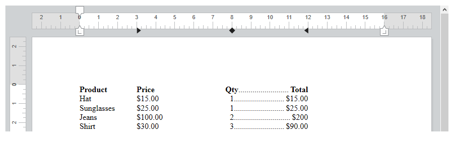

<!--REF #_command_.WP SET ATTRIBUTES.Syntax-->**WP SET ATTRIBUTES** ( *targetObj* ; *attribName* ; *attribValue* {; *attribName2* ; *attribValue2* ; ... ; *attribNameN* ; *attribValueN*} )<br/>**WP SET ATTRIBUTES** ( *targetObj* ; *attribObj* )<!-- END REF-->

<!--REF #_command_.WP SET ATTRIBUTES.Params-->

| 引数          | 型                                               |                             | 説明                                  |
| ----------- | ----------------------------------------------- | --------------------------- | ----------------------------------- |
| targetObj   | Object                                          | &#8594; | レンジまたは要素または4D Write Pro ドキュメント      |
| attribName  | Text                                            | &#8594; | 設定する属性名                             |
| attribValue | Text, Number, Object, Collection, Picture, Date | &#8594; | 新しい属性の値                             |
| attribObj   | Object                                          | &#8594; | 設定したい属性の名前とそれに対応する設定したい値を格納したオブジェクト |

<!-- END REF-->

#### 説明

**WP SET ATTRIBUTES** コマンドを使うと<!--REF #_command_.WP SET ATTRIBUTES.Summary-->レンジ、要素、あるいはドキュメントのあらゆる属性の値を設定することができます。<!-- END REF-->このコマンドを使ってあらゆる4D Write Pro内部の属性(文字、段落、ドキュメント、表組、またはピクチャー)にアクセスすることができます。

*targetObj* 引数には、以下のいずれかを渡すことができます :

- レンジ
- 要素(ヘッダー / フッター / 本文 / 表組 / 行 / 段落 / アンカーされた画像あるいはインライン画像 / セクション / サブセクション / スタイルシート)
- 4D Write Pro ドキュメント

*targetObj* 引数で指定したターゲット内で設定したい属性は、2通りの方法で指定することができます:

- *attribName* および *attribValue* 引数を使用する。 *attribName* 引数にはターゲット内で設定したい属性の名前を渡し、*attribValue* 引数には設定したい新しい値を渡します。 一度の呼び出しで*attribName*/*attribValue* のペアを好きなだけ渡すことができます。

- *attribObj* 引数を使用して、属性の名前と対応する値をオブジェクトのプロパティとして格納した一つのオブジェクトを渡すことができます。

渡すことのできる属性の包括的な一覧と、そのスコープおよび対応する値については、*4D Write Pro属性* の章を参照してください。

#### 例題 1

この4D Write Proエリアにて、以下のように単語を選択した場合を考えます:


以下のコードを実行した場合:

```4d
 $range:=WP Get selection(*;"WParea") // 選択されたレンジを取得
 
  // 選択されたテキストに対して影のオフセットをpt単位で設定
 WP SET ATTRIBUTES($range;wk text shadow offset;1)
  // 段落のパッディングを設定
 WP SET ATTRIBUTES($range;wk padding;1)
  // 10 ptの境界線を定義
 WP SET ATTRIBUTES($range;wk border style;wk solid;wk border width;10)
  // 境界線カラーを設定
 WP SET ATTRIBUTES($range;wk border color;"blue";wk border color bottom;"#00FA9A";wk border color right;"#00FA9A")
```

以下のような結果になります:


#### 例題 2

以下の例では、wk inside とwk outside 定数の使用を説明します:

```4d
 $wpRange:=WP Get selection(writeProdoc)
 WP SET ATTRIBUTES($wpRange;wk border style+wk inside;wk dotted)
 WP SET ATTRIBUTES($wpRange;wk border style+wk outside;wk solid)
 WP SET ATTRIBUTES($wpRange;wk border color+wk outside;"#00FA9A")
```

ドキュメント全体が選択されていた場合、結果は以下のようになります:


#### 例題 3

ドキュメントに対して背景画像を設定したい場合を考えます:

```4d
 var WParea : Object
 WParea:=WP New
 
 READ PICTURE FILE("C:\\Pictures\\boats.jpg";$picture)
 
 WP SET ATTRIBUTES(WParea;wk background image;$picture)
```

結果は以下のようになります:


背景画像を、印刷可能エリア全体に対して設定したい場合を考えます。 全ての属性は単一のオブジェクトを使用して渡されます:

```4d
 var WParea : Object
 WParea:=WP New
 
 READ PICTURE FILE("C:\\Pictures\\boats.jpg";$picture)
 
 $myAttributes:=New object()
 $myAttributes[wk background image]:=$picture
 $myAttributes[wk background clip]:=wk paper box
 $myAttributes[wk background origin]:=wk paper box

 WP SET ATTRIBUTES(WParea;$myAttributes)
```

結果は以下のようになります:


:::note

paper box の値はドキュメントあるいはセクションに対してのみ適用可能です。

:::

#### 例題 4

異なる間隔のタブを設定し、最後のタブに対して先頭文字を指定したい場合を考えます:

```4d
 $tab1:=New object()
 $tab1[wk type]:=wk left
 $tab1[wk offset]:="3cm"
 $tab1[wk leading]:=""
 
 $tab2:=New object()
 $tab2[wk type]:=wk center
 $tab2[wk offset]:="8cm"
 $tab2[wk leading]:=""
 
 $tab3:=New object()
 $tab3[wk type]:=wk right
 $tab3[wk offset]:="12cm"
 $tab3[wk leading]:="."
 
 $_tabs:=New collection($tab1;$tab2;$tab3)
 WP SET ATTRIBUTES(wpArea;wk tabs;$_tabs)
```

結果は以下のようになります:



#### 参照

*4D Write Pro Attributes*\
[WP GET ATTRIBUTES](../commands/wp-get-attributes.md)\
[WP RESET ATTRIBUTES](../commands/wp-reset-attributes.md)