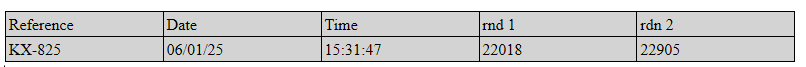

<!--REF #_command_.WP Table append row.Syntax-->**WP Table append row** ( *tableRef* ; *value* {; *value2* ; ... ; *valueN*} )  : Object<br/>**WP Table append row** ( *tableRef* ; *valueColl* ) : Object<!-- END REF-->

<!--REF #_command_.WP Table append row.Params-->

| 引数        | 型                                         |   | 説明                                            |
| --------- | ----------------------------------------- | - | --------------------------------------------- |
| tableRef  | Object                                    | → | Table reference                               |
| value     | Text, Number, Time, Date, Picture, Object | → | Value(s) to set in the row |
| valueColl | Collection                                | → | Collection of values to set in the row        |
| 戻り値       | Object                                    | ← | Row range object                              |

<!-- END REF-->

#### 説明

he **WP Table append row** command<!--REF #_command_.WP Table append row.Summary-->T appends one row to the *tableRef* table, fills it with *value*(s) or a *valueColl* collection, and returns the corresponding row range object.<!-- END REF-->

The command supports two syntaxes:

- **Using values as parameters:**
  Adds as many cells in the row as there are values provided in the *value* parameter(s). You can pass any number of values of different types.

- **Using a collection of values (*valueColl)*:**
  Fills the row with values from the *valueColl* collection. Each element of the collection corresponds to a cell in the row.

  The following value types are supported in both syntaxes: Text, Number, Time, Date, Picture and Object (formulas or named formulas returning a row element).

The default cell alignment will depend on the value type:

- text: left aligned
- pictures: centered
- other types (numbers, date, and time): right aligned

:::note 注記

- Array type values are not supported.
- Ensure the number of values or the size of the collection matches the number of cells in the table to avoid unexpected results.

:::

The command returns the new row as a row range object.

#### 例題 1

You want to create an empty table and append several rows of different sizes. 以下のように書くことができます:

```4d
 var $wpTable;$wpRange;$wpRow1;$wpRow2;$wpRow3 : Object
 $wpRange:=WP Text range(WParea;wk start text;wk end text)
 $wpTable:=WP Insert table($wpRange;wk append)
 $wpRow1:=WP Table append row($wpTable;"Paul";"Smith";25)
 $wpRow2:=WP Table append row($wpTable;"John";"Richmond";40)
 $wpRow3:=WP Table append row($wpTable;"Mary";"Trenton";18;"New!")
```


#### 例題 2

You want to create an empty table and append a row using a collection :

```4d
$table:=WP Insert table(WParea; wk replace; wk include in range)

$row:=WP Table append row($table; "Reference"; "Date"; "Time"; "rnd 1"; "rdn 2")
WP SET ATTRIBUTES($row; wk background color; "lightgrey")

$colItems:=[]
$colItems.push("KX-825")
$colItems.push(Formula(Current date))
$colItems.push(Formula(String(Current time; HH MM SS)))
$colItems.push(Formula(Random))
$colItems.push({name: "RND NUMBER"; formula: Formula(Random)})

$row:=WP Table append row($table; $colItems)
```



#### 例題 3

In a billing application, you want to create a table automatically filled with related invoice lines:

```4d
 var $wpTable;$wpRange : Object
 
 $wpRange:=WP Text range(4DWPArea;wk start text;wk end text)
 
 $wpTable:=WP Insert table($wpRange;wk append) //create the table
 
  // add the header row
 $row:=WP Table append row($wpTable;"Name";"Quantity";"Unit Price";"Discount Rate";"Total")
 WP SET ATTRIBUTES($row;wk font bold;wk true;wk text align;wk center)
 
  //simply apply to selection
 APPLY TO SELECTION([INVOICE_LINES];WP Table append row($wpTable;[INVOICE_LINES]ProductName;[INVOICE_LINES]Quantity;[INVOICE_LINES]ProductUnitPrice;[INVOICE_LINES]DiscountRate;[INVOICE_LINES]Total))
 
  //add a footer row
 $row:=WP Table append row($wpTable;"Total:";Sum([INVOICE_LINES]Quantity);"";"";Sum([INVOICE_LINES]Total))
 
  //format the table
 $range:=WP Table get columns($wpTable;1;5)
 WP SET ATTRIBUTES($range;wk width;"80pt")
 WP SET ATTRIBUTES($wpTable;wk font size;10)
```


#### 参照

[WP Insert table](../commands-legacy/wp-insert-table.md)</br>
[WP Table get rows](../commands-legacy/wp-table-get-rows.md)
