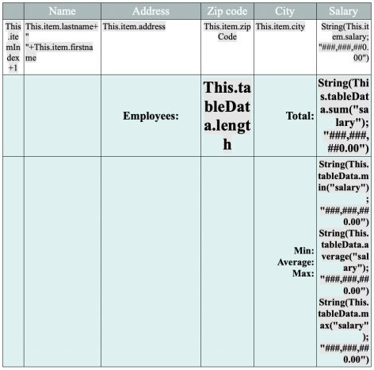

## 概要

4D Write Pro ドキュメントには、変数、フィールド、式、プロジェクトメソッドあるいは4D コマンドなどの4Dフォーミュラへの参照を含めることができます。 ページ番号などの特定の情報もフォーミュラを通して参照することができます(以下の[ドキュメントとページ式を挿入](#inserting-date-and-time-formulas) を参照してください)。

4D Write Pro エリアへのフォーミュラの挿入には[**WP INSERT FORMULA**](commands/wp-insert-formula.md) コマンドを使用し、フォーミュラの読み出しには[**WP Get formulas**](commands-legacy/wp-get-formulas.md) コマンドを使用します。 また、[**WP Get text**](commands-legacy/wp-get-text.md) コマンドを使用することでも返されます。

フォーミュラは以下のタイミングで評価されます:

- 計算された値を表示するフォームオブジェクト内に挿入されたとき
- 計算された値を表示するフォームオブジェクト内に4D Write Pro オブジェクトが読み込まれたとき
- [**WP COMPUTE FORMULAS**](commands-legacy/wp-compute-formulas.md) コマンドが呼び出された時
- [**WP FREEZE FORMULAS**](commands-legacy/wp-freeze-formulas.md) コマンドを使用して値が"固定化"(計算)されたとき(ただしまだ計算されていない場合)
- 印刷の前(ただしまだ計算されていない場合)
- .docx 形式に書き出される前(ただしフォーミュラがMS Word フォーミュラにマップすることができない場合)
- (値の)固定化、印刷、フォーミュラの計算の標準アクションが呼び出された時。 詳細は*標準アクション* を参照してください。

フォーミュラはドキュメントが([**WP New**](commands-legacy/wp-new.md) 、[**WP Insert document body**](commands/wp-insert-document-body.md) を使用して、あるいは`wpArea:=[table]field` などで)読み込まれたときでも、以下の場合には評価されません:

- ドキュメントが画面外のみにある場合
- ドキュメントが画面上に表示されているが、フォームオブジェクトが参照しか表示しない場合

フォーミュラは[**WP FREEZE FORMULAS**](commands-legacy/wp-freeze-formulas.md) コマンドを呼び出すと、静的な値になります(ただしページ番号とページ数は除く、以下参照)。

**互換性に関する注意**: [**ST INSERT EXPRESSION**](../commands-legacy/st-insert-expression.md)、 [**ST Get expression**](../commands-legacy/st-get-expression.md)、 [**ST COMPUTE EXPRESSIONS**](../commands-legacy/st-compute-expressions.md)、および [**ST FREEZE EXPRESSIONS**](../commands-legacy/st-freeze-expressions.md) コマンドを使用して式を管理するのは、廃止予定となっていますが、互換性のために4D Write Pro では引き続きサポートされています。

### 例題

4D Write Pro エリアの選択範囲を、変数の中身で置き換えたい場合を考えます:

```4d
 var fullName: Text
 var $sel: Object
 fullName:="John Smith"
 $sel:=WP Selection range(4DWPArea)
 Case of
    :(Form event code=On Clicked)
       WP INSERT FORMULA($sel;Formula(fullName);wk replace)
 End case
```

## フォーミュラコンテキストオブジェクト

[WP Insert formula](commands/wp-insert-formula.md) コマンドを使用することで、あらゆるドキュメントエリア(本文、ヘッダー、フッター)にドキュメント属性に関連した特殊な式を挿入することができます。 フォーミュラ内ではフォーミュラコンテキストオブジェクトが自動的に公開されます。 [**This**](../commands/this.md) を通してこのオブジェクトのプロパティを使用することができます:

| プロパティ                                                                          | 型      | 説明                                                                                                                                                                                                                                            |
| ------------------------------------------------------------------------------ | ------ | --------------------------------------------------------------------------------------------------------------------------------------------------------------------------------------------------------------------------------------------- |
| [This](../commands/this.md).title                              | Text   | wk title 属性で定義されているタイトル                                                                                                                                                                                                                       |
| [This](../commands/this.md).author                             | Text   | wk author 属性で定義されている作者                                                                                                                                                                                                                        |
| [This](../commands/this.md).subject                            | Text   | wk subject 属性で定義されている主題                                                                                                                                                                                                                       |
| [This](../commands/this.md).company                            | Text   | wk company 属性で定義されている会社                                                                                                                                                                                                                       |
| [This](../commands/this.md).notes                              | Text   | wk notes 属性で定義されている注記                                                                                                                                                                                                                         |
| [This](../commands/this.md).dateCreation                       | Date   | wk date creation 属性で定義されている作成日                                                                                                                                                                                                                |
| [This](../commands/this.md).dateModified                       | Date   | wk date modified 属性で定義されている変更日                                                                                                                                                                                                                |
| [This](../commands/this.md).pageNumber (\*) | Number | 以下の場所から定義されているページ番号:<li>- ドキュメントの開始からのページ番号(デフォルト)</li><li>- セクションの開始から定義されている場合には、セクションの開始からのページ番号</li> このフォーミュラは常に動的です。つまり[**WP FREEZE FORMULAS**](commands-legacy/wp-freeze-formulas.md) コマンドの影響を受けません。 |
| [This](../commands/this.md).pageCount (\*)  | Number | ページ数: 総合のページ数。<br/>このフォーミュラは常に動的です。つまり[**WP FREEZE FORMULAS**](commands-legacy/wp-freeze-formulas.md) コマンドの影響を受けません。                                                                                                          |
| [This](../commands/this.md).document                           | Object | 4D Write Pro ドキュメント                                                                                                                                                                                                                           |
| [This](../commands/this.md).data                               | Object | [**WP SET DATA CONTEXT**](commands-legacy/wp-set-data-context.md) コマンドで設定された4D Write Pro ドキュメントのデータコンテキスト                                                                                                                                     |
| [This](../commands/this.md).sectionIndex                       | Number | 4D Write Pro ドキュメント内のセクションのインデックス(1から開始)                                                                                                                                                                                   |
| [This](../commands/this.md).pageIndex                          | Number | 4D Write Pro ドキュメント内の実際のページ番号(1から開始、セクションのページ番号とは無関係)                                                                                                                                                                      |
| [This](../commands/this.md).sectionName                        | 文字列    | ユーザーが与えたセクションの名前                                                                                                                                                                                                                              |

:::note

表組を使用する場合には追加のコンテキストプロパティが利用できます。 より詳細な情報については*表組を管理する* を参照して下さい。

:::

(\*) **重要**: **This.pageNumber**、**This.pageIndex** および **This.pageCount** は4D Write Pro フォーミュラの中で直接的にのみ使用することができます(*formula.source* 文字列の中に記入されている必要があります)。 これらはフォーミュラから呼び出されたメソッド内の4D ランゲージで使用された場合には不正確な値を返します。 ただし、フォーミュラから直接呼び出されるメソッドにこれらを引数として渡すことはできます:

- この使い方は動作します: « *formatNumber(This.pageNumber)* »
- この使い方は動作**しません**: « *formatNumber* » (*formatNumber* メソッド内部で*This.pageNumber* を処理する)

例えば、フッターエリアにページ番号を挿入するには:

```4d
 $footer:=WP Get footer(4DWP;1)
 WP INSERT FORMULA($footer;Formula(This.pageNumber);wk append)
  // ただしFormula(myMethod) と書いてmyMethod にThis.pageNumber を処理させようとした場合
  // これは正常には動作しません
```

## 日付と時間フォーミュラを挿入

**日付**

[**Current date**](../commands-legacy/current-date.md) コマンド、日付型変数、あるいは日付を返すメソッドがフォーミュラに挿入された場合、この日付はsystem date short フォーマットを使用してテキストをへと自動的に変換されます。

**時間**

[**Current time**](../commands-legacy/current-time.md) コマンド、時間型変数、あるいは時間を返すメソッドがフォーミュラに挿入される場合、この時間は[**String**](../commands-legacy/string.md) コマンドでくくってあげる必要があります。JSON では時間型はサポートされていないからです。 以下のフォーミュラの例を参考にして下さい:

```4d
  // このコードがベストプラクティといえます
 $formula1:=Formula(String(Current time)) //OK 
 
  // このコードは動作しますが一般的には推奨されません("Edit formula"の直後を除く)
 $formula2:=Formula from string("String(Current time)") //OK
 
  // 以下のコードは時間値が秒数(またはミリ秒数)の倍長整数として表示されるため間違ったコードです
 $formula3:=Formula from string("Current time") //NG
 $formula4:=Formula(Current time) //NG
 
```

## バーチャルストラクチャーのサポート

4D Write Pro ドキュメントに挿入されたテーブルおよびフィールドの式はデータベースのバーチャルストラクチャー定義をサポートします。 フォーミュラに公開されるバーチャルストラクチャーは[**SET FIELD TITLES**](../commands-legacy/set-field-titles.md)(...;\*) および [**SET TABLE TITLES**](../commands-legacy/set-table-titles.md)(...;\*) コマンドを通して定義されます。

バーチャルストラクチャーが定義されている場合:

- 4D Write Pro ドキュメントが値ではなく参照を表示する場合、フィールドを格納する式への参照はバーチャルな名前を表示します。
- [**WP Get text**](commands-legacy/wp-get-text.md) は、expressions 引数に`wk expressions as source` オプションが設定されている場合、バーチャルストラクチャー名を返します。
- [WP Insert formula](commands/wp-insert-formula.md) コマンドはバーチャルストラクチャーを無視し、常に実際のテーブル/フィールド名を受け付けます。

:::note

ドキュメントが"式を表示"モードで表示されているとき、バーチャルストラクチャーに属していないテーブルまたはフィールドへの参照は"`?`"文字付きで表示されます。例えばあるフィールドがバーチャルストラクチャー内で定義されていなければ、`[VirtualTableName]?` と表示されます。

:::

## フォーミュラの表示

ドキュメント内でフォーミュラがどのように表示されるかは以下のようにコントロールすることができます:

- *値* または*参照* として表示
- 参照として表示されている場合、ソーステキスト、記号、または名前を表示

### 参照か値か

デフォルトでは、4D フォーミュラは値として表示されます。 4D フォーミュラを挿入すると、4D Write Pro はカレントの値を計算して表示します。  どのフォーミュラが表示されているのか知りたい場合には、これを参照として表示する必要があります。

フォーミュラを参照として表示するためには、以下の方法があります:

- プロパティリスト内の**参照として表示** オプションをチェックする(*ビュープロパティの設定* 参照)
- visibleReferences 標準アクションを使用する(*動的な式* 参照)
- [**WP SET VIEW PROPERTIES**](commands-legacy/wp-set-view-properties.md) コマンドを、`wk visible references` セレクターを**True** にして使用する

フォーミュラ参照は、以下の表示方法があります:

- ソーステキスト(デフォルト)
- symbols
- names

### 参照をソーステキストとして表示(デフォルト)

フォーミュラが参照 として表示されている場合、ドキュメント内にはフォーミュラのソーステキストが表示され、デフォルトでは灰色の背景色がつけられます(これは`wk formula highlight` セレクターを使用することでカスタマイズ可能です)

たとえば、フォーマットを指定したカレント日付を挿入していると、デフォルトでは次の表示になります:


フォーミュラを参照として表示した場合、そのフォーミュラの**ソース** が表示されます:


### 参照を記号として表示

フォーミュラのソーステキストがドキュメント内に表示されている場合、例えば表組を使用したような込み入ったテンプレートで作業していてかつフォーミュラが複雑だった場合、デザインが分かりづらくなってしまううことがあります:



この場合、フォーミュラ参照を 記号として表示することで、ドキュメントを読みやすくすることができます:


フォーミュラ参照を記号として表示するためには、以下の方法があります:

- プロパティリスト内の**フォーミュラのソースを記号として表示** オブションをチェックする(*ビュープロパティの設定* 参照)
- displayFormulaAsSymbol 標準アクションを使用する(*4D Write Pro標準アクションの使用* 参照)
- [**WP SET VIEW PROPERTIES**](commands-legacy/wp-set-view-properties.md) コマンドを、`wk display formula as symbol` セレクターを**True** にして使用する

### 参照を名前で表示

フォーミュラには名前を割り当てることができ、これによって4D Write Pro テンプレートドキュメントをエンドユーザーがより読みやすく理解しやすいようにすることができます。 フォーミュラが参照として表示されている場合(そして記号として表示されていない場合)で、フォーミュラに対して名前を定義している場合、フォーミュラ名が表示されます。

例えば、以下のフォーミュラ参照はデフォルトではソーステキストとして表示されます:


フォーミュラ名を割り当てた場合、テキストではなく名前が表示されます:


フォーミュラに名前を割り当てるためには、[WP Insert formula](commands/wp-insert-formula.md) コマンドにオブジェクト型の引数を渡す必要があります。 例:

```4d
  // ドキュメント内に昨日の日付を挿入する
 $o:=New object("formula";Formula(Current date-1);"name";"Yesterday")
 $range:=WP Text range(WPArea;wk start text;wk end text)
 WP INSERT FORMULA($range;$o;wk append)
 
```


:::note

名前をつけられるのはインラインフォーミュラのみです(アンカーされた画像、ブレーク行などに対するフォーミュラ、表データソースフォーミュラには名前をつけることはできません)。

:::

### フォーミュラのtips

フォーミュラの表示モードに関わらず、フォーミュラ上をマウスでホバーした時に表示される**tips** でフォーミュラに関する追加の情報を得ることができます。

- フォーミュラに名前がない場合、tips はフォーミュラのソーステキストを表示します:

 

- フォーミュラに名前はついているものの値または記号として表示されている場合、tips はフォーミュラ名を表示します:

 

このコンテキストでは、フォーミュラ上をホバーしているときに**Ctrl** (Windows) または **Cmd** (macOS) キーを押すことでフォーミュラのソーステキストを表示できます。

- フォーミュラに名前がついていて、名前として表示されている場合、デフォルトではtips は表示されません。
 フォーミュラ上をホバーしているときに**Ctrl** (Windows) または **Cmd** (macOS) キーを押すことでフォーミュラのソーステキストを表示できます:
 

#### 参照

[HDI データベースをダウンロード](http://download.4d.com/Demos/4D_v16/HDI_4DWP_Filter4DExpressions.zip)</br>
*スタイル付きテキストテーマのコマンドを使用*