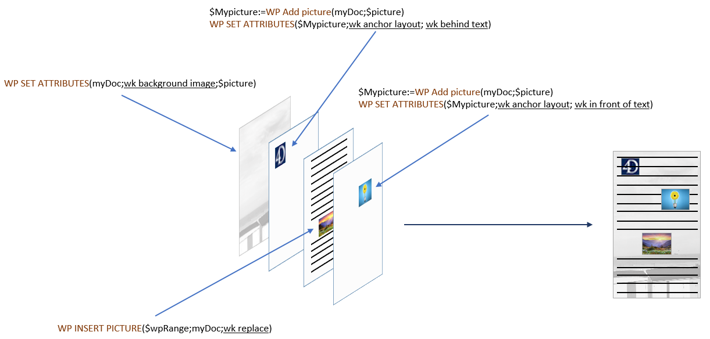

#### 背景画像 

ピクチャーは4D Write Pro ドキュメントあるいはドキュメント要素(テーブル、段落、セクション、ヘッダー/フッター等)の、背景画像として設定することが可能です。

以下の図は、ピクチャーをドキュメントの背景として使用する二つの異なる方法を示したものです:

>  

背景画像はプログラミングによって、あるいはコンテキストメニューによって設定することが可能です。詳細な情報については、*4D Write Pro エリアを使用する* の記事内の*背景* の章を参照してください。

背景画像の表示はプログラムによって、またはコンテキストメニューによって設定することができます。背景表示モードの値は以下の定数の詳細に記されているように背景設定のプリセットを定義するという点に注意してください:

| 定数                       | コメント                                                                                                                                                                                                                                                                                                                                                                                                             |
| ------------------------ | ---------------------------------------------------------------------------------------------------------------------------------------------------------------------------------------------------------------------------------------------------------------------------------------------------------------------------------------------------------------------------------------------------------------- |
| wk proportional          | wk image display mode の値として使用された場合、画像はコンテンツボックスの左上に配置され、繰り返しはされず、コンテンツボックスに収まるように縮小/拡大され、元のアスペクト比を保ちます。 wk background display mode の値として使用された場合、以下の属性をプリセットします: wk background width \= "contain" wk background height \= "auto" wk background repeat \= wk no repeat wk background origin \= wk padding box wk background position horizontal \= wk left wk background position vertical \= wk top               |
| wk proportional centered | wk image display mode の値として使用された場合、画像はコンテンツボックスの中方に配置され、繰り返しはされず、コンテンツボックスに収まるように縮小/拡大され、元のアスペクト比を保ちます。 wk background display mode の値として使用された場合、以下の属性をそれぞれ次のようにプリセットします: wk background width \= "contain" wk background height \= "auto" wk background repeat \= wk no repeat wk background origin \= wk padding box wk background position horizontal \= wk center wk background position vertical \= wk center |
| wk replicated            | wk image display mode の値として使用された場合、画像はコンテンツボックスの左上に配置され、繰り返され、元のサイズを保ちます。 wk background display mode の値として使用された場合、以下の属性をそれぞれ次のようにプリセットします: wk background width \= "auto" wk background height \= "auto" wk background repeat \= wk repeat wk background origin \= wk padding box wk background position horizontal \= wk left wk background position vertical \= wk top                                          |
| wk replicated centered   | wk image display mode の値として使用された場合、画像はコンテンツボックスの中央に配置され、繰り返され、元のサイズを保ちます。 wk background display mode の値として使用された場合、以下の属性をそれぞれ次のようにプリセットします: wk background width \= "auto" wk background height \= "auto" wk background repeat \= wk repeat wk background origin \= wk padding box wk background position horizontal \= wk center wk background position vertical \= wk center                                     |
| wk scaled to fit         | wk image display mode の値として使用された場合、画像はコンテンツボックスに収まるように縮小/拡大され、繰り返しはされません。 wk background display mode の値として使用された場合、以下の属性を変更します: wk background width \= "100%" wk background height \= "100%" wk background repeat \= wk no repeat wk background origin \= wk padding box wk background position horizontal \= wk left wk background position vertical \= wk top                                                   |
| wk truncated             | wk image display mode の値として使用された場合、画像はコンテンツボックスの左上に配置され、繰り返しはなく、オリジナルのサイズを保ちます。 wk background display mode の値として使用された場合、以下の属性をそれぞれ次のようにプリセットします: wk background width \= "auto" wk background height \= "auto" wk background repeat \= wk no repeat wk background origin \= wk padding box wk background position horizontal \= wk left wk background position vertical \= wk top                                 |
| wk truncated centered    | wk image display mode の値として使用された場合、画像はコンテンツボックスの中央に配置され、繰り返しはされず、オリジナルのサイズを保ちます。 wk background display mode の値として使用された場合、以下の属性をそれぞれ次のようにプリセットします: wk background width \= "auto" wk background height \= "auto" wk background repeat \= wk no repeat wk background origin \= wk padding box wk background position horizontal \= wk center wk background position vertical \= wk center                           |

#### ピクチャーの追加 

4D Write Pro ドキュメントへのピクチャーの追加は、必要に応じて複数の方法で行うことができます:

* **背景画像**を追加するためには、[WP SET ATTRIBUTES](../commands/wp-set-attributes) コマンドとwk background image 属性あるいは wk background image url 属性を使用します。
* **インライン画像**(文字のようにテキストフローに挿入された画像)を追加するためには、[WP INSERT PICTURE](../commands/wp-insert-picture) あるいは [ST INSERT EXPRESSION](../../commands/st-insert-expression) コマンドを使用します。
* **アンカー画像**をページ内(テキストの後ろあるいは前面)に追加するためには、[WP Add picture](../commands/wp-add-picture) コマンドを使用します。

ピクチャーの追加方法によって画像が位置するレイヤーが決定されます。以下の図を参照してください:



#### アンカーされたピクチャーの位置と表示 

アンカーされたピクチャーは絶対位置で、テキストの前あるいは後ろに追加されます。また、ページあるいはドキュメントの特定のパーツ(ヘッダー、フッター、セクションなど)にアンカーすることもできます。ピクチャーに絶対位置を設定するためには、[WP Add picture](../commands/wp-add-picture) and [WP SET ATTRIBUTES](../commands/wp-set-attributes) コマンドを使用します。

アンカーされた画像の位置は以下の特定の属性あるいは標準アクションを使用することで変更可能です:

| **プロパティ(定数)**               | **標準アクション**             |
| --------------------------- | ----------------------- |
| wk anchor layout            | *anchorLayout*          |
| wk anchor horizontal offset |                         |
| wk anchor horizontal align  | *anchorHorizontalAlign* |
| wk anchor vertical offset   |                         |
| wk anchor vertical align    | *anchorVerticalAlign*   |
| wk anchor origin            | *anchorOrigin*          |
| wk anchor page              | *anchorPage*            |
| wk anchor section           | *anchorSection*         |
| | *moveToBack*              |                         |
| | *moveToFront*             |                         |

アンカーされたピクチャーは、左側/右側/大きい側/上と下またはwk anchor layout プロパティまたは**anchorLayout** 標準アクションを通して提供されるオプションでドキュメントにアンカーされた場合、自動テキスト折り返しをサポートします。詳細については [こちらのblog記事](https://blog.4d.com/4d-write-pro-more-display-options-for-anchored-pictures-and-text-boxes/) を参照してください。


テキスト折り返しが設定されているピクチャーがページの本文に対してアンカーされている場合、それらはヘッダーまたはフッターには影響しません(ピクチャーはヘッダーまたはフッターの前面に表示されます)。その反対に、ヘッダーまたはフッターにアンカーされたピクチャーは、ページの本文と重なった場合にはそちらに影響します。

**注意**: テキスト折り返しが設定されているピクチャーをヘッダーまたはフッターにアンカーしたい場合、ピクチャーの横方向揃えを上揃えに設定する必要があります。

アンカーされたピクチャーは全てページビューモードでのみ表示されます。以下の場合には表示されません:

* ピクチャーが非表示のヘッダーあるいはフッターにアンカーされている
* ビューモードが下書きモードである
* 中央揃えになっているかセクションにアンカーされている状態で、**HTML WYSIWYGで表示**オプションがチェックされている
* "背景を表示"オプションが選択されていない

#### ピクチャー式 

4D Write Pro エリア内には、ピクチャーを返す4D 式を挿入することも可能です。式には変数、フィールド、プロジェクトメソッド(\*)、オブジェクト属性あるいはコレクション要素を使用することができます。

ピクチャーtipでは、式の参照を見ることができます(\*):


(\*)アンカーされたがずには割り当てられたテキストは何もないため、その式参照は表示されません。

全ての画像属性はピクチャー式に適用することができます(wk imageおよび wk image url 属性は読出し専用です)。しかしながら、ピクチャーには特有の属性があるため、4D Write Pro はそその式の結果がピクチャーであると判定し、それをピクチャー式として扱うために、少なくとも一度は式を評価する必要がある点に注意してください。これはつまり[WP INSERT FORMULA](../commands/wp-insert-formula) を使用してピクチャー式を挿入した場合、どのピクチャー属性を設定するよりも前に[WP COMPUTE FORMULAS](../commands/wp-compute-formulas) を呼び出す必要があるということです。

**注**: 他の式同様、ピクチャー式は[WP INSERT FORMULA](../commands/wp-insert-formula) および [WP COMPUTE FORMULAS](../commands/wp-compute-formulas) コマンドの影響を受けます。

##### アンカーされた画像 

アンカーされたピクチャー式は、[WP Add picture](../commands/wp-add-picture) コマンド(第2引数なし)によって追加され、その後に[WP SET ATTRIBUTES](../commands/wp-set-attributes) コマンドをwk image formula セレクターつきで呼び出します。

例:

```4d
 obImage:=WP Add picture(myDoc)
 WP SET ATTRIBUTES(obImage;wk image formula;Formula(m_buildPict))
```

また、既存のアンカーされたピクチャーに[WP SET ATTRIBUTES](../commands/wp-set-attributes) コマンドとwk image formula を合わせて使用することでピクチャー式を挿入することもできます。

**互換性に関する注意:** テキストを通してピクチャー式を定義するためには、wk image expression 定数は引き続き使用することができます。しかしながら、今後はwk image formula とオブジェクトを使用する方法が推奨されます。

[WP RESET ATTRIBUTES](../commands/wp-reset-attributes) コマンドをwk image formula と呼び出すことは、式が画像属性から消去されるという点において、[WP FREEZE FORMULAS](../commands/wp-freeze-formulas) を(ドキュメント全体に)呼び出すことに似ています。しかしながら、[WP FREEZE FORMULAS](../commands/wp-freeze-formulas) コマンドは消去の前に式を計算するのに対し、[WP RESET ATTRIBUTES](../commands/wp-reset-attributes) コマンドは計算をしません。式が一度も計算されていない場合、デフォルトの黒いフレーム画像が表示されます。

##### 画像式の挿入 

[WP INSERT FORMULA](../commands/wp-insert-formula) コマンドを使用することでインラインピクチャー式を追加することができます。

例:

```4d
  //ピクチャー変数を挿入
 WP INSERT FORMULA(wpRange;Formula($vpict);wk prepend)
 
  //フィールドを挿入
 WP INSERT FORMULA(wpRange;Formula([DOC]SamplePict);wk prepend)
 
  //4D メソッドを挿入
 WP INSERT FORMULA(wpRange;Formula(M_ComputeChart);wk prepend)
```

#### 空のピクチャー 

画像が空の場合(例: 画像が読み込みできない、計算できない式の結果である、サポートされていないピクチャーフォーマットを使用している等)、デフォルトで4D Write Pro は黒枠の四角形を表示します。


以下の方法を使用してこれらの黒い四角形をカレントのビューから消去することができます:

* プロパティリストの"空またはサポートされていない画像を表示"オプション(*ビュープロパティの設定* 参照)を使用する
* [WP SET VIEW PROPERTIES](../commands/wp-set-view-properties) コマンドとwk visible empty images セレクターを組み合わせて使用する
* *visibleEmptyImage* 標準アクションを使用する(*4D Write Pro標準アクションの使用* 参照)

またwk visible empty images セレクターを[WP EXPORT DOCUMENT](../commands/wp-export-document) および [WP EXPORT VARIABLE](../commands/wp-export-variable) コマンドに対して使用することで、書き出されたコンテンツから黒い四角形を消去することもできます。

このオプションが設定されている場合、たとえ画像に境界線、幅、高さ、背景などが設定されてあっても空の画像要素は全く表示されないという点に注意して下さい。これはインライン画像のページレイアウトに影響する可能性があります。

#### ピクチャープロパティ 

全てのピクチャーには高さ、幅、境界線、表示モードなどといったプロパティ(属性)があります。これら4D Write Pro ランゲージ([WP GET ATTRIBUTES](../commands/wp-get-attributes) あるいは [WP SET ATTRIBUTES](../commands/wp-set-attributes))あるいは標準アクションを用いて取得あるいは設定することが可能です。

* ピクチャーに対して使用可能なプロパティの完全な一覧は、*4D Write Pro属性* のページに記載されています。
* *画像* の章にはピクチャー専用の属性が含まれています。
* *4D Write Pro標準アクションの使用* のページにも利用可能な画像プロパティの一覧があります。

##### ピクチャー参照またピクチャーURL 

ピクチャー参照(ピクチャー変数、フィールド、式)を使用する事もできますし、ピクチャーURL(ピクチャーのローカルあるいはネットワークアドレスを表すテキスト)を使用する事もできます。

2組の属性を使用する事で、ピクチャー参照を使用したいか、ピクチャーURLを使用したいかを定義する事ができます:

* wk image、 wk background image、wk list style image: ピクチャー参照を設定あるいは取得します。  
これらの属性を使用してピクチャーを取得した場合、ピクチャーの定義方法に関係なく、4Dピクチャーを受け取ります。
* wk image url、wk background image url、wk list style image url: ピクチャーURLを設定あるいは取得します。  
これらの属性を使用してピクチャーを取得した場合、テキストのみを受け取ります。ピクチャーが参照を通して定義されていた場合(例: ピクチャー変数)、ローカルのURI と、そのあとにBase64 の画像を受け取ります。

**例:**

```4d
 $range:=WP Get selection(WPArea) //ユーザーが選択した画像を取得
 $range:=WP Picture range($range) //レンジを作成
 $url:="http://doc.4d.com/image/logo/poweredby4D_web.png"
 
 WP SET ATTRIBUTES($range;wk image;$url) //URLから画像参照を設定
 
  //画像を取得
 var vPictureGet : Picture
 WP GET ATTRIBUTES($range;wk image;vPictureGet) //vPictureGet に画像が格納される
 var vPictureURLGet : Text
 WP GET ATTRIBUTES($range;wk image url;vPictureURLGet) //vPictureURLGet=$url
```

#### ピクチャーの取得 

以下のコマンドを使用するとピクチャーが返されます:

* [WP Picture range](../commands/wp-picture-range) \- インライン画像に対してのみ適用可能
* [WP Selection range](../commands/wp-selection-range) \- ユーザーが選択した画像に対してのみ適用可能

#### ピクチャーの削除 

インライン画像とアンカー画像は、以下の方法で削除することができます:

* *マウス/キーボードアクション* を使用する
* [WP DELETE PICTURE](../commands/wp-delete-picture) コマンドを使用する

#### マウス/キーボードアクション 

ピクチャーはマウスあるいはキーボードで編集することができます。利用可能なアクションは以下の通りです:

* **選択**  
   * 前面レイヤーにあるピクチャーはクリックすることで選択することが可能です。  
   * 背景画像はCTRL+クリック(Windows)あるいはCommand+クリック(Mac)で選択することが可能です。  
   * 絶対位置をもつピクチャーを一つだけ選択することができます。複数選択することはできません。
* **移動**  
   * ピクチャーはマウスを使用して移動およびリサイズすることができます(インライン画像はドキュメントの外へとドラッグすることはできません)。
* **挿入**  
   * 絶対位置を持つピクチャーが下書きモードに貼り付け場合、カレントのキーボードセレクションの先頭にインラインとして表示されます。
* **カット/貼り付け/コピー**  
   * ピクチャーは選択されていればクリップボードへとコピーしたり、カット/貼り付けなどを行うことができます。  
   * 絶対位置を持つピクチャーをページモードで貼り付けすると、そのピクチャーは選択されている最初のページに貼り付けられ、元のアンカー設定に関係なく、そのページへとアンカーされます。貼り付けられたピクチャーは元のオフセットは保持しますが、元のモードとは異なるページモードへと貼り付けられた場合には保持しません(例えばピクチャーがページモードでコピーされ、埋め込みモードで貼り付けされた場合には、オフセットは0へとリセットされます)。
* **削除** \-ピクチャーを選択した状態で以下の操作を行うと、ピクチャーを削除することができます:  
   * deleteキー  
   * クリアアクションのキーボードショートカット