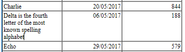
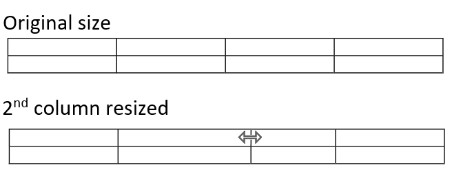
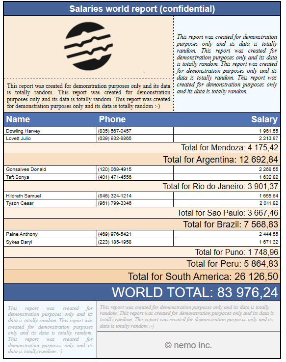
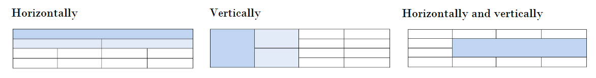
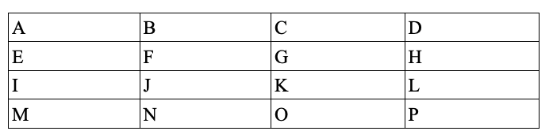
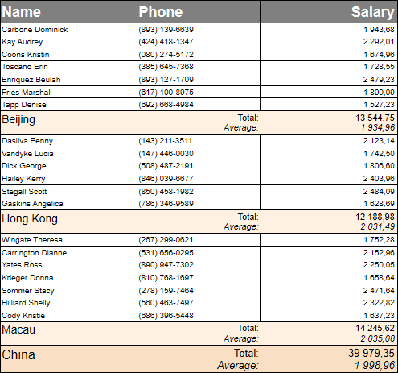
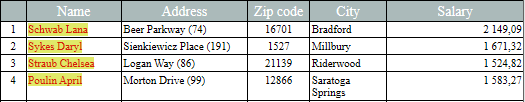

## 表組みの管理 

4D Write Proドキュメントには表を含めることができます。4D Write Pro の表組みはプログラミングによって作成・定義されますが、そのコンテンツについては変更可能で、ユーザーによって管理されます。行の高さ、並び、マージン、テキストスタイル、カラー、境界線を含め、様々な 4D Write Pro 表属性が編集可能です。


**注意:** 4D Write Pro の表組みはプログラミングによって値を入れることが可能であるため、大量のカラムと列を持たせることができます。巨大な表組みは、特にスクリーン上に表示される場合にパフォーマンスに影響を与える点に注意してください。詳細な情報については[このblog記事](https://blog.4d.com/4d-write-pro-tables-without-limit) をご覧下さい。

## 表の作成 

4D Write Pro の表は[WP Insert table](../commands/wp-insert-table) コマンドを呼び出すことによって作成されます。その後、[WP Table append row](../commands/wp-table-append-row) コマンドを使用して行を追加することができます。

**注:** ユーザーはセルの範囲をコピー・ペーストすることによって表を作成することができます:   


## 表の編集 

セルの中身は[WP Table append row](../commands/wp-table-append-row) コマンドを使用することでプログラミングによって追加することができます。

表組みの作成後は、セルの中身はユーザーによってランタイムで編集可能です。ユーザーはセル内をクリックし、通常の段落同様、選択、編集、コピー/ペースト、あるいはテキストまたはピクチャーの削除をすることが可能です。また**Tab**キーを使用してセルを移動していくことも可能です(**Shift+Tab**で逆方向に移動していきます)。

セル内で**キャリッジリターン**を使用すると、セル内に新しい段落を作成します。

セルの幅は固定であることに注意して下さい。ユーザーがテキストを入力するかピクチャーを貼り付けると、行の高さが必要に応じて自動的に拡張され、テキストは自動的に折り返されます:



ユーザーはまた、カラム、行、あるいはセルを選択し、ビルトインのポップアップメニューあるいはカスタマイズされたインターフェースを使用して、テキストスタイル、カラー、並び、などの利用可能な属性を適用することができます。4D Write Proでは表組みの任意の部分を選択する複数のコマンドを提供します:

* [WP Table get rows](../commands/wp-table-get-rows) は行のレンジ(またはヘッダー行レンジ)を取得します。
* [WP Table get columns](../commands/wp-table-get-columns) はカラムのレンジを取得します。(\*)
* [WP Table get cells](../commands/wp-table-get-cells) はセルのレンジを取得します。

(\*) カラムは、それに相当するものがhtmlにはありません。4D Write Proでは、カラムのレンジは実際にはセルのレンジであり、これはつまりカラムはセルと同じプロパティを持つことを意味します。

レンジを選択したら、[WP SET ATTRIBUTES](../commands/wp-set-attributes) コマンドを使用して適切な属性を適用することができます。セルの中では、そのコンテンツに応じて、属性は段落、章、あるいはピクチャーへと適用されます。例えば、表組みあるいは表組みのセルに対しては、高さ、フォントサイズ、境界線、パッディング、などを設定することができます(詳細な情報については、*4D Write Pro属性* の章を参照して下さい)。

異なる属性が表の要素に同時に適用された場合、レンダリングには以下の優先順位が適用されます:

1. 表が最初にレンダリングされます
2. 行がレンダリングされます(このとき表属性を上書きします)
3. セル/カラムがレンダリングされます(このとき行属性を上書きします)

### 列をリサイズする 

表の列の幅は、列のセパレータを左か右にドラッグすることで変更することができます。セパレータが水平方向に移動できる時、カーソルはルーラー上の水平方向の矢印に変形して移動可能であることを示します:


列のリサイズをすると、On After Edit フォームイベントが発生します。

列をリサイズするには、列セパレータをクリックし、左か右にドラッグします。最小の列幅は8pt です。右の列が最小幅に達すると、それ以降は隣の列より右にある列は全て移動されていきます。最初の列、またはすぐ左の列が最小幅に達した場合、その方向へのリサイズはそれ以上できません。



**Shift** キーを押しながら列をリサイズすると、右の列の幅は変更されません。


****Note:** 列のリサイズをするためには、4D Write Pro ドキュメントの入力可能プロパティが有効化されている必要があります。

### セルの結合と結合解除 

4D Write Pro では、表内のセルを結合したり結合解除したりできます。セルの結合とは、表内の同じ行または列にある隣り合った2つ以上のセルを1つのセルへと組み合わせることです。セルの結合解除とは、すでに結合したセルに対して、同じ行または列内にに並んだ複数の隣り合ったセルへと分割することです。セルは、[WP TABLE MERGE CELLS](../commands/wp-table-merge-cells) コマンドまたは**cell/merge** 標準アクションを使用することで結合でき、また[WP TABLE SPLIT CELLS](../commands/wp-table-split-cells) コマンドや**cell/split** 標準コマンドを使用することで結合解除できます。



表のセルは、以下の様に縦方向にも横方向にもその両方向にも結合することができます: 



**ランゲージを使用したセル結合の例:**

1. 表内で結合したいセルのレンジを指定します。指定するセルは水平方向、垂直方向、またはその両方向に隣り合っている必要があります。
2. 選択されたレンジに対して[WP TABLE MERGE CELLS](../commands/wp-table-merge-cells) コマンドを呼び出します。

```4d
 $cells:=WP Table get cells($table;1;1;3;1)
 WP TABLE MERGE CELLS($cells)
  //または
 WP TABLE MERGE CELLS($table;1;1;3;1)
```

元のセル内の既存のデータは、結合されたセル内で連結されます。

実行前  


実行後  


**ランゲージを使用したセル結合解除の例:**

1. 表内で結合を解除したいセルのレンジを指定します。選択されたレンジには既に結合されているセルが含まれている必要があります。
2. 選択されたレンジに対して[WP TABLE SPLIT CELLS](../commands/wp-table-split-cells) コマンドを呼び出します。

```4d
 $cells:=WP Table get cells($table;1;1;1;1)
 WP TABLE SPLIT CELLS($cells)
  //または
 WP TABLE SPLIT CELLS($table;1;1;1;1)
```

既に結合していたセル内のデータは、結合解除の後には全て最初(左上)のセルに残されます。結合解除された他のセルは空のままとなります。

実行前  


実行後  


**重要**: 

* 特殊行(データ行、ブレーク行、下部キャリーオーバー行)に属するセルは、どれも垂直方向に結合することはできません。
* ヘッダー行に属するセルは、結合対象であるセルが全て他のヘッダー行に属している場合のみ垂直方向に結合することができます(ヘッダー行の次の、非ヘッダー行とは結合することができません)。

**結合したセルの指定:** 

結合したセルは、4D Write Pro インターフェース、標準アクション、あるいはWP Set Attributes コマンドを使用することで、単一のセルと同じ様に操作することができます(背景色、境界線スタイル、段落スタイルなど)。

既存の表コマンドは全て、結合したセルを格納したレンジまたは要素に対して適用可能です。結合したセルが含まれる表においては、セルのインデックスはあたかもどのセルも結合していないのと同じ様に扱われます。  

例: 

```4d
 $cell1:=WP Table get cells($table;1;1;1;1)
 $cell4:=WP Table get cells($table;4;1;1;1)
 WP SET ATTRIBUTES($cell1;wk background color;"yellow")
 WP SET ATTRIBUTES($cell4;wk background color;"pink")
```

実行前  


実行後  


この例題では、$cell1 の代わりに$cell2 または$cell3 を渡して以下の様に実行することもできます:

```4d
 $cell2:=WP Table get cells($table;2;1;1;1)
```

```4d
 $cell3:=WP Table get cells($table;3;1;1;1)
```

そして実行した結果は$cell1 を使用したときと同じ結果になります。なぜなら$cell1、$cell2、$cell3 はセル結合後は全て同じセルを参照し、$cell1、$cell2、$cell3 に対して適用された変更は全て実際には新しい結合されたセルへと適用されるからです。

しかし、行全体、あるいは列全体がx行(またはx列)が結合された場合には、その後の行または列のインデックスは、x分だけ減ることになります。

## 表のページ分け 

ページモードあるいは下書きモードで表示した場合(あるいはドキュメント印刷のコンテキストにおいて)、4D Write Pro の表は以下の場合に分割されることがあります:

* 表の高さが利用可能なページ/カラムの高さより大きい場合には、自動的に分割されます。
* あるいはプログラムによって、もしくはユーザーによって設定されたページ/カラムブレークに応じて分割されます。
 表は行の間で分割することができ、また行そのものも分割可能です。表のページ分けはページの向きやカラムの数が変更された場合などに動的に更新されます。 

**注:**

* wk page break inside row / wk page break inside table 属性(詳細は*4D Write Pro属性* 参照)、または標準アクション(詳細は*4D Write Pro標準アクションの使用* 参照)を使用することで、表内での自動分割を無効化することができます。
* 表の行と段落とで異なる改ページオプションが設定されていた場合、行に適用されたオプションが優先されます。例えば、段落が改ページを許可していても、その親の行が改ページを許可していない場合、その行は分割されません。

 表のページ分けは、プログラムによって、あるいはユーザーによってコントロール可能です。利用可能なアクションには以下のものが含まれます: 
* 表内に改ページを挿入する:  
   * [WP INSERT BREAK](../commands/wp-insert-break) コマンド  
   * *insertPageBreak* 標準アクション  
   * デフォルトのコンテキストメニューの**改ページを挿入**オプション
* 表内にカラムブレークを挿入  
   * [WP INSERT BREAK](../commands/wp-insert-break) コマンド  
   * *insertColumnBreak* 標準アクション  
   * デフォルトのコンテキストメニューの**カラムブレークを挿入**オプション

改ページあるいはカラムブレークが標準アクションあるいはコンテキストメニューを介して挿入された時、それらは選択されたコンテンツの前に追加されます。選択範囲の最初の行は次のページあるいは次のカラムの最初に移動されます。例:

 \===> 

****注意:** 

* 分割可能なのは本文部分にある表だけです。ヘッダーまたはフッター内にある表にブレークが挿入されても、それは無視されます。
* 表は異なるセクションへと分解することはできません。表内にセクションブレークを挿入すると、表全体が新しいセクションへと移動されます。
* *キャリーオーバー行* が有効化されている場合には、行内のブレークは許可されません。

## 繰り返し表示されるヘッダー行 

4D Write Pro では、1つの表につき、5つまでヘッダー行を指定することができます。ヘッダー行として選択された行は、カラムブレーク、あるいは改ページがあればそこに必ず繰り返し表示されます。


表のヘッダー行に指定できるのは表の最初の行(あるいは最初の複数の行)です。ヘッダー行を定義するためには、以下の方法があります:

* *headerRowCount* 標準アクション(*4D Write Pro標準アクションの使用* 参照)を使用する。
* [WP SET ATTRIBUTES](../commands/wp-set-attributes) コマンドに対して、wk header row count (ターゲットは表、*テーブル*参照)、あるいは wk header (ターゲットは行、*行とカラム*参照)を使用する。

5行以上の行をヘッダー行として指定した場合(あるいは既存のヘッダーに対して行を挿入した結果5行以上になった場合)、4D Write Pro は最初の5行のみをヘッダー行として使用します。ヘッダーとして定義されている行を削除した場合、ヘッダー行の数はそれだけ減少します。

## 表のデータソース 

表に対してフォーミュラオブジェクトをデータソースとして割り当て、表内から*This を使用した式* を使用することで計算された値にアクセスすることができます(以下参照)。データソースのフォーミュラは、フォーミュラが計算されたとき(例: ドキュメントが開かれたとき、[WP COMPUTE FORMULAS](../commands/wp-compute-formulas) コマンドが呼ばれたとき、など)に4D Write Pro によって処理されます。この機能はデータコンテキストの機能を活用しています([WP SET DATA CONTEXT](../commands/wp-set-data-context) 参照)。

データソースのフォーミュラオブジェクトが(空でない)コレクションまたはエンティティセレクションを返す場合、フォーミュラが計算されるとすぐに表はデータが埋められます。表にはコレクション内にある要素数分だけ、あるいはエンティティセレクション内のエンティティ数分だけ行が表示されます。(ヘッダー行を除いた)最初の行はテンプレート行として使用され、そこにはThis.item.lastname といったような特別なキーワードを使用した式を挿入することができます。式はコレクションまたはエンティティセレクションからのデータの処理中に置き換えられます。このテンプレート行は、フォーミュラが計算された後のコレクションまたはエンティティセレクション内の項目数と項目行の数が合致するように複製されていきます。  
  
表にデータソースを割り当てる場合、[WP SET ATTRIBUTES](../commands/wp-set-attributes) コマンドとwk datasource 定数を使用し、値として*4D formula* オブジェクトを渡します。例えば、表の中にFrance に住む全ての人のデータを行に表したい場合、以下のようなコードを使用します:  
  
```4d
 $formula:=Formula(ds.people.query("country = :1";"France"))
 WP SET ATTRIBUTES($table;wk datasource;$formula)
```

* データソースフォーミュラがオブジェクトが(空ではない)コレクションまたはエンティティセレクションを返す場合、表はフォーミュラが計算される時点で地頭的に埋められていきます。行の数は少なくともコレクション内の要素数、またはエンティティセレクション内のエンティティ数と同じだけ格納されています。データ行と呼ばれる、表の最初の行は、テンプレート行として使用されます(ヘッダー行とブレーク行(あれば)は除く)。
* データ行(およびブレーク行)内では、This.item.lastname のような特殊なキーワードを使用した式を挿入することができます。式は、処理の過程で、コレクションまたはエンティティセレクションからのデータによって置き換えられます。繰り返される行は、フォーミュラ計算後に項目行がコレクションまたはエンティティセレクション内の項目の数と同じになるように複製されていきます。
* データソースフォーミュラがコレクションまたはエンティティセレクションを返さない場合、あるいは空のコレクション/エンティティセレクションを返す場合、表の行は自動的には作成されず、全ての行は通常の行として扱われます。データソースが空の場合に表示されるプレースホルダー行を定義することができます。

表からデータソースを削除するためには、[WP RESET ATTRIBUTES](../commands/wp-reset-attributes) コマンドを使用してください。このコマンドはデータソース属性値をnull に設定します:  
  
```4d
 WP RESET ATTRIBUTES($table;wk datasource)
```

### データソースに基づく表組み 

データソースに基づいた表デザインは、以下のような行を格納しています:

| **アイコン**                                                      | **行 <br/>** | **数** | **必須** | **条件**                            | **説明**                                                                                                                                                                                  |
| ------------------------------------------------------------- | ------------------- | ----- | ------ | --------------------------------- | --------------------------------------------------------------------------------------------------------------------------------------------------------------------------------------- |
|               | ヘッダー行               | 最大5   | \-     | \-                                | 標準の表ヘッダー、*繰り返し表示されるヘッダー行* 参照                                                                                                                                                            |
| <br/>        | データ行                | 1     | 必須     | データソースフォーミュラは必ず繰り返される要素を返す必要があります | 表にヘッダー行またはブレーク行がない場合、データ行が表の最初の行となります。それ以外の場合には、ヘッダー行の後の最初の行がこの行となります。一般的には**This** を使用した式(例: *This.item.value* )が記述されています。ドキュメントが*値を表示*モードで行が複製されているとき、この式を通して処理されたデータへとアクセスすることができます。 |
| <br/> | ソートブレーク行            | 最大5   | \-     | データソースフォーミュラは必ず繰り返される要素を返す必要があります | データ行の前または後に表示される行。 *ブレーク行* 参照                                                                                                                                                           |
| <br/> | 下部キャリーオーバー行         | 1     | \-     | データソースフォーミュラは必ず繰り返される要素を返す必要があります | データ行またはブレーク行のあとに最初に表示される行。*キャリーオーバー行* 参照                                                                                                                                                |
|               | プレースホルダー行           | 1     | \-     | データソースが定義されている必要があります             | プレースホルダ行は、表に対してデータソースが空でかつ"プレースホルダー行を表示"属性が*emptyDatasource* 標準アクションまたは*wk empty datasource* 定数を通して設定されていた場合に、データ行の代わりに表示される行です。プレースホルダー行はその他の行の直前に表示されます。                              |
| |  その他の行                                                      | 無制限                 | \-    | \-     | 標準の行(複製されません)                     |                                                                                                                                                                                         |

表示例(*参照を表示* モード):


フォーミュラが計算されると、繰り返される行は、データソースフォーミュラから返される全エンティティ数またはコレクション項目数と合致するまで自動的に複製されます:


いずれの場合にしても、以下の宣言を使用することで実際の行数を得ることができます:

```4d
 WP GET ATTRIBUTES($table;wk row count;$vcount) // 上記の例の場合には31
```

### キャリーオーバー行 

データソースに基づいた表は**下部キャリー行**をサポートします。これは表が複数のページ/カラムに分割される場合に各ページ/カラムの下部に自動的に表示される行です。キャリーオーバー行は**This.previousItems** という式を使用することで、ここまで表示/印刷された項目に基づいた追加の情報を表示することができます(*This を使用した式* 参照)。この機能を使用することで、例えば小計行を追加することなどができます。


キャリーオーバー行は以下のように表示されます: 

* データソース表が単一のページ(またはカラム)に収まらない場合に表示されます
* 表の下部に表示されます
* 最初のページ(または最初のカラム)を含め、他の全てのページ/カラムに表示されますが、最後のページ/カラムには表示されません。

**重要:** キャリーオーバー行は、空でないコレクションまたはエンティティセレクションを返すデータソースフォーミュラで埋められた表において、値を表示モードのときにのみ利用できます。それ以外の場合、またはデータソースフォーミュラが計算されていない場合には、キャリーオーバー行は通常の行として表示されます。

キャリーオーバー行は以下のように作成できます:

1. 表のテンプレートに、データ行またはブレーク行のすぐ後に行を追加し、例えば**This.previousItems** のように必要なフォーミュラを中に入力します。
2. ドキュメントにおいてキャリーオーバー行を有効化します。以下の2つの方法があります:  
\- *bottomCarryOverRow* 標準アクションを使用する(*4D Write Pro標準アクションの使用* 参照)  
\- [WP SET ATTRIBUTES](../commands/wp-set-attributes) コマンドに wk bottom carry over row *表* 属性セレクターを組み合わせて使用する

**注意:** キャリーオーバー行機能が有効化されている場合、行内の改ページは許可されません(*表のページ分け* 参照)。対応するオプションが設定されてい場合には、無視されます。

### ブレーク行 

データソースに基づいた表では1つまたは複数の**並べ替えブレーク行**をサポートします。これはデータ行の前または後に表示することができます。**並べ替えブレーク行**を使用すると、表内で既に並べ替えられているデータソースの項目を、計算されたフォーミュラの値に基づいて複数の部分に区分けすることができます。



フォーミュラの値が変わるたびに、新しいブレーク行が挿入されます。そのため、表が正確にレンダリングされるためには、表のデータソースとして使用されているエンティティセレクション(またはコレクション)は**適切にソートされている必要があります**。例えば、国ごとおよび都市ごとにブレーク行を挿入したい場合、データソースは以下のように指定されている必要があります: *ds.people.all().orderBy("country asc, city asc")*

ブレーク値は、*wk break formula*  属性を通して定義されます。値は通常、"This.item.name'' のような、項目のプロパティに基づいたフォーミュラです。そうでない場合には値は全く変化しないことがあり、これではブレークフォーミュラは意味のないものになってしまいます。*wk break formula* 属性は、表に何のデータソースもない場合、あるいは行がヘッダー行の場合には無視されます。ブレーク行はデータ行と(前か後ろに)隣り合うか、他のブレーク行と隣り合うように配置されなければなりません。そうでない場合にはこれは無視されます。

```4d
 WP SET ATTRIBUTES($row_2;wk break formula;Formula(This.item.country))
```

この機能で使用することができる**This.breakItems** 式を使用することで、例えば、データ行全体の平均を1つのブレーク行で表示することができます。breakItems は、表のデータソースがエンティティセレクションならエンティティセレクションの、表のデータソースがコレクションならコレクションの、データソースの評価されたサブセットです。そのため、ブレーク行内には、以下のように書くことができます: *This.breakItems.sum("salary")*

ブレーク行を作成するには、以下の手順に従って下さい:

1. データソースを、表示したいブレークに対応したレベルで並べ替えして下さい。例: *ds.People.all().orderBy("continent asc, country asc, city asc")*
2. ブレーク行を表のテンプレート内に追加します。ブレーク行をデータ行の後に配置したい場合、ブレークはデータソースとは**逆順のソート**と合致する必要があり、繰り替えされる行の前に配置したい場合、ブレークはデータソースと**同じソート順**と合致する必要があります。
3. 選択された行に対して*wk break formula* 属性を設定します:

```4d
 $row:=WP Table get rows($table;2;1) //2行目をブレークとして選択
 WP SET ATTRIBUTES($row_2;wk break formula;Formula(This.item.country))
```

### This を使用した式 

表内のフォーミュラ内で使用された場合、**This** キーワードはコンテキストに応じて異なるデータへのアクセスを提供します:

| **コンテキスト**                                            | **式<br/>**         | **型**                                           | **返されるもの**                                                                                                                                                          |
| ----------------------------------------------------- | -------------------------- | ----------------------------------------------- | ------------------------------------------------------------------------------------------------------------------------------------------------------------------- |
| 全て                                                    | This.table                 | オブジェクト                                          | カレントの表                                                                                                                                                              |
| |  This.row                                           | オブジェクト                     | カレントの表の行要素                                      |                                                                                                                                                                     |
| |  This.rowIndex                                      | 数値                         | カレント行のインデックス、1から数え始める                           |                                                                                                                                                                     |
| 表に対してデータソースが定義されている場合                                 | This.table.dataSource      | オブジェクト (formula)                                | データソースをフォーミュラとして取得                                                                                                                                                  |
| |  This.tableData                                     | (通常は)コレクションまたはエンティティセレクション | 評価された table.dataSource                          |                                                                                                                                                                     |
| 表のデータソースがコレクションまたはエンティティセレクションを返す場合のそれぞれのデータ行内        | This.item.xxx              | 不定                                              | 表のデータソースのコレクションまたはエンティティセレクションにマップされたそれぞれの項目。例えば、割り当てられたエンティティに*firstName* 属性がある場合には**This.item.firstName** でアクセス可能                                                 |
| |  This.itemIndex                                     | 数値                         | コレクションまたはエンティティセレクション内でのカレントの項目のインデックス、0から数え始める |                                                                                                                                                                     |
| データソースがコレクションまたはエンティティセレクションを返す表における任意の行(ただしヘッダー行を除く) | This.previousItems         | コレクションまたはエンティティセレクション                           | 下部キャリーオーバー行の前まで、あるいは式の行の前までのページに表示された要素。これには式を格納している行を表示しているページも含まれます。<br/>この式は **This.tableData** の式と同じ型の値を返します。                                           |
| ブレーク行内                                                | This.breakItems            | コレクションまたはエンティティセレクション                           | コレクションまたはエンティティセレクションの項目が以下の場所に表示されます: ブレーク行が、データ行の後に表示される場合には、現在のブレーク行とその同レベルの前のブレーク行(もしくは表のスタート)との間 ブレーク行が、データ行の前に表示される場合には、現在のブレーク行とその同レベルの後のブレーク行(もしくは表の終わり)との間 |

その他のコンテキストにおいては、これらの式は*undefined* を返します。

**注意:** フォーミュラの挿入についてのより詳しい情報については、[WP INSERT FORMULA](../commands/wp-insert-formula) を参照してください。

### 表のデータソースを扱う 

表がデータソースからのデータが表示されている場合、参照が計算されると行が自動的に作成されます。行を挿入または削除したり、セルのコンテンツを削除したり、スタイルを変えたり、といったことができます:


しかしながら、表のデータソースが再計算された場合、計算された行への変更は(最初の行以外)全て失われてしまうという点に注意して下さい。その一方で、最初の行はデータ行であるため、この行に対して行われた変更は、表のデータソースが再計算された際に全ての行へと伝搬していきます。同じことはブレーク行にも適用され、計算されたブレーク行に対して行われた編集はテンプレートブレーク行を除いて全て失われてしまいます(テンプレートのブレーク行は表の最初または最後に配置されます)。

例えば、以下の表は、:


式が再計算されたあとは以下のようになります:



カーソルが、データソースが割り当てられている表のセル内に挿入された時、以下の情報を表示する警告アイコンが左上角に表示されます:


フォーミュラが参照として表示されている場合、あるいはドキュメントを保存した時、最初の行のみがテンプレート行として表示/保存されます(フォーミュラが固定化されていなかった場合)。

フォーミュラが固定化されると、表は標準の表となり、表のデータソースはリセットされます。

**注意:** *freezeExpressions* 標準アクションを使用しても、フォーミュラは再計算されません。